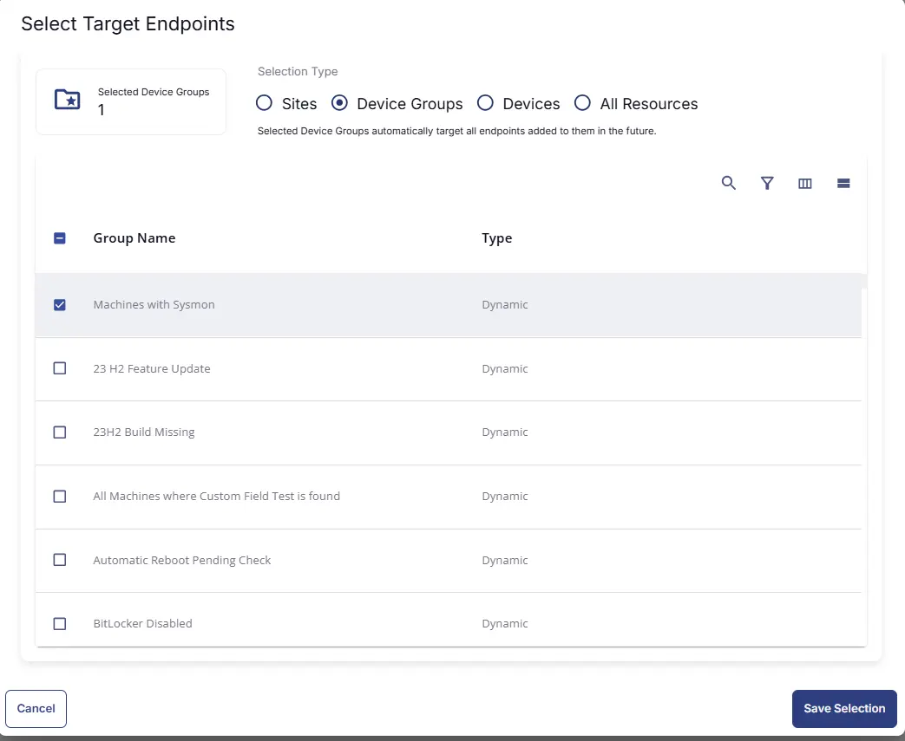
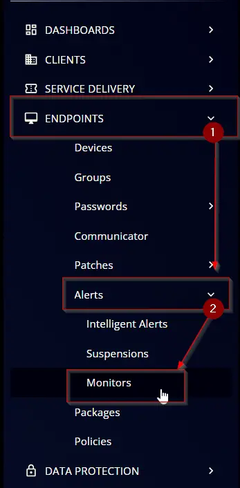
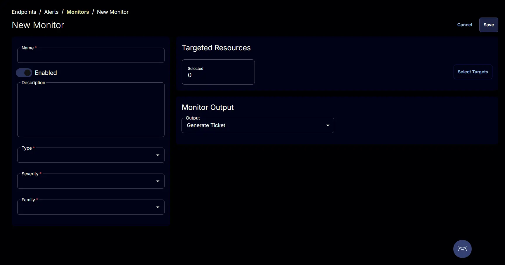
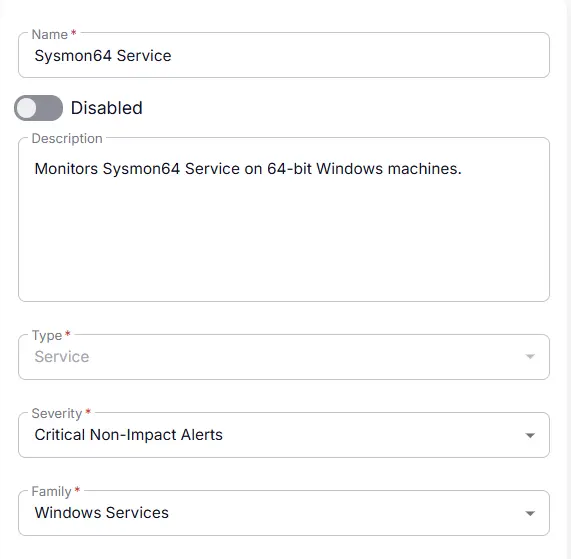
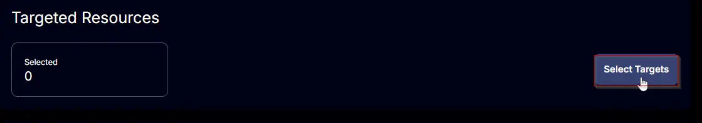
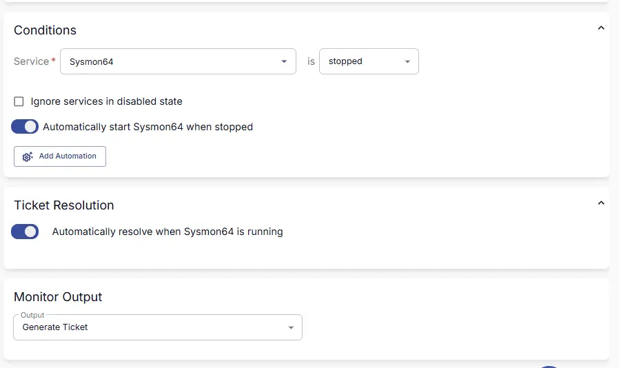
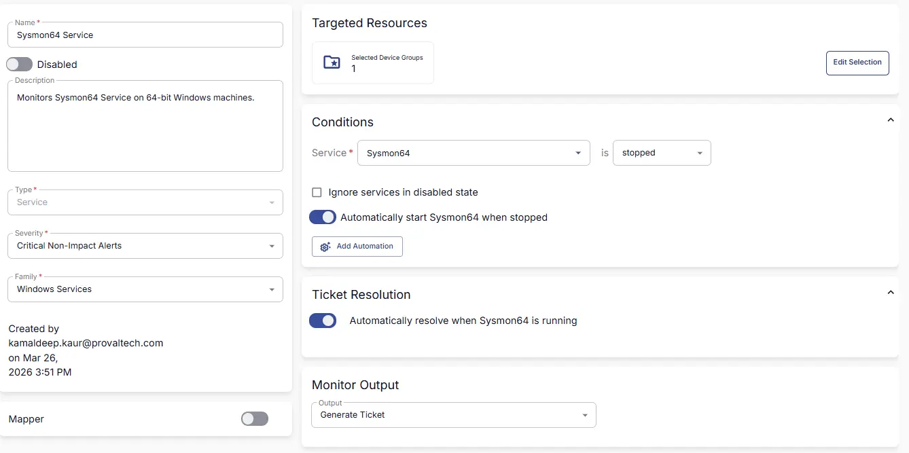

## Summary
Monitors Sysmon64 Service on 64-bit Windows machines.

## Dependencies

- [Solution - Sysmon Solution ](/docs/2db51f41-1313-46c4-81f1-8c67ed578b73) 

## Target

This monitor should target the group `Machines with Sysmon` as shown below:  

## Monitor Creation

### Step 1

Navigate to `ENDPOINTS` ➞ `Alerts` ➞ `Monitors`  

### Step 2

Locate the `Create Monitor` button on the right-hand side of the screen and click on it.  

This page will appear after clicking on the `Create Monitor` button:  

### Step 3

Fill in the mandatory columns on the left side  
Name: `Sysmon64 Service`  
Description: `Monitors Sysmon64 Service on 64-bit Windows machines.`  
Type: `Service`  
Severity: `Critical Non-Impact Alerts`  
Family: `Windows Services` 

### Step 4

Click the `Select Target` button to choose the endpoints for running the monitor set.  

Search and Select `Machines with Sysmon` device group.

### Step 5

#### Condtions :

Select `Sysmon64` from the Service dropdown.  
Deselect `Ignore services in disabled state`

### Ticket Resolution :

Ensure both the `Automatically start Sysmon64 when stopped` toggle and the `Automatically resolve when Sysmon64 is running` toggle are enabled.  

### Monitor Output :

Select `Generate Ticket` from the Output Drop-down Menu

## Completed Monitor

## Changelog

### 2026-03-26

- Initial version of the document
