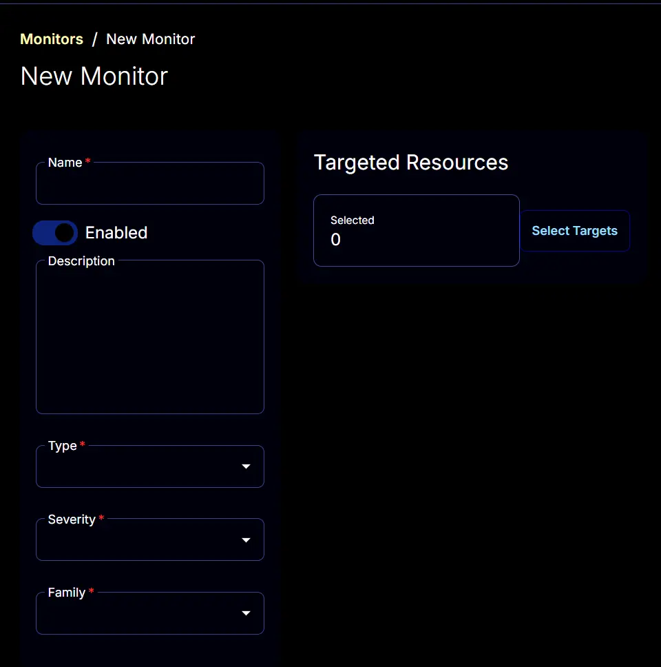

## Summary

This monitor will sync the machine's time with us.pool.ntp.org.

## Monitor

1. Navigate to `Endpoints` > `Alerts` > `Monitors`
   
   

2. Click the `Create Monitor` button.

   

3. This screen will appear.

   

4. **Name:** Time Sync Compliance  
   **Description:** This monitor will sync machine time with us.pool.ntp.org.  
   **Type:** Script  
   **Family:** Desktop Operating System  
   **Severity:** Others  

   

5. The `Conditions` tab will start looking like this:

   

6. Set the `Repeat every` to `24` Hours:

   

7. Disable the `Ticket Resolution` section by clicking the `Automatically resolve` button.

   

8. Paste this PowerShell script in the `Script` box.

   ```powershell
   $S = 'W32Time';
   $peerList = 'us.pool.ntp.org';
   $syncOutput = '';
   if ((Get-Service $S).Status -ne 'Running') 
   {Try
      {Start-Service $S -Confirm:$False -ErrorAction Stop | Out-Null}
   catch 
      {return "Failed to start $S Service. Reason: $($Error.Exception.Message)"}
      };
   $syncOutput += w32tm /config /manualpeerlist:$peerList;
   Start-Sleep -Seconds 5;
   $syncOutput += "`n" + (W32tm /resync /force);
   if ($syncOutput -match 'The computer did not resync') 
      {return 'Failed: The computer did not resync.'} 
   else 
      {return 'Success: The computer resynced successfully.'}
   ```

   

9. Set `Failed` to the `Script Output` box.

   

10. Select the required client or group to target from the `Select Targets` button.

      
    

11. Monitors Final Look

    

12. Click the `Save` button to save the monitor set.

    
