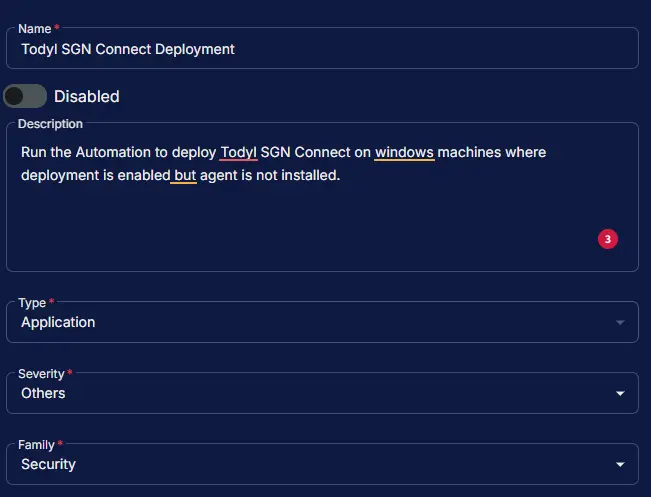
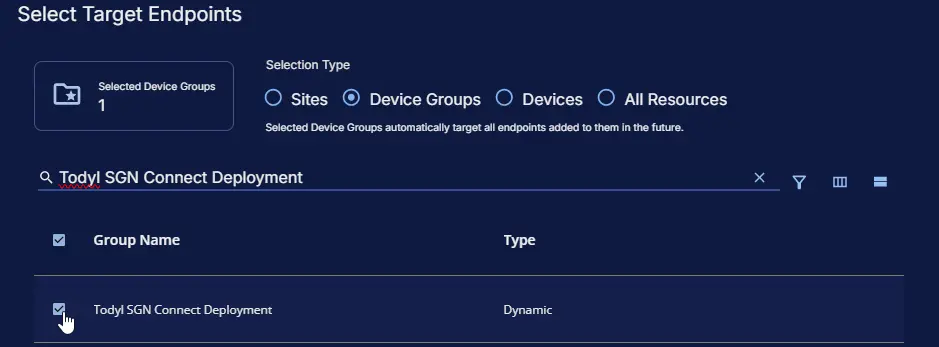
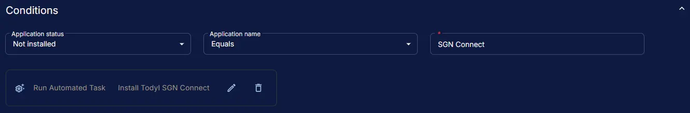
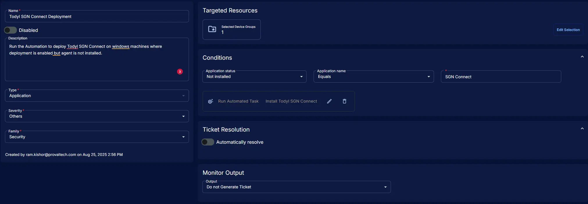

## Summary

Run the [Automation](/docs/c23cdc78-f90e-4aba-b77e-4dff9d612940) to deploy Todyl SGN Connect on windows machines where deployment is enabled but agent is not installed.'

## Dependencies

- [Deploy Todyl SGN Connect](/docs/e21d58b1-9fd5-4888-9e1f-788420313237)
- [Exclude Todyl Deployment Device](/docs/ee6d7b42-0783-422a-a820-8ef36aab0713)
- [Exclude Todyl Deployment Site](/docs/b4d717f5-38fe-4eac-83d4-d1cb88e7fe9d)
- [Todyl Desktop Policy Key](/docs/8656e3f6-5cfc-49b9-a700-cbf453744576)
- [Todyl Laptop Policy Key](/docs/894b9f2c-e0ac-4351-a312-f7f55865e32a)
- [Todyl Servers Policy Key](/docs/e7b46cfc-c872-4d3c-b317-2b59a6c9679d)
- [Todyl SGN Connect Deployment](/docs/34482e9f-122f-490d-b3c8-1e1d466bbc77)
- [Install Todyl SGN Connect](/docs/c23cdc78-f90e-4aba-b77e-4dff9d612940)
- [Solution: Todyl SGN Connect Deployment](/docs/41308550-ea69-4cca-aa0d-9e6f02fcab43)

## Monitor Setup Location

**Monitors Path:** `ENDPOINTS` ➞ `Alerts` ➞ `Monitors`  

## Monitor Summary

- **Name:** `Todyl SGN Connect Deployment`  
- **Description:** `Run the Automation to deploy Todyl SGN Connect on windows machines where deployment is enabled but agent is not installed.`  
- **Type:** `Application`  
- **Severity:** `Others`  
- **Family:** `Security`

## Targeted Resources

- **Target Type:**  `Device Groups`  
- **Group Name:** `Todyl SGN Connect Deployment`

## Conditions

- **Application Status:** `Not Installed`  
- **Application Name:** `Contains`  
- **Enter Value:** `SGN Connect`
- **Add Automation:**  `Install Todyl SGN Connect`

## Ticket Resolution

**Automatically Resolve:** `Disabled`

## Monitor Output

**Output:** `Do not Generate Ticket`

## Completed Monitor

