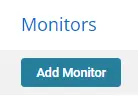
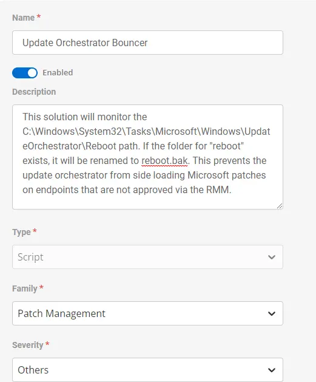
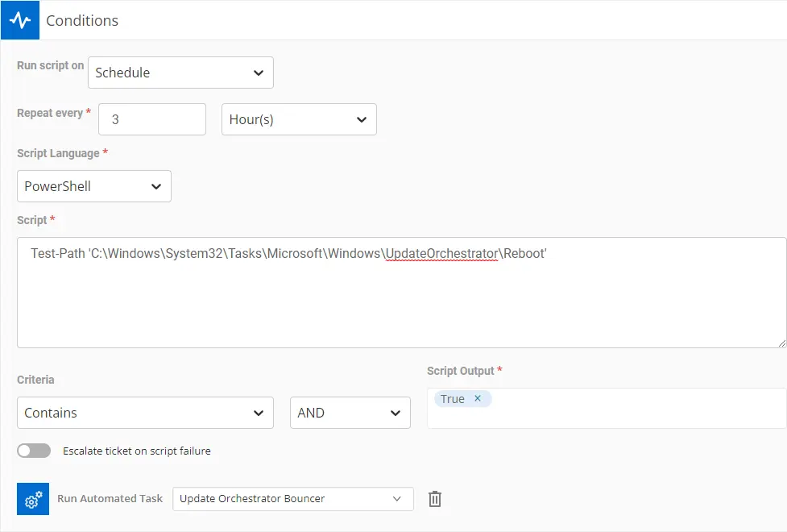

## Summary

This solution will monitor the `C:\Windows\System32\Tasks\Microsoft\Windows\UpdateOrchestrator\Reboot` path. If the folder for "reboot" exists, it will be renamed to `reboot.bak`. This prevents the update orchestrator from side-loading Microsoft patches on endpoints that are not approved via the RMM.

*Note: A Task and Device group will need to be created before the monitor can be set up.*

## Details

### Monitor Creation

Navigate to Automation > Monitors  
Click "Add Monitor"  


---

### Monitor Configuration

- **Name:** Update Orchestrator Bouncer
- **Description:** This solution will monitor the `C:\Windows\System32\Tasks\Microsoft\Windows\UpdateOrchestrator\Reboot` path. If the folder for "reboot" exists, it will be renamed to `reboot.bak`. This prevents the update orchestrator from side-loading Microsoft patches on endpoints that are not approved via the RMM.
- **Type:** Script
- **Family:** Patch Management
- **Severity:** Other



### Conditions

- **Run Script on:** Schedule
- **Repeat every:** 3 Hours
- **Script Language:** PowerShell
- **Script:**

  ```powershell
  Test-Path 'C:\Windows\System32\Tasks\Microsoft\Windows\UpdateOrchestrator\Reboot'
  ```

- **Criteria:** Contains > AND > "True"
- **Run Automated Task:** [Update Orchestrator Bouncer](/docs/06e1e902-b204-498e-a31f-9de7879c528e)



### Ticket Resolution

- **Automatically resolve:** Enabled
- **Run same script as above**
- **Criteria:** Contains > AND > "False"


## Resources

*Note: A Task and Device group will need to be created before the monitor can be set up.*  
This monitor is intentionally aimed at the Update Orchestrator group.


## Dependencies

- [Custom Field - PowerShell Version](/docs/945d88e0-81a9-4253-8406-63fa7430d45a)
- [Task - PowerShell Version Information](/docs/a8419e91-9e07-4f16-be4b-769c78f86f1b)
- [Device Groups - PowerShell Version](/docs/bbb9f958-4fd3-4fda-903f-7d303bf26779)

## Ticketing

This solution does technically create tickets, but the tickets are designed to autoclose as soon as the machine runs the task to update PowerShell.