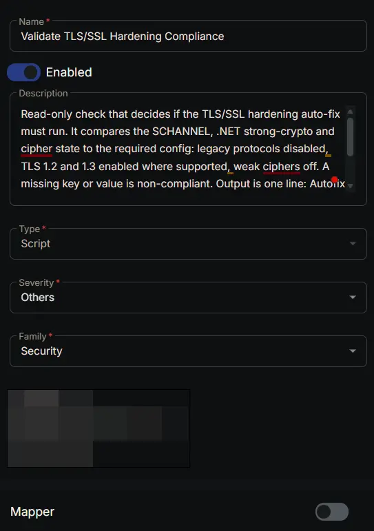
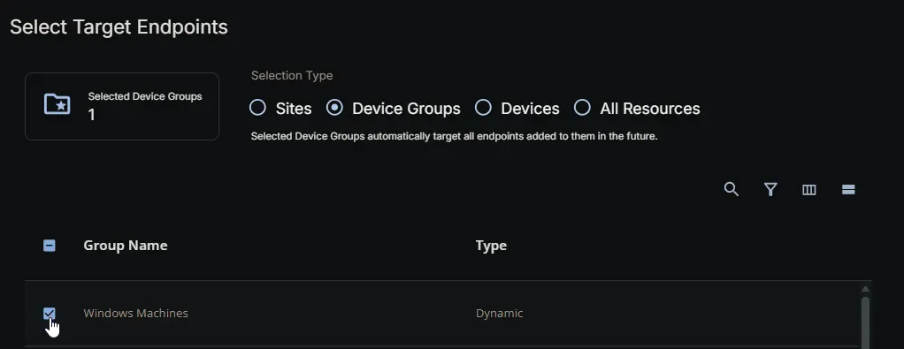
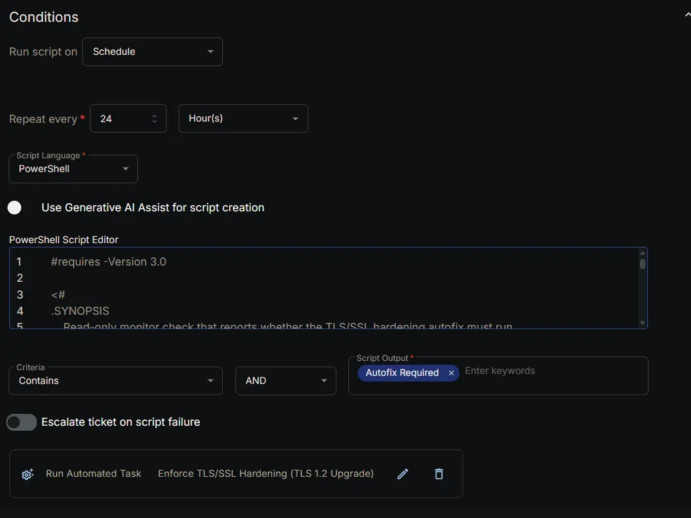
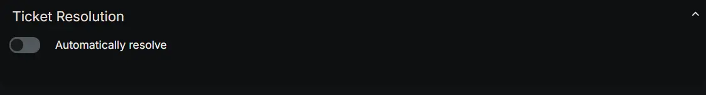
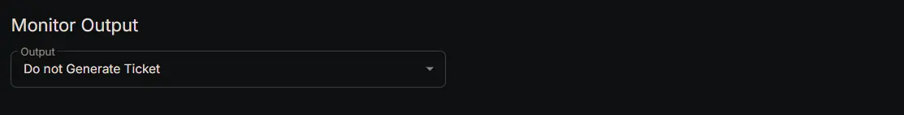
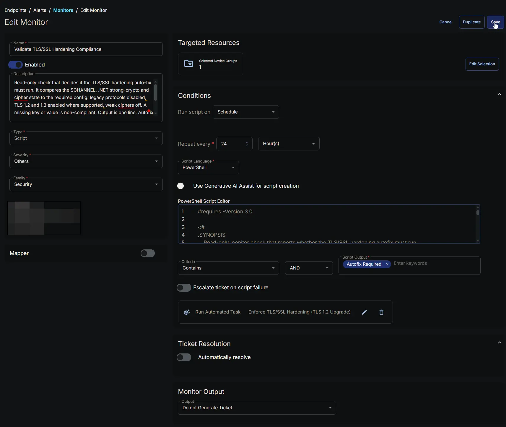

---
id: 'a304b2ff-557f-4715-81cf-7becc125b350'
slug: /a304b2ff-557f-4715-81cf-7becc125b350
title: 'Validate TLS/SSL Hardening Compliance'
title_meta: 'Validate TLS/SSL Hardening Compliance'
keywords: ['tls','ssl','disable','enable','security-hardening','tls-1.2']
description: 'Read-only monitor check that reports whether the TLS/SSL hardening autofix must run.'
tags: ['tls','windows']
draft: false
unlisted: false
last_update:
  date: 2026-07-28
---

## Summary

This monitor is the watchful half of the TLS/SSL hardening pair. On a regular schedule it looks at each targeted Windows device and checks whether its secure-connection settings match the standard the platform requires, without changing anything on the device. If a device is already set up correctly the monitor simply records it as compliant; if something is missing or wrong - an old protocol still switched on, a modern protocol not switched on, a security option not set, or a weak encryption method still in use - the monitor reports that work is needed and the platform automatically runs the paired hardening task, [Enforce TLS/SSL Hardening (TLS 1.2 Upgrade)](/docs/79112007-ac74-4fde-97f5-59d56dbe0282), to bring the device back in line. In that sense the monitor is the eyes and the hardening task is the hands: the monitor finds the devices that need attention, and the task does the actual fixing.

We provide this monitor so compliance is checked continuously rather than only when someone remembers to look. As the platform retires the older protocols, devices can fall out of step over time - for example after a rebuild, a manual change, or a new machine joining the fleet - and this monitor catches that drift and triggers the fix on its own, so devices do not quietly lose the ability to talk to our services. It is read-only and safe to leave running: it never edits settings, never disables anything, and never restarts a device, so it causes no disruption by itself.

A few things to keep in mind:

- It runs on a schedule (every 24 hours by default), so there can be up to about a day between a device going out of compliance and the monitor noticing it and launching the fix. For an urgent, fleet-wide rollout you can run the hardening task directly instead of waiting for the next check.
- A device that has never been hardened will be reported as needing work on the first check. That is expected and is exactly how the monitor kicks off the initial fix; after the hardening task runs once, the device should report as compliant on the following check.
- This monitor is set up to fix problems quietly rather than raise support tickets: when it finds a device out of compliance it launches the hardening task automatically and does not open a ticket, and it does not escalate when a check fails. If you would rather be notified by ticket when a device is non-compliant, that is a separate setting to switch on in the monitor configuration.
- The monitor reads the settings as they are saved on the device, not the settings currently active in memory. Because the hardening task's changes only become active after a reboot (see that task's notes), a device can show as compliant here before it has actually been rebooted. That is normal; the reboot is still required for the new protocol and encryption settings to take effect. The monitor also does not flag a pending reboot on its own, because re-running the hardening task cannot perform a reboot the device does not need, so a reboot-only situation is left to the task and to your maintenance schedule.
- The same operating-system limitation as the hardening task applies here. On the oldest systems (Windows Server 2008, Windows Server 2008 R2 and earlier) the modern TLS 1.2 protocol cannot be enabled because the operating system does not support it. On those systems, once the old protocols are switched off the monitor will report the device as compliant with everything it is able to check - but that does not mean the device can connect, because no supported protocol remains after a reboot. For those machines the required step is still an operating-system upgrade, so a green result on this monitor should not be read as proof of connectivity there.

In short: leave this monitor running on your Windows devices so compliance is checked automatically and any gap is fixed without manual effort; expect up to a 24-hour detection window, expect the first check on a new or un-hardened device to trigger the fix, and remember that on the oldest operating systems a compliant result still requires an upgrade to restore full connectivity.

## Dependencies

- [Group: Windows Machines](/docs/b0c8b058-2cac-4922-a6a7-1c4275c4be15)
- [Task: Enforce TLS/SSL Hardening (TLS 1.2 Upgrade)](/docs/79112007-ac74-4fde-97f5-59d56dbe0282)
- [Solution: TLS/SSL Security Hardening](/docs/13ac3912-863b-41fe-bb61-dfd681f06fa8)

## Monitor Setup Location

**Monitors Path:** `ENDPOINTS` ➞ `Alerts` ➞ `Monitors`  

## Monitor Summary

- **Name:** `Validate TLS/SSL Hardening Compliance`  
- **Description:** `Read-only check that decides if the TLS/SSL hardening auto-fix must run. It compares the SCHANNEL, .NET strong-crypto and cipher state to the required config: legacy protocols disabled, TLS 1.2 and 1.3 enabled where supported, weak ciphers off. A missing key or value is non-compliant. Output is one line: Autofix Not Required if compliant, else Autofix Required: <reasons>. In the monitor set, match the failed state to Autofix Required and the healthy state to Autofix Not Required.`  
- **Type:** `Script`  
- **Severity:** `Others`  
- **Family:** `Security`

## Targeted Resources

- **Target Type:**  `Device Groups`  
- **Group Name:** `Windows Machines`

## Conditions

- **Run script on:** `Schedule`  
- **Repeat every:** `24` `Hour(s)`  
- **Script Language:** `PowerShell`  
- **Use Generative AI Assist for script creation:** `False`  

- **PowerShell Script Editor:**  

[PowerShell Script](https://github.com/ProVal-Tech/cw-rmm/blob/main/monitors/validate-tls-ssl-hardening-compliance/script.ps1)

- **Criteria:**  `Contains`  
- **Operator:** `AND`  
- **Script Output:**  `Autofix Required`  
- **Escalate ticket on script failure:** `Disabled`  
- **Add Automation:**  `Enforce TLS/SSL Hardening (TLS 1.2 Upgrade)`

## Ticket Resolution

- **Automatically Resolve:** `Disabled`

## Monitor Output

**Output:** `Do not Generate Ticket`

## Completed Monitor

## Changelog

### 2026-07-28

- Initial version of the document

