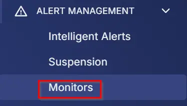
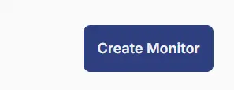
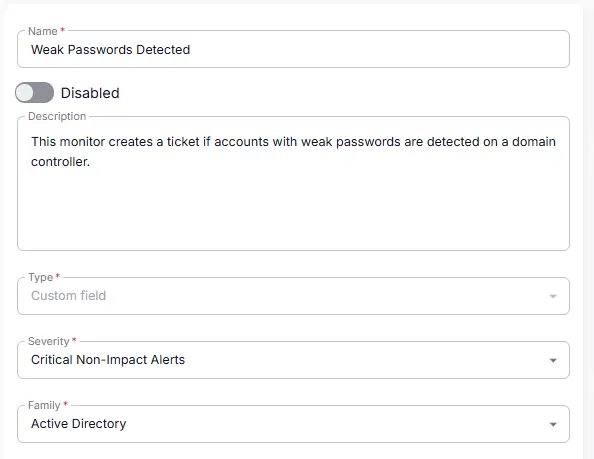
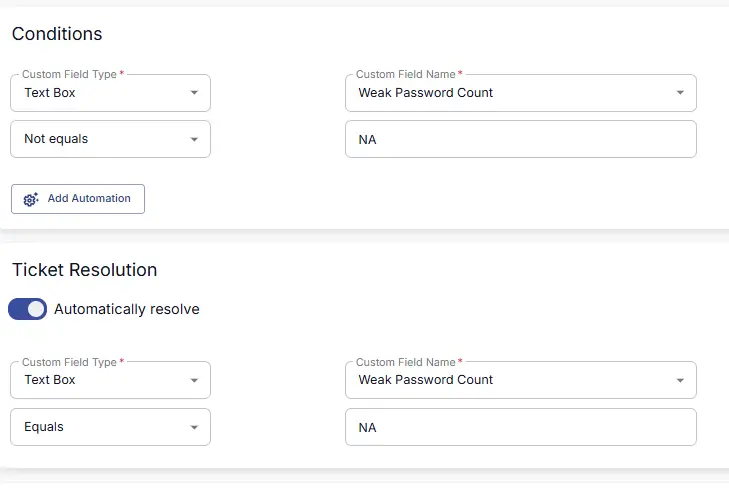
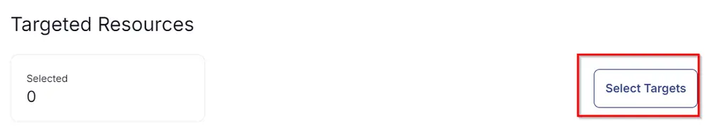
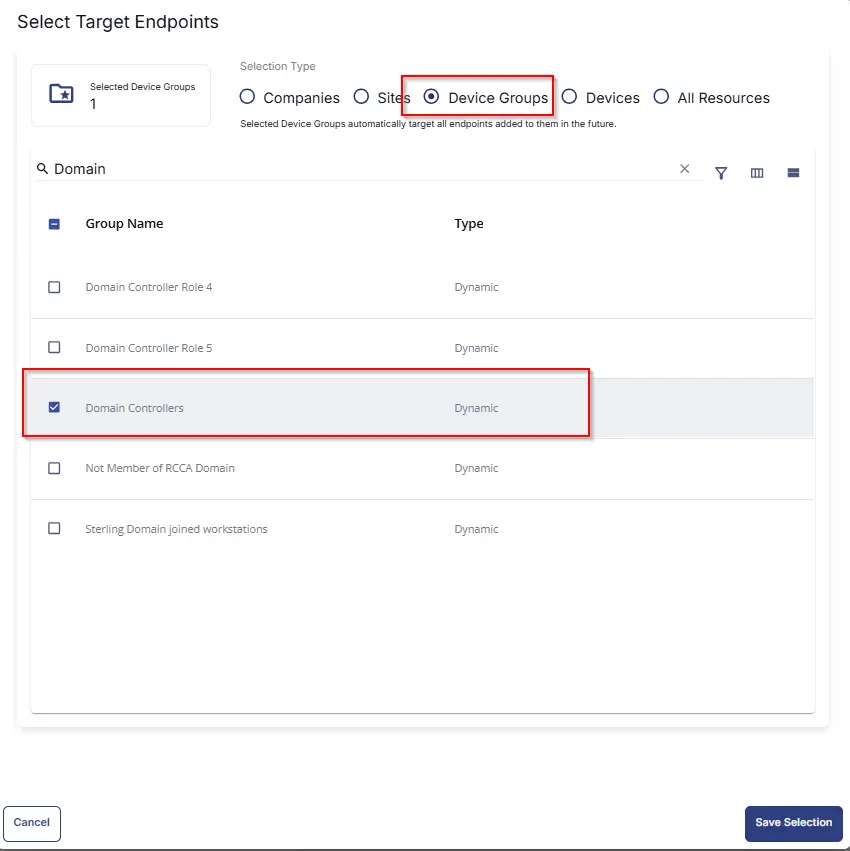

## Summary

This monitor creates a ticket if accounts with weak passwords are detected on a domain controller.

## Dependencies

- [CW RMM - Machine Group - Domain Controllers](/docs/eeeb4ee0-d683-44fd-81cf-7f8872b71c68)
- [CW RMM - Task - Weak Passwords - AD Test](/docs/1d54d079-e038-46a7-8a03-fe6bad481487)
- [CW RMM - Solution - Weak Passwords Audit](/docs/67f4ab8a-5eb0-49f6-ae41-4b3a308b1f11)

## Target

**Domain Controllers**  
This should target the group 'Domain Controllers.'

## Implementation

1. From the left bar, select **Alert Management** -> **Monitor**  
     
   Then click **Create Monitor**  
     

2. Fill in the mandatory fields on the left side.  
   - **Name:** Weak Passwords Detected  
   - **Description:** This monitor creates a ticket if accounts with weak passwords are detected on a domain controller.  
   - **Type:** Custom Field  
   - **Severity:** Critical Non-Impact Alerts  
   - **Family:** Active Directory  
     

3. Fill in the condition on the right side.  
   Follow the screenshot:  
     

4. Select the target.  
   Click on **Select Target:**  
     
   Then click on **Device Group**, search for the word **Domain**, and select the 'Domain Controllers' group as shown below:  
     

## Ticketing

**Subject**  
The custom field failed on %computername%

**Body**  
The custom field failed on %computername%