## Summary

This monitor will identify computers where the license key is reported as inactivated or in a grace period.

## Monitor

1. Go to `Alert Management` > `Monitors` > `Add monitor`  
   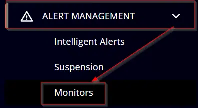

2. Click the `Create Monitor` button.  
   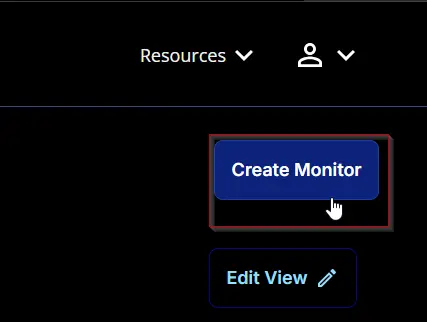

3. This screen will appear.  
   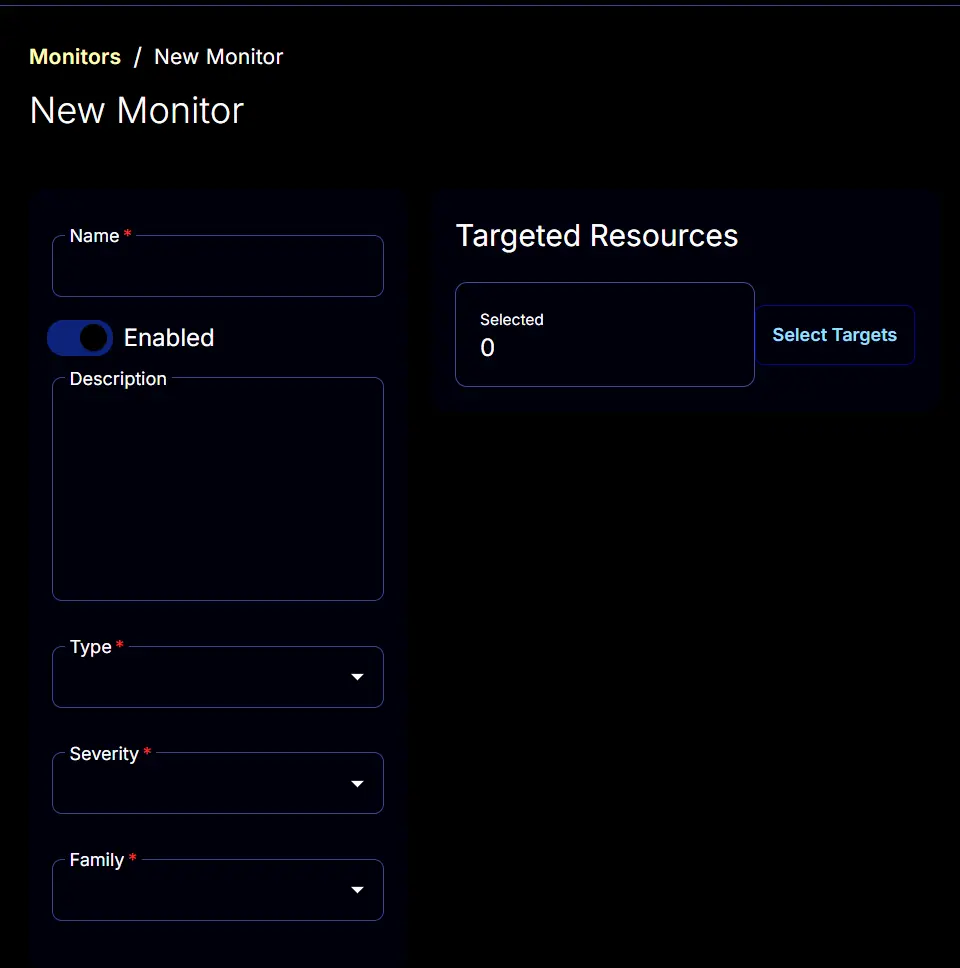

4. **Name:** Windows License Status  
   **Description:** The monitor will detect computers with expired Windows license keys.  
   **Type:** Script  
   **Family:** Critical Impact Alerts  
   **Severity:** Desktop Operating System  
   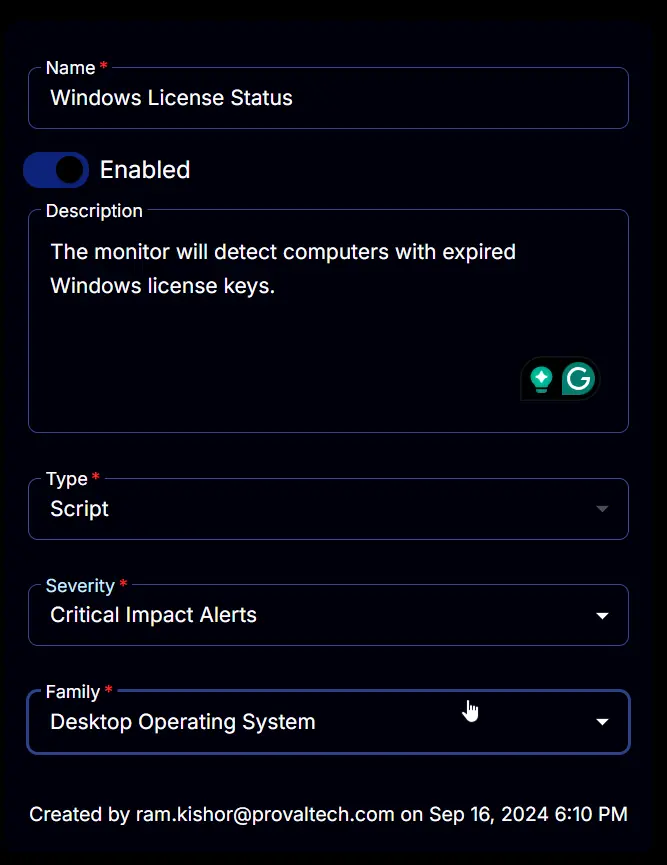

5. The `Conditions` tab will start looking like this:  
   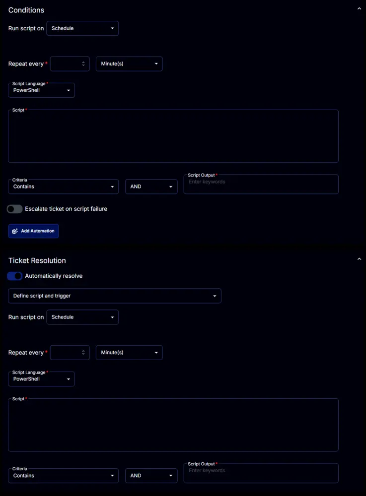

6. Set the `Repeat every` to 24 Hours:  
   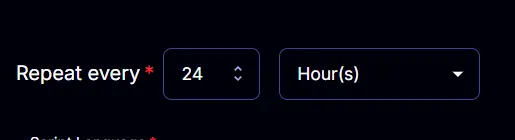

7. Disable the `Ticket Resolution` section by clicking the `Automatically resolve` button.  
   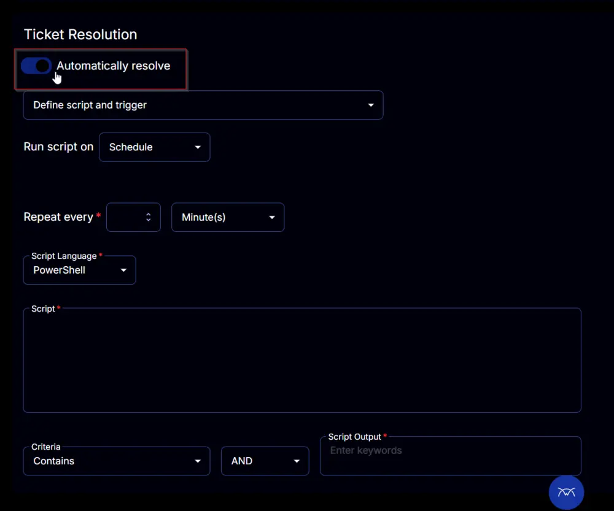

8. The `Conditions` section will change to this:  
   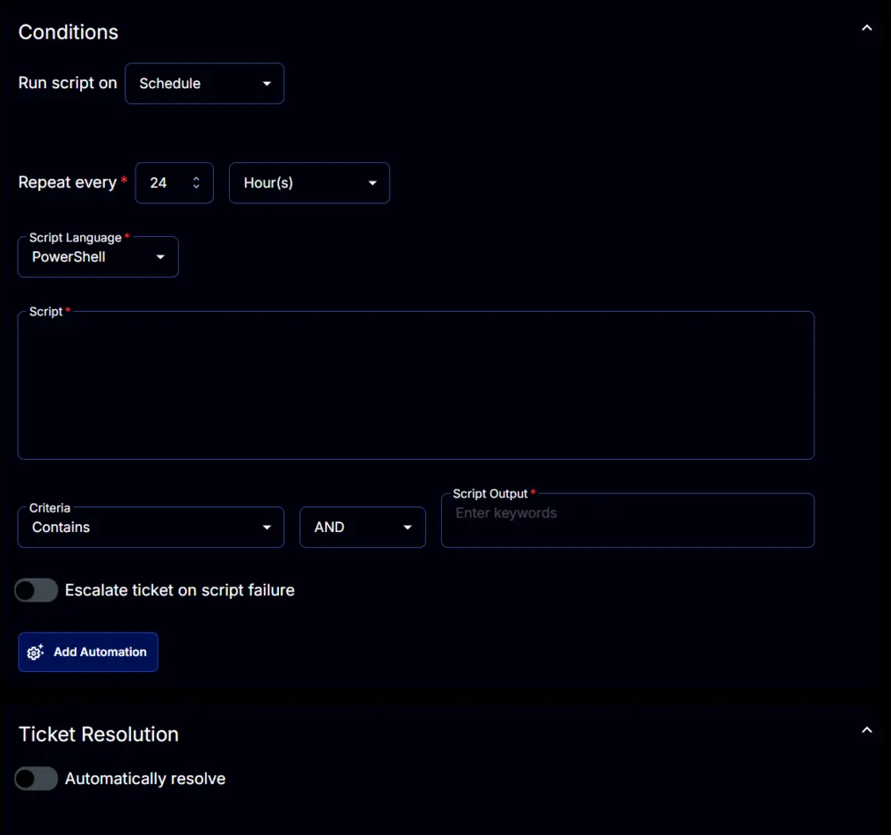

9. Paste this PowerShell script in the `Script` box.  
   ```powershell
   $ErrorActionPreference = 'SilentlyContinue';

   (Get-CimInstance -Class SoftwareLicensingProduct -Filter "Name LIKE 'Windows%'" |
       Where-Object { $_.PartialProductKey } |
       Select-Object @{
           label = 'LStatus';
           expression = {
               switch ($_.LicenseStatus) {
                   0 { 'Unlicensed' }
                   1 { 'Licensed' }
                   2 { 'OOBGrace' }
                   3 { 'OOTGrace' }
                   4 { 'NonGenuineGrace' }
                   5 { 'Notification' }
                   6 { 'ExtendedGrace' }
               }
           }
       }).LStatus
   ```
   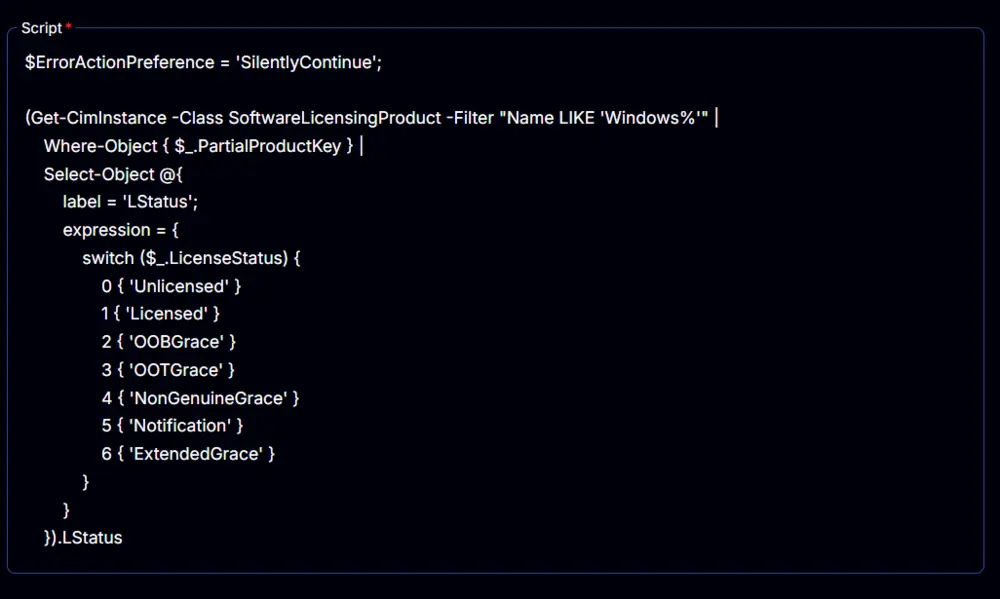

10. Change the comparator to `OR` from `AND`  
    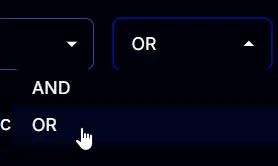  
    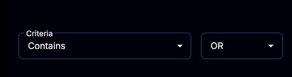

11. Set `Unlicensed` and `NonGenuineGrace` to the `Script Output` box.  
    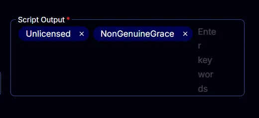

12. Enable the `Escalate ticket on script failure`.  
    

13. Select the required client to target from the `Select Targets` button.  
    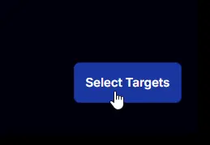  
    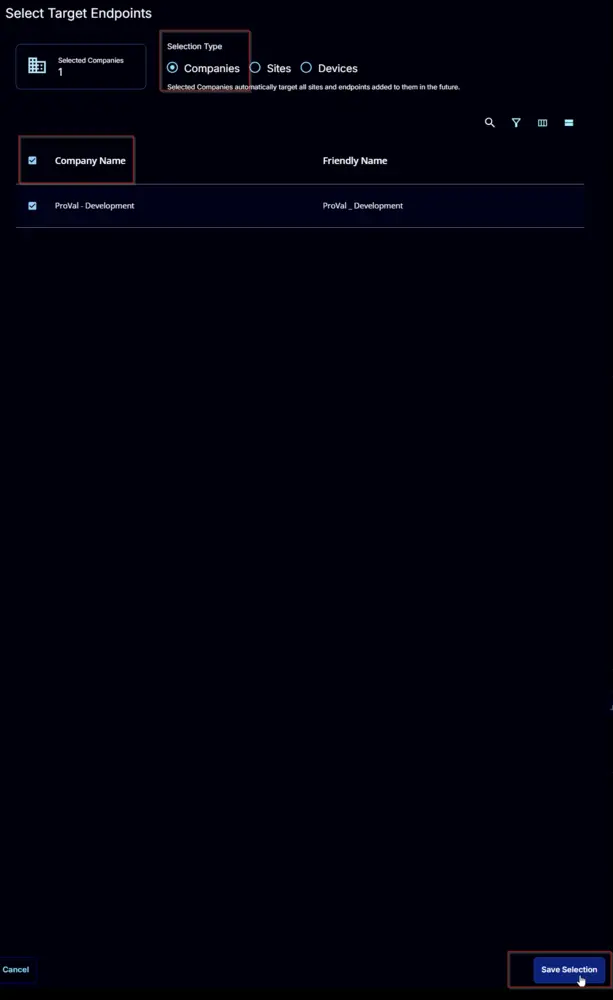

14. Final look:  
    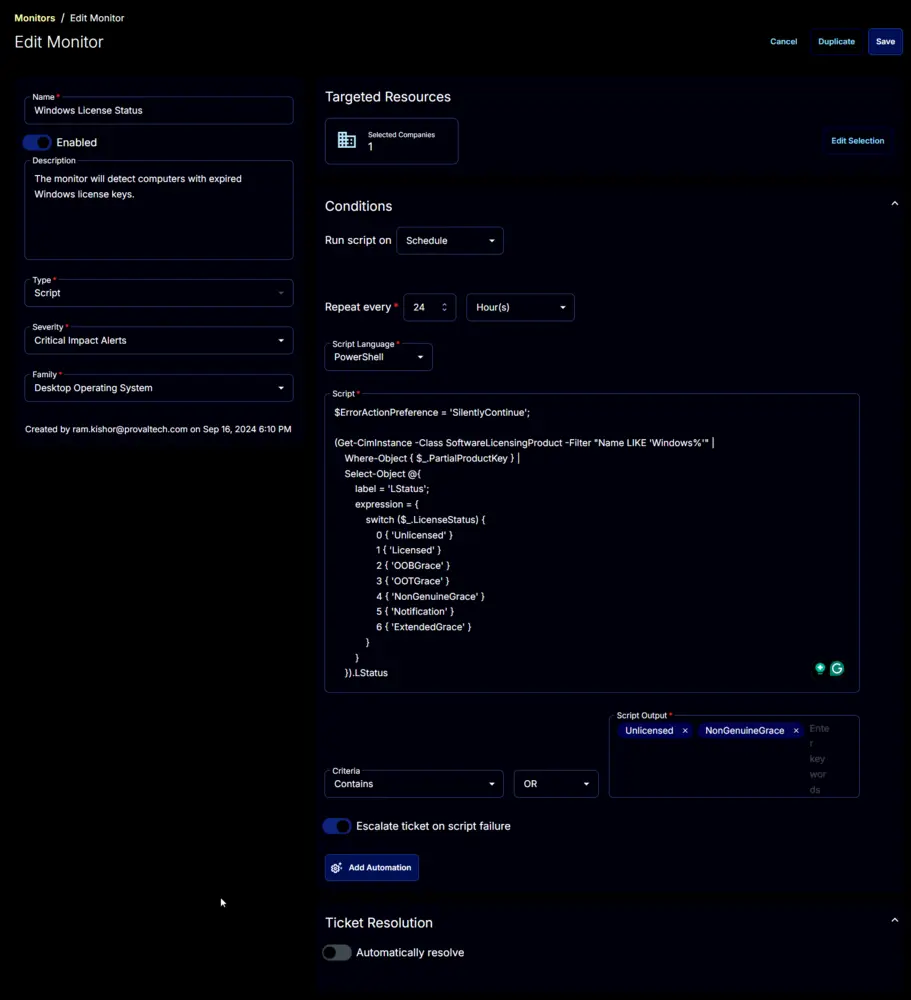

15. Click the `Save` button to save the monitor set.  
    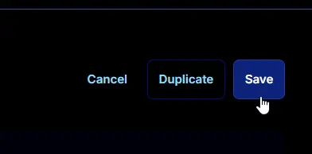
