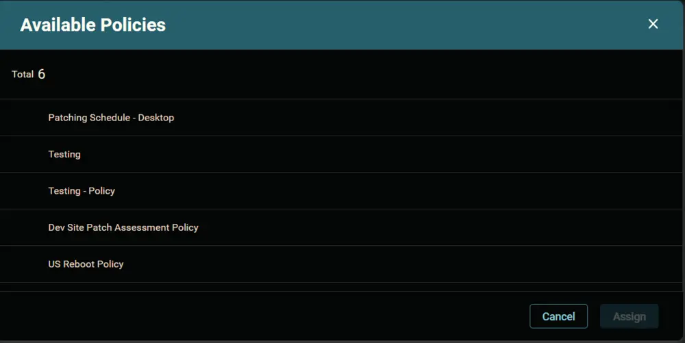

## Summary

Enable Windows 11 installation for compatible Windows 10 computers.

## Dependencies

- [CW RMM - Device Group - Upgrade Enabled Windows 11 Compatible Machines](/docs/9c422249-e949-4bcd-83ea-2c91b8365a96)
- [CW RMM - Policy - Install Windows 11](/docs/4664a942-cb4f-425a-ae16-4615d2b14cae)

## Package Creation

1. Navigate to `Endpoints` > `Packages`.  
   

2. Go to `Policy Groups` and select the `OS Patching Desktop` group.  
   

3. Click the `Add Existing Device Group` button.  
   

4. This screen will appear.  
   

5. **Policy Group Name:** `Install Windows 11`  
   **Description:** `Enable Windows 11 installation for compatible Windows 10 computers.`  
   

6. Search and select the [Upgrade Enabled Windows 11 Compatible Machines](/docs/9c422249-e949-4bcd-83ea-2c91b8365a96) Device group.
   

7. Click the `Assign` button.  
   

8. This screen will appear.  
   

9. Select the [Install Windows 11](/docs/4664a942-cb4f-425a-ae16-4615d2b14cae) policy and click the `Assign` button.
   

10. 

11. Click the `Save` button to save the `Policy Group`.  
   

## Completed Policy Group

