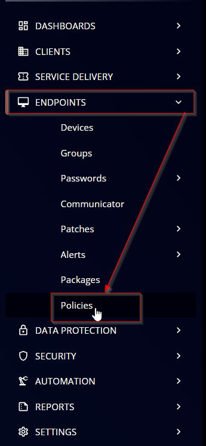
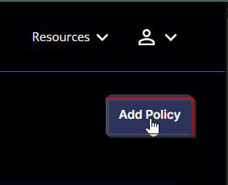
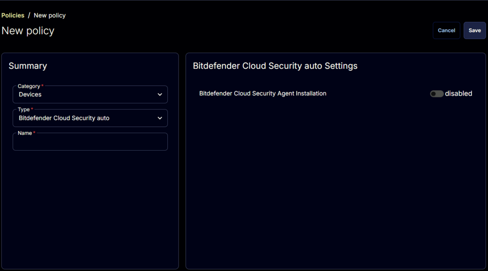
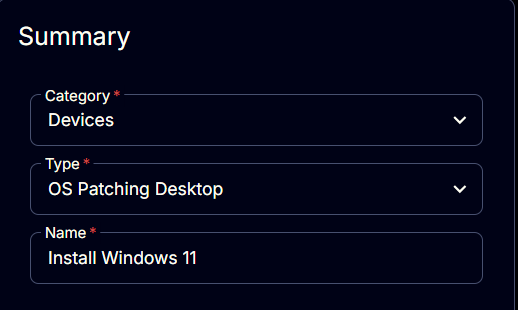
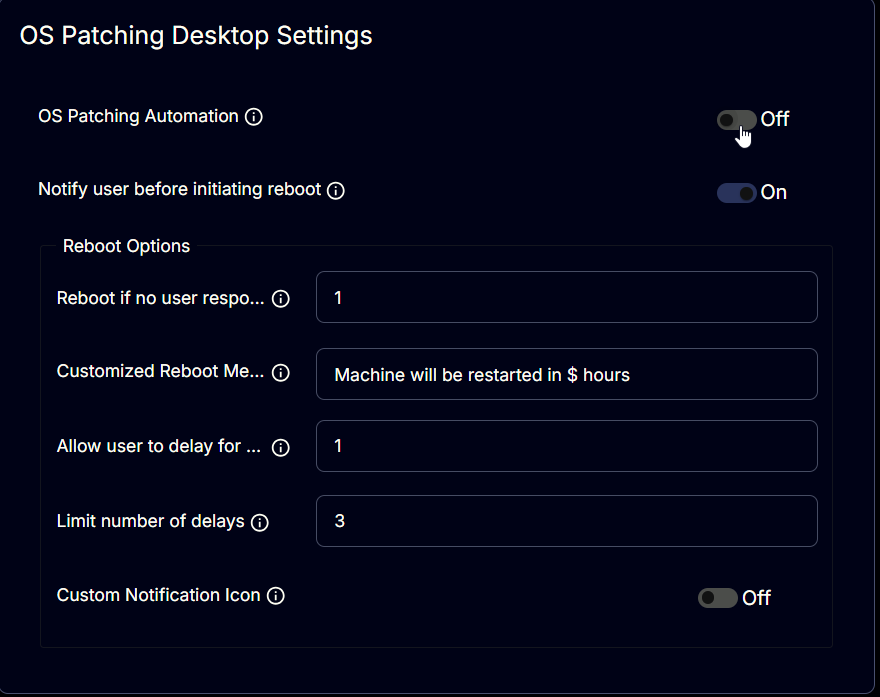
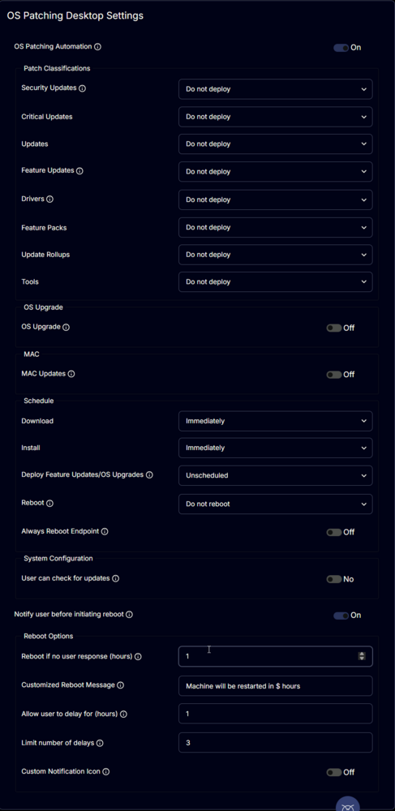
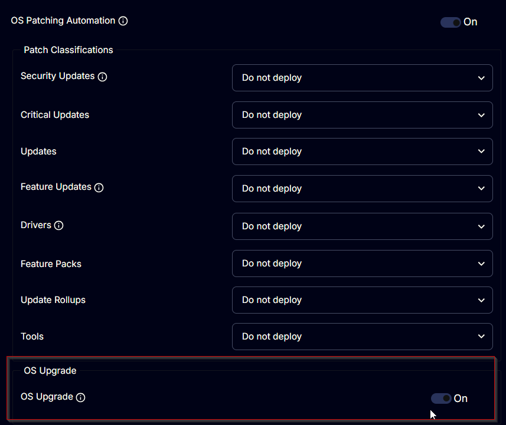
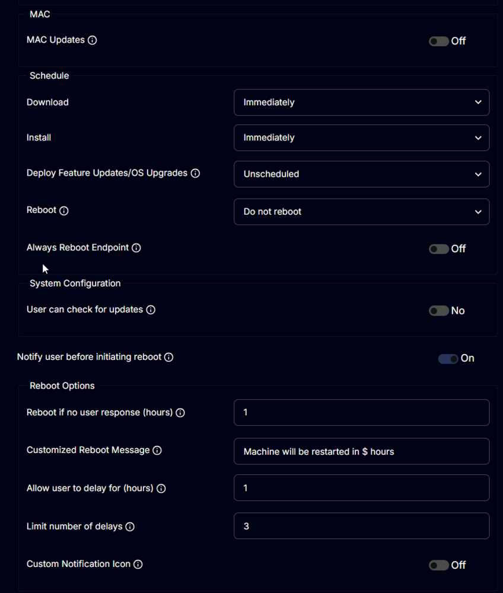
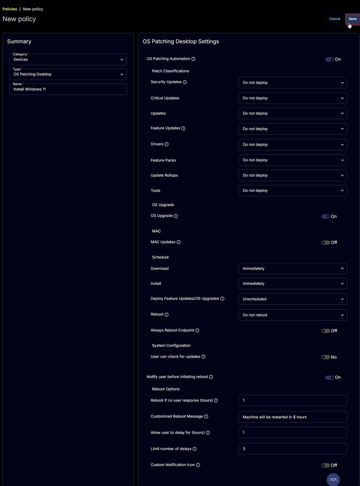
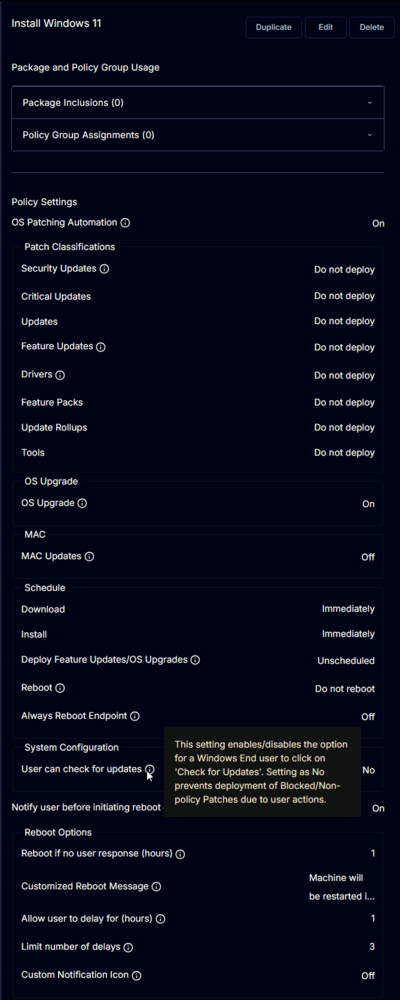

## Summary

Policy to enable Windows 11 installation for Windows 10 machines.

## Policy Creation

1. Navigate to `Endpoints` > `Policies`.
   

2. Click the `Add Policy` button.
   

3. This screen will appear.
   

4. **Type:** `OS Patching Desktop`  
   **Name:** `Install Windows 11`  
   

5. 

6. Enable the `OS Patching Automation`.
   

7. Leave the other options in the `Patch Classifications` section to `Do not deploy` and turn on `OS Upgrade` option.
   

8. Make the necessary changes to the rest of the options as the partner requires.
   

9. Click the `Save` button to save the policy.
   

## Completed Policy

