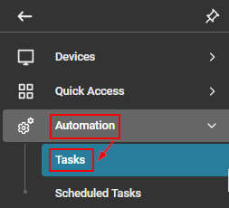
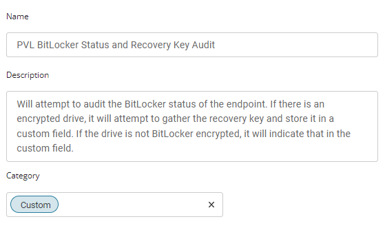
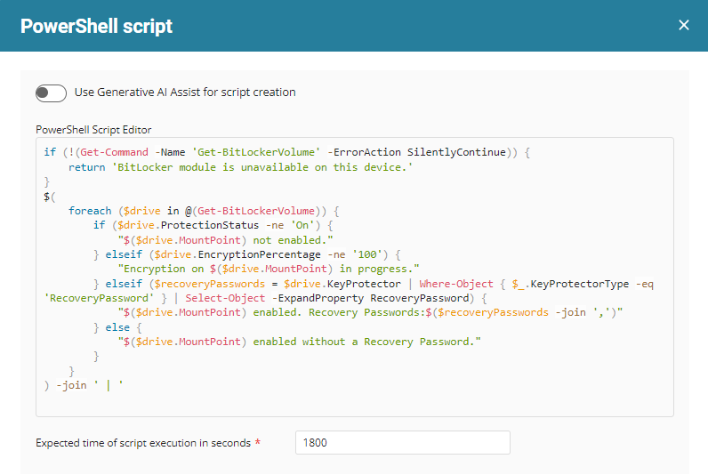
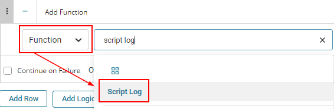
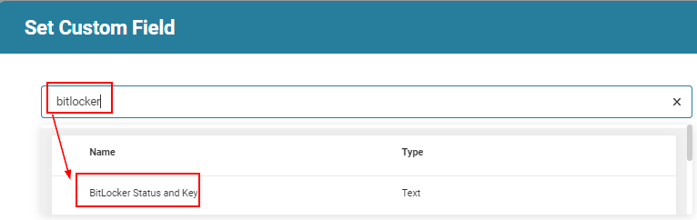
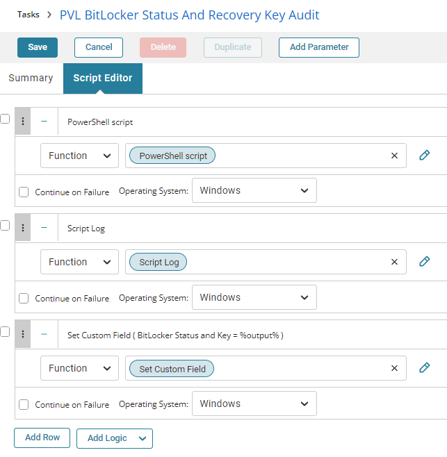
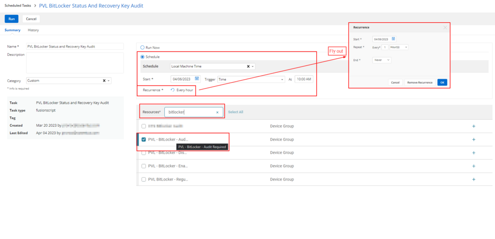
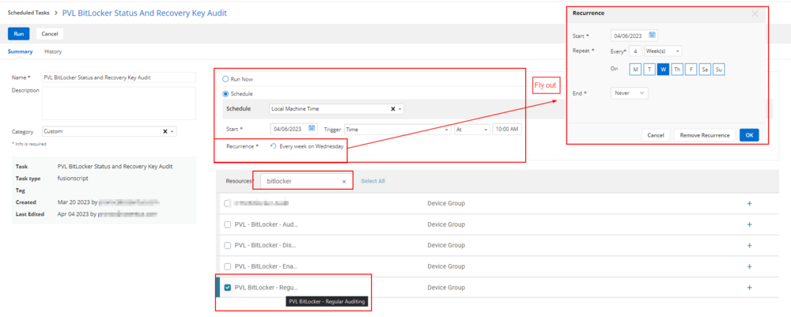

## Summary

This document will attempt to audit the BitLocker status of the endpoint. If there is an encrypted drive, it will attempt to gather the recovery key and store it in a custom field. If the drive is not BitLocker encrypted, it will indicate that in the custom field.

## Manual Run

This script does not have any parameters and can be run against any online Windows device.

## Dependencies

- [CW RMM - Custom Field - BitLocker Key Backup Status](<../custom-fields/BitLocker Key Backup Status.md>)
- [CW RMM - Device Groups - BitLocker Auditing](<../groups/BitLocker Auditing.md>) (BitLocker - Auditing, BitLocker - Regular Auditing)

## Create Script

To implement this script, please create a new "Script Editor" style script in the system.




**Name:** BitLocker Status and Recovery Key Audit  
**Description:** This script will attempt to audit the BitLocker status of the endpoint. If there is an encrypted drive, it will attempt to gather the recovery key and store it in a custom field. If the drive is not BitLocker encrypted, it will indicate that in the custom field.  
**Category:** Custom  


## Script

Start by making three separate rows. You can do this by clicking the "Add Row" button at the bottom of the script page.


**Row 1 Function:** PowerShell Script  


Paste in the following PowerShell script and set the expected time of script execution to 1800 seconds.

```
if (!(Get-Command -Name 'Get-BitLockerVolume' -ErrorAction SilentlyContinue)) {
    return 'BitLocker module is unavailable on this device.'
}
$(
    foreach ($drive in @(Get-BitLockerVolume -ErrorAction SilentlyContinue)) {
        if ($drive.ProtectionStatus -ne 'On') {
            "$($drive.MountPoint) not enabled."
        } elseif ($drive.EncryptionPercentage -ne '100') {
            "Encryption on $($drive.MountPoint) in progress."
        } elseif ($recoveryPasswords = $drive.KeyProtector | Where-Object { $_.KeyProtectorType -eq 'RecoveryPassword' } | Select-Object -ExpandProperty RecoveryPassword -First 1) {
            "$($drive.MountPoint) enabled. Recovery Passwords:$($recoveryPasswords)"
        } else {
            "$($drive.MountPoint) enabled without a Recovery Password."
        }
    }
) -join ' | '
```



Save and move to the next row.

**Row 2 Function:** Script Log  


In the script log message, simply type `%output%` so that the script will send the results of the PowerShell script above to the output on the Automation tab for the target device.  


**Row 3 Function:** Set Custom Field  


When you select "Set Custom Field," a new window will open. In this window, find the "BitLocker Status and Key" field.  


In the Value area, simply type `%output%` to store the PowerShell output in the custom field.  


Once all items are added, please save the task.  
The final task should look like the screenshot below.  


## Script Deployment

The script is intended to run on a scheduled basis against two device groups.

First, is the [CW RMM - Device Groups - BitLocker Auditing](<../groups/BitLocker Auditing.md>) (BitLocker - Auditing) device group as a scheduled task. As machines run the script, they will exit the device group.

The task should be scheduled to run hourly against the device group. Please see the example in the screenshot below.  


**Schedule:** Local Machine Time  
**Start:** Select today's date  
**Trigger:** Time  
**At:** 10:00 AM  
**Recurrence:** Every Hour  
**Resource:** [CW RMM - Device Groups - BitLocker Auditing](<../groups/BitLocker Auditing.md>) (BitLocker - Auditing)

---

Second, is the [CW RMM - Device Groups - BitLocker Auditing](<../groups/BitLocker Auditing.md>) (BitLocker - Regular Auditing) device group as a scheduled task. As machines complete their audit, they will join the BitLocker - Regular Auditing group, and the scheduled task will update the details every four (4) weeks.

The task should be scheduled to run every four (4) weeks against the BitLocker - Regular Auditing device group. Please see the example in the screenshot below.  


**Schedule:** Local Machine Time  
**Start:** Select today's date  
**Trigger:** Time  
**At:** 10:00 AM  
**Recurrence:** Every 4 weeks on Wednesday  
**Resource:** [CW RMM - Device Groups - BitLocker Auditing](<../groups/BitLocker Auditing.md>) (BitLocker - Regular Auditing)

This script can also run manually against any Windows-based device at any time to update the details.

## Output

- Script log
- Custom Field
