## Summary

This is a CW RMM implementation of the agnostic script [Initialize-BitLockerVolume](<../../powershell/Initialize-BitLockerVolume.md>). The script can be used to manually encrypt a drive with BitLocker disk encryption.

**Requirement:** PowerShell v5+

## Sample Run

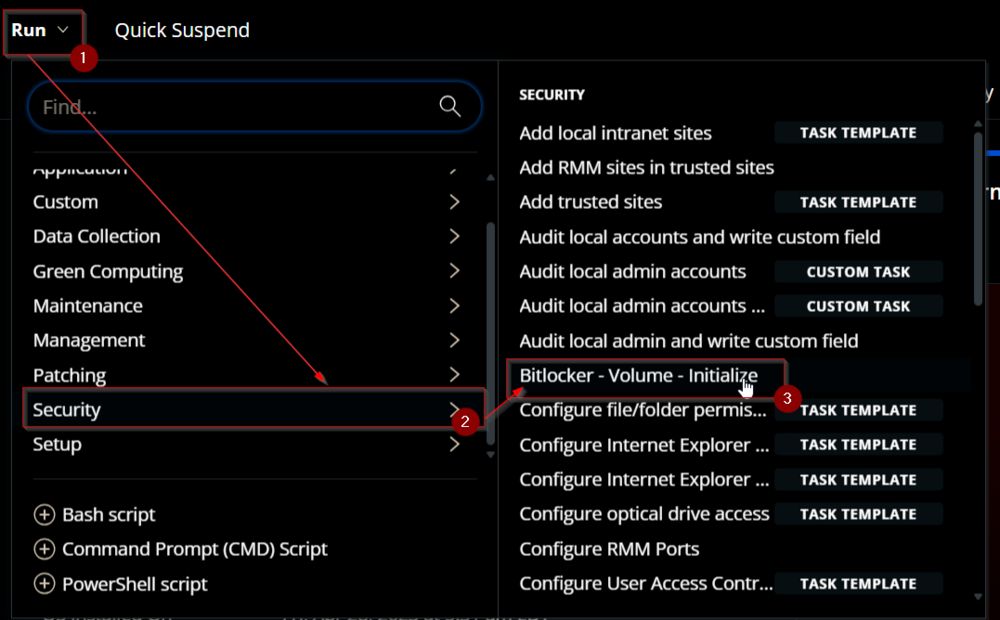

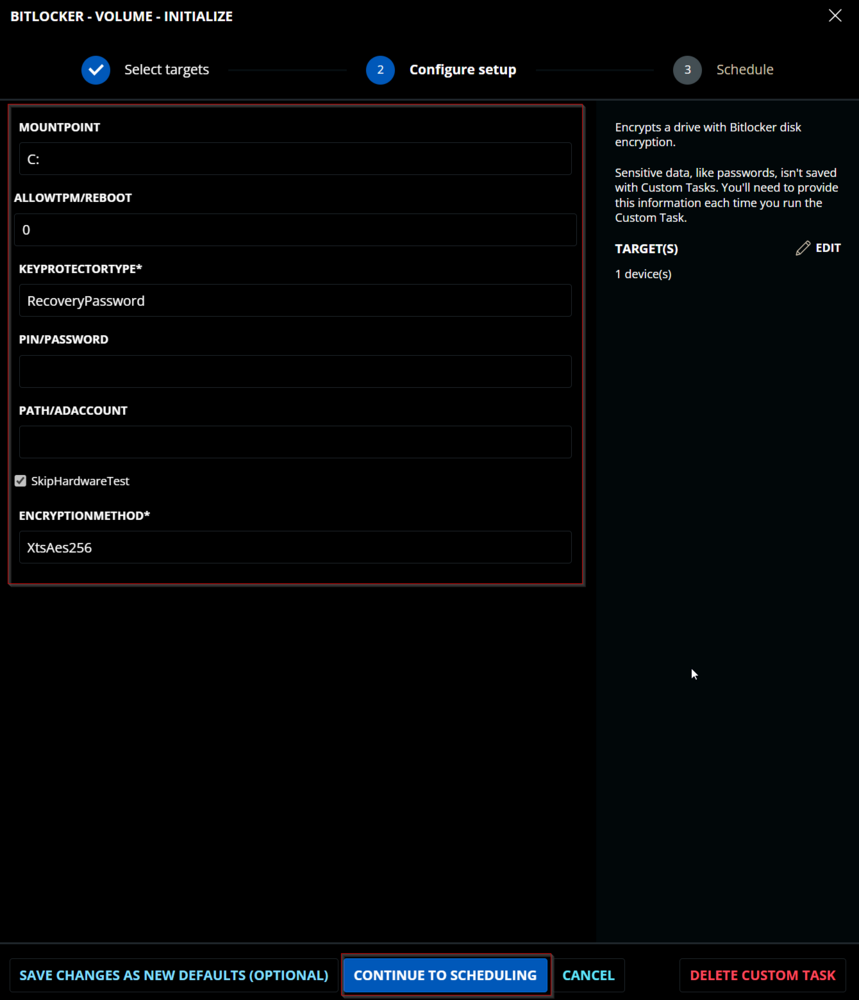

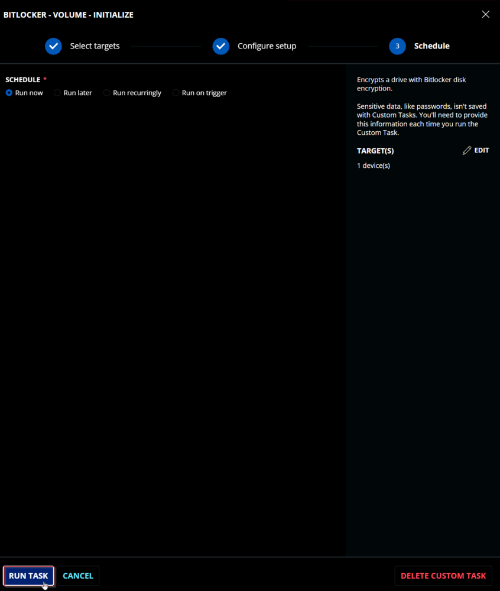

## Dependencies

[SEC - Encryption - Agnostic - Initialize-BitLockerVolume](<../../powershell/Initialize-BitLockerVolume.md>)

## User Parameters

| Name                  | Example                       | Accepted Values                                                                                                                                  | Required | Default | Type   | Description                                                                                          |
|-----------------------|-------------------------------|--------------------------------------------------------------------------------------------------------------------------------------------------|----------|---------|--------|------------------------------------------------------------------------------------------------------|
| Mount Point           | E:                            |                                                                                                                                                  | False    | C:      | Text   | The volume to protect. Defaults to the system drive.                                               |
| Allow TPM/Reboot      | 3                             | 0,1,2,3                                                                                                                                         | False    | 0       | Number | Options for allowing TPM initialization and rebooting. 0 = Do not allow, 1 = Allow TPM Initialization, 2 = Allow Reboot, 3 = Allow TPM Initialization and Reboot |
| Key Protector Type     | RecoveryPassword              | Tpm, TpmStartup, TpmPinStartup, Password, Startup, RecoveryKey, RecoveryPassword, AdAccount                                                    | True     |         | Text   | Options for which type of protector to use for BitLocker: Tpm, TpmPin (Requires PIN/Password parameter), TpmStartup (Requires Path/ADAccount parameter), TpmPinStartup (Requires PIN/Password and Path/ADAccount parameters), Password (Requires PIN/Password parameter), Startup (Requires Path/ADAccount parameter), RecoveryKey (Requires Path/ADAccount parameter), RecoveryPassword, AdAccount (Requires Path/ADAccount parameter) |
| PIN/Password          | - 123456- Pa$sw0rD!- 123456-654321-123456-654321-123456-654321 |                                                                                                                                                  | Semi     |         | Text   | Option for the PIN or Password needed for specific key protector types.                            |
| Path/ADAccount        | - F://Recovery- CONTOSO//ContosoUser- CONTOSO//ContosoGroup |                                                                                                                                                  | Semi     |         | Text   | Option for the Path or AD Account needed for specific key protector types.                         |
| SkipHardwareTest      | Checked                       |                                                                                                                                                  | False    | Checked  | Flag   | Mark this checkbox to enable BitLocker without forcefully validating the hardware.                  |
| EncryptionMethod      | XtsAes256                    | Aes128, Aes256, XtsAes128, XtsAes256                                                                                                           | True     | XtsAes256 | Text   | The encryption method that will be used to protect the target volume. Valid options are: Aes128, Aes256, XtsAes128, XtsAes256 |

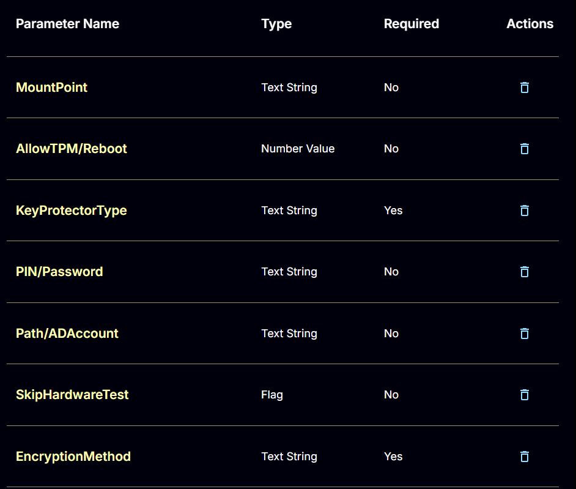

## Key Protector Types

| Type            | Description                                                                                                  |
|-----------------|--------------------------------------------------------------------------------------------------------------|
| Tpm             | Protect the encrypted drive with only the TPM chip.                                                         |
| TpmPin          | Protect the encrypted drive with the TPM chip and a PIN. Requires the PIN/Password parameter to be passed. |
| TpmStartup      | Protect the encrypted drive with the TPM chip and a startup key. Requires the Path/ADAccount parameter.    |
| TpmPinStartup   | Protect the encrypted drive with the TPM chip, a PIN, and a startup key. Requires the PIN/Password and Path/ADAccount parameters. |
| Password        | Protects the encrypted drive with a custom password. Requires the PIN/Password parameter to be passed.      |
| Startup         | Protect the encrypted drive with a startup key. Requires the Path/ADAccount parameter.                      |
| RecoveryKey     | Protect the encrypted drive with a recovery key. Requires the Path/ADAccount parameter.                     |
| RecoveryPassword | Protect the encrypted drive with a recovery password. If the PIN/Password parameter is not passed, the script will generate one automatically. |
| AdAccount       | Protect the encrypted drive with an Active Directory Account or Group. Requires the Path/ADAccount parameter. |

## Task Creation

Create a new `Script Editor` style script in the system to implement this Task.


**Name:** Bitlocker - Volume - Initialize  \
**Description:** `Encrypts a drive with BitLocker disk encryption.`  \
**Category:** Security  

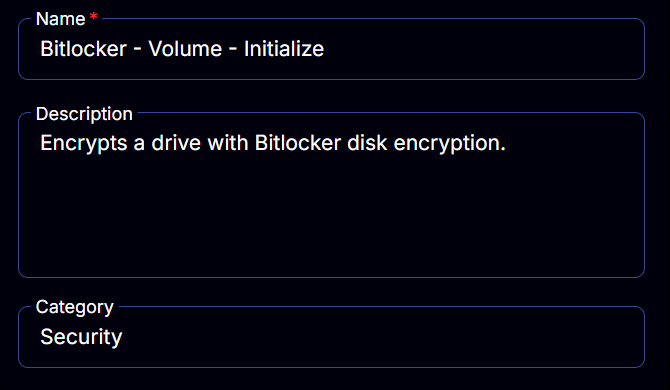

## Parameters

### MountPoint:
Add a new parameter by clicking the `Add Parameter` button present at the top-right corner of the screen.


This screen will appear.


- Set `MountPoint` in the `Parameter Name` field.
- Select `Text String` from the `Parameter Type` dropdown menu.
- Click the `Save` button.

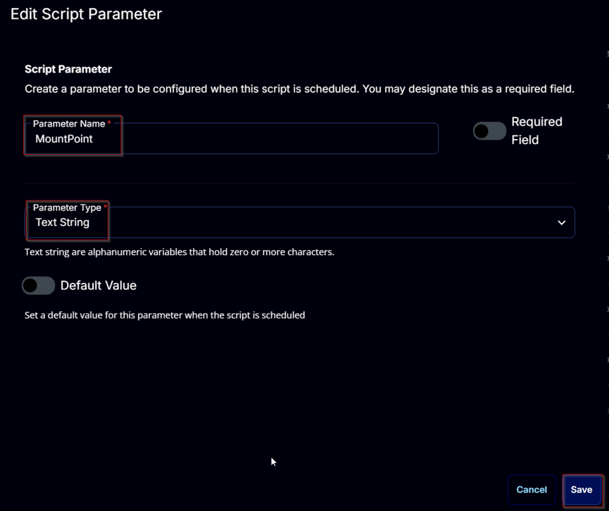

### AllowTPM/Reboot:
Add a new parameter by clicking the `Add Parameter` button present at the top-right corner of the screen.


This screen will appear.


- Set `AllowTPM/Reboot` in the `Parameter Name` field.
- Select `Number Value` from the `Parameter Type` dropdown menu.
- Enable the `Default Value` button.
- Set `0` in the `Value` field.
- Click the `Save` button.

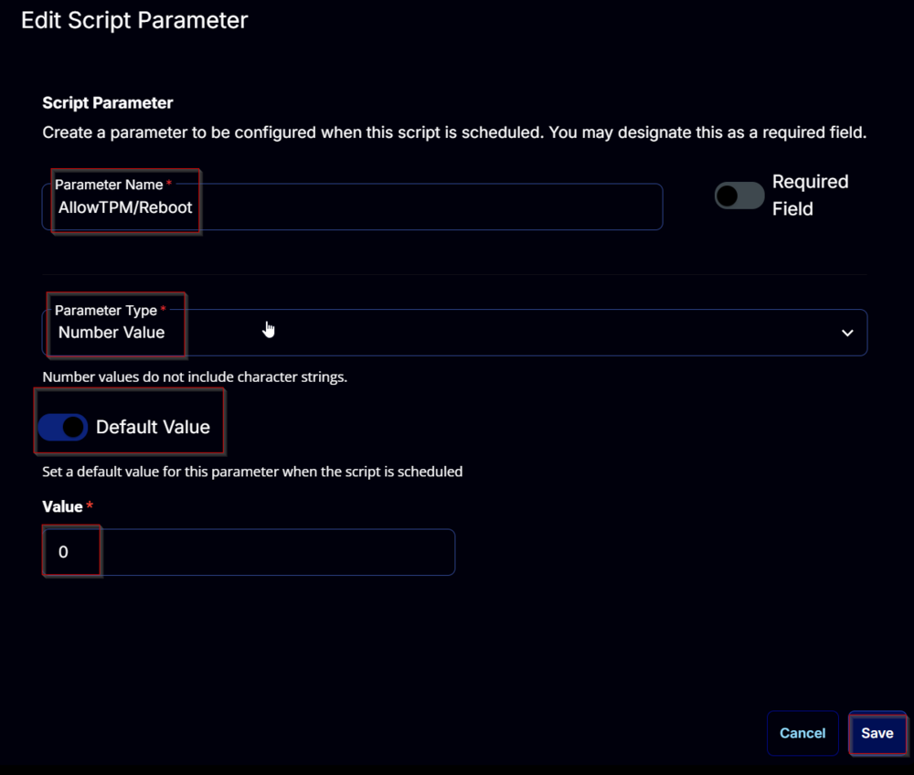

### KeyProtectorType:
Add a new parameter by clicking the `Add Parameter` button present at the top-right corner of the screen.


This screen will appear.


- Set `KeyProtectorType` in the `Parameter Name` field.
- Select `Text String` from the `Parameter Type` dropdown menu.
- Enable the `Required Field` button.
- Click the `Save` button.

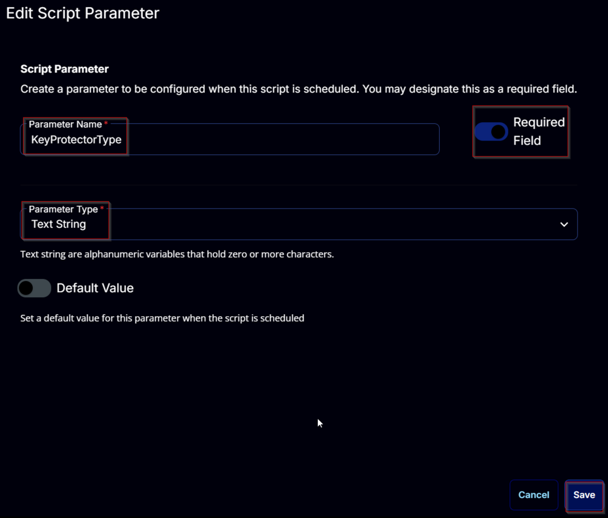

### PIN/Password:
Add a new parameter by clicking the `Add Parameter` button present in the top-right corner of the screen.


This screen will appear.


- Set `PIN/Password` in the `Parameter Name` field.
- Select `Text String` from the `Parameter Type` dropdown menu.
- Click the `Save` button.

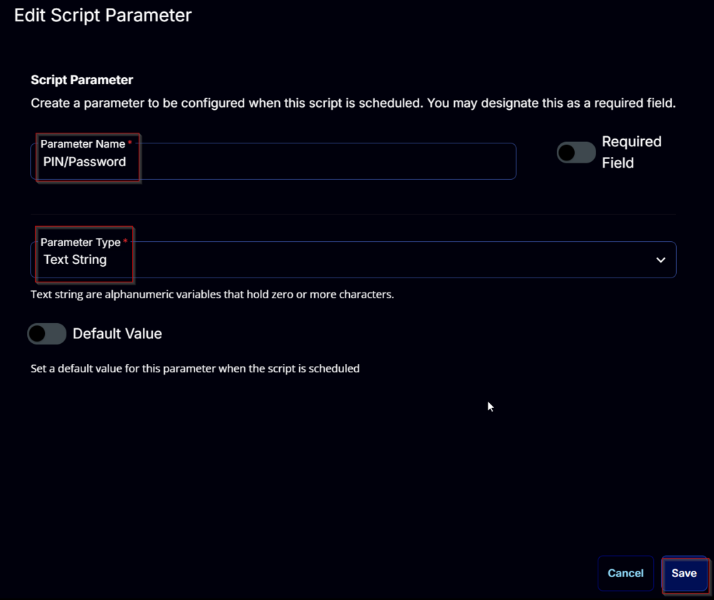

### Path/ADAccount:
Add a new parameter by clicking the `Add Parameter` button present in the top-right corner of the screen.


This screen will appear.


- Set `Path/ADAccount` in the `Parameter Name` field.
- Select `Text String` from the `Parameter Type` dropdown menu.
- Click the `Save` button.

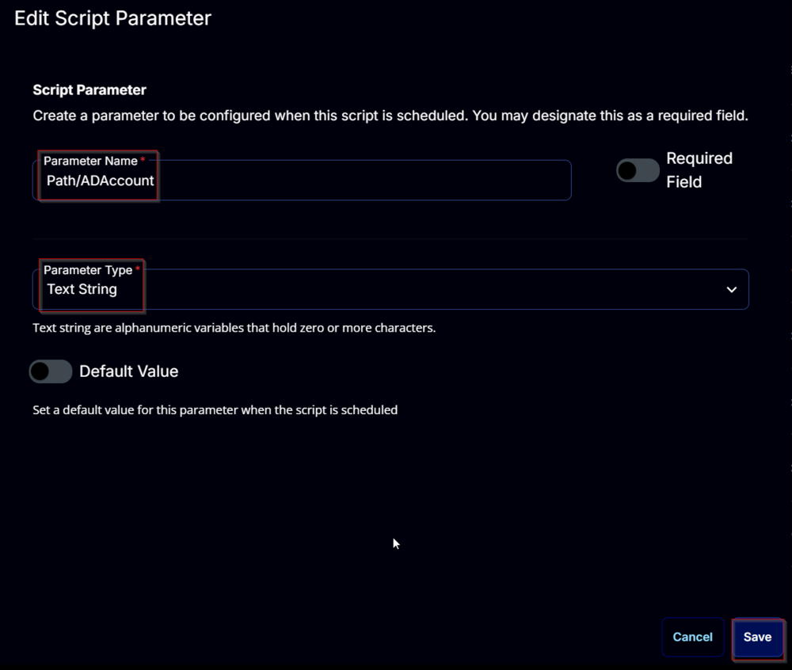

### SkipHardwareTest:
Add a new parameter by clicking the `Add Parameter` button present in the top-right corner of the screen.


This screen will appear.


- Set `SkipHardwareTest` in the `Parameter Name` field.
- Select `Flag` from the `Parameter Type` dropdown menu.
- Enable the `Default Value` button.
- Set `True` in the `Value` field.
- Click the `Save` button.

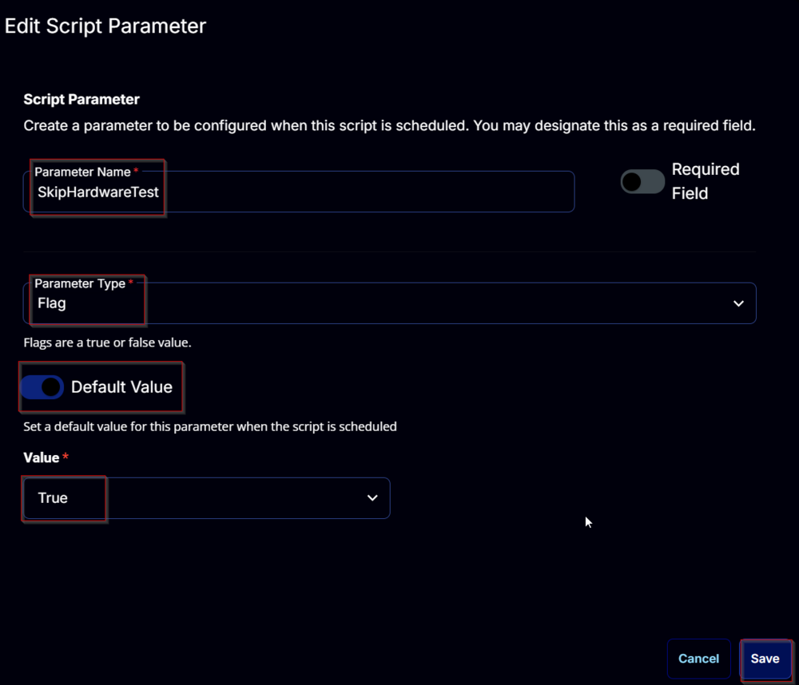

### EncryptionMethod:
Add a new parameter by clicking the `Add Parameter` button present in the top-right corner of the screen.


This screen will appear.


- Set `EncryptionMethod` in the `Parameter Name` field.
- Select `Text String` from the `Parameter Type` dropdown menu.
- Enable the `Required Field` button.
- Enable the `Default Value` button.
- Set `XtsAes256` in the `Value` field.
- Click the `Save` button.

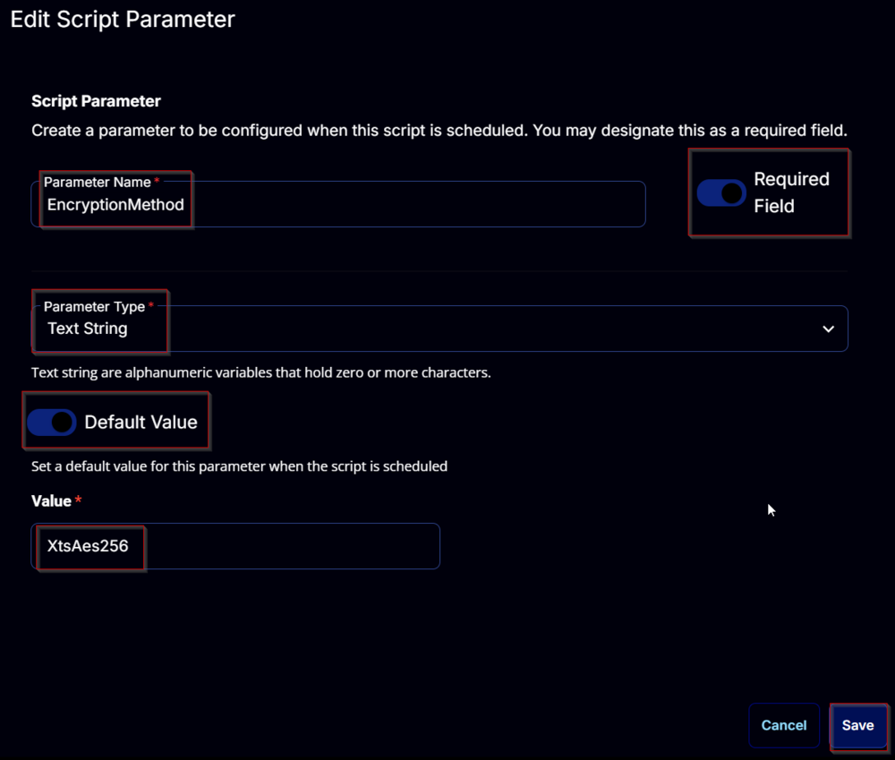

## Task
Navigate to the Script Editor Section and start by adding a row. You can do this by clicking the `Add Row` button at the bottom of the script page.


A blank function will appear.


### Row 1 Function: PowerShell Script
Search and select the `PowerShell Script` function.


The following function will pop up on the screen:


Paste in the following PowerShell script and set the `Expected time of script execution in seconds` to `600` seconds. Click the `Save` button.

```powershell
[Diagnostics.CodeAnalysis.SuppressMessageAttribute('PSAvoidUsingConvertToSecureStringWithPlainText', '')]
[CmdletBinding()]
Param()
# # Parameters and Globals
# # Be sure that the name of the hashtable property matches the name of the parameter of the script that you are calling.
$mountPoint = '@MountPoint@'
$allowTPMReboot = '@AllowTPM/Reboot@'
$keyProtectorType = '@KeyProtectorType@'
$pINPassword = '@PIN/Password@'
$pathADAccount = '@Path/ADAccount@'
$skipHardwareTest = '@SkipHardwareTest@'
$encryptionMethod = '@EncryptionMethod@'

if ( $mountPoint -notmatch '^[A-z]{1}:{0,1}$' ) {
    $mountPoint = $env:SystemDrive
}

if ( $encryptionMethod -notin ('Aes128', 'Aes256', 'XtsAes128', 'XtsAes256') ) {
    throw "Invalid encryption method specified: '$encryptionMethod'. Supported encryption methods are 'Aes128', 'Aes256', 'XtsAes128', and 'XtsAes256'."
}

if ( $skipHardwareTest -match '1|Yes|True' ) {
    $skipHardwareTest = $true
} else {
    $skipHardwareTest = $false
}

if ( ($pINPassword -match [Regex]::Escape('PIN/Password@')) -or ($null -eq $pINPassword) ) {
    $pINPassword = $null
} elseif ( $pINPassword.Length -lt 2 ) {
    $pINPassword = $null
}

if ( ($pathADAccount -match [Regex]::Escape('Path/ADAccount@')) -or ($null -eq $pathADAccount) ) {
    $pathADAccount = $null
} elseif ( $pathADAccount.Length -lt 2 ) {
    $pathADAccount = $null
}

$parameters = @{
    MountPoint = $mountPoint
    EncryptionMethod = $encryptionMethod
    SkipHardwareTest = $skipHardwareTest
}

switch ($keyProtectorType) {
    'TPM' {
        $parameters.Add('TpmProtector', $true)
    }
    'TpmPin' {
        if ( $pINPassword ) {
            $pin = (ConvertTo-SecureString -String $pINPassword -AsPlainText -Force)
            $parameters.Add('TpmAndPinProtector', $true)
            $parameters.Add('Pin', $pin)
        } else {
            throw 'A PIN must be provided when using the ''TpmPin'' key protector type.'
        }
    }
    'TpmStartup' {
        if ( $pINPassword -and $pathADAccount ) {
            $pin = (ConvertTo-SecureString -String $pINPassword -AsPlainText -Force)
            $parameters.Add('TpmAndPinAndStartupKeyProtector', $true)
            $parameters.Add('Pin', $pin)
            $parameters.Add('Path', $pathADAccount)
        } else {
            throw 'Both a PIN and the path to the external drive to save the startup key must be provided when using the ''TpmPinStartup'' key protector type.'
        }
    }
    'Password' {
        if ( $pINPassword ) {
            $password = (ConvertTo-SecureString -String $pINPassword -AsPlainText -Force)
            $parameters.Add('PasswordProtector', $true)
            $parameters.Add('Password', $password)
        } else {
            throw 'A password must be provided when using the ''Password'' key protector type.'
        }
    }
    'Startup' {
        if ( $pathADAccount ) {
            $parameters.Add('StartupKeyProtector', $true)
            $parameters.Add('Path', $pathADAccount)
        } else {
            throw 'The path to the external drive to save the startup key must be provided when using the ''Startup'' key protector type.'
        }
    }
    'RecoveryKey' {
        if ( $pathADAccount ) {
            $parameters.Add('RecoveryKeyProtector', $true)
            $parameters.Add('Path', $pathADAccount)
        } else {
            throw 'The path to the external drive to save the recovery key must be provided when using the ''RecoveryKey'' key protector type.'
        }
    }
    'RecoveryPassword' {
        $parameters.Add('RecoveryPasswordProtector', $true)
        if ( $pINPassword ) {
            $parameters.Add('RecoveryPassword', $pINPassword)
        }
    }
    'AdAccount' {
        if ( $pathADAccount ) {
            $parameters.Add('AdAccountOrGroupProtector', $true)
            $parameters.Add('AdAccountOrGroup', $pathADAccount)
        } else {
            throw 'AD account or group must be provided when using the ''AdAccount'' key protector type.'
        }
    }
    default {
        throw "KeyProtectorType ''$keyProtectorType'' is invalid. Accepted Values are 'Tpm', 'TpmStartup', 'TpmPinStartup', 'Password', 'Startup', 'RecoveryKey', 'RecoveryPassword', and 'AdAccount'."
    }
}

Switch ($allowTPMReboot) {
    1 {
        $parameters.Add('AllowTPMInit', $true)
    }
    2 {
        $parameters.Add('AllowRestart', $true)
    }
    3 {
        $parameters.Add('AllowTPMInit', $true)
        $parameters.Add('AllowRestart', $true)
    }
    default {
        break
    }
}

#region Setup - Variables
$ProjectName = 'Initialize-BitLockerVolume'
[Net.ServicePointManager]::SecurityProtocol = [enum]::ToObject([Net.SecurityProtocolType], 3072)
$BaseURL = 'https://file.provaltech.com/repo'
$PS1URL = "$BaseURL/script/$ProjectName.ps1"
$WorkingDirectory = "C://ProgramData//_automation//script//$ProjectName"
$PS1Path = "$WorkingDirectory//$ProjectName.ps1"
$Workingpath = $WorkingDirectory
$LogPath = "$WorkingDirectory//$ProjectName-log.txt"
$ErrorLogPath = "$WorkingDirectory//$ProjectName-Error.txt"
#endregion

#region Setup - Folder Structure
New-Item -Path $WorkingDirectory -ItemType Directory -ErrorAction SilentlyContinue | Out-Null
$response = Invoke-WebRequest -Uri $PS1URL -UseBasicParsing
if (($response.StatusCode -ne 200) -and (!(Test-Path -Path $PS1Path))) {
    throw "No pre-downloaded script exists and the script '$PS1URL' failed to download. Exiting."
} elseif ($response.StatusCode -eq 200) {
    Remove-Item -Path $PS1Path -ErrorAction SilentlyContinue
    [System.IO.File]::WriteAllLines($PS1Path, $response.Content)
}
if (!(Test-Path -Path $PS1Path)) {
    throw 'An error occurred and the script was unable to be downloaded. Exiting.'
}
#endregion

#region Execution
if ($Parameters) {
    & $PS1Path @Parameters
} else {
    & $PS1Path
}
#endregion

if ( !(Test-Path $LogPath) ) {
    throw 'PowerShell Failure. A Security application seems to have restricted the execution of the PowerShell Script.'
}
if ( Test-Path $ErrorLogPath ) {
    $ErrorContent = ( Get-Content -Path $ErrorLogPath )
    throw $ErrorContent
}
Get-Content -Path $LogPath
```

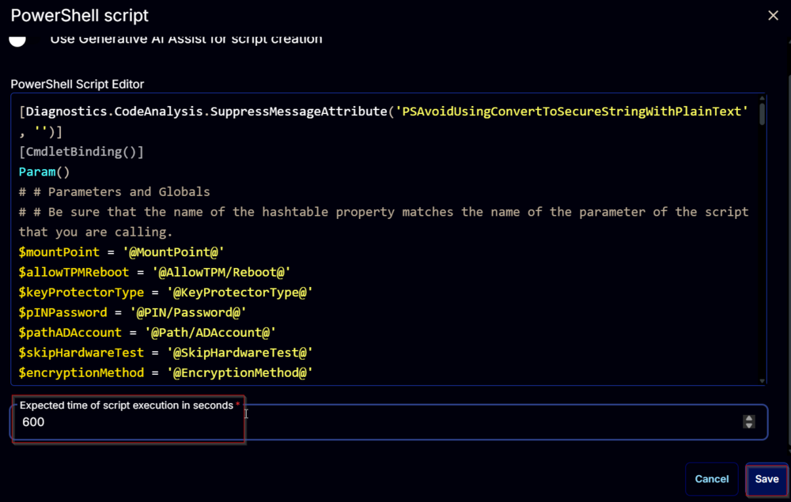

### Row 2 Function: Script Log
Add a new row by clicking the `Add Row` button.


A blank function will appear.


Search and select the `Script Log` function.


The following function will pop up on the screen:


In the script log message, simply type `%output%` and click the `Save` button.


Click the `Save` button at the top-right corner of the screen to save the script.


## Completed Task


## Output

- Script log

