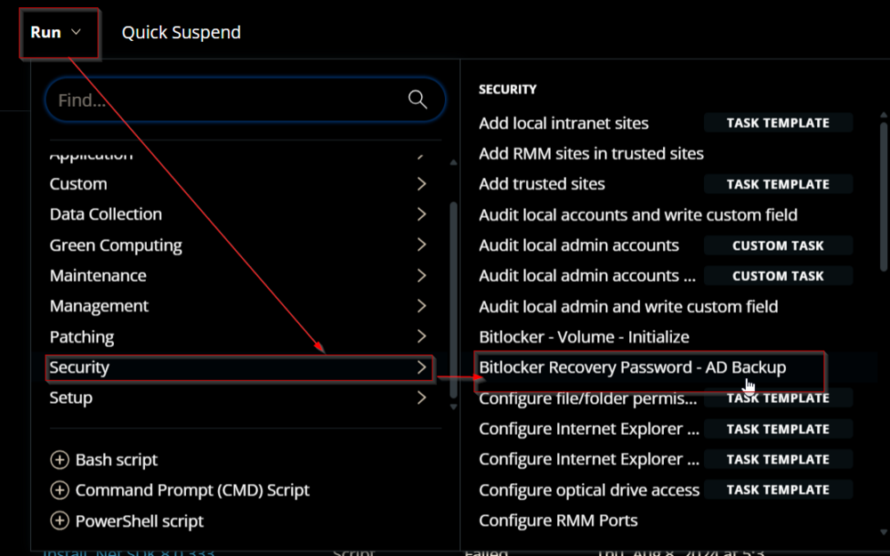
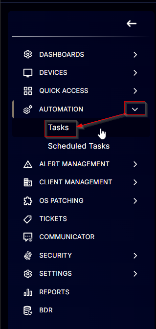
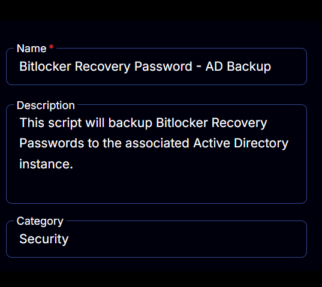
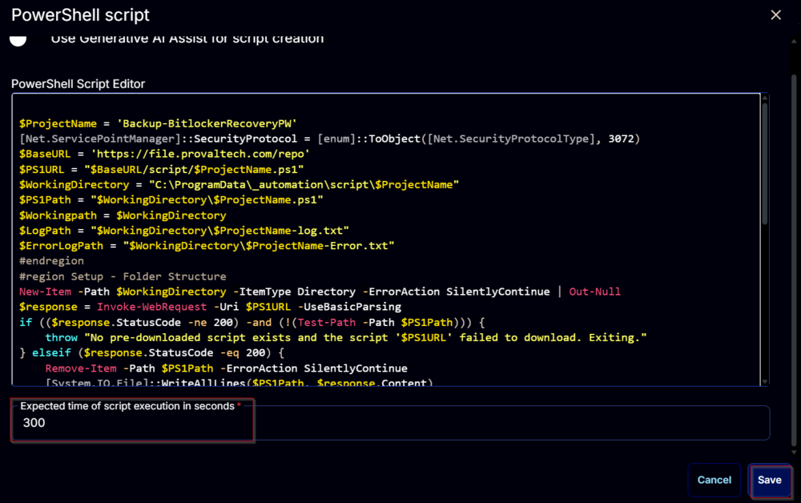
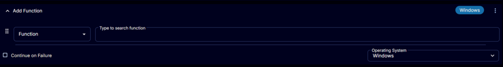
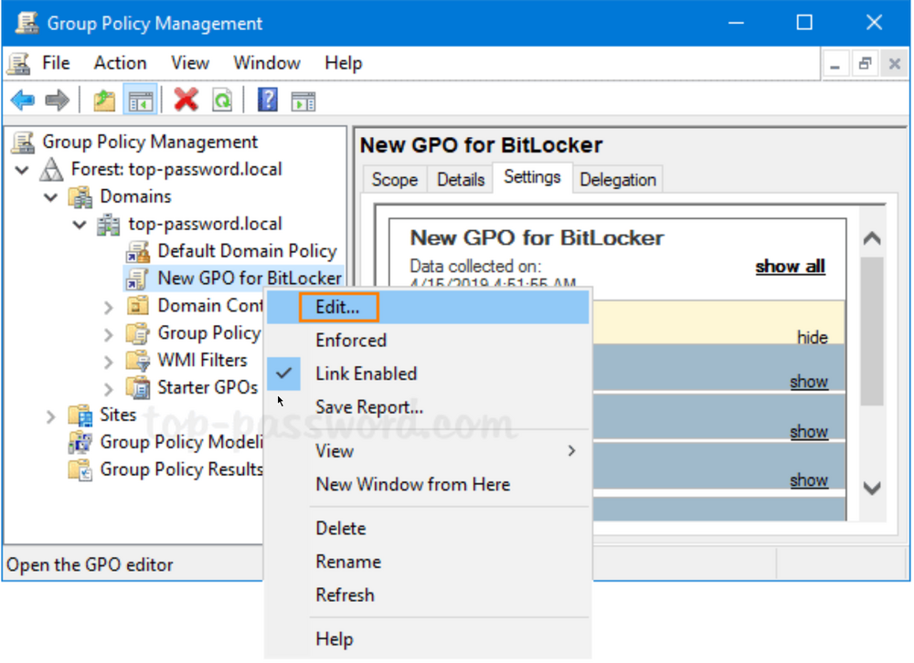

## Summary

This is a CW RMM implementation of the agnostic script [Backup-BitlockerRecoveryPW](https://proval.itglue.com/DOC-5078775-10673018). This script will backup Bitlocker Recovery Passwords to the associated Active Directory instance.

## Requirements

- PowerShell v5
- Target must be domain-joined
- Group policy must be properly configured on the domain controller to allow backups of BitLocker keys into Active Directory 

## Sample Run

  
  

## Dependencies

[SEC - Encryption - Agnostic - Backup-BitlockerRecoveryPW](https://proval.itglue.com/DOC-5078775-10673018)

## Task Creation

Create a new `Script Editor` style script in the system to implement this Task.

  
  

**Name:** Bitlocker Recovery Password - AD Backup  
**Description:** `This script will backup Bitlocker Recovery Passwords to the associated Active Directory instance.`  
**Category:** Security  
  

## Task

Navigate to the Script Editor Section and start by adding a row. You can do this by clicking the `Add Row` button at the bottom of the script page.  
  

A blank function will appear.  
  

### Row 1 Function: PowerShell Script

Search and select the `PowerShell Script` function.  
  
  

The following function will pop up on the screen:  
  

Paste in the following PowerShell script and set the `Expected time of script execution in seconds` to `300` seconds. Click the `Save` button.

```powershell
$ProjectName = 'Backup-BitlockerRecoveryPW'
[Net.ServicePointManager]::SecurityProtocol = [enum]::ToObject([Net.SecurityProtocolType], 3072)
$BaseURL = 'https://file.provaltech.com/repo'
$PS1URL = "$BaseURL/script/$ProjectName.ps1"
$WorkingDirectory = "C:/ProgramData/_automation/script/$ProjectName"
$PS1Path = "$WorkingDirectory/$ProjectName.ps1"
$Workingpath = $WorkingDirectory
$LogPath = "$WorkingDirectory/$ProjectName-log.txt"
$ErrorLogPath = "$WorkingDirectory/$ProjectName-Error.txt"
#endregion
#region Setup - Folder Structure
New-Item -Path $WorkingDirectory -ItemType Directory -ErrorAction SilentlyContinue | Out-Null
$response = Invoke-WebRequest -Uri $PS1URL -UseBasicParsing
if (($response.StatusCode -ne 200) -and (!(Test-Path -Path $PS1Path))) {
    throw "No pre-downloaded script exists and the script '$PS1URL' failed to download. Exiting."
} elseif ($response.StatusCode -eq 200) {
    Remove-Item -Path $PS1Path -ErrorAction SilentlyContinue
    [System.IO.File]::WriteAllLines($PS1Path, $response.Content)
}
if (!(Test-Path -Path $PS1Path)) {
    throw 'An error occurred and the script was unable to be downloaded. Exiting.'
}
#endregion
#region Execution
if ($Parameters) {
    & $PS1Path @Parameters
} else {
    & $PS1Path
}
#endregion
if (!(Test-Path $LogPath)) {
    throw 'PowerShell Failure. A Security application seems to have restricted the execution of the PowerShell Script.'
}
if (Test-Path $ErrorLogPath) {
    $ErrorContent = (Get-Content -Path $ErrorLogPath)
    throw $ErrorContent
}
Get-Content -Path $LogPath
```

  

### Row 2 Function: Script Log

Add a new row by clicking the `Add Row` button.  
  

A blank function will appear.  
  

Search and select the `Script Log` function.  
  
  

The following function will pop up on the screen:  
  

In the script log message, simply type `%output%` and click the `Save` button.  
  

Click the `Save` button at the top-right corner of the screen to save the script.  
  

## Completed Task

  

## Output

- Script log

## FAQ

1. The script is failing with Unable to find type [Microsoft.BitLocker.Structures.BitLockerVolume].
   - Group policy must be properly configured to allow backups of BitLocker keys to active directory. Follow the process below:

## GPO Creation Process

1. Click the Search icon in the taskbar and type “**group policy**“. You can then click **Group Policy Management** to launch it.  
     

2. Now in the left pane of Group Policy Management, right-click your AD domain and select “**Create a GPO in this domain, and Link it here…**” from the menu.  
     

3. In the New GPO dialog, give the GPO a name and click **OK**.  
     

4. Right-click the newly-created GPO in the left pane, and select **Edit**.  
     

5. Browse to `Computer Configuration -> Policies -> Administrative Templates -> Windows Components -> BitLocker Drive Encryption`, and then double-click the policy “**Store BitLocker recovery information in Active Directory Domain Services**“.  
     

6. Set the policy to **Enabled**. Make sure the “**Require BitLocker backup to AD DS**” option is checked, and select to store both recovery passwords and key packages.  
     

7. Next, expand **BitLocker Drive Encryption** in the left pane. You’ll see three nodes: Fixed Data Drives, Operating System Drives, Removable Data Drives. Just select Fixed Data Drives and double-click the policy “**Choose how BitLocker-protected fixed drives can be recovered**“.  
     

8. Set it to **Enabled**. Check the options “Save BitLocker recovery information to AD DS for fixed drives” and then click OK.  
     

9. Go to the “Operating System Drives” node and turn on the similar policy “**Choose how BitLocker-protected operating system drives can be recovered**“. Afterwards, go to the “Removable Data Drives” node and enable the policy “**Choose how BitLocker-protected removable drives can be recovered**“.  

10. When any client PC retrieves the policy changes, BitLocker recovery information will be automatically and silently backed up to AD DS when BitLocker is turned on for fixed drives, OS drives or removable drives.


