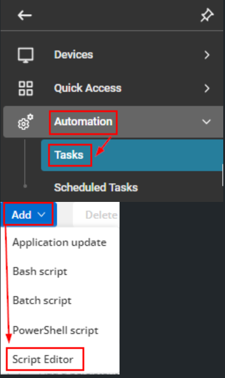

## Summary

This is a CW RMM implementation of the agnostic script [Remove-PUA](/docs/fda5f79b-3e83-4561-af2b-2533f41c7443). This script removes bloatware from a Windows computer. Use the “ListBloatware” parameter to generate a log of installed bloatware from the supported applications. For a list of supported applications, refer to the “Supported Bloatware” section at the very bottom of this document. 

## Sample Run


To get the list of installed Bloatware: 


To remove all installed Bloatware supported by the script: 


To remove all `XboxFeaturesApps` supported by the script: 


To remove all installed Bloatware except any of `WindowsStoreApps` category apps and `Microsoft.BingNews`,  and `Microsoft.MSPaint`: 


To remove individual apps supported by the script like `Microsoft.MicrosoftOfficeHub`, `Microsoft.XboxApp`, `Microsoft.Messaging`, and `Microsoft.People`:


## Dependencies

[Remove-PUA](/docs/fda5f79b-3e83-4561-af2b-2533f41c7443)

## Implementation

### Create Task

To implement this script, please create a new "PowerShell" style script in the system.



- **Name:** Remove - PUA  
- **Description:** This is a CW RMM implementation of the agnostic script [Remove-PUA](/docs/fda5f79b-3e83-4561-af2b-2533f41c7443). This script removes bloatware from a Windows computer. Use the “ListBloatware” parameter to generate a log of installed bloatware from the supported applications. For a list of supported applications, refer to the “Supported Bloatware” section at the very bottom of this document.   
- **Category:** Application  


## Parameters

#### ListBloatware:
Add a new parameter by clicking the `Add Parameter` button present at the top-right corner of the screen.


This screen will appear.  


- Set `ListBloatware` in the `Parameter Name` field.
- Select `Flag` from the `Parameter Type` dropdown menu.
- Click the `Save` button.


#### Remove:
Add a new parameter by clicking the `Add Parameter` button present at the top-right corner of the screen.


This screen will appear.  


- Set `Remove` in the `Parameter Name` field.
- Select `Text String` from the `Parameter Type` dropdown menu.
- Click the `Save` button


#### RemoveAll:
Add a new parameter by clicking the `Add Parameter` button present at the top-right corner of the screen.


This screen will appear.  


- Set `RemoveAll` in the `Parameter Name` field.
- Select `Flag` from the `Parameter Type` dropdown menu.
- Click the `Save` button


#### Category:
Add a new parameter by clicking the `Add Parameter` button present at the top-right corner of the screen.


This screen will appear.  


- Set `Category` in the `Parameter Name` field.
- Select `Text String` from the `Parameter Type` dropdown menu.
- Click the `Save` button


#### Except:
Add a new parameter by clicking the `Add Parameter` button present at the top-right corner of the screen.


This screen will appear.  


- Set `Except` in the `Parameter Name` field.
- Select `Text String` from the `Parameter Type` dropdown menu.
- Click the `Save` button


### Script

Start by creating three separate rows. You can do this by clicking the "Add Row" button at the bottom of the script page.


A blank function will appear.  

### Row 1: Function: PowerShell Script


The following function will pop up on the screen: 


Paste in the following PowerShell script and set the `Expected time of script execution in seconds` to 3600 seconds. Click the `Save` button.
```
#region user parameters
$ListBloatware = '@ListBloatware@'
$Remove = '@Remove@'
$RemoveAll = '@RemoveAll@'
$Category = '@Category@'
$Except = '@Except@'
if ($ListBloatware -match '1|True|Yes') {
    $ListBloatware = $true
} else {
    $ListBloatware = $false
}
if ($Remove -and $Remove -notmatch 'Remove' -and $Remove -match '[A-z]') {
    $Remove = $Remove -replace ', ', ',' -replace ' ,', ','
    $Remove = $Remove.Trim()
    $Remove = $Remove.Split(',')
}
if ($RemoveAll -match '1|True|Yes') {
    $RemoveAll = $true
} else {
    $RemoveAll = $false
}
if ($RemoveAll -and $Category -and $Category -notmatch 'Category' -and $Category -match '[A-z]') {
    if (!(('MsftBloatApps', 'ThirdPartyBloatApps', 'WindowsStoreApps', 'XboxFeaturesApps', 'NonAppxApps') -contains $Category)) {
        throw 'Invalid category. Supported categories are: MsftBloatApps, ThirdPartyBloatApps, WindowsStoreApps, XboxFeaturesApps, NonAppxApps'
    } else {
        $Category = $Category
    }
} else {
    $Category = $false
}
if ($RemoveAll -and $Except -and $Except -notmatch 'Except' -and $Except -match '[A-z]') {
    $Except = $Except -replace ', ', ',' -replace ' ,', ','
    $Except = $Except.Trim()
    $Except = $Except.Split(',')
} else {
    $Except = $false
}
#endregion
#region parameters hash table
$Parameters = @{}
if ( $ListBloatware ) {
    $Parameters.Add('ListBloatware', $true)
} elseif ( $Remove ) {
    $Parameters.Add('Remove', $Remove)
} elseif ( $RemoveAll ) {
    $Parameters.Add('RemoveAll', $true)
    if ( $Category ) {
        $Parameters.Add('Category', $Category)
    }
    if ( $Except ) {
        $Parameters.Add('Except', $Except)
    }
} else {
    throw 'Invalid parameter set.'
}
#endregion
#region variables
[Net.ServicePointManager]::SecurityProtocol = [enum]::ToObject([Net.SecurityProtocolType], 3072)
$ProjectName = 'Remove-PUA'
$BaseURL = 'https://file.provaltech.com/repo'
$PS1URL = "$BaseURL/script/$ProjectName.ps1"
$WorkingDirectory = "C:\ProgramData\_automation\script\$ProjectName"
$PS1Path = "$WorkingDirectory\$ProjectName.ps1"
$Workingpath = $WorkingDirectory
$LogPath = "$WorkingDirectory\$ProjectName-log.txt"
$ErrorLogPath = "$WorkingDirectory\$ProjectName-Error.txt"
#endregion
#region Setup - Folder Structure
New-Item -Path $WorkingDirectory -ItemType Directory -ErrorAction SilentlyContinue | Out-Null
$response = Invoke-WebRequest -Uri $PS1URL -UseBasicParsing
if (($response.StatusCode -ne 200) -and (!(Test-Path -Path $PS1Path))) {
    Write-Error -Message "No pre-downloaded script exists and the script '$PS1URL' failed to download. Exiting."
    return
} elseif ($response.StatusCode -eq 200) {
    Remove-Item -Path $PS1Path -ErrorAction SilentlyContinue
    [System.IO.File]::WriteAllLines($PS1Path, $response.Content)
}
if (!(Test-Path -Path $PS1Path)) {
    Write-Error -Message 'An error occurred and the script was unable to be downloaded. Exiting.'
    return
}
#endregion
& $PS1Path @Parameters
#region Execution
if ($Parameters) {
    & $PS1Path @Parameters
} else {
    & $PS1Path
}
#endregion
if ( !(Test-Path $LogPath) ) {
    throw 'PowerShell Failure. A Security application seems to have restricted the execution of the PowerShell Script.'
}
if ( Test-Path $ErrorLogPath ) {
    $ErrorContent = ( Get-Content -Path $ErrorLogPath )
    throw $ErrorContent
}
Get-Content -Path $LogPath
```


### Row 2: Function: Script Log 

Add a new row by clicking the `Add Row` button.  


A blank function will appear.  


Search and select the `Script Log` function.  


The following function will pop up on the screen:  


In the script log message, simply type %output% and click the `Save` button  


In the script log message, simply type `%output%` so that the script will send the results of the PowerShell script above to the output on the Automation tab for the target device.


Click the `Save` button at the top-right corner of the screen to save the script.  


## Row 3: Completed Script


## Output
- Script log

## Supported Bloatware

| MsftBloatApps                            | ThirdPartyBloatApps                       | WindowsStoreApps                       | XboxFeaturesApps                   | NonAppxApps                                             |
|------------------------------------------|-------------------------------------------|---------------------------------------|-----------------------------------|---------------------------------------------------------|
| Microsoft.3DBuilder                       | 46928bounde.EclipseManager                | Microsoft.DesktopAppInstaller         | Microsoft.Xbox.TCUI               | Clean Your Device                                       |
| Microsoft.AppConnector                    | 4DF9E0F8.Netflix                          | Microsoft.WindowsStore                 | Microsoft.XboxApp                 | Dell Optimizer Service                                  |
| Microsoft.BingFinance                     | 828B5831.HiddenCityMysteryofShadows      |                                       | Microsoft.XboxGameOverlay         | Dell Power Manager Service                               |
| Microsoft.BingNews                        | 89006A2E.AutodeskSketchBook               |                                       | Microsoft.XboxIdentityProvider    | Dell SupportAssist OS Recovery Plugin for Dell Update   |
| Microsoft.BingSports                      | 9E2F88E3.Twitter                          |                                       | Microsoft.XboxSpeechToTextOverlay | HP Notifications                                         |
| Microsoft.BingWeather                     | A278AB0D.DisneyMagicKingdoms             |                                       |  Microsoft.XboxLive                | HP TechPulse                                           |
| Microsoft.CommsPhone                      | A278AB0D.MarchofEmpires                  |                                       | Microsoft.XboxGamingOverlay        | Lenovo Quick Clean                                      |
| Microsoft.ConnectivityStore               | ActiproSoftwareLLC.562882FEEB491         |                                       |  Microsoft.GamingApp               | Lenovo Vantage Service                                   |
| Microsoft.Getstarted                       | AD2F1837.HPPCHardwareDiagnosticsWindows   |                                       |                                   |                                                         |
| Microsoft.Messaging                        | AD2F1837.HPPowerManager                   |                                       |                                   |                                                         |
| Microsoft.Microsoft3DViewer               | AD2F1837.HPPrivacySettings                |                                       |                                   |                                                         |
| Microsoft.MicrosoftOfficeHub               | AD2F1837.HPQuickDrop                      |                                       |                                   |                                                         |
| Microsoft.MicrosoftPowerBIForWindows      | AD2F1837.HPSupportAssistant               |                                       |                                   |                                                         |
| Microsoft.MicrosoftSolitaireCollection     | AD2F1837.HPSystemInformation              |                                       |                                   |                                                         |
| Microsoft.MicrosoftStickyNotes             | AD2F1837.myHP                             |                                       |                                   |                                                         |
| Microsoft.MinecraftUWP                    | AdobeSystemsIncorporated.AdobePhotoshopExpress |                                   |                                   |                                                         |
| Microsoft.MixedReality.Portal              | CAF9E577.Plex                             |                                       |                                   |                                                         |
| Microsoft.MSPaint                         | D52A8D61.FarmVille2CountryEscape          |                                       |                                   |                                                         |
| Microsoft.NetworkSpeedTest                | D5EA27B7.Duolingo-LearnLanguagesforFree  |                                       |                                   |                                                         |
| Microsoft.Office.OneNote                  | Drawboard.DrawboardPDF                    |                                       |                                   |                                                         |
| Microsoft.Office.OneNote                  | E046963F.cameraSettings                   |                                       |                                   |                                                         |
| Microsoft.Office.Sway                     | E046963F.LenovoCompanion                  |                                       |                                   |                                                         |
| Microsoft.OneConnect                       | E046963F.LenovoSettingsforEnterprise      |                                       |                                   |                                                         |
| Microsoft.People                          | Facebook.Facebook                          |                                       |                                   |                                                         |
| Microsoft.Print3D                         | flaregamesGmbH.RoyalRevolt2              |                                       |                                   |                                                         |
| Microsoft.RemoteDesktop                    | GAMELOFTSA.Asphalt8Airborne               |                                       |                                   |                                                         |
| Microsoft.SkypeApp                        | KeeperSecurityInc.Keeper                  |                                       |                                   |                                                         |
| Microsoft.Windows.Photos                  | king.com.BubbleWitch3Saga                 |                                       |                                   |                                                         |
| Microsoft.WindowsAlarms                   | king.com.CandyCrushSodaSaga               |                                       |                                   |                                                         |
| Microsoft.WindowsCamera                   | laregamesGmbH.RoyalRevolt2                |                                       |                                   |                                                         |
| microsoft.windowscommunicationsapps       | WhatsApp.WhatsAppDesktop                  |                                       |                                   |                                                         |
| Microsoft.WindowsFeedbackHub              | Clipchamp.Clipchamp                       |                                       |                                   |                                                         |
| Microsoft.WindowsMaps                     | LinkedIn.LinkedIn                         |                                       |                                   |                                                         |
| Microsoft.WindowsPhone                    | HPInc.MyHP                                |                                       |                                   |                                                         |
| Microsoft.WindowsSoundRecorder            | SpotifyAB.SpotifyMusic                    |                                       |                                   |                                                         |
| Microsoft.ZuneMusic                       |                                           |                                       |                                   |                                                         |
| Microsoft.ZuneVideo                       |                                           |                                       |                                   |                                                         |
| Microsoft.OneDrive                        |                                           |                                       |                                   |                                                         |
| Microsoft.GetHelp                         |                                           |                                       |                                   |                                                         |
| Microsoft.PowerAutomateDesktop            |                                           |                                       |                                   |                                                         |
| Microsoft.QuickAssist                     |                                           |                                       |                                   |                                                         |
| Microsoft.LinkedIn                        |                                            |                                       |                                   |                                                         |
| Microsoft.WindowsCopilot                  |                                           |                                       |                                   |                                                         |
| Microsoft.549981C3F5F10                  |                                           |                                       |                                   |                                                         |
| Microsoft.WhatsAppDesktop                |                                           |                                       |                                   |                                                         |
| Microsoft.Todos                          |                                           |                                       |                                   |                                                         |
| Microsoft.OneDriveSync                   |                                           |                                       |                                   |                                                         |
| Microsoft.Paint3D                        |                                           |                                       |                                   |                                                         |
| MicrosoftCorporationII.QuickAssist       |                                           |                                       |                                   |                                                         |
| Microsoft.SpotifyMusic                   |                                           |                                       |                                   |                                                         |


