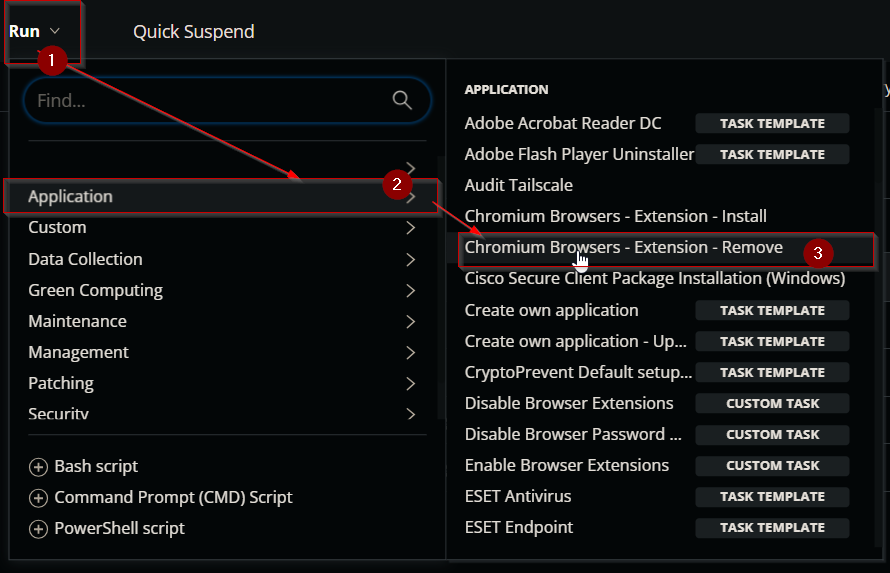
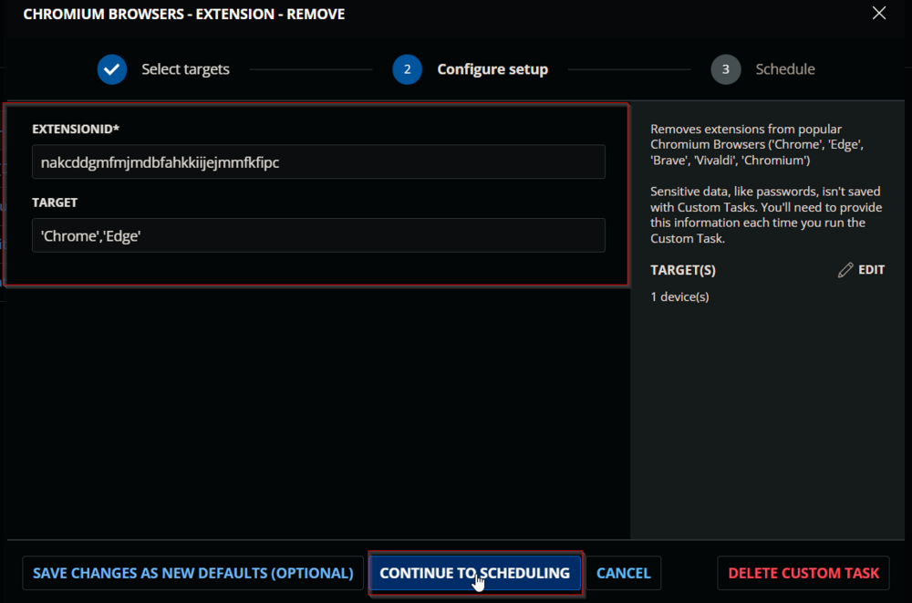
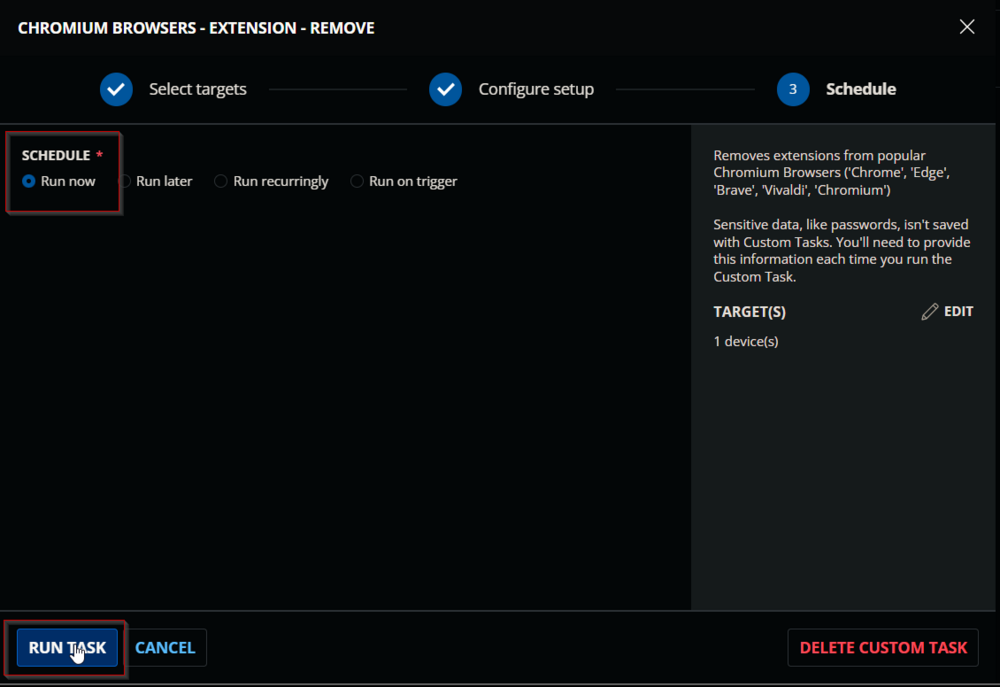
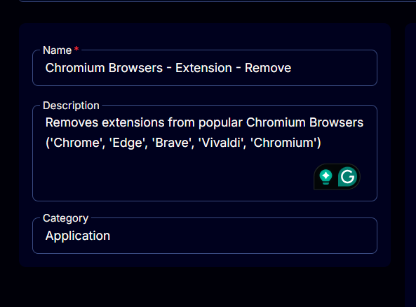
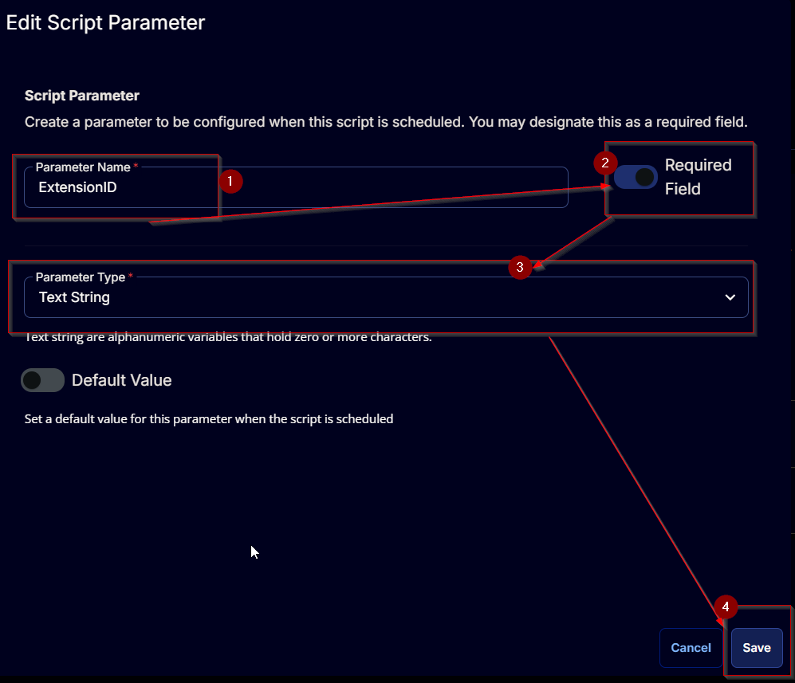
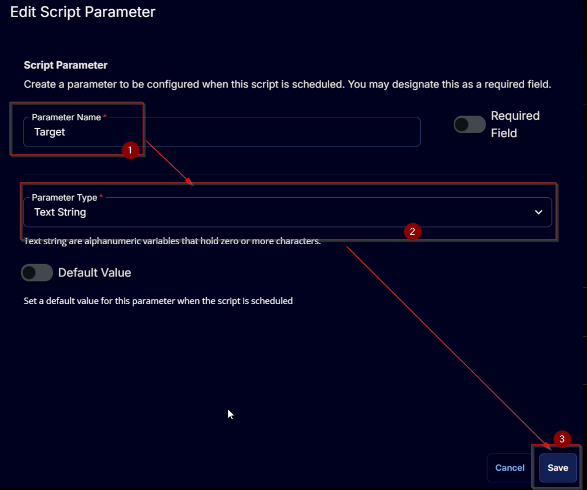
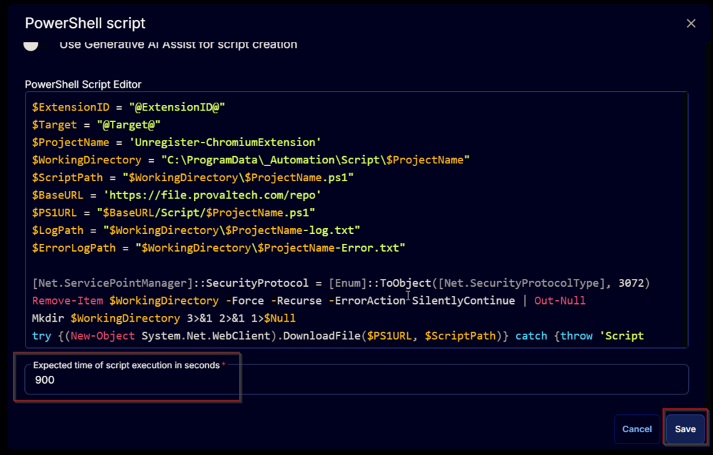
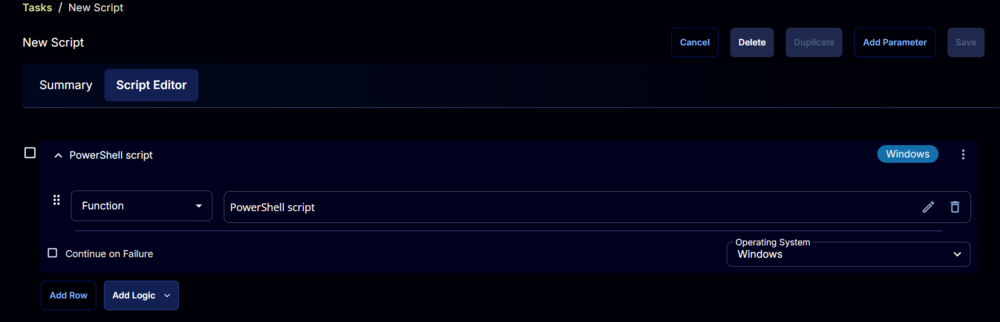

## Summary

Remove extensions from popular Chromium browsers (Chrome, Edge, Brave, Vivaldi, and Chromium).

## Sample Run

  
  
  

## Dependencies

[SWM - Software Configuration - Unregister-ChromiumExtension](<../../powershell/Unregister-ChromiumExtension.md>)

## User Parameters

| Name        | Example                                   | Required | Description                                                                                                                                                                                                                      |
|-------------|-------------------------------------------|----------|----------------------------------------------------------------------------------------------------------------------------------------------------------------------------------------------------------------------------------|
| ExtensionID | nakcddgmfmjmdbfahkkiijejmmfkfipc         | True     | The ExtensionID of the extension(s) from the Google Chrome Store. Multiple IDs can be separated by a comma. Example: `'kgjfgplpablkjnlkjmjdecgdpfankdle', 'cjpalhdlnbpafiamejdnhcphjbkeiagm'                                 |
| Target      | Chrome                                    | False    | Designates the target browser to remove the extension from. Defaults to applying settings to all available targets. Available options: `'Chrome', 'Edge', 'Brave', 'Vivaldi', 'Chromium'`. Multiple IDs can be separated by a comma: `'Chrome', 'Edge', 'Brave'` |

## Task Creation

Create a new `Script Editor` style script in the system to implement this task.  
  
  

**Name:** Chromium Browsers - Extension - Remove  
**Description:** Removes extensions from popular Chromium browsers (Chrome, Edge, Brave, Vivaldi, and Chromium)  
**Category:** Application  
  

## Parameters

Add a new parameter by clicking the `Add Parameter` button present at the top-right corner of the screen.  
  

This screen will appear.  
  

- Set `ExtensionID` in the `Parameter Name` field.
- Enable the `Required Field` option.
- Select `Text String` from the `Parameter Type` dropdown menu.
- Click the `Save` button.  
  
- It will ask for confirmation to proceed. Click the `Confirm` button to create the parameter.  
  

Add another parameter by clicking the `Add Parameter` button present at the top-right corner of the screen.  
  

This screen will appear.  
  

- Set `Target` in the `Parameter Name` field.
- Select `Text String` from the `Parameter Type` dropdown menu.
- Click the `Save` button.  
  
- It will ask for confirmation to proceed. Click the `Confirm` button to create the parameter.  
  

## Task

Navigate to the Script Editor section and start by adding a row. You can do this by clicking the `Add Row` button at the bottom of the script page.  
  

A blank function will appear.  
  

### Row 1 Function: PowerShell Script

Search and select the `PowerShell Script` function.  
  
  

The following function will pop up on the screen:  
  

Paste in the following PowerShell script and set the expected time of script execution to `900` seconds. Click the `Save` button.

```powershell
$ExtensionID = "@ExtensionID@"
$Target = "@Target@"
$ProjectName = 'Unregister-ChromiumExtension'
$WorkingDirectory = "C:/ProgramData/_Automation/Script/$ProjectName"
$ScriptPath = "$WorkingDirectory/$ProjectName.ps1"
$BaseURL = 'https://file.provaltech.com/repo'
$PS1URL = "$BaseURL/Script/$ProjectName.ps1"
$LogPath = "$WorkingDirectory/$ProjectName-log.txt"
$ErrorLogPath = "$WorkingDirectory/$ProjectName-Error.txt"

[Net.ServicePointManager]::SecurityProtocol = [Enum]::ToObject([Net.SecurityProtocolType], 3072)
Remove-Item $WorkingDirectory -Force -Recurse -ErrorAction SilentlyContinue | Out-Null
Mkdir $WorkingDirectory 3>&1 2>&1 1>$Null
try {(New-Object System.Net.WebClient).DownloadFile($PS1URL, $ScriptPath)} catch {throw 'Script Download Failure'}

if ($Target -match '^(Chromium|Chrome|Edge|Brave|Vivaldi)$') {
  & $ScriptPath -ExtensionID $ExtensionID -Target $Target
} else {
  & $ScriptPath -ExtensionID $ExtensionID
}

if (!(Test-Path $LogPath)) {
  Throw 'PowerShell Failure. A security application seems to have restricted the execution of the PowerShell script.'
}

if (Test-Path $ErrorLogPath) {
  $ErrorContent = (Get-Content -Path $ErrorLogPath)
  throw $ErrorContent
}

Get-Content -Path $LogPath
```

  

Click the `Save` button at the top-right corner of the screen to save the script.  
  

## Completed Task

  

## Output

- Script Log
