## Summary

This document executes a PowerShell script to validate the full version of the OS and compares it with Microsoft's database of Windows 10/11 Cumulative Updates to identify which cumulative update the device has. The data is then formatted and stored in the [CW RMM - Custom Field - Latest Cumulative Update](<../custom-fields/Latest Cumulative Update.md>) for further auditing and monitoring purposes.

## Sample Run

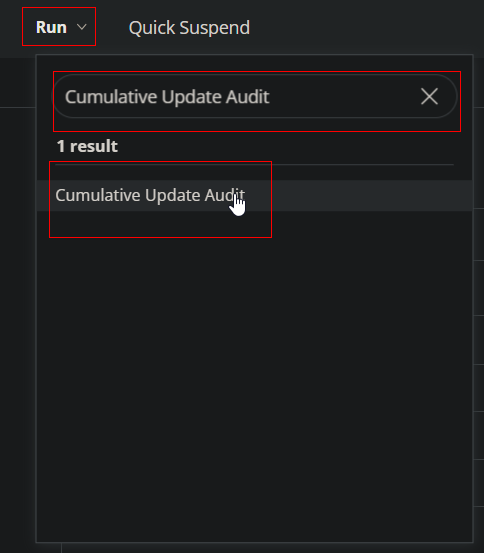
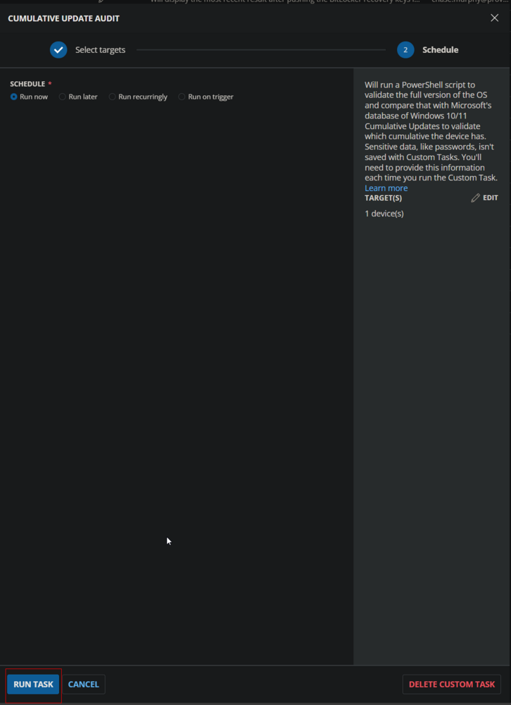

## Dependencies

- [CW RMM - Custom Field - Latest Cumulative Update](<../custom-fields/Latest Cumulative Update.md>)

## Variables

| Name              | Description                                                                                             |
|-------------------|---------------------------------------------------------------------------------------------------------|
| Threshold_Days    | Age of the latest installed Cumulative Update in days to determine if it is obsolete. Default is 75.   |
| Output            | Output of the PowerShell script gathering the data from the endpoint.                                   |

## Implementation

Create the Custom Field [CW RMM - Custom Field - Latest Cumulative Update](<../custom-fields/Latest Cumulative Update.md>).

### Create Script

Create a new `Script Editor` style script in the system to implement this Task.

**Name:** Cumulative Update Audit  
**Description:** This script will run a PowerShell script to validate the full version of the OS and compare it with Microsoft's database of Windows 10/11 Cumulative Updates to identify which cumulative update the device has.  
**Category:** Custom  


### Script

Start by adding a row. You can do this by clicking the "Add Row" button at the bottom of the script page.


#### Row 1 Function: Set User Variable

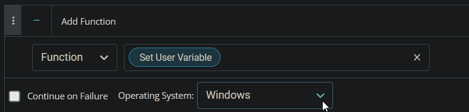

Type `Threshold_Days` for Variable Name and `75` for the value. This value represents the number of days to consider the latest installed Cumulative Update as obsolete. This threshold can be modified as needed.

The script will return `Failed` in the Custom Field if the most recently installed Cumulative Update on the computer is older than the days stored in this variable.


#### Row 2 Function: PowerShell Script

 


Paste in the following PowerShell script and set the expected time of script execution to `600` seconds.

```powershell
$ProgressPreference = 'SilentlyContinue'
$WarningPreference = 'SilentlyContinue'
[Net.ServicePointManager]::SecurityProtocol = [Enum]::ToObject([Net.SecurityProtocolType], 3072)
$ThresholdDays = '@ThresholdDays@'
$ThresholdDays = if ( -not ($ThresholdDays -match '^[0-9]{1,}$') ) { '75' } else { $ThresholdDays }
$url = 'https://proval.itglue.com/DOC-5078775-15739309'
$iwr = Invoke-WebRequest -Uri $url -UseBasicParsing
$json = $($iwr.content -split '&lt;code&gt;' -split '&lt;/code&gt;' ) -match 'plugin_proval_windows_os_support'
$json = $json -replace '&lt;br&gt;', "`n" -replace '//', '//' -replace "'", "/'" -replace "$([char]0x2018)|$([char]0x2019)", "/'" -replace '&amp;#x2014;', ' ' -replace '&amp;nbsp;', ''
$rows = ( $json | ConvertFrom-Json ).rows
$osinfo = Get-CimInstance -ClassName Win32_OperatingSystem
if ( !( $osinfo.caption -match '(Windows 1[01])|(Server 20(1[69]|22))' ) ) {
    return 'Unsupported OS'
}
$SupportEndDate = if ( $osinfo.caption -Match 'Server 2016' ) {
    ( $rows | Where-Object { $_.BaseOS -Match 'Windows Server 2016' } ).SupportMainStreamEnd
} elseif ( $osinfo.caption -Match 'Server 2019' ) {
    ( $rows | Where-Object { $_.BaseOS -Match 'Windows Server 2019' } ).SupportMainStreamEnd
} elseif ( $osinfo.caption -Match 'Server 2022' ) {
    ( $rows | Where-Object { $_.BaseOS -Match 'Windows Server 2022' } ).SupportMainStreamEnd
} elseif ( $osinfo.caption -Match 'Windows 10.*LTS[CB]'  ) {
    ( $rows | Where-Object { $_.BaseOS -Match 'Windows 10' -and $_.Build -eq $osinfo.Version } ).SupportLTSBEnd
} elseif ( $osinfo.caption -Match 'Windows 10.*Enterprise' ) {
    ( $rows | Where-Object { $_.BaseOS -Match 'Windows 10' -and $_.Build -eq $osinfo.Version } ).SupportEnterpriseEnd
} elseif ( $osinfo.caption -Match 'Windows 10' ) {
    ( $rows | Where-Object { $_.BaseOS -Match 'Windows 10' -and $_.Build -eq $osinfo.Version } ).SupportMainstreamEnd
} elseif ( $osinfo.caption -Match 'Windows 11.*LTS[CB]'  ) {
    ( $rows | Where-Object { $_.BaseOS -Match 'Windows 11' -and $_.Build -eq $osinfo.Version } ).SupportLTSBEnd
} elseif ( $osinfo.caption -Match 'Windows 11.*Enterprise' ) {
    ( $rows | Where-Object { $_.BaseOS -Match 'Windows 11' -and $_.Build -eq $osinfo.Version } ).SupportEnterpriseEnd
} elseif ( $osinfo.caption -Match 'Windows 11' ) {
    ( $rows | Where-Object { $_.BaseOS -Match 'Windows 11' -and $_.Build -eq $osinfo.Version } ).SupportMainstreamEnd
} else {
    'Unsupported'
}
if ( $SupportEndDate -eq 'Unsupported') {
    return 'Unsupported OS'
} elseif ( $([DateTime]$SupportEndDate).AddDays(30) -lt (Get-Date) ) {
    return "End of Life Build. Support End Date: $SupportEndDate"
} else {
}
#region get latest cumulative update
$Progresspreference = 'silentlycontinue'
[Net.ServicePointManager]::SecurityProtocol = [Enum]::ToObject([Net.SecurityProtocolType], 3072)
$osinfo = Get-CimInstance -ClassName Win32_OperatingSystem
$comparisionurl = if ( $osinfo.Name -Match '(Windows 10)|(Server 201[69])' ) {
    'https://learn.microsoft.com/en-us/windows/release-health/release-information'
} elseif ($osinfo.Name -Match 'Windows 11') {
    'https://learn.microsoft.com/en-us/windows/release-health/windows11-release-information'
} elseif ($osinfo.Name -Match 'Server 2022') {
    'https://support.microsoft.com/en-us/topic/windows-server-2022-update-history-e1caa597-00c5-4ab9-9f3e-8212fe80b2ee'
} else {
    'Unsupported Operating System'
}
if ( $comparisionurl -eq 'Unsupported Operating System' ) {
    throw $comparisionurl
}
$UBR = (Get-ItemProperty 'HKLM://SOFTWARE//Microsoft//Windows NT//CurrentVersion' -ErrorAction SilentlyContinue).UBR
$Build = "$($osinfo.buildnumber).$($UBR)"
$OSBuild = "$((($osinfo).Version).$($UBR))"
if (!($Build -match '[0-9]{5}//.[0-9]{3,5}')) {
    $OSBuild = (cmd.exe /c ver)
    $OSBuild = ($OSBuild -replace '[//[//]A-z//s]', '')[1]
    $Build = ($OsBuild -split '//.')[2, 3] -join '.'
    if (!($build -match '[0-9]{5}//.[0-9]{3,5}')) {
        throw 'Failed to gather build number'
    }
}
$KBIDRawContent = Invoke-WebRequest -Uri $comparisionurl -UseBasicParsing
if ( !( $osinfo.Name -Match 'Server 2022' ) ) {
    $KBhtml = $KBIDRawContent.Rawcontent -split '&lt;tr&gt;' -split '&lt;/tr&gt;' | Select-String -Pattern $build | Select-String -Pattern 'http'
    if ($null -eq $kbhtml) {
        $KBhtml = $KBIDRawContent.Rawcontent -split '&lt;tr&gt;' -split '&lt;/tr&gt;' | Select-String -Pattern $build
        $ReleaseDate = $($($Kbhtml -split '&lt;td&gt;' -split '&lt;/td&gt;') -match '[0-9]{4}(-[0-9]{2}){2}').Trim()
        $KBid = ''
    } else {
        $KBid = $($($KBhtml -split '/\"&gt;' -split '&lt;/a') -Match 'KB[0-9]{7}').Trim()
        $SupportURL = $($($Kbhtml -Split '=/\"' -split '/\"') -match 'https').Trim()
        $ReleaseDate = $($($Kbhtml -split '&lt;td&gt;' -split '&lt;/td&gt;') -match '[0-9]{4}(-[0-9]{2}){2}').Trim()
        $PatchInfoHTML = (Invoke-WebRequest -Uri $SupportUrl -UseBasicParsing).Links.OuterHTML
        $PatchInfoHTML = ($PatchInfoHTML -Match $KBid)[0]
        $patchinfostring = ($PatchInfoHTML -split '&gt;|&lt;')[2] -replace '&amp;#x2014;', ' '
    }
} else {
    $patchinfohtml = ($KBIDRawContent.Links.OuterHTML -Match $build)[0]
    $patchinfostring = ($PatchInfoHTML -split '&gt;|&lt;')[2] -replace '&amp;#x2014;', ' '
    $ReleaseDate = ($PatchInfoString -split ' ')[0..2] -join ' '
    $ReleaseDate = [datetime]::ParseExact($ReleaseDate, 'MMMM d, yyyy', $Null)
    $ReleaseDate = $Releasedate.tostring('yyyy-MM-dd')
    $KBid = ($PatchInfoString -split ' ')[3]
}
$Month = $([datetime]$releasedate).Tostring('MMMM')
$CUString = "$ReleaseDate $KBid $Month Cumulative Update$(if($patchInfoString -Match 'Preview') {' Preview'})"
$CUInfo = [PSCustomObject]@{
    LastInstalledCU = if ( $kbid -notmatch '[0-9]') { $null } else { $CUString -replace '////', '////' -replace "'", "/'" -replace "$([char]0x2018)|$([char]0x2019)", "/'" };
    OSBuild = $OSBuild
    ReleaseDate = $ReleaseDate
    KBid = $KBid
}
$Today = Get-Date
$FormattedDate = $Today.ToString('yyyy-MM-dd')
$CompareFormat = [DateTime]$FormattedDate
$ReleaseDate = $CUInfo.ReleaseDate
$comparereleasedate = [DateTime]$ReleaseDate
$Difference = New-TimeSpan -Start $comparereleasedate -End $CompareFormat
$status = if ($Difference.Days -ge $ThresholdDays) { 'Failed' } else { 'Success' }
return "$($status). $($CUInfo.LastInstalledCU). Version: $($CUInfo.OSBuild). Date Audited: $FormattedDate"
#endRegion
```

Save and move to the next row.

#### Row 3 Function: Script Log

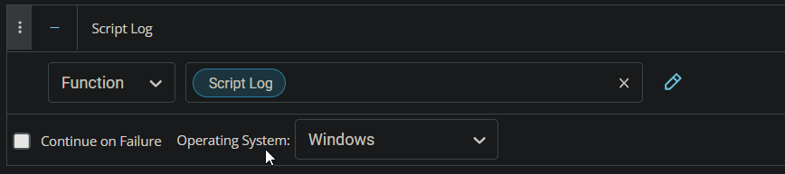

In the script log message, simply type `%output%` so that the script will send the results of the PowerShell script above to the output on the Automation tab for the target device.


#### Row 4 Function: Set Custom Field

Add a new row by clicking on the "Add Row" button.


Select `Set Custom Field` Function.

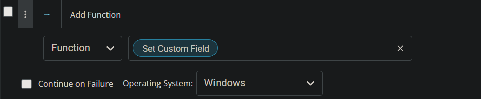

When you select `Set Custom Field`, a new window will open.


In this window, search for the `Latest Cumulative Update` field.

**Custom Field:** Latest Cumulative Update  
**Value:** %Output%


Once all items are added, please save the task. The final task should look like the screenshot below.

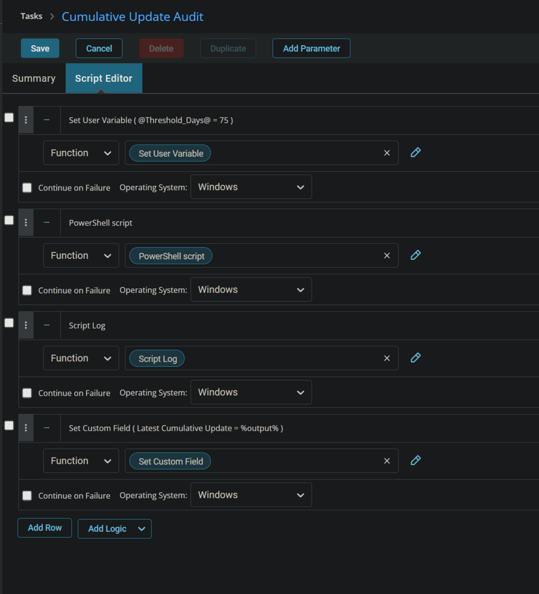

## Deployment

It is suggested to run the Task once per month against Windows computers.

1. Go to `Automation` > `Tasks`.
2. Search for the `Cumulative Update Audit` Task.
3. Select the concerned task.
4. Click on the `Schedule` button to schedule the task/script.

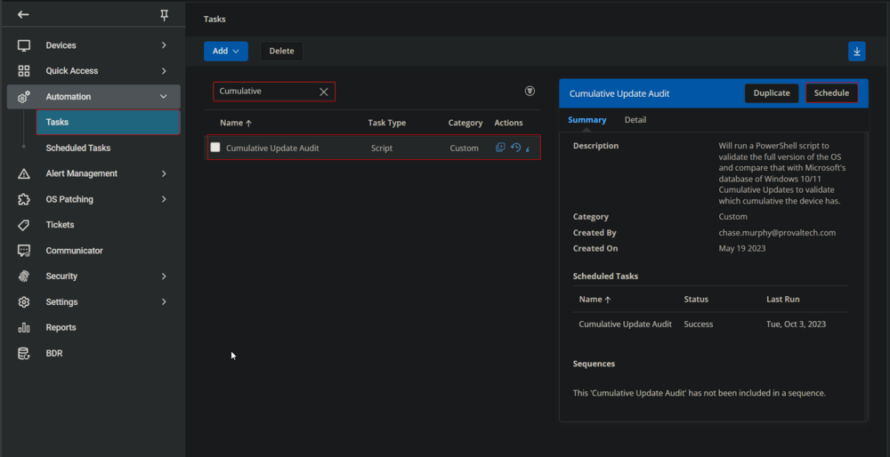

This screen will appear.

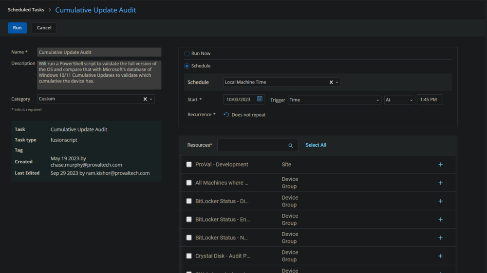

Select the relevant time to run the script and click the "Does not repeat" button.

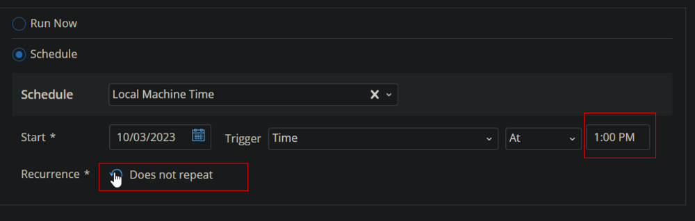

This pop-up box will appear.


Change the Repeat interval to once per month. Here, I am selecting the 15th of every month since Microsoft releases the patches on the second Tuesday of every month.

 
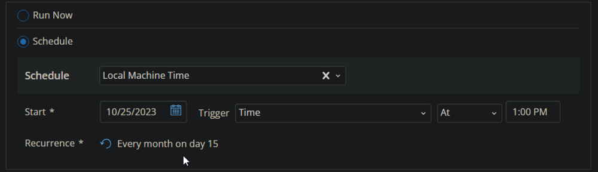

Search for `windows` in the `Resources*` and select `Windows Desktops` and `Windows Servers` groups. You can search and select any relevant group you would like to schedule the task against.


Now click the `Run` button to initiate the task.

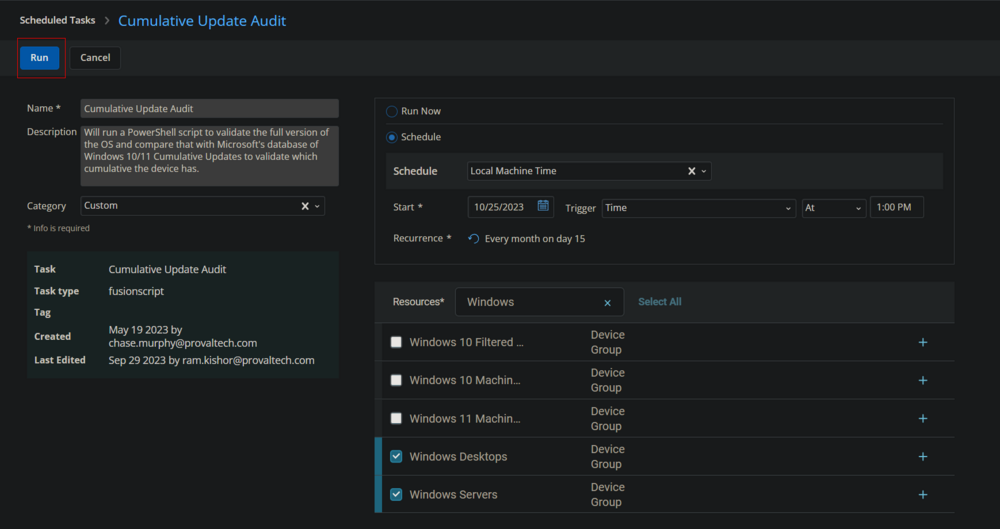

The task will start appearing in the Scheduled Tasks.

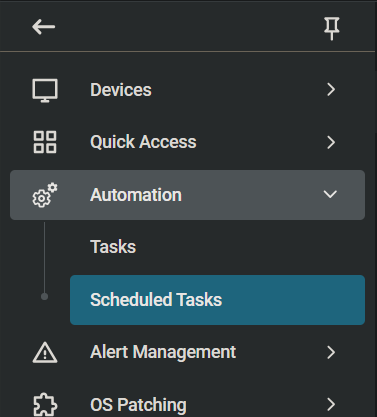 
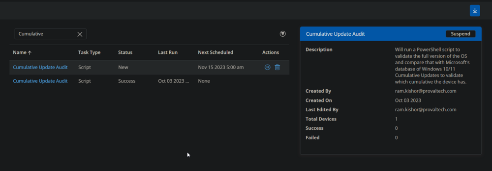

## Output

- **Script log**
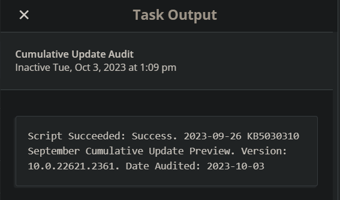

- **Custom Field**
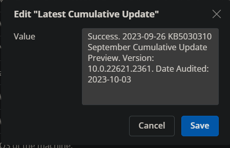


