## Summary

The script installs or updates the DUO Authentication Proxy application to the latest available version.

## Sample Run

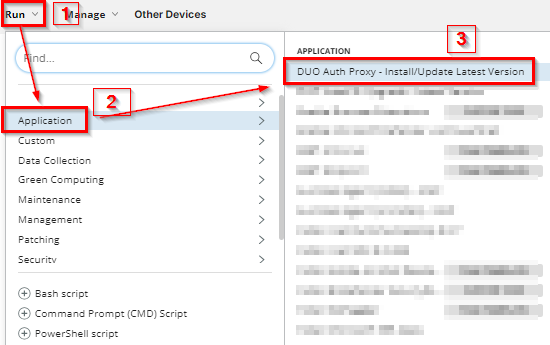  
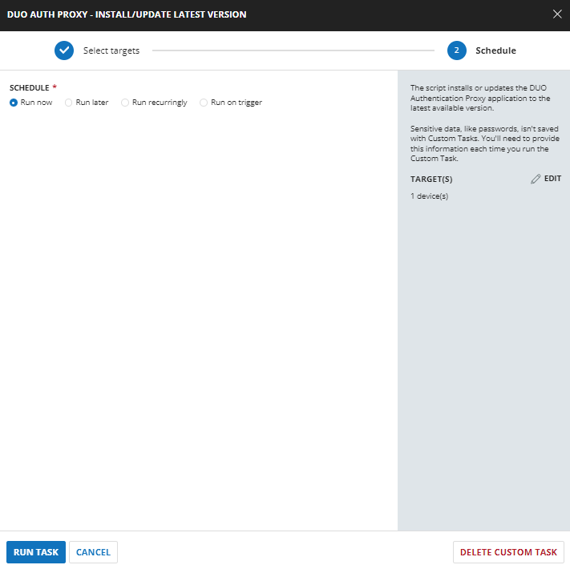  

## Dependencies

[CW RMM Custom Fields - DUO Auth Proxy Deployment](https://proval.itglue.com/DOC-5078775-17914128)

## Task Creation

Create a new `Script Editor` style script in the system to implement this task.

  
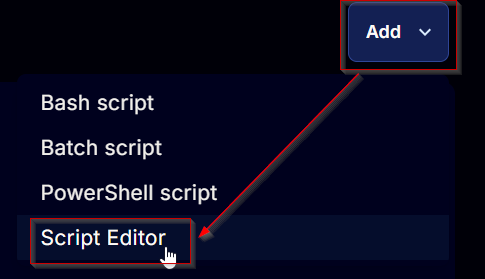  

**Name:** `DUO Install & Upgrade - Latest Version`  
**Description:** `This script will install or update DUO if the currently installed instance is older than the latest released version. This script checks the hash of the installer from the official website before deploying it. This script downloads the latest installer from [https://dl.duosecurity.com/duo-win-login-latest.exe](https://dl.duosecurity.com/duo-win-login-latest.exe).`  
**Category:** `Application`  

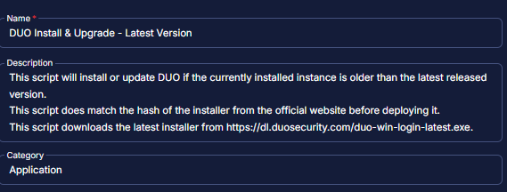  

## Task

### Row 1 Function: PowerShell Script

Add a new `Add Row` button.

  

Search and select the `PowerShell Script` function.  

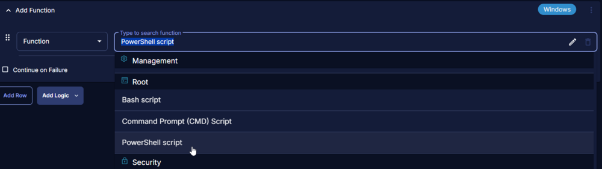  

The following function will pop up on the screen:  

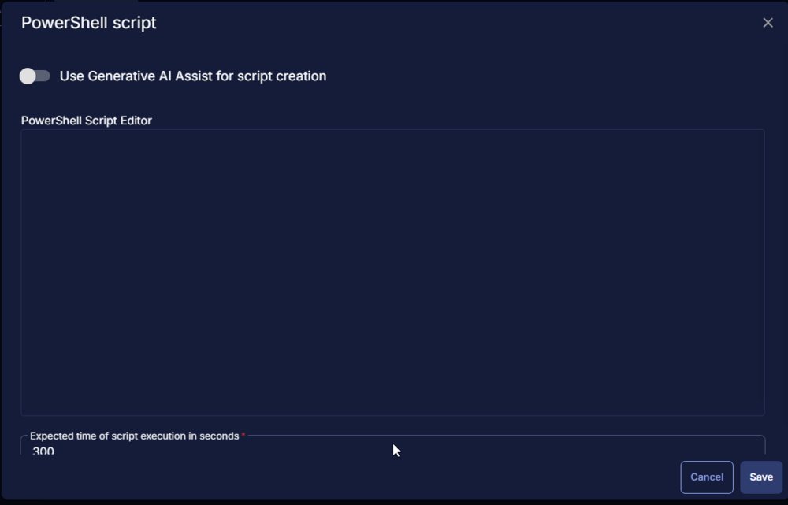  

Paste the following PowerShell script and set the `Expected time of script execution in seconds` to `900` seconds. Click the `Save` button.

```powershell
$ProgressPreference = 'SilentlyContinue'
$ErrorActionPreference = 'SilentlyContinue'
$URL = 'https://dl.duosecurity.com/duoauthproxy-latest.exe'
$WorkingDirectory = 'C:/ProgramData/_Automation/Script/DuoAuthProxy'
$Path = "$WorkingDirectory/DuoAuthProxyInstaller.exe"
$File = (Invoke-WebRequest -uri https://dl.duosecurity.com/duoauthproxy-latest.exe -UseBasicParsing -Method Head).headers.'Content-Disposition'
$DuoVersion = "$(($File -replace '.*duoauthproxy-','' -replace '/.exe"$',''))"

#region Setup - Folder Structure
if (!(Test-Path $WorkingDirectory)) {
    try {
        New-Item -Path $WorkingDirectory -ItemType Directory -Force -ErrorAction Stop | Out-Null
    }
    catch {
        return "ERROR: Failed to Create $WorkingDirectory. Reason: $($Error[0].Exception.Message)"
    }
}
if (-not (((Get-Acl $WorkingDirectory).Access | Where-Object { $_.IdentityReference -Match 'Everyone' }).FileSystemRights -Match 'FullControl')) {
    $Acl = Get-Acl $WorkingDirectory
    $AccessRule = New-Object System.Security.AccessControl.FileSystemAccessRule('Everyone', 'FullControl', 'ContainerInherit, ObjectInherit', 'none', 'Allow')
    $Acl.AddAccessRule($AccessRule)
    Set-Acl $WorkingDirectory $Acl
}
#endregion

$response = Invoke-WebRequest -Uri $URL -OutFile $Path -UseBasicParsing
if (!(Test-Path -Path $Path)) {
    return 'ERROR: An error occurred and the script was unable to be downloaded. Exiting.'
}

$DUOCurrentVersion = Get-ChildItem -Path HKLM:/SOFTWARE/Microsoft/Windows/CurrentVersion/Uninstall, HKLM:/SOFTWARE/Wow6432Node/Microsoft/Windows/CurrentVersion/Uninstall | Get-ItemProperty | Where-Object { $_.DisplayName -match 'DUO Security Authentication Proxy' } | Select-Object -ExpandProperty DisplayVersion
if ($DuoVersion -eq $DUOCurrentVersion) {
    return 'DUO Security Authentication Proxy is already up to date.'
}
elseif ($DUOCurrentVersion -match '[0-9]') {
    & $Path /S
    Start-Sleep -Seconds 120
    $DUOCurrentVersion = Get-ChildItem -Path HKLM:/SOFTWARE/Microsoft/Windows/CurrentVersion/Uninstall, HKLM:/SOFTWARE/Wow6432Node/Microsoft/Windows/CurrentVersion/Uninstall | Get-ItemProperty | Where-Object { $_.DisplayName -match 'DUO Security Authentication Proxy' } | Select-Object -ExpandProperty DisplayVersion
    if ($DuoVersion -eq $DUOCurrentVersion) {
        Write-Output 'DUO Security Authentication Proxy is successfully updated.'
    }
    else {
        return 'ERROR: DUO Security Authentication Proxy failed to update.'
    }
}
else {
    & $Path /S
    Start-Sleep -Seconds 120
    $DUOCurrentVersion = Get-ChildItem -Path HKLM:/SOFTWARE/Microsoft/Windows/CurrentVersion/Uninstall, HKLM:/SOFTWARE/Wow6432Node/Microsoft/Windows/CurrentVersion/Uninstall | Get-ItemProperty | Where-Object { $_.DisplayName -match 'DUO Security Authentication Proxy' } | Select-Object -ExpandProperty DisplayVersion
    if ($DuoVersion -eq $DUOCurrentVersion) {
        Write-Output 'DUO Security Authentication Proxy is successfully installed.'
    }
    else {
        return 'ERROR: DUO Security Authentication Proxy failed to install.'
    }
}
```

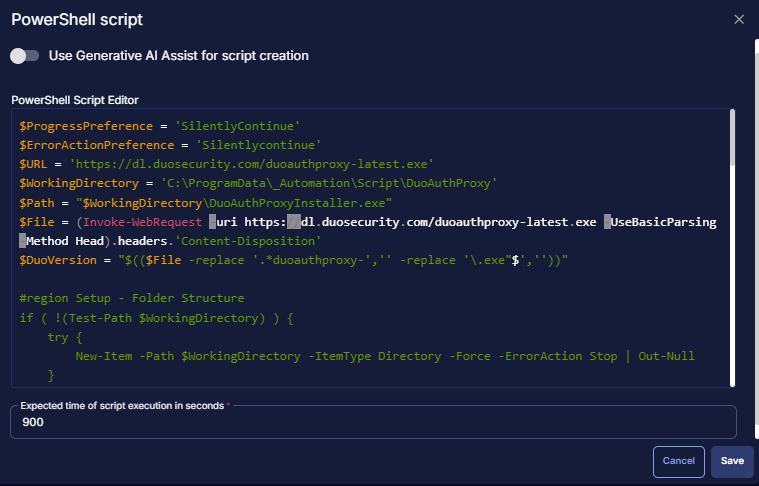  

### Row 2 Logic: If/Then

Add a new `If/Then/Else` logic from the Add Logic dropdown menu.

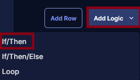  

#### ROW 2a Condition: Output Contains

Type `ERROR:` in the Value box.

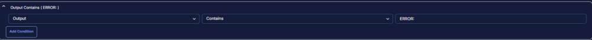  

#### Row 2b Function: Set Custom Field

Add a new row by clicking the `Add Row` button.

  

Search and select the `Set Custom Field` function.

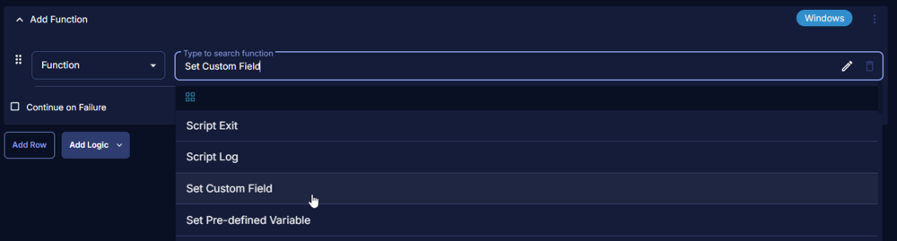  

The following function will pop up on the screen:  

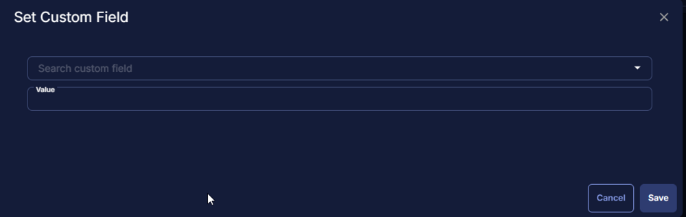  

- Search and select the Computer-Level Custom Field `DUO Auth Proxy Result` from the Custom Field dropdown menu.
- Set `Failed` in the `Value` field.
- Click the `Save` button.  

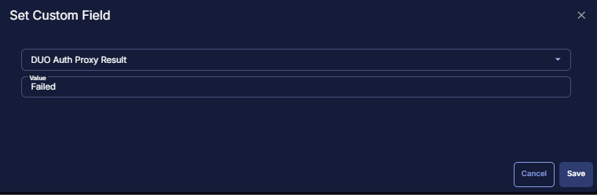  
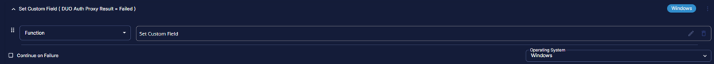  

#### Row 2c Function: Script Exit

Add a new row by clicking the `Add Row` button.

  

A blank function will appear.  

  

Search and select the `Script Exit` function.

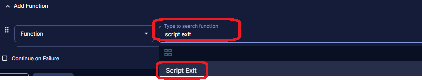  
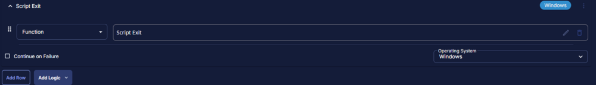  

The following function will pop up on the screen:  

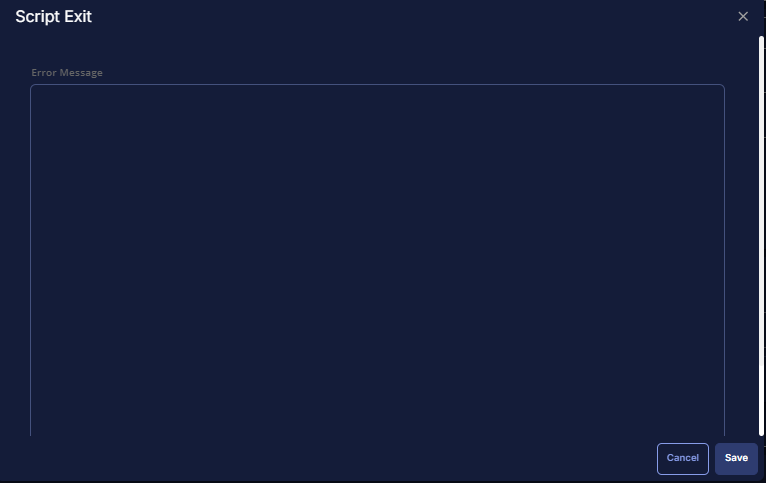  

In the script exit message, simply type:

```
Failed to install the "DUO Security Authentication Proxy" application. Refer to the logs:
%Output%
```

and click the `Save` button.

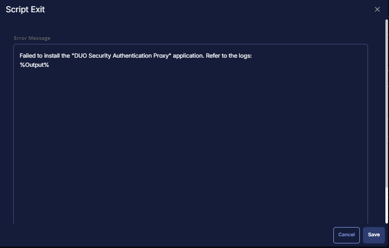  

### Row 3 Function: Script Log

Add a new row by clicking the `Add Row` button.

  

A blank function will appear.  

  

Search and select the `Script Log` function.

  
  

The following function will pop up on the screen:  

  

In the script log message, type:

```
Successfully installed the "DUO Security Authentication Proxy" application. Refer to the logs:
%Output%
```

and click the `Save` button.

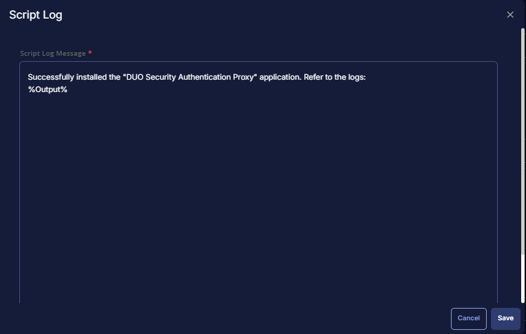  

### Row 4 Function: Set Custom Field

Add a new row by clicking the `Add Row` button.

  

Search and select the `Set Custom Field` function.

  

The following function will pop up on the screen:  

  

- Search and select the Computer-Level Custom Field `DUO Auth Proxy Result` from the Custom Field dropdown menu.
- Set `Success` in the `Value` field.
- Click the `Save` button.

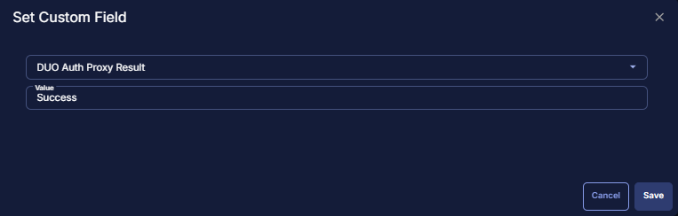  
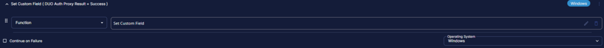  

### Row 5 Function: Script Exit

Add a new row by clicking the `Add Row` button.

  

A blank function will appear.  

  

Search and select the `Script Exit` function.

  
  

The following function will pop up on the screen:  

  

In the script exit message, leave it blank and click the `Save` button.

  

## Completed Task

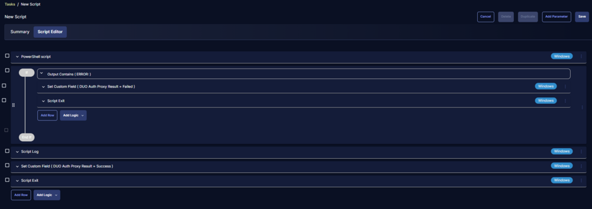  

## Implementation

It is suggested to run the task once per week against the group `DUO Auth Proxy Deployment`.

- Go to `Automation` > `Tasks`.
- Search for the `DUO Auth Proxy - Install/Update Latest Version` task.
- Select the concerned task.
- Click on the `Schedule` button to schedule the task/script.

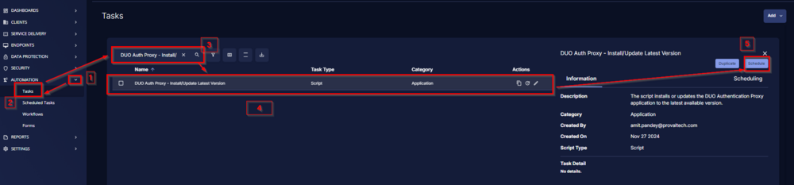  

This screen will appear.

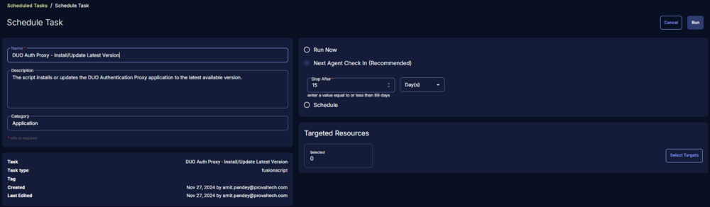  

Select the `Schedule` button and click the calendar-looking button present in front of the `Recurrence` option.

  

Select the `Month(s)` for the `Repeat`, `1` for `Dates`, and click the `OK` button to save the schedule.

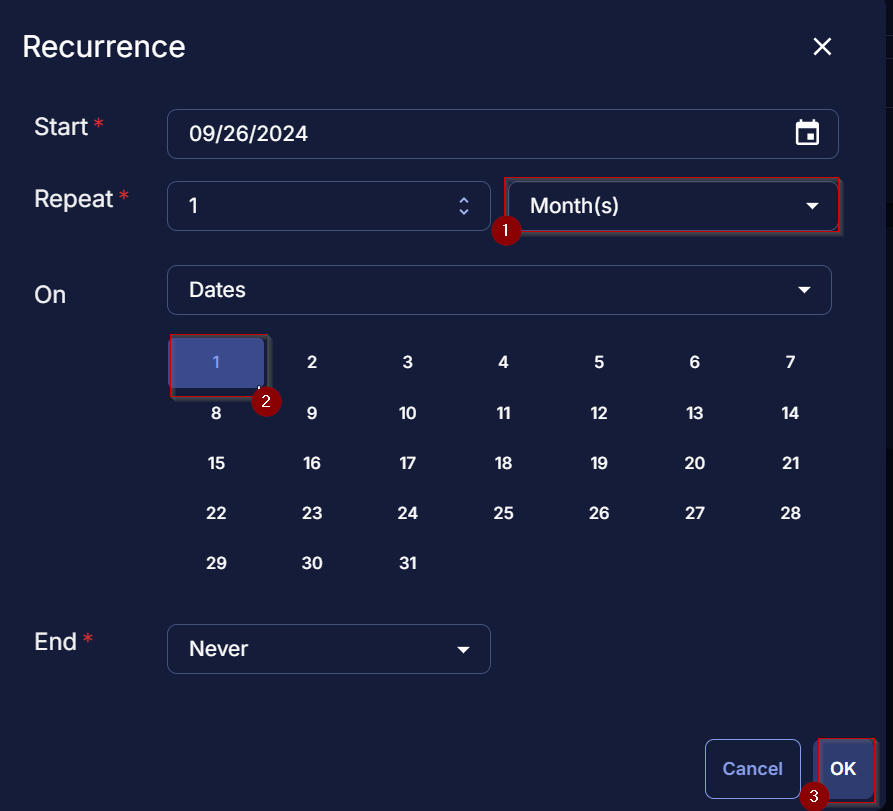  

Click the `Select Targets` button to select the concerned target.

  

Search and select the `Duo Auth Proxy Deployment` Device Group for the target.

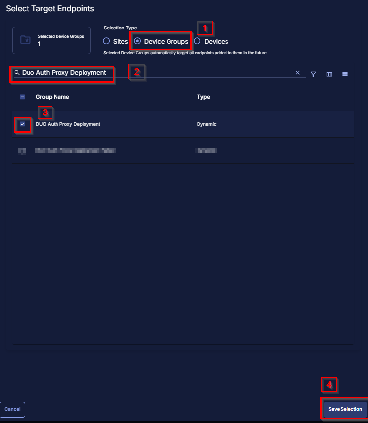  

Click the `Run` button to initiate the schedule.

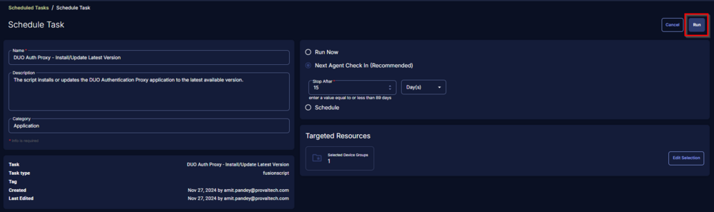  

## Output

Script log  
Custom field  

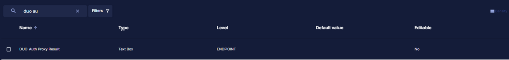  


