## Summary

The task installs the latest version of `Dell Command | Update for Windows Universal` from `Winget` if it's missing or outdated. The `Argument` parameter can be used to run the specified command or argument. If the parameter is left blank, the `/scan` command will be executed.

**Supported commands/arguments reference:**  
[Supported commands/arguments reference](https://www.dell.com/support/manuals/en-us/command-update/dcu_rg/dell-command-%7C-update-cli-commands?guid=guid-92619086-5f7c-4a05-bce2-0d560c15e8ed&lang=en-us)

**Exit codes reference:**  
[Exit codes reference](https://www.dell.com/support/manuals/en-aw/command-update/dcu_rg/command-line-interface-error-codes?guid=guid-fbb96b06-4603-423a-baec-cbf5963d8948&lang=en-us)

## Sample Run

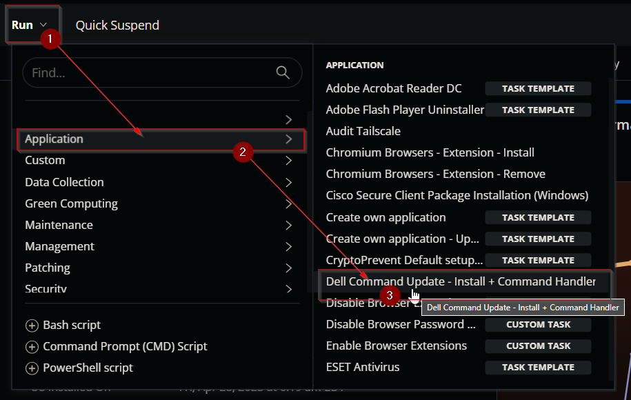  

### Example 1:
Running the script with basic `/scan` command to return the available updates.  
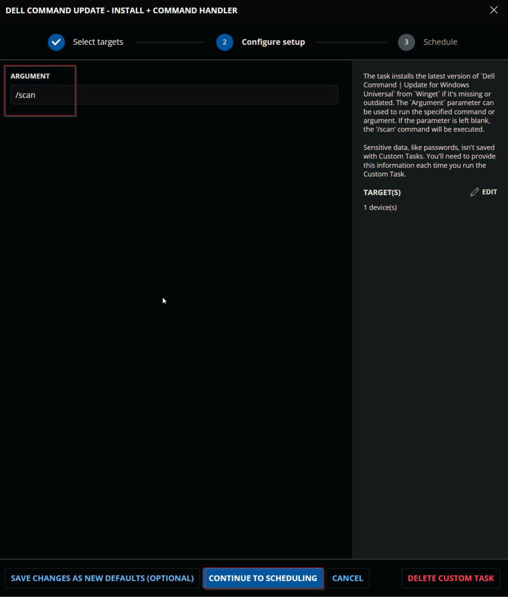  

### Example 2:
Running the script to install available `bios`, `firmaware`, and `driver` updates.  
This command will not install any active driver as we are not using the `-forceupdate` switch.  
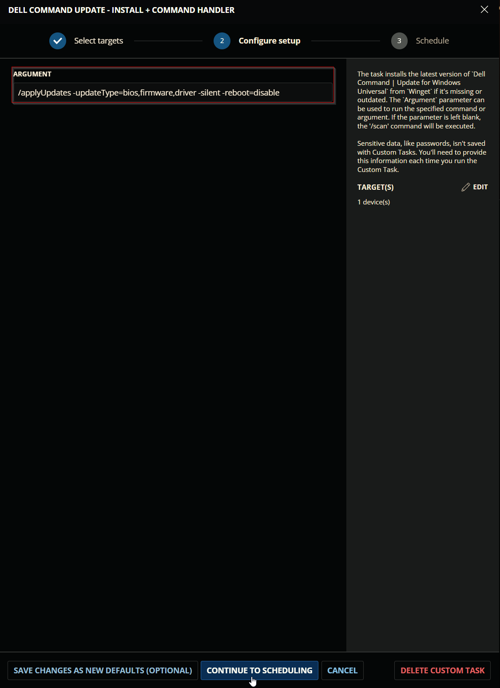  

### Example 3:
Running the script to forcefully install all available driver updates.  
<span style={{color: 'Orange'}}>**Caution:** It is recommended to restart the computer at the earliest convenience after using the `-forceupdate=enable` switch, as this switch updates active drivers as well. An active driver that requires a restart for the update may malfunction if the update is installed without rebooting the computer.</span>  
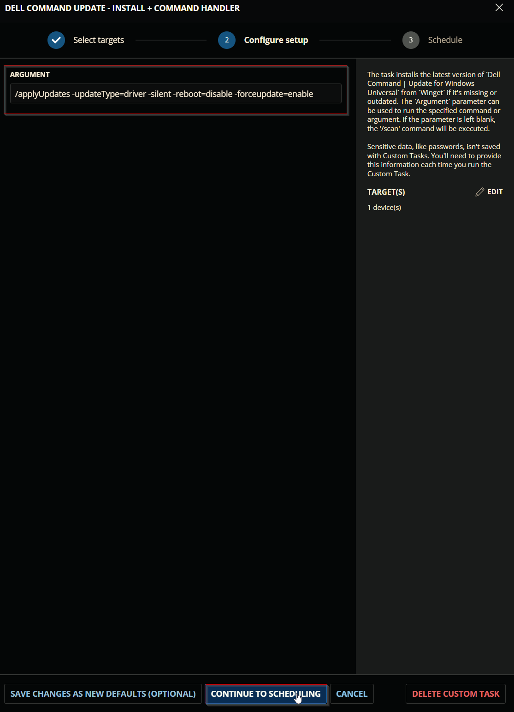  


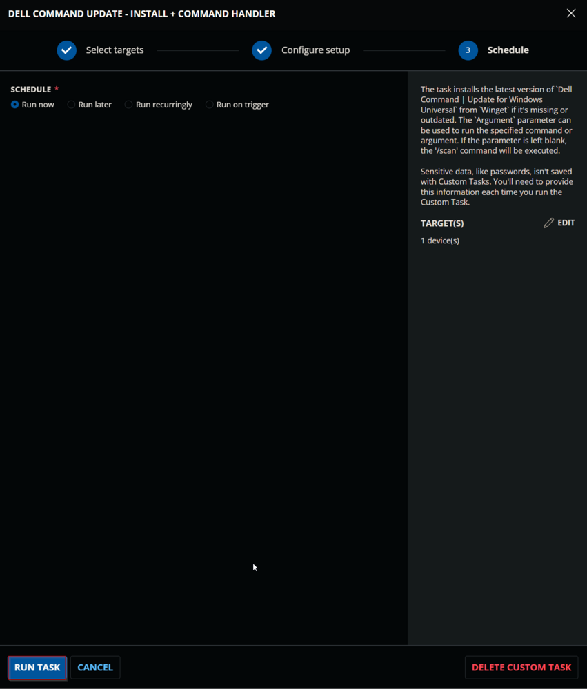

## Dependencies

[SWM - Software Management - agnostic - Invoke-WingetProcessor](<../../powershell/Invoke-WingetProcessor.md>)

## User Parameters

| Name      | Examples                                                                                                           | Accepted Values                                                                                                      | Default | Type  | Required | Description                                 |
|-----------|-------------------------------------------------------------------------------------------------------------------|----------------------------------------------------------------------------------------------------------------------|---------|-------|----------|---------------------------------------------|
| Argument  | <ul><li>`/version`</li><li>`/scan`</li><li>`/scan -updateType=bios,firmware,driver`</li><li>`/applyUpdates -updateType=bios,firmware -silent -reboot=disable`</li><li>`/applyUpdates -updateType=driver -silent -reboot=disable -forceupdate=enable`</li><li>`/driverInstall -silent -reboot=disable`</li></ul> | [Supported commands/arguments reference](https://www.dell.com/support/manuals/en-us/command-update/dcu_rg/dell-command-%7C-update-cli-commands?guid=guid-92619086-5f7c-4a05-bce2-0d560c15e8ed&lang=en-us) | `/scan`   | Text  | False    | Command to execute with `Dell Command \| Update`. If left blank, the default value `/Scan` will be used. |

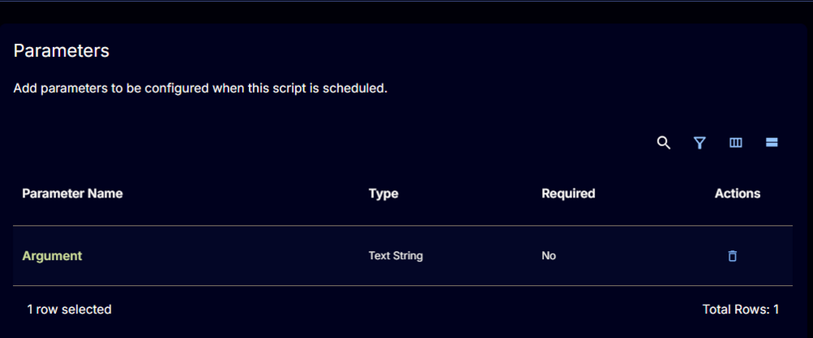

## Task Creation

Create a new `Script Editor` style script in the system to implement this task.

  


**Name:** `Dell Command Update - Install + Command Handler`  
**Description:** `The task installs the latest version of "Dell Command | Update for Windows Universal" from "Winget" if it's missing or outdated. The "Argument" parameter can be used to run the specified command or argument. If the parameter is left blank, the "/scan" command will be executed.`  
**Category:** `Application` 

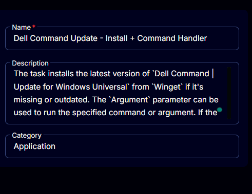

## Parameters

Add a new parameter by clicking the `Add Parameter` button present at the top-right corner of the screen.


This screen will appear.  


- Set `Argument` in the `Parameter Name` field.
- Select `Text String` from the `Parameter Type` dropdown menu.
- Enable the `Default Value` button.
- Set `/scan` in the `Default Value` field.
- Click the `Save` button.

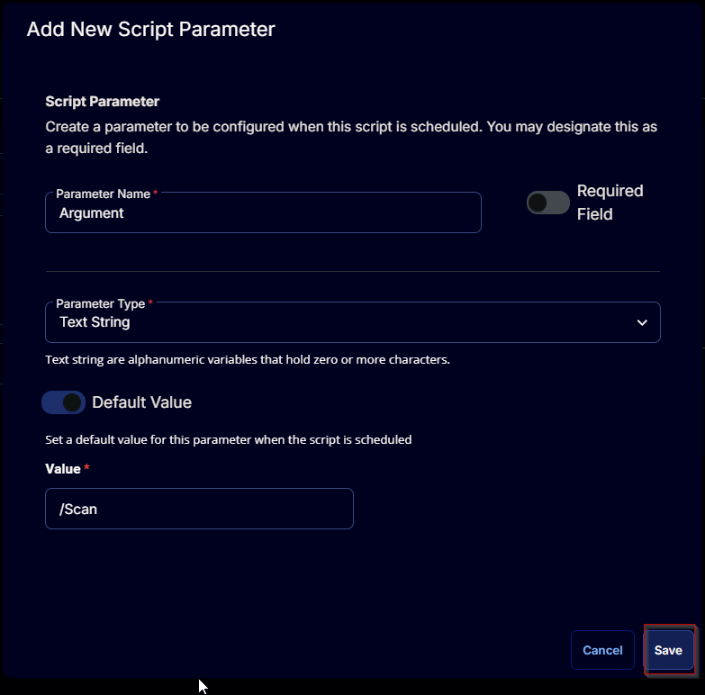

Click the `Confirm` button to save the parameter.  
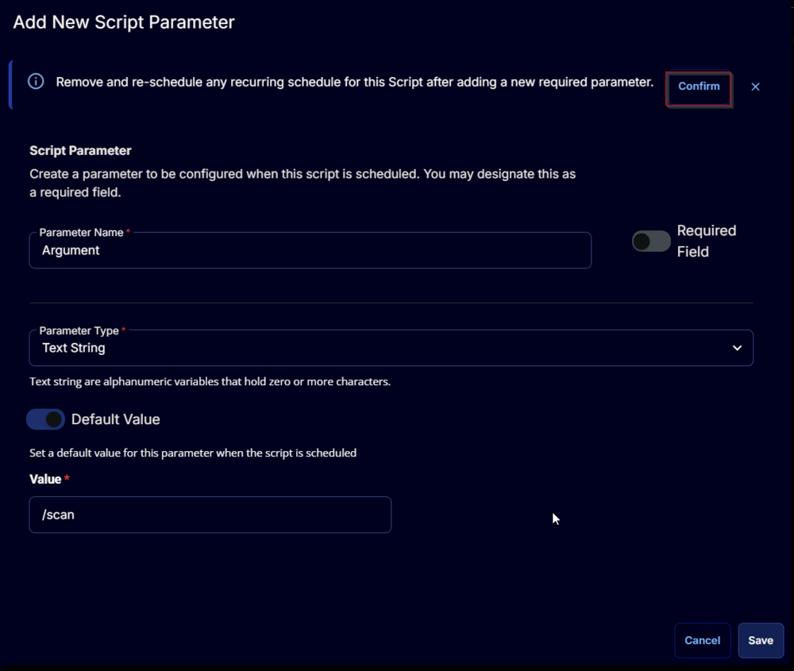

## Task

Navigate to the Script Editor Section and start by adding a row. You can do this by clicking the `Add Row` button at the bottom of the script page.


A blank function will appear.  


### Row 1 Function: PowerShell Script

Search and select the `PowerShell Script` function.  
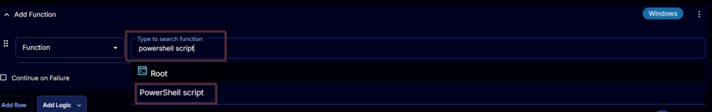  


The following function will pop up on the screen:  


Paste in the following PowerShell script and set the expected time of script execution to `3600` seconds. Click the `Save` button.

```powershell
#requires -RunAsAdministrator
#requires -Version 5.1
<#
Supported commands/arguments reference:
https://www.dell.com/support/manuals/en-us/command-update/dcu_rg/dell-command-%7C-update-cli-commands?guid=guid-92619086-5f7c-4a05-bce2-0d560c15e8ed&lang=en-us
Exit codes reference:
https://www.dell.com/support/manuals/en-aw/command-update/dcu_rg/command-line-interface-error-codes?guid=guid-fbb96b06-4603-423a-baec-cbf5963d8948&lang=en-us
#>
if ( (Get-CimInstance -ClassName Win32_ComputerSystem).manufacturer -notmatch 'Dell' ) {
    throw 'Unsupported Device. The script is designed to work for Dell Workstations.'
}
if ( (Get-CimInstance -ClassName Win32_OperatingSystem).Name -notmatch 'Windows 1[01]' ) {
    throw 'Unsupported Operating System. The script is designed to work for Windows 10 and Windows 11.'
}
$argument = '@Argument@'
if ( $argument -match '\SArgument\S' -or ( $null -eq $argument ) ) {
    $argument = '/Scan'
} elseif ( $argument.length -lt 2 ) {
    $argument = '/Scan'
} else {
    $argument = ('@Argument@') -split ' '
}
$ProgressPreference = 'SilentlyContinue'
[Net.ServicePointManager]::SecurityProtocol = [Enum]::ToObject([Net.SecurityProtocolType], 3072)
### Process ###
### Latest Available Version ###
$iwr = (Invoke-WebRequest 'https://github.com/microsoft/winget-pkgs/tree/master/manifests/d/Dell/CommandUpdate/Universal' -UseBasicParsing).content
$iwr = $iwr -split ('{') -split ('}')
$iwr = $iwr -match 'manifests\/d\/Dell\/CommandUpdate\/'
$iwr = $iwr -split ('"')
$iwr = $iwr -match '^[0-9\.]{1,}$'
$iwr = $iwr -match '[1-9][0-9]{0,}\.[0-9]{1,}\.[0-9]{1,}'
$versions = $iwr | ForEach-Object { [version]$_ }
$maxVersion = $versions | Sort-Object | Select-Object -Last 1
Write-Information "Latest Available Version: $maxVersion" -InformationAction Continue
### Installed Version ###
$version = (Get-ChildItem -Path HKLM:\SOFTWARE\Microsoft\Windows\CurrentVersion\Uninstall, HKLM:\SOFTWARE\Wow6432Node\Microsoft\Windows\CurrentVersion\Uninstall | Get-ItemProperty | Where-Object { $_.DisplayName -match [regex]::Escape('Dell Command | Update') }).DisplayVersion | Sort-Object | Select-Object -Last 1
### Install Function ###
function Install-DCU {
    ## Variables ##
    $projectName = 'Invoke-WingetProcessor'
    $workingDirectory = "C:\ProgramData\_Automation\Script\$projectName"
    $logPath = "$workingDirectory\$projectName-log.txt"
    $errorLogPath = "$workingDirectory\$projectName-error.txt"
    $BaseURL = 'https://file.provaltech.com/repo'
    $PS1URL = "$BaseURL/script/$ProjectName.ps1"
    $PS1Path = "$WorkingDirectory\$ProjectName.ps1"
    ## Directory ##
    if ( !(Test-Path $WorkingDirectory) ) {
        try {
            New-Item -Path $WorkingDirectory -ItemType Directory -Force -ErrorAction Stop | Out-Null
        } catch {
            throw "!ERROR!: Failed to Create $WorkingDirectory. Reason: $($Error[0].Excpection.Message)"
        }
    }
    if (-not ( ( ( Get-Acl $WorkingDirectory ).Access | Where-Object { $_.IdentityReference -Match 'EveryOne' } ).FileSystemRights -Match 'FullControl' ) ) {
        $ACl = Get-Acl $WorkingDirectory
        $AccessRule = New-Object System.Security.AccessControl.FileSystemAccessRule('Everyone', 'FullControl', 'ContainerInherit, ObjectInherit', 'none', 'Allow')
        $Acl.AddAccessRule($AccessRule)
        Set-Acl  $WorkingDirectory $Acl -ErrorAction SilentlyContinue
    }
    ## Parameters ##
    $Parameters = @{
        Install = $True
        PackageId = 'Dell.CommandUpdate.Universal'
        Source = 'winget'
        AllowUpdate = $True
    }
    ## Script Download ##
    mkdir -Path $WorkingDirectory -ErrorAction SilentlyContinue | Out-Null
    $response = Invoke-WebRequest -Uri $PS1URL -UseBasicParsing
    if (($response.StatusCode -ne 200) -and (!(Test-Path -Path $PS1Path))) {
        Write-Error -Message "No pre-downloaded script exists and the script '$PS1URL' failed to download. Exiting."
        return
    } elseif ($response.StatusCode -eq 200) {
        Remove-Item -Path $PS1Path -ErrorAction SilentlyContinue
        [System.IO.File]::WriteAllLines($PS1Path, $response.Content)
    }
    if (!(Test-Path -Path $PS1Path)) {
        Write-Error -Message 'An error occurred and the script was unable to be downloaded. Exiting.'
        return
    }
    ## Execute Script ##
    Set-ExecutionPolicy -Scope Process -ExecutionPolicy RemoteSigned -ErrorAction SilentlyContinue
    & $PS1Path @Parameters
    if ( !(Test-Path -Path $logPath ) ) {
        throw 'Script Failed to install Dell Command | Update. A security application seems to have interupted the installation.'
    } else {
        Write-Information 'Log Content:' -InformationAction Continue
        Get-Content -Path $logPath -ErrorAction SilentlyContinue
    }
    if ( (Test-Path -Path $errorLogPath) ) {
        throw "Error log Content: $(Get-Content -Path $errorLogPath -ErrorAction SilentlyContinue)"
    }
}
## Exit Code Validation Function ##
function Convert-ExitCode {
    ## Parameter ##
    [CmdletBinding()]
    Param(
        [Parameter(Mandatory = $true)][int]$ExitCode
    )
    Write-Information "Last command exit code: $ExitCode" -InformationAction Continue
    ## Exit Codes ##
    $Message = Switch ($ExitCode) {
        0 { '!Information!: command execution was successful.' }
        1 { '!Warning!: A reboot was required from the execution of an operation. Reboot the system to complete the operation.' }
        2 { '!ERROR!: An unknown application error has occurred.' }
        3 { '!ERROR!: The current system manufacturer is not Dell. Dell Command | Update can only be run on Dell systems.' }
        4 { '!ERROR!: The CLI was not launched with administrative privilege. Invoke the Dell Command | Update CLI with administrative privileges.' }
        5 { '!ERROR!: A reboot was pending from a previous operation. Reboot the system to complete the operation.' }
        6 { '!ERROR!: Another instance of the same application (UI or CLI) is already running. Close any running instance of Dell Command | Update UI or CLI and retry the operation.' }
        7 { '!ERROR!: The application does not support the current system model. Contact your administrator if the current system model in not supported by the catalog.' }
        8 { '!ERROR!: No update filters have been applied or configured. Supply at least one update filter.' }
        100 { '!ERROR!: While evaluating the command line parameters, no parameters were detected. A command must be specified on the command line.' }
        101 { "!ERROR!: While evaluating the command line parameters, no commands were detected. Provide a valid command and options. `nSee Command line interface reference section for more information:`n https://www.dell.com/support/manuals/en-aw/command-update/dellcommandupdate_rg/command-line-interface-reference?guid=guid-92619086-5f7c-4a05-bce2-0d560c15e8ed&lang=en-us" }
        102 { "!ERROR!: While evaluating the command line parameters, invalid commands were detected. Provide a command along with the supported options for that command. `nSee Command line interface reference section for more information:`n https://www.dell.com/support/manuals/en-aw/command-update/dellcommandupdate_rg/command-line-interface-reference?guid=guid-92619086-5f7c-4a05-bce2-0d560c15e8ed&lang=en-us" }
        103 { "!ERROR!: While evaluating the command line parameters, duplicate commands were detected. Remove any duplicate commands and rerun the command. `nSee Command line interface reference section for more information:`n https://www.dell.com/support/manuals/en-aw/command-update/dellcommandupdate_rg/command-line-interface-reference?guid=guid-92619086-5f7c-4a05-bce2-0d560c15e8ed&lang=en-us" }
        104 { "!ERROR!: While evaluating the command line parameters, the command syntax was incorrect. Ensure that you follow the command syntax: /<command name>. `nSee Command line interface reference section for more information:`n https://www.dell.com/support/manuals/en-aw/command-update/dellcommandupdate_rg/command-line-interface-reference?guid=guid-92619086-5f7c-4a05-bce2-0d560c15e8ed&lang=en-us" }
        105 { "!ERROR!: While evaluating the command line parameters, the option syntax was incorrect. Ensure that you follow the option syntax: -<option name>. `nSee Command line interface reference section for more information:`n https://www.dell.com/support/manuals/en-aw/command-update/dellcommandupdate_rg/command-line-interface-reference?guid=guid-92619086-5f7c-4a05-bce2-0d560c15e8ed&lang=en-us" }
        106 { "!ERROR!: While evaluating the command line parameters, invalid options were detected. Ensure to provide all required or only supported options. `nSee Command line interface reference section for more information:`n https://www.dell.com/support/manuals/en-aw/command-update/dellcommandupdate_rg/command-line-interface-reference?guid=guid-92619086-5f7c-4a05-bce2-0d560c15e8ed&lang=en-us" }
        107 { "!ERROR!: While evaluating the command line parameters, one or more values provided to the specific option was invalid. Provide an acceptable value. `nSee Command line interface reference section for more information:`n https://www.dell.com/support/manuals/en-aw/command-update/dellcommandupdate_rg/command-line-interface-reference?guid=guid-92619086-5f7c-4a05-bce2-0d560c15e8ed&lang=en-us" }
        108 { "!ERROR!: While evaluating the command line parameters, all mandatory options were not detected. If a command requires mandatory options to run, provide them. `nSee Command line interface reference section for more information:`n https://www.dell.com/support/manuals/en-aw/command-update/dellcommandupdate_rg/command-line-interface-reference?guid=guid-92619086-5f7c-4a05-bce2-0d560c15e8ed&lang=en-us" }
        109 { "!ERROR!: While evaluating the command line parameters, invalid combination of options were detected. Remove any mutually exclusive options and rerun the command. `nSee Command line interface reference section for more information:`n https://www.dell.com/support/manuals/en-aw/command-update/dellcommandupdate_rg/command-line-interface-reference?guid=guid-92619086-5f7c-4a05-bce2-0d560c15e8ed&lang=en-us" }
        110 { '!ERROR!: While evaluating the command line parameters, multiple commands were detected. Except for /help and /version, only one command can be specified in the command line.' }
        111 { "!ERROR!: While evaluating the command line parameters, duplicate options were detected. Remove any duplicate options and rerun the command. `nSee Command line interface reference section for more information:`n https://www.dell.com/support/manuals/en-aw/command-update/dellcommandupdate_rg/command-line-interface-reference?guid=guid-92619086-5f7c-4a05-bce2-0d560c15e8ed&lang=en-us" }
        112 { "!ERROR!: An invalid catalog was detected. Ensure that the file path provided exists, has a valid extension type, is a valid SMB, UNC, or URL, does not have invalid characters, does not exceed 255 characters and has required permissions. `nSee Command line interface reference section for more information:`n https://www.dell.com/support/manuals/en-aw/command-update/dellcommandupdate_rg/command-line-interface-reference?guid=guid-92619086-5f7c-4a05-bce2-0d560c15e8ed&lang=en-us" }
        113 { "!ERROR!: While evaluating the command line parameters, one or more values provided exceeds the length limit. Ensure to provide the values of the options within the length limit. `nSee Dell Command | Update CLI commands section for more information:`n https://www.dell.com/support/manuals/en-aw/command-update/dellcommandupdate_rg/dell-command-%7C-update-cli-commands?guid=guid-92619086-5f7c-4a05-bce2-0d560c15e8ed&lang=en-us" }
        500 { '!Information!: No updates were found for the system when a scan operation was performed. The system is up to date or no updates were found for the provided filters. Modify the filters and rerun the commands.' }
        501 { '!ERROR!: An error occurred while determining the available updates for the system, when a scan operation was performed. Retry the operation.' }
        502 { '!ERROR!: The cancellation was initiated, Hence, the scan operation is canceled. Retry the operation.' }
        503 { '!ERROR!: An error occurred while downloading a file during the scan operation. Check your network connection, ensure there is Internet connectivity and Retry the command.' }
        1000 { '!ERROR!: An error occurred when retrieving the result of the apply updates operation. Retry the operation.' }
        1001 { '!ERROR!: The cancellation was initiated, Hence, the apply updates operation is canceled. Retry the operation.' }
        1002 { '!ERROR!: An error occurred while downloading a file during the apply updates operation. Check your network connection, ensure there is Internet connectivity, and retry the command.' }
        1505 { '!ERROR!: An error occurred while exporting the application settings. Verify that the folder exists or have permissions to write to the folder.' }
        1506 { '!ERROR!: An error occurred while importing the application settings. Verify that the imported file is valid.' }
        2000 { '!ERROR!: An error occurred when retrieving the result of the Advanced Driver Restore operation. Retry the operation.' }
        2001 { '!ERROR!: The Advanced Driver Restore process failed. Retry the operation.' }
        2002 { '!ERROR!: Multiple driver CABs were provided for the Advanced Driver Restore operation. Ensure that you provide only one driver CAB file.' }
        2003 { "!ERROR!: An invalid path for the driver CAB was provided as in input for the driver install command. Ensure that the file path provided exists, has a valid extension type, is a valid SMB, UNC, or URL, does not have invalid characters, does not exceed 255 characters and has required permissions. `nSee Command line interface reference section for more information:`n https://www.dell.com/support/manuals/en-aw/command-update/dellcommandupdate_rg/command-line-interface-reference?guid=guid-92619086-5f7c-4a05-bce2-0d560c15e8ed&lang=en-us" }
        2004 { '!ERROR!: The cancellation was initiated, Hence, the driver install operation is canceled. Retry the operation.' }
        2005 { '!ERROR!: An error occurred while downloading a file during the driver install operation. Check your network connection, ensure there is Internet connectivity, and retry the command.' }
        2006 { '!ERROR!: Indicates that the Advanced Driver Restore feature is disabled. Enable the feature using ''/configure -advancedDriverRestore=enable''' }
        2007 { '!ERROR!: Indicates that the Advanced Diver Restore feature is not supported. Disable FIPS mode on the system.' }
        2500 { '!ERROR!: An error occurred while encrypting the password during the generate encrypted password operation. Retry the operation.' }
        2501 { '!ERROR!: An error occurred while encrypting the password with the encryption key provided. Provide a valid encryption key and Retry the operation. `nSee Command line interface reference section for more information:`n https://www.dell.com/support/manuals/en-aw/command-update/dellcommandupdate_rg/command-line-interface-reference?guid=guid-92619086-5f7c-4a05-bce2-0d560c15e8ed&lang=en-us' }
        2502 { '!ERROR!: The encrypted password provided does not match the current encryption method. The provided encrypted password used an older encryption method. Reencrypt the password.' }
        3000 { '!ERROR!: The Dell Client Management Service is not running. Start the Dell Client Management Service in the Windows services if stopped.' }
        3001 { '!ERROR!: The Dell Client Management Service is not installed. Download and install the Dell Client Management Service from the Dell support site.' }
        3002 { '!ERROR!: The Dell Client Management Service is disabled. Enable the Dell Client Management Service from Windows services if disabled.' }
        3003 { '!ERROR!: The Dell Client Management Service is busy. Wait until the service is available to process new requests.' }
        3004 { '!ERROR!: The Dell Client Management Service has initiated a self-update install of the application. Wait until the service is available to process new requests.' }
        3005 { '!ERROR!: The Dell Client Management Service is installing pending updates. Wait until the service is available to process new requests.' }
        Default { '!ERROR!: Unknown exit code.' }
    }
    if ( $Message -match '!ERROR' ) {
        throw $Message
    } else {
        Write-Information $Message -InformationAction Continue
    }
}
## Execute Command Function ##
function Invoke-Argument {
    ## Parameter ##
    [CmdletBinding()]
    Param(
        [Parameter(Mandatory = $false)][String[]]$argument
    )
    ## Variables ##
    $projectName = 'DCU-CLI'
    $workingDirectory = "C:\ProgramData\_Automation\Script\$projectName"
    ## Directory ##
    if ( !(Test-Path $WorkingDirectory) ) {
        try {
            New-Item -Path $WorkingDirectory -ItemType Directory -Force -ErrorAction Stop | Out-Null
        } catch {
            throw "!ERROR!: Failed to Create $WorkingDirectory. Reason: $($Error[0].Excpection.Message)"
        }
    }
    if (-not ( ( ( Get-Acl $WorkingDirectory ).Access | Where-Object { $_.IdentityReference -Match 'EveryOne' } ).FileSystemRights -Match 'FullControl' ) ) {
        $ACl = Get-Acl $WorkingDirectory
        $AccessRule = New-Object System.Security.AccessControl.FileSystemAccessRule('Everyone', 'FullControl', 'ContainerInherit, ObjectInherit', 'none', 'Allow')
        $Acl.AddAccessRule($AccessRule)
        Set-Acl  $WorkingDirectory $Acl -ErrorAction SilentlyContinue
    }
    ## Exe Path ##
    if ( Test-Path -Path 'C:\Program Files (x86)\Dell\CommandUpdate\dcu-cli.exe' ) {
        $exePath = 'C:\Program Files (x86)\Dell\CommandUpdate\dcu-cli.exe'
    } elseif ( Test-Path -Path 'C:\Program Files\Dell\CommandUpdate\dcu-cli.exe' ) {
        $exePath = 'C:\Program Files\Dell\CommandUpdate\dcu-cli.exe'
    } else {
        throw 'Executable for the Dell Command Update is missing.'
    }
    ## Execute Process ##
    try {
        if ($argument) {
            Write-Information "Running the Dell Command Update with the '$($argument -join ' ')' command." -InformationAction Continue
            & $exePath $argument
            Convert-ExitCode -ExitCode $LASTEXITCODE
            if ( $argument -match 'ApplyUpdate' ) {
                Write-Information 'Running the Dell Command Update with the /scan command after applying the updates.' -InformationAction Continue
                & $exePath /scan
                Convert-ExitCode -ExitCode $LASTEXITCODE
            }
        } else {
            Write-Information 'Running the Dell Command Update with the /scan command.' -InformationAction Continue
            & $exePath /scan
            Convert-ExitCode -ExitCode $LASTEXITCODE
        }
    } catch {
        throw "Failed to execute DCU-Cli. Reason: $($Error[0].Exception.Message)"
    }
}
if ( !$Version ) {
    Write-Information 'Dell Command | Update is not installed. Installing...' -InformationAction Continue
    Install-DCU
} elseif ( [Version]$version -lt [version]$maxVersion ) {
    Write-Information "Dell Command | Update is outdated. Upgrading to $maxVersion..." -InformationAction Continue
    Write-Information 'Uninstalling the existing version' -InformationAction Continue
    cmd.exe /c wmic product Where 'Name Like "%%Dell Command %% Update%%"' Call Uninstall
    if ( $LASTEXITCODE -ne 0 ) {
        Write-Information 'Failed to remove the existing version of the application. Still attempting to install the latest version.' -InformationAction Continue
    }
    Install-DCU
} else {
    Write-Information 'Dell Command | Update is UpToDate.' -InformationAction Continue
}
Invoke-Argument -argument $argument
```

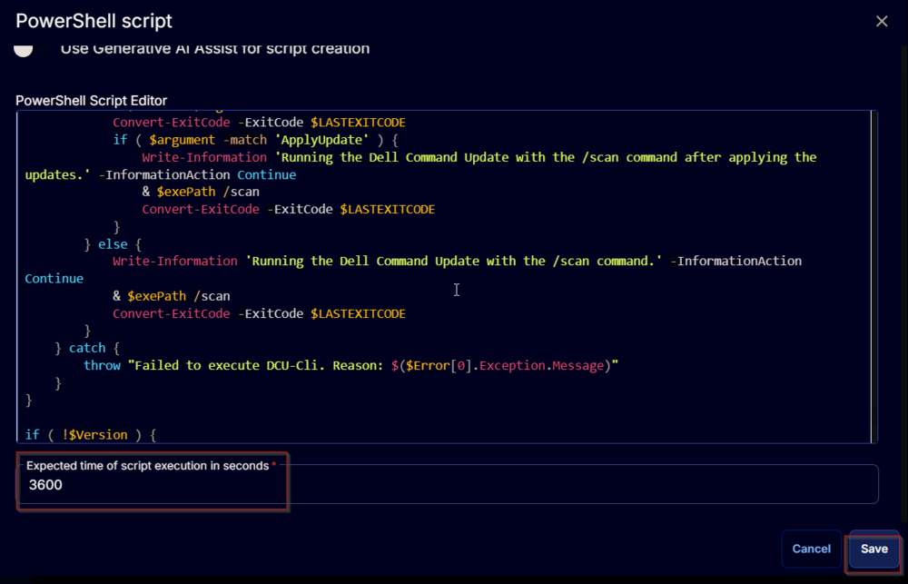

### Row 2 Function: Script Log

Add a new row by clicking the `Add Row` button.  


A blank function will appear.  


Search and select the `Script Log` function.  
  


The following function will pop up on the screen:  


In the script log message, simply type `%output%` and click the `Save` button.  


Click the `Save` button at the top-right corner of the screen to save the script.  


## Completed Task


## Output

- Script log 