## Summary

This task detects if SMB1 is enabled on the machine or not and saves its output to [CW RMM - Custom Field - SMB1 Enabled](https://proval.itglue.com/DOC-5078775-14419753) Custom field, which further can be used to display information of the machines with SMB1 enabled on them.

## Sample Run

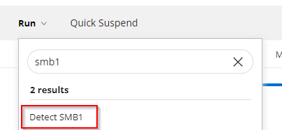

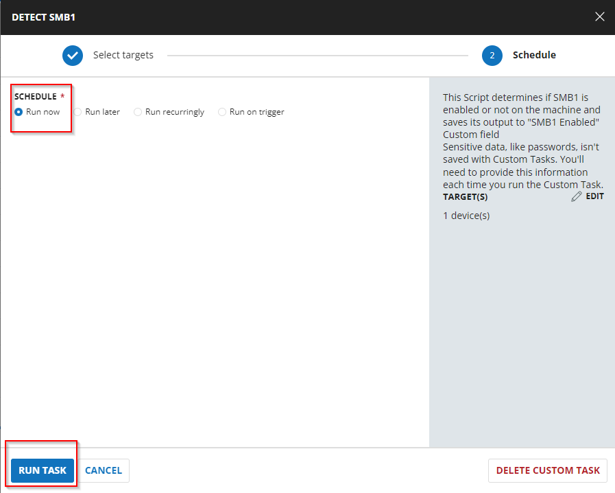

## Implementation

### Create Script

Create a new "Script Editor" style script in the system to implement this Task.

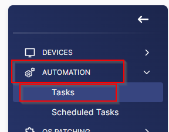

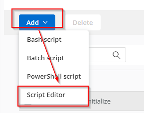

**Name:** Detect SMB1  
**Description:** This task determines if SMB1 is enabled or not on the machine and saves its output to "SMB1 Enabled" Custom field  
**Category:** Custom  

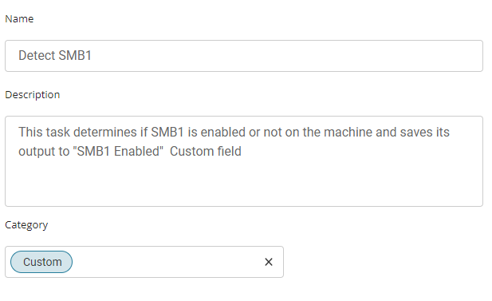

Start by making three separate rows. You can do this by clicking the "Add Row" button at the bottom of the script page.

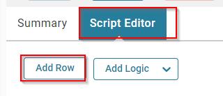

### Row 1 Function: PowerShell Script

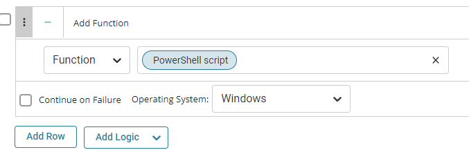


Paste in the following PowerShell script and set the expected time of script execution to `300` seconds.

```
$ErroractionPreference= 'SilentlyContinue';  
$ver = [Version](get-WmiObject -Class Win32_OperatingSystem).version; 
"$($ver.Major).$($ver.Minor)"; 
if($ver -ge [version]'6.3') {
    if ( ( (Get-SmbServerConfiguration).EnableSMB1Protocol )  -ne 'True') {
        return 'False'
    } else {
        return 'True'
    } 
} else { 
    $s =  (Get-Item HKLM://SYSTEM//CurrentControlSet//Services//LanmanServer//Parameters | ForEach-Object {Get-ItemProperty $_.pspath -Name SMB1} );  
    if ( ( -not $s ) -or ( $s -contains 1 )) {
        return 'True' 
    } else {
        return 'False' 
    } 
}
```

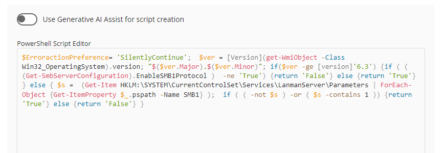

Save and move to the next row.

### Row 2 Function: Script Log

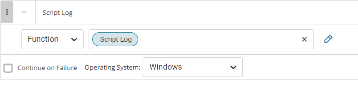

In the script log message, simply type `Output:%output%` so that the script will send the results of the PowerShell script above to the output on the Automation tab for the target device.

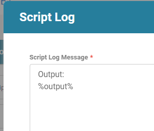

### Row 3 Logic: If/Then/Else


There will be two sections: If part and Else part.


#### Row 3a Condition: Output Contains

In IF part, enter `True` in the right box of the "Output Contains" Part.

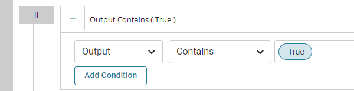

#### Row 3b Function: Script Exit

Add a new row by clicking on the Add row button.

Select Function 'Set Custom Field'. When you select `set custom field`, it will open up a new window.

In this window, search for `SMB1 Enabled` field.

**Custom Field:** `SMB1 Enabled`  
**Value:** True  

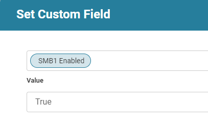

#### Row 3c Function: Script Exit

Add a new row by clicking on the Add row button in the ELSE part and select Script 'Set Custom Field' function again.

In this one, set Custom Field and Value like shown below.

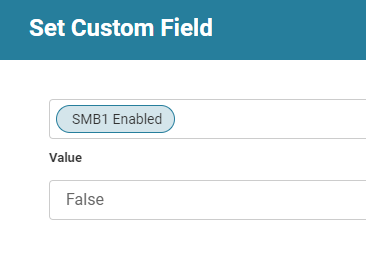

Once all items are added, please save the task. The final task should look like the below screenshot.

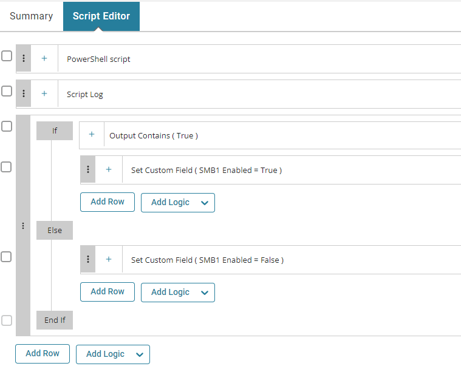

## Deployment

It is suggested to run the Task once per week against Windows computers.

- Go to `Automation` > `Tasks`.
- Search for `Detect SMB1` Task.
- Select the concerned task.
- Click on `Schedule` button to schedule the task/script.

This screen will appear.

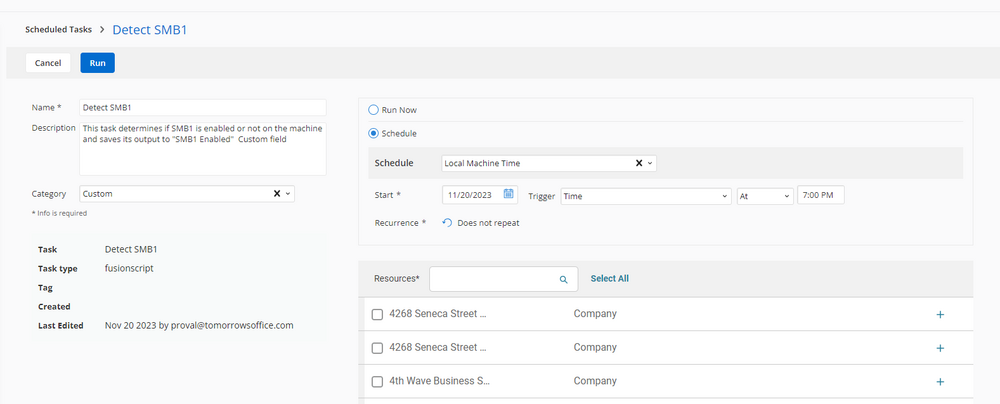

Select the relevant time to run the script and click the Does not repeat button.


A pop-up box will appear.

Change the number of days to `7` and click `OK`.

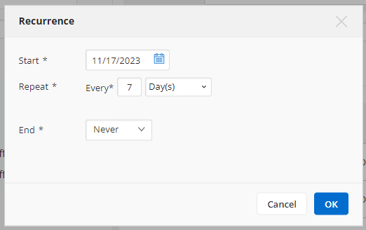


Search for `windows agents` in the `Resources*` and select it. You can search and select any relevant group you would like to schedule the task against. If the client doesn't have a device group which includes all Windows agents, then create one and schedule the task on it.


Now click the `Run` button to initiate the task.

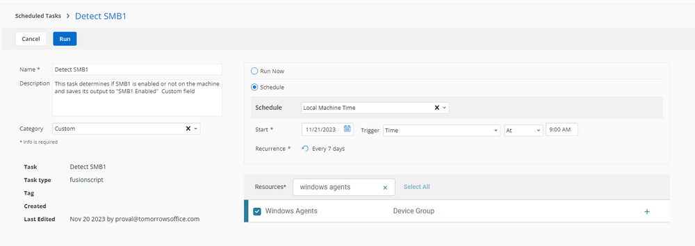

The task will start appearing in the Scheduled Tasks.

## Output

- Script log
- custom field - [CW RMM - Custom Field - SMB1 Enabled](https://proval.itglue.com/DOC-5078775-14419753)


