## Summary

The script will attempt to modify the registry keys to disable fastboot on the Windows workstations if it is not already disabled.

## Sample Run

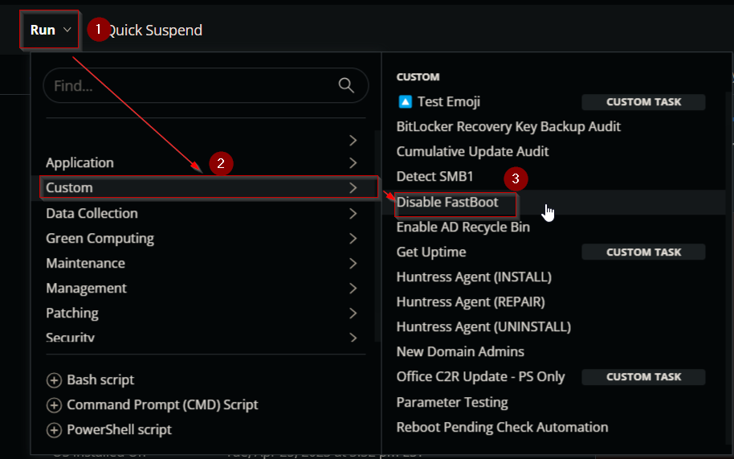  
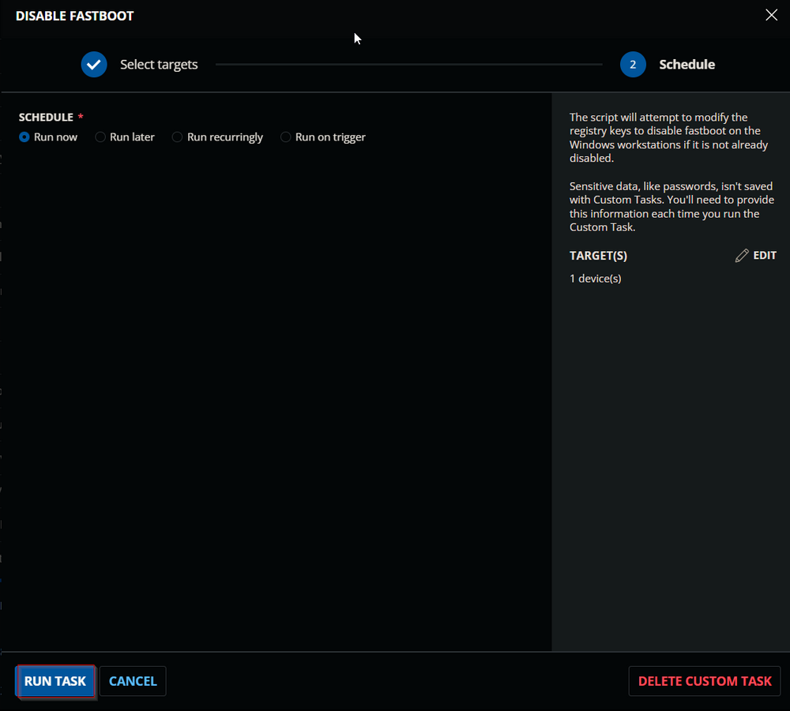  

## Dependencies

- [CW RMM - Custom Field - Company - Disable_FastBoot](https://proval.itglue.com/DOC-5078775-16020399) 
- [CW RMM - Custom Field - Endpoint - FastBoot_Disabled](https://proval.itglue.com/DOC-5078775-16020673) 
- [CW RMM - Custom Field - Endpoint - Disable_Fastboot_Exclusion](https://proval.itglue.com/DOC-5078775-16020404) 
- [CW RMM - Custom Field - Site - Disable_Fastboot_Exclusion](https://proval.itglue.com/DOC-5078775-16020405) 
- [CW RMM - Device Group - Disable FastBoot](https://proval.itglue.com/DOC-5078775-16020416) 

## Task Creation

Create a new `Script Editor` style script in the system to implement this Task.

  
  

**Name:** Disable FastBoot  
**Description:** The script will attempt to modify the registry keys to disable fastboot on the Windows workstations if it is not already disabled.  
**Category:** Custom  
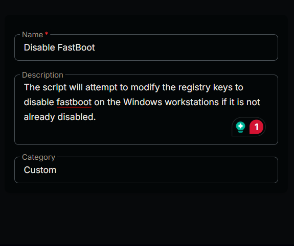  

## Task

1. Start by adding a row. You can do this by clicking the `Add Row` button at the bottom of the script page.  
     
   This function will appear.  
     

### Row 1 Function: PowerShell Script

Search and select the `PowerShell Script` function.  
  
  
  

Paste in the following PowerShell script and set the expected time of script execution to `300` seconds. Click the `Save` button.

```powershell
$registryPath = 'HKLM://SYSTEM//CurrentControlSet//Control//Session Manager//Power'
if (Test-Path $registryPath) {
    $hiberbootEnabled = Get-ItemProperty -Path $registryPath -Name HiberbootEnabled -ErrorAction SilentlyContinue
    if ($hiberbootEnabled.HiberbootEnabled -eq 1) {
        Set-ItemProperty -Path $registryPath -Name HiberbootEnabled -Value 0
        $hiberbootEnabled = Get-ItemProperty -Path $registryPath -Name HiberbootEnabled -ErrorAction SilentlyContinue
        if ($hiberbootEnabled.HiberbootEnabled -ne 0) {
            return 'Failed'
        } else {
            return 'Success'
        }
    } else {
        return 'Success'
    }
} else {
    return 'Success'
}
```

### Row 2 Logic: If Then Else

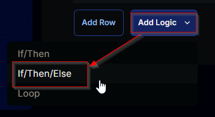  
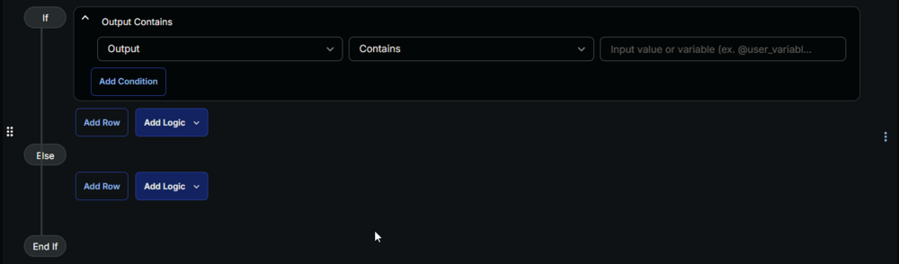  

#### Row 2a Condition: Output Contains

Type `Success` in the `Input Value or Variable` field and press `Enter`.  
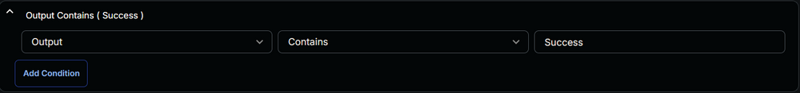  

#### Row 2b Function: Set Custom Field

Add a new row by clicking on `Add row` button.  
  

Search and select `Set Custom Field` Function.  
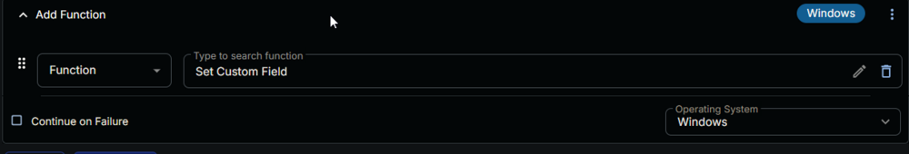  
  

Search and select `FastBoot_Disabled` in the `Search Custom Field` field and set `True` in the `Value` field and click the `Save` button.  
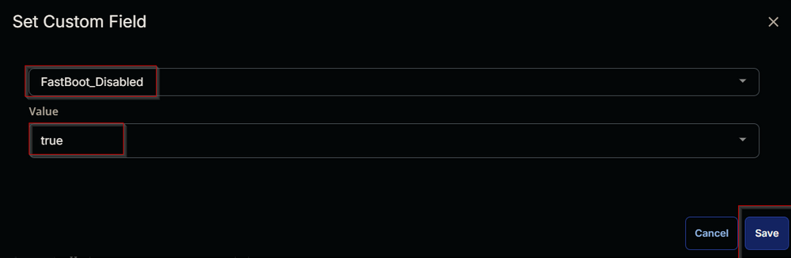  
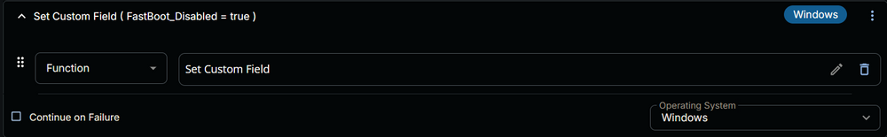  

#### Row 2d Function: Set Custom Field

Add a new row by clicking on `Add row` button in the `Else` section.  
  

Search and select `Set Custom Field` Function.  
  
  

Search and select `FastBoot_Disabled` in the `Search Custom Field` field and set `False` in the `Value` field and click the `Save` button.  
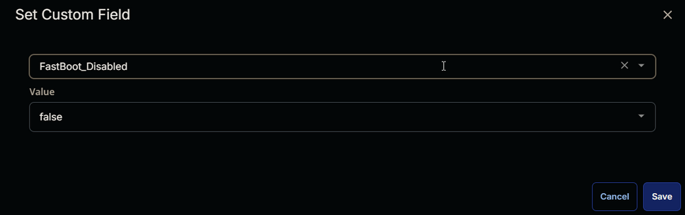  
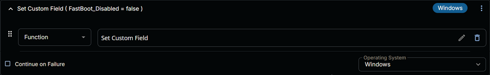  

#### Row 2c Function: Script Exit

Add a new row by clicking on `Add row` button.  
  

Search and select `Script Exit` Function.  
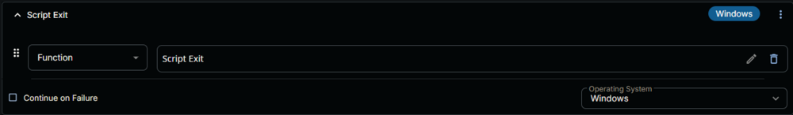  

Following function will pop-up on to the screen:  
  

Paste the following lines in the `Error Message` field and click the `Save` button.  
```plaintext
Failed to disable FastBoot.
```
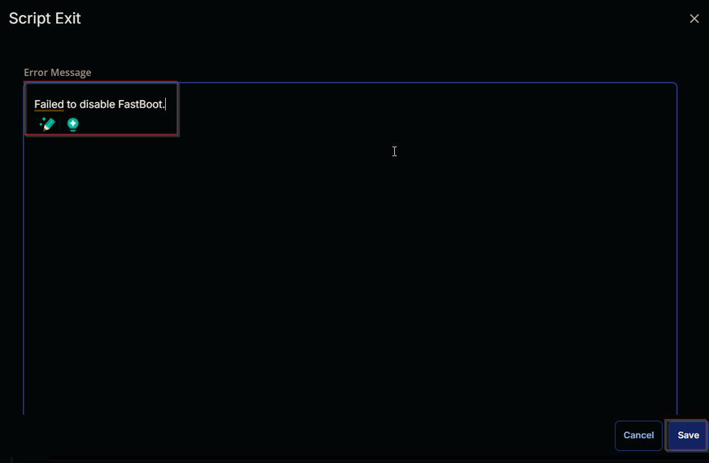  

Click the `Save` button at the top-right corner of the screen to save the script.  
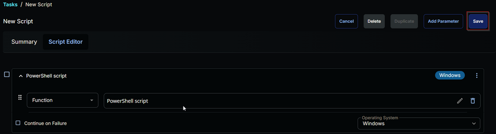  

## Completed Script

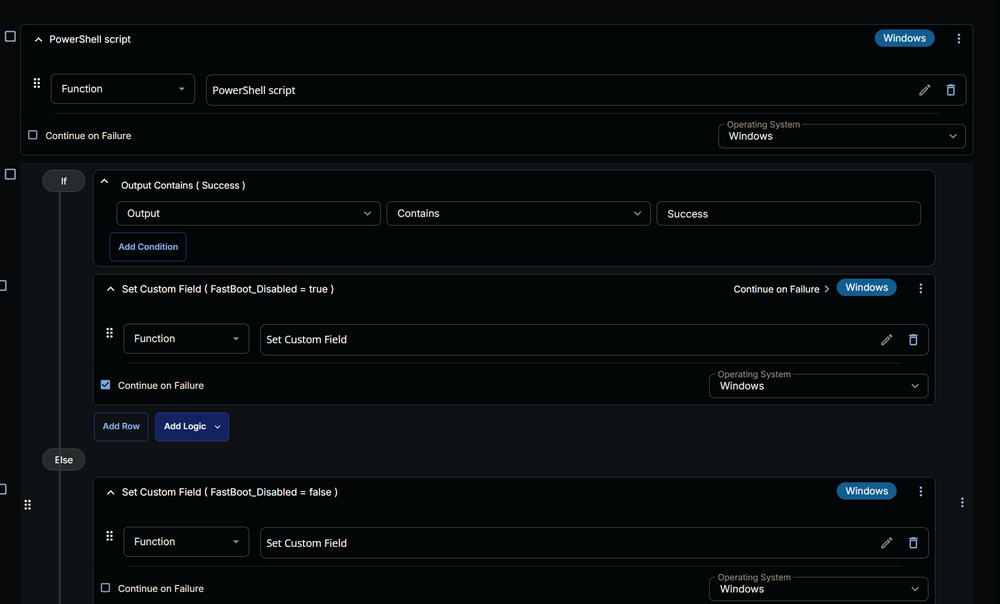  
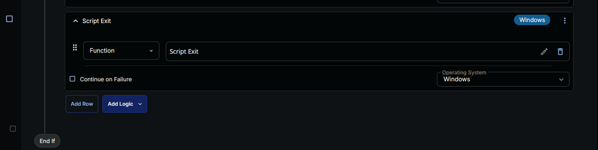  

## Deployment

The task should be scheduled to run once per day against the [Disable FastBoot](https://proval.itglue.com/DOC-5078775-16020416) device group.

- Go to `Automation` > `Tasks.`
- Search for `Disable FastBoot` Task.
- Select the concerned task.
- Click on `Schedule` button to schedule the task.  
  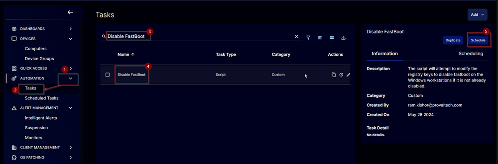  
- This screen will appear.  
  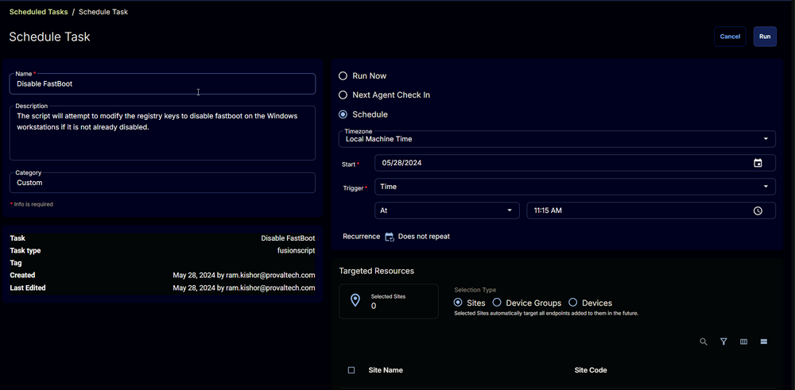  
- Click the `Does not repeat` button.  
  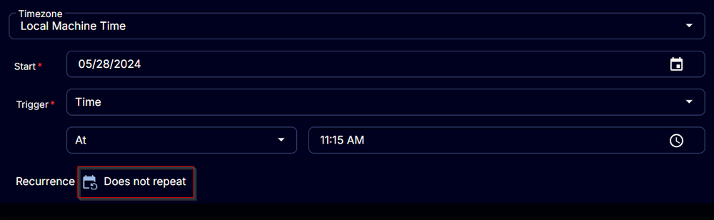  
- This pop-up box will appear.  
  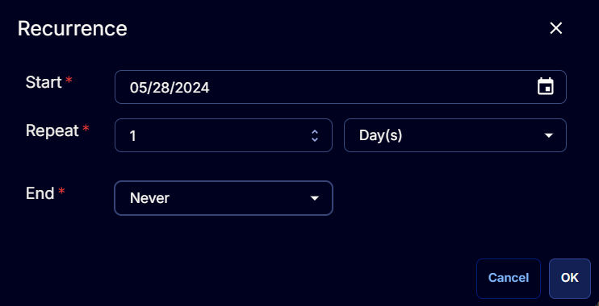  
- Click the `OK` button without making any changes to run the task `Every day`.  
  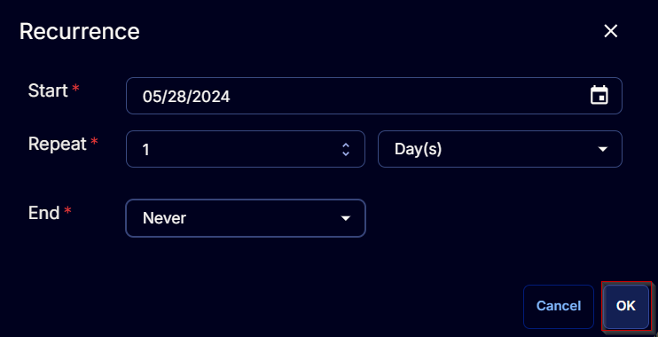  
- Recurrence will be updated to `Every Day`.  
  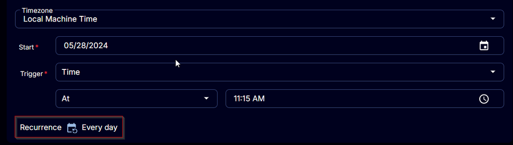  
- Select the `Device Groups` option in the `Targeted Resources` section.  
  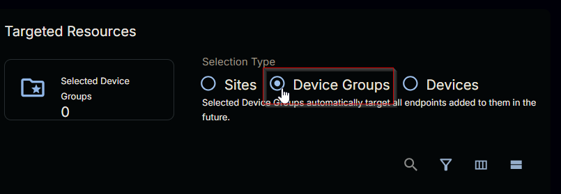  
- Search and Select the [Disable FastBoot](https://proval.itglue.com/DOC-5078775-16020416) device group.  
  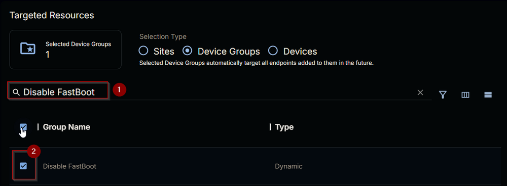  
- Now click the `Run` button to initiate the task.  
  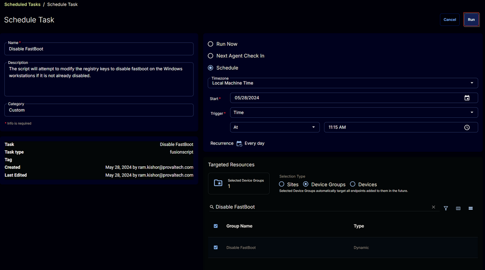  
- The task will start appearing in the Scheduled Tasks.  
  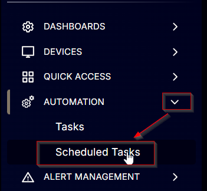  
  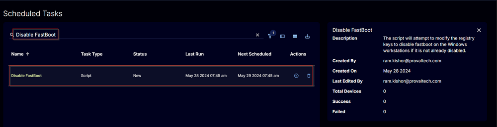  

## Output

- Script Log
- Custom Field


