## Summary

This script disables the SMB1 protocol on the target machine for both versions below and above '6.3'.

Output Syntax: `Harddisk - \\<Model> (Drives: \\<Drive Letter(s)>): Health Status - \\<Status>`

## Sample Run

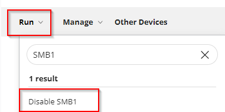

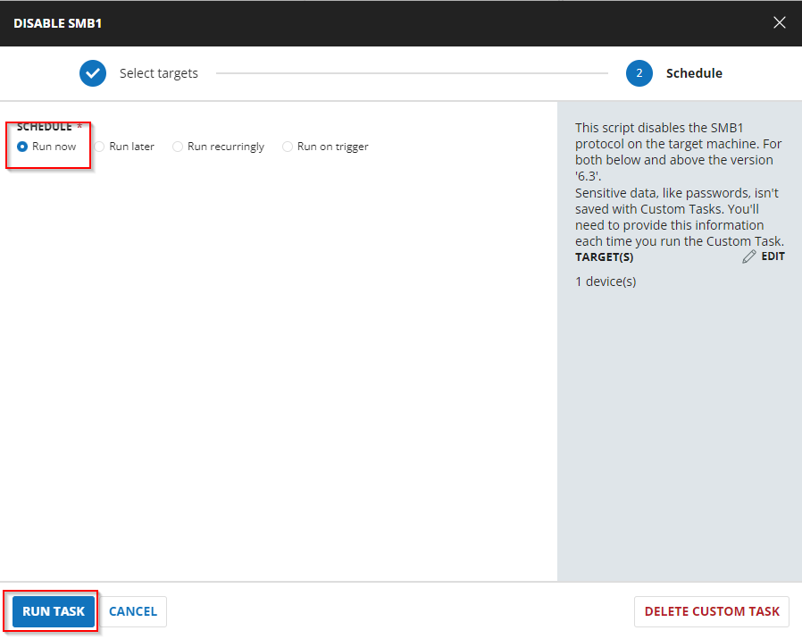

## Implementation

### Create Script

Create a new `Script Editor` style script in the system to implement this task.


**Name:** Disable SMB1  
**Description:** This script disables the SMB1 protocol on the target machine for both versions below and above '6.3'.  
**Category:** Security

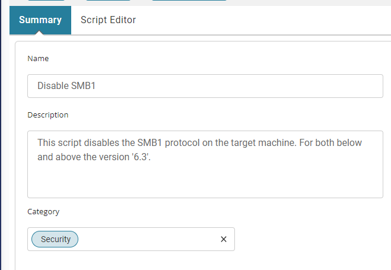

### Script

Start by making three separate rows. You can do this by clicking the "Add Row" button at the bottom of the script page.

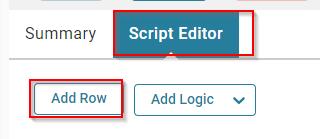

#### Row 1 Function: PowerShell Script


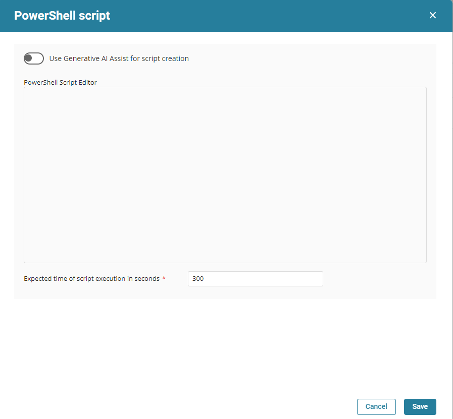

Paste in the following PowerShell script and set the expected time of script execution to `300` seconds.

```powershell
$ver = [Version](get-WmiObject -Class Win32_OperatingSystem).version; "$($ver.Major).$($ver.Minor)"; 
if($ver -ge [version]'6.3') 
{
    if ( ( (Get-WindowsOptionalFeature -Online -FeatureName "SMB1Protocol").state )  -ne 'Enabled') 
    { 
        return 'SMB1 was already in a disabled state'
    } 
    else 
    {
        Disable-WindowsOptionalFeature -Online -FeatureName SMB1Protocol -NoRestart
        return 'SMB1 has been successfully disabled'
    }
} 
else 
{
    $s =  (Get-Item HKLM:\SYSTEM\CurrentControlSet\Services\LanmanServer\Parameters | ForEach-Object {Get-ItemProperty $_.pspath -Name SMB1} ); 
    if ( ( -not $s ) -or ( $s -contains 1 )) 
    {  
        Set-ItemProperty -Path 'HKLM:\SYSTEM\CurrentControlSet\Services\Lanmanworkstation\Parameters' -Name 'SMB1' -Value 0 -Type DWORD -Force
        Set-ItemProperty -Path 'HKLM:\SYSTEM\CurrentControlSet\Services\LanmanServer\Parameters' -Name 'SMB1' -Value 0 -Type DWORD -Force
    }  
    return 'SMB1 has been successfully disabled'
    else 
    {
        return 'SMB1 was already in a disabled state'
    }
}
```

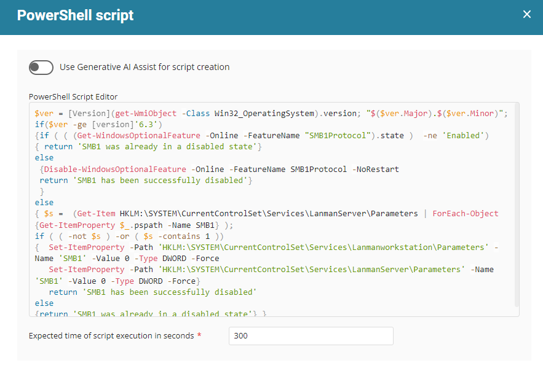

Save and move to the next row.

#### Row 2 Function: Script Log


In the script log message, simply type `Output:%output%` so that the script will send the results of the PowerShell script above to the output on the Automation tab for the target device.

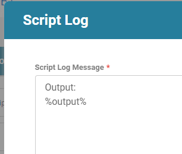

#### Row 3 Logic: If/Then/Else


There will be two sections: If part and Else part.


##### Row 3a Condition: Output Contains

In the IF part, enter **Disabled** in the right box of the "Output Contains" part.

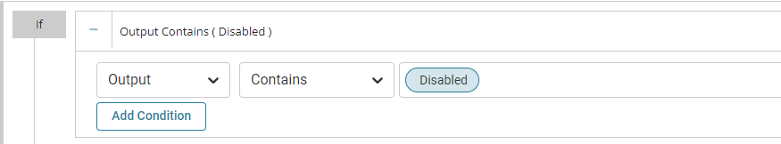

##### Row 3b Function: Script Exit

Add a new row by clicking on the Add Row button.

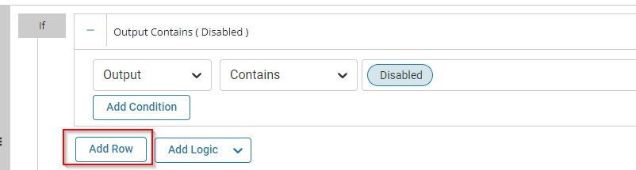

In the script exit message, simply type `SMB1 has been successfully disabled. Exiting script` so that the script will send a successful message on the Automation tab for the target device.

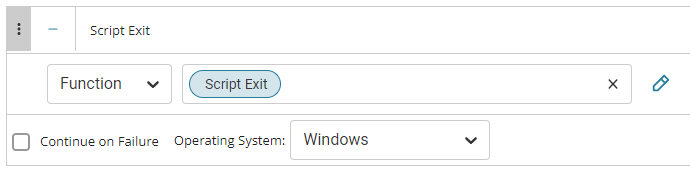

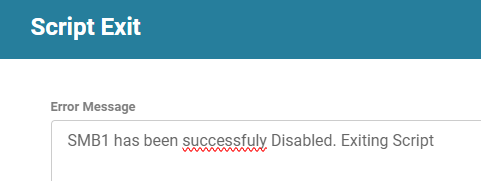

##### Row 3c Function: Script Exit

Add a new row by clicking on the Add Row button in the ELSE part and select Script Exit Function.


In the script exit message, type `Failed to disable SMB1 on the machine` so that the script will send a failure message on the Automation tab for the target device.

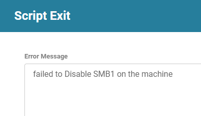

Once all items are added, please save the task.  
The final task should look like the screenshot below.

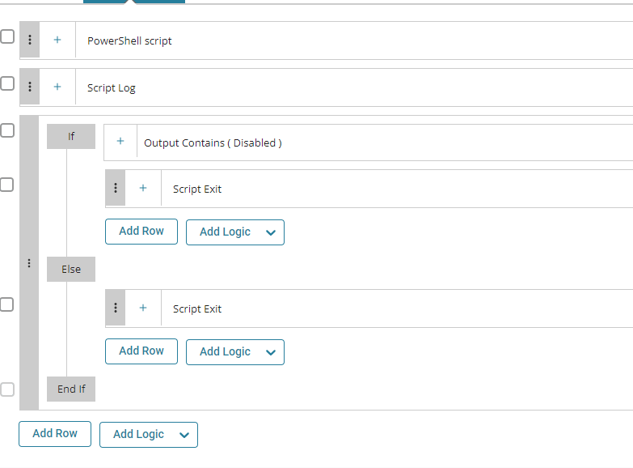

## Deployment

**IMPORTANT**: Only enable this automation if it is explicitly requested by the consultant. This can cause issues if deployed improperly.

It is suggested to run the task once per week against Windows computers.

- Go to `Automation` > `Tasks.`
- Search for `Disable SMB1` Task.
- Select the concerned task.
- Click on the `Schedule` button to schedule the task/script.

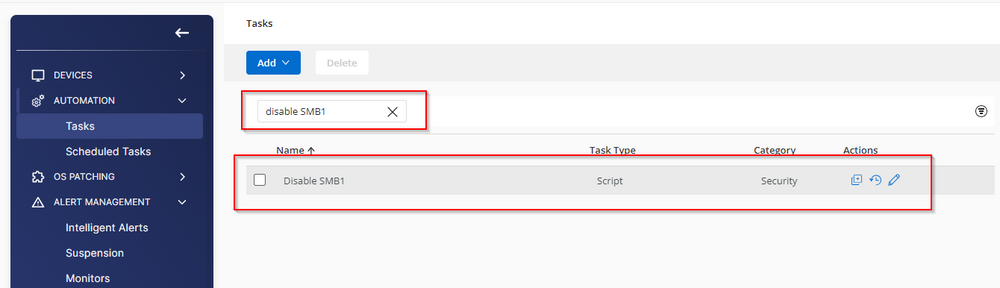

- This screen will appear.

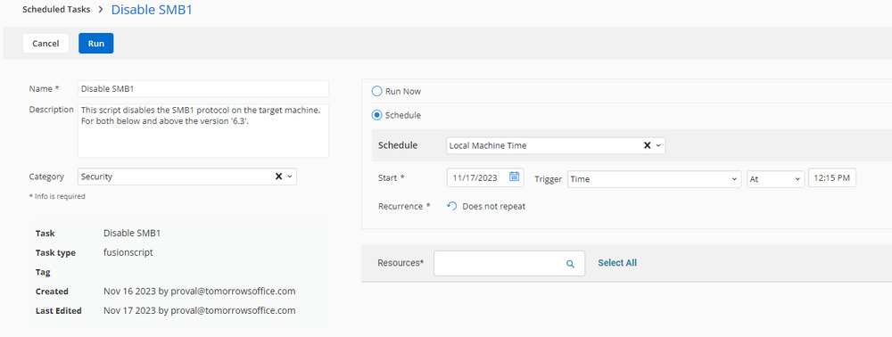

- Select the relevant time to run the script and click the Does not repeat button.

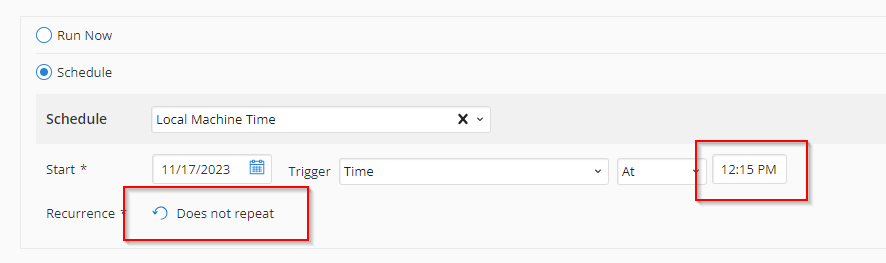

- This pop-up box will appear.
- Change the number of days to `7` and click `OK`.


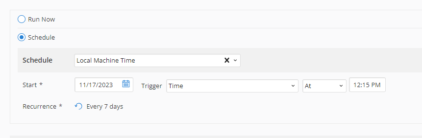

- Search for `windows` in the `Resources*` and select `Windows Desktops` and `Windows Servers` groups. You can search and select any relevant group you would like to schedule the task against.

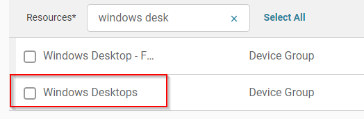

- Now click the `Run` button to initiate the task.

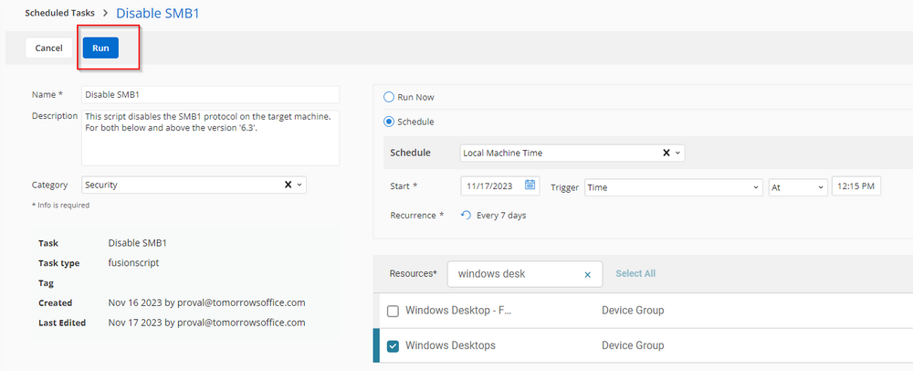

- The task will start appearing in the Scheduled Tasks.

## Output

- Script log


