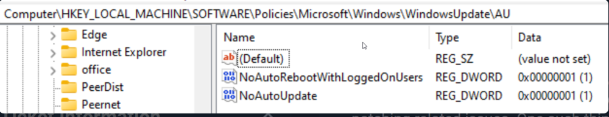
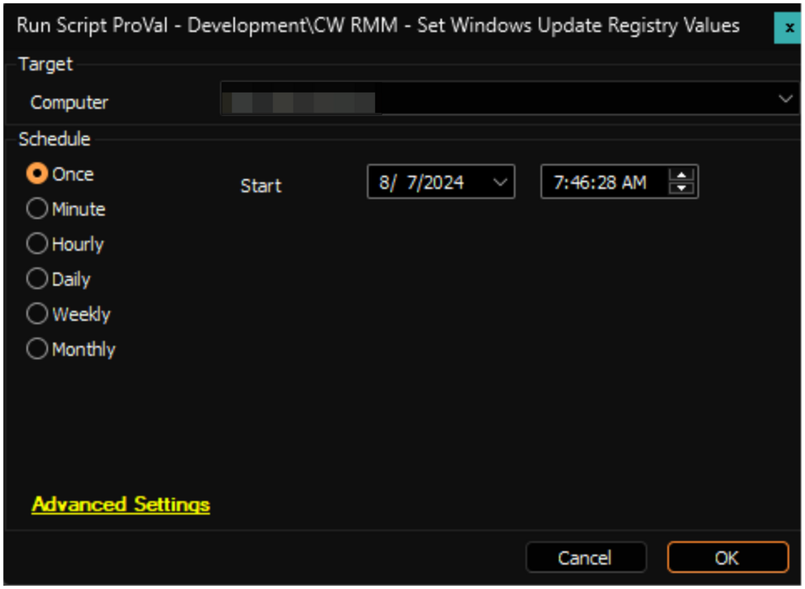

## Summary

The script is designed to remove any additional registry values from the registry path `Computer/HKEY_LOCAL_MACHINE/SOFTWARE/Policies/Microsoft/Windows/WindowsUpdate/AU`. Additionally, it ensures that the values for the keys `NoAutoRebootWithLoggedOnUsers` and `NoAutoUpdate` are set to `1`.  

CW Support recommends setting these registry keys on the local device to ensure that patching and rebooting occur properly from CW RMM.

Furthermore, the script will make sure that patching access is not disabled for the `System` account by making the necessary registry changes.

**File Hash:** `CD403F3ADF92ED255BBD935164481AA89686F44CF5498AAA2C9F1AE922CE0ADF`

## Sample Run

## Variables

| Name              | Description                                   |
|-------------------|-----------------------------------------------|
| ProjectName       | Set-WURegCWRMM                               |
| WorkingDirectory   | C:/ProgramData/_Automation/Script/Set-WURegCWRMM |
| ScriptPath        | C:/ProgramData/_Automation/Script/Set-WURegCWRMM/Set-WURegCWRMM.ps1 |

## Output

- Script log

