## Summary

This document describes how to enable the Active Directory (AD) Recycle Bin on AD Infrastructure Masters.

## Dependencies

- [CW RMM - Custom Fields - AD Recycle Bin](<../custom-fields/AD Recycle Bin.md>)
- [CW RMM - Device Group - Infrastructure Master - Without Recycle Bin](<../groups/Infrastructure Master - Without Recycle Bin.md>)

## Create Script

To implement this script, please create a new "PowerShell" style script in the system.

  
  

**Name:** Enable AD Recycle Bin  
**Description:** This task enables AD recycle on Windows Infrastructure Masters  
**Category:** Custom  
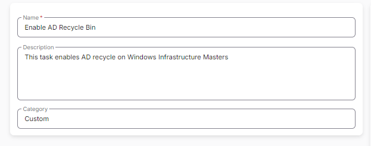  

### Script

#### Row 1 Function: PowerShell Script

  

Paste in the following PowerShell script and set the expected time of script execution to 900 seconds.

```
$result = (Get-Host | Select -exp Version).ToString()
if($result -ge 3)
{
    Write-Host "Supported: $result"
}
else
{
    Write-Host "Outdated: $result"
}
```

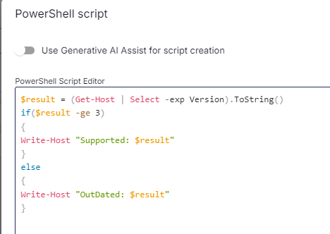  

#### Step 2 Logic: If/Then

- Add a new `If/Then` logic from the Add Logic dropdown menu.  

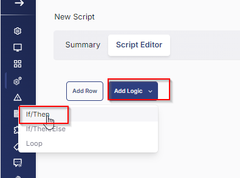  

#### ROW 2a Condition: Output Contains

- Type `Outdated` in the Value box.

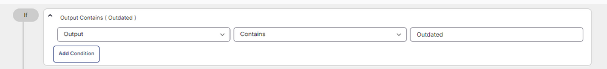  

#### ROW 2b Function: Set Custom Field

Add a new row in the If Section by clicking the Add Row button.

- Search and select the `Set Custom Field` function.

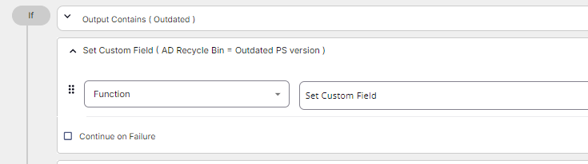  

- Search and select the `AD Recycle Bin` Custom Field.
- Type `Outdated PS version` in the `Value` box and click the Save button.

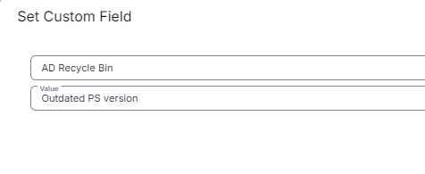  

#### ROW 2c Function: Script Exit

- Add a new row in the If Section by clicking the Add Row button.
- Search and select the `Script Exit` function.
- Input the following:

```
The AD Recycle Bin failed to be enabled on the DC server as the PowerShell version is outdated. Minimum version required is above 3.0 and the current version is %output%
```

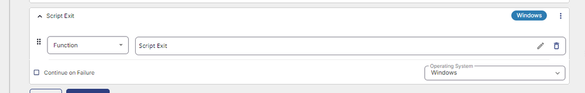  
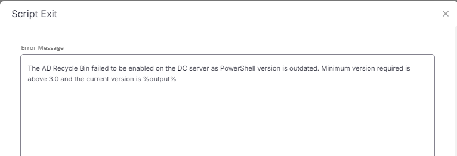  

#### ROW 3 Function: PowerShell Script

  

Paste in the following PowerShell script and set the expected time of script execution to 900 seconds.

```
$adwsService = Get-Service -Name ADWS -ErrorAction SilentlyContinue
if ($adwsService -eq $null) {
    Write-Output "ADWS service is not installed."
} elseif ($adwsService.Status -ne "Running") {
    Start-Service -Name ADWS
    Write-Output "ADWS service has been started."
} else {
    Write-Output "ADWS service is already running."
}
```

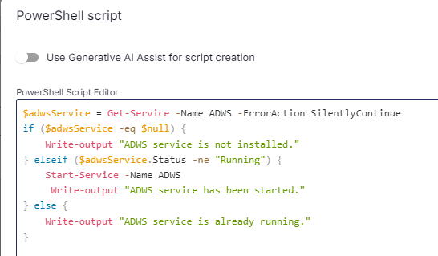  

#### ROW 4 Function: PowerShell Script

  

Paste in the following PowerShell script and set the expected time of script execution to 900 seconds.

```
Import-Module ActiveDirectory
$DomainCheck = (Get-ADDomain).DomainMode
$ForestCheck = (Get-ADForest).ForestMode

if($DomainCheck -eq 'Windows2008Domain' -or $ForestCheck -eq 'Windows2008Forest' -or $DomainCheck -match '2003' -or $ForestCheck -match '2003')
{
    Write-Host "Minimum criteria for AD Recycle Bin enable is: Above 2008R2 Domain and Forest mode required."
}
else
{
    Write-Host "Eligible for AD Recycle Bin."
}
```

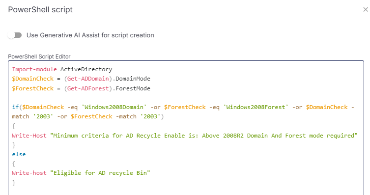  

#### Step 5 Logic: If/Then

- Add a new `If/Then` logic from the Add Logic dropdown menu.

  

#### ROW 5a Condition: Output Contains

- Type `Minimum criteria for AD Recycle Bin enable` in the Value box.

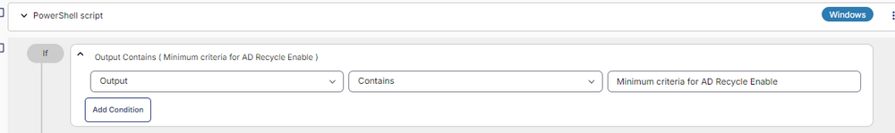  

#### Row 5b Function: Set Custom Field

Add another row by selecting the `ADD ROW` button in the `If` section of the `If/Then` section.

- Search and select the `Set Custom Field` function.

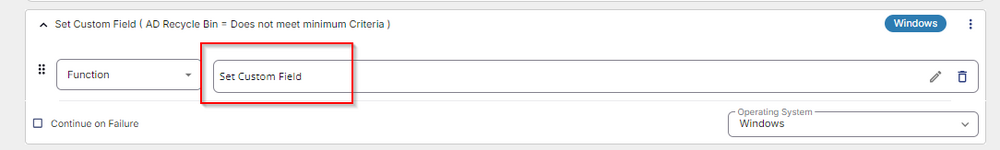  

- Search and select the `AD Recycle Bin` Custom Field.
- Type `Does not meet minimum criteria` in the `Value` box and click the Save button.

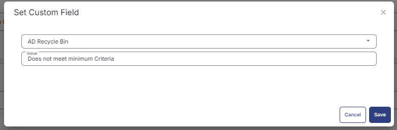  

#### ROW 5c Function: Script Exit

- Add a new row in the If Section by clicking the Add Row button.
- Search and select the `Script Exit` function.
- Input the following:

```
The AD Recycle Bin failed to be enabled on the DC server. The DomainMode or ForestMode is not eligible for the AD Recycle Bin to be enabled.

Logs:

%output%
```

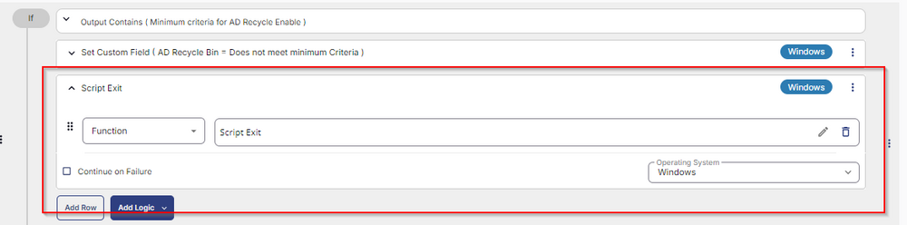  
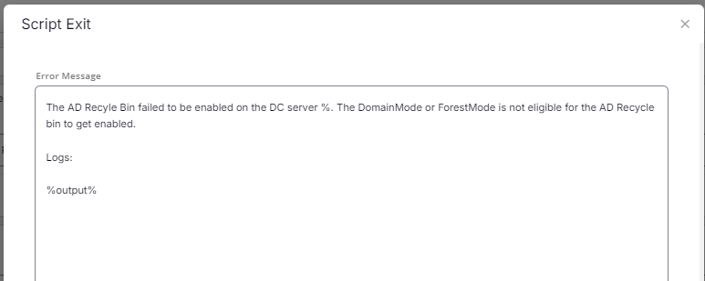  

#### ROW 6 Function: PowerShell Script

  

Paste in the following PowerShell script and set the expected time of script execution to 900 seconds.

```
Import-Module ActiveDirectory
$DomainCheck = (Get-ADDomain).DomainMode
$ForestCheck = (Get-ADForest).ForestMode

if($DomainCheck -eq 'Windows2008Domain' -or $ForestCheck -eq 'Windows2008Forest' -or $DomainCheck -match '2003' -or $ForestCheck -match '2003')
{
    Write-Host "Minimum criteria for AD Recycle Bin enable is: Above 2008R2 Domain and Forest mode required."
}
else
{
    $Result = Get-ADOptionalFeature -Filter * -ErrorAction SilentlyContinue | Select-Object -ExpandProperty EnabledScopes
    if($Result)
    {
        Write-Host "Recycle Bin already enabled in the AD."
    }
    else 
    {
        Write-Host "AD Recycle Bin not enabled. Proceeding to enable it."
        $Domain = Get-ADForest | Select-Object -ExpandProperty RootDomain
        Enable-ADOptionalFeature 'Recycle Bin Feature' -Scope ForestOrConfigurationSet -Target $Domain -Confirm:$false
        $Result = Get-ADOptionalFeature -Filter * -ErrorAction SilentlyContinue | Select-Object -ExpandProperty EnabledScopes
        if($Result)
        {
            Write-Host "Recycle Bin enabled in AD successfully."
        }
        else
        {
            Write-Host "Failed to enable the Recycle Bin."
        }
    }
}
```

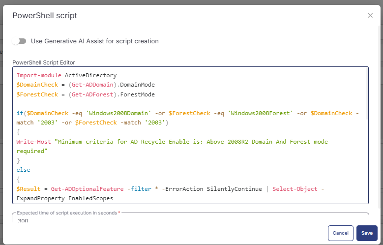  

#### Step 7 Logic: If/Then/Else

- Add a new `If/Then/Else` logic from the Add Logic dropdown menu.

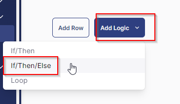  

#### ROW 7a Condition: Output Contains

- Type `Failed to enable` in the Value box.

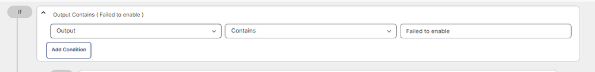  

#### Step 7b Logic: If/Then

Add a new `If/Then` logic from the `Add Logic` dropdown menu inside the `IF` section.

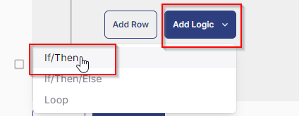  

#### Row 7b(i) Condition: Custom Field Does Not Contain

- Select `Custom field` from the dropdown.
- Select `AD Recycle Bin` custom field from the dropdown.
- Select `Does Not Contain` from the dropdown.
- Type `Does not meet minimum criteria` into the value.

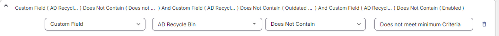  

Select ADD CONDITION in the Custom field section and add another condition.

- Select `Custom field` from the dropdown.
- Select `AD Recycle Bin` custom field from the dropdown.
- Select `Does Not Contain` from the dropdown.
- Type `Outdated PS version` into the value.

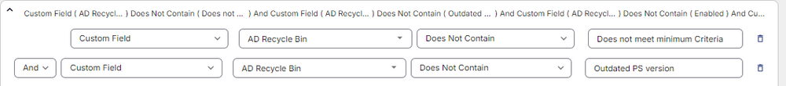  

Select ADD CONDITION in the Custom field section and add another condition.

- Select `Custom field` from the dropdown.
- Select `AD Recycle Bin` custom field from the dropdown.
- Select `Does Not Contain` from the dropdown.
- Type `Enabled` into the value.

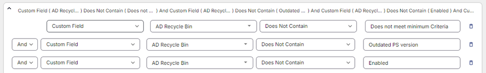  

Select ADD CONDITION in the Custom field section and add another condition.

- Select `Custom field` from the dropdown.
- Select `AD Recycle Bin` custom field from the dropdown.
- Select `Does Not Contain` from the dropdown.
- Type `failed more than 3 times` into the value.

The whole custom field should look like this.

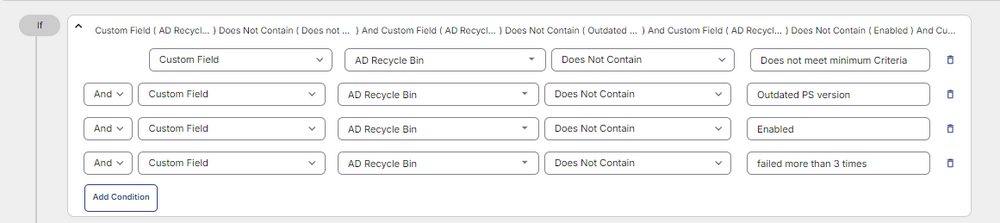  

#### Row 7b(ii) Condition: Set Pre-defined Variable

Add another row by selecting the `ADD ROW` button in the `IF` section of the internal `If/Then` section.

- Select `Set Pre-Defined Variable` function.

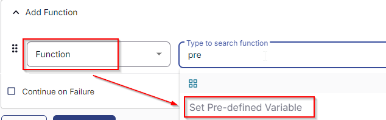  

- Select `Custom Field`.
- Input `AD_RecycleBin_Result` as the variable name.
- Select `AD Recycle Bin` custom field from the dropdown.
- Click Save.

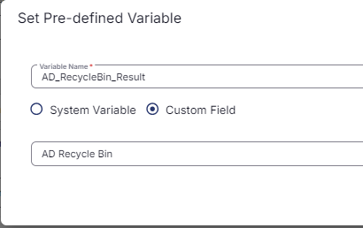  

#### Row 7b(iii) Function: PowerShell Script

Add another row by selecting the `ADD ROW` button in the `IF` section of the internal `If/Then` section.

- Select PowerShell Script function.

  

Paste in the following PowerShell script and set the expected time of script execution to 900 seconds.

```
if ('@AD_RecycleBin_Result@' -eq '2'){return 'failed more than 3 times'} 
elseif ('@AD_RecycleBin_Result@' -eq '0'){return '1'} 
elseif ('@AD_RecycleBin_Result@' -eq '1'){return '2'} 
else {return 'failed more than 3 times'}
```

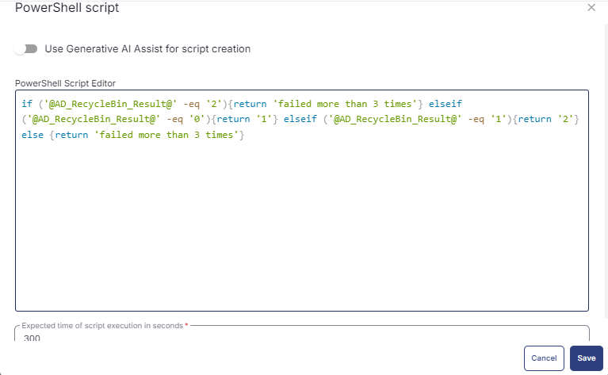  

#### Row 7b(iv) Function: Set Custom Field

Add another row by selecting the `ADD ROW` button in the `IF` section of the internal `If/Then` section.

- Search and select the `Set Custom Field` function.

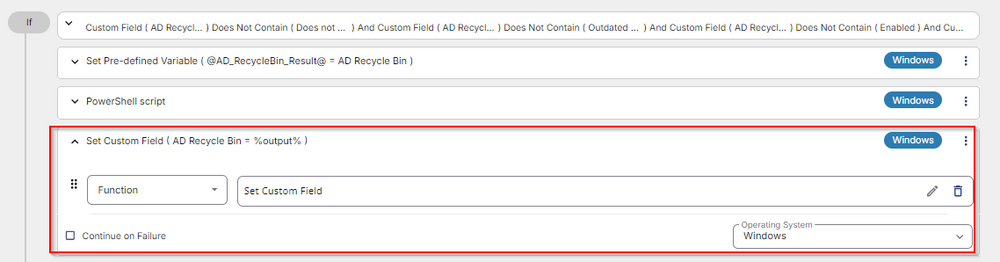  

- Search and select the `AD Recycle Bin` Custom Field.
- Type `%Output%` in the `Value` box and click the Save button.

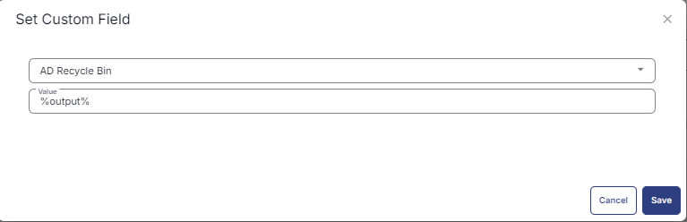  

#### Row 7b(v) Function: Script Exit

Add another row by selecting the `ADD ROW` button in the `Else` section of the internal `If/Then` section.

- Search and select the `Script Exit` function.
- Input the following:

```
Script failed to enable AD Recycle Bin on the DC server.

Logs:

%output%
```

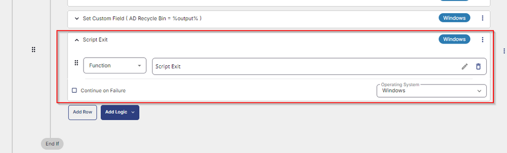  
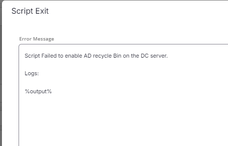  

#### Row 7c Function: Set Custom Field

Add another row by selecting the `ADD ROW` button in the `Else` part of the `If/Then/Else` section.

- Search and select the `Set Custom Field` function.

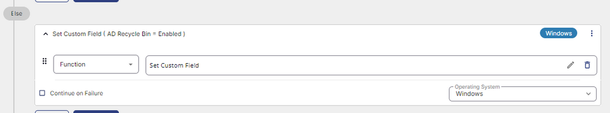  

- Search and select the `AD Recycle Bin` Custom Field.
- Type `Enabled` in the `Value` box and click the Save button.

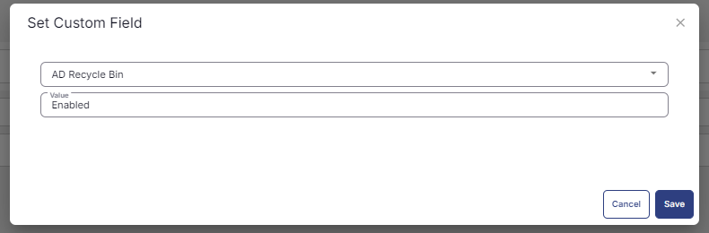  

The final task should look like the screenshot below.

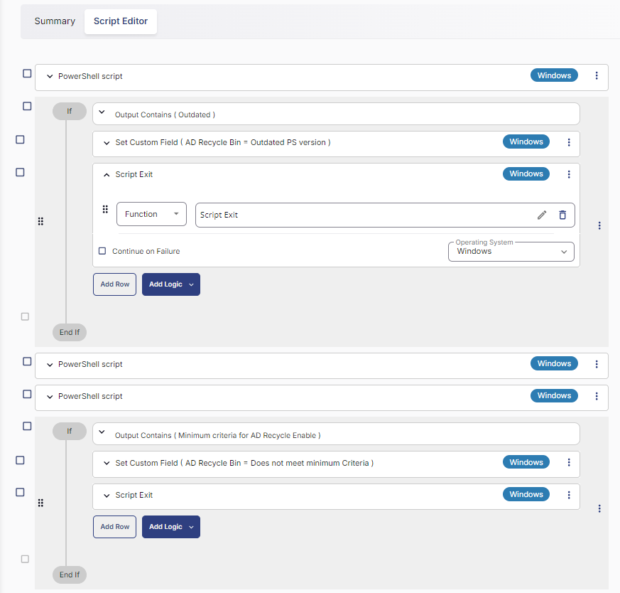  
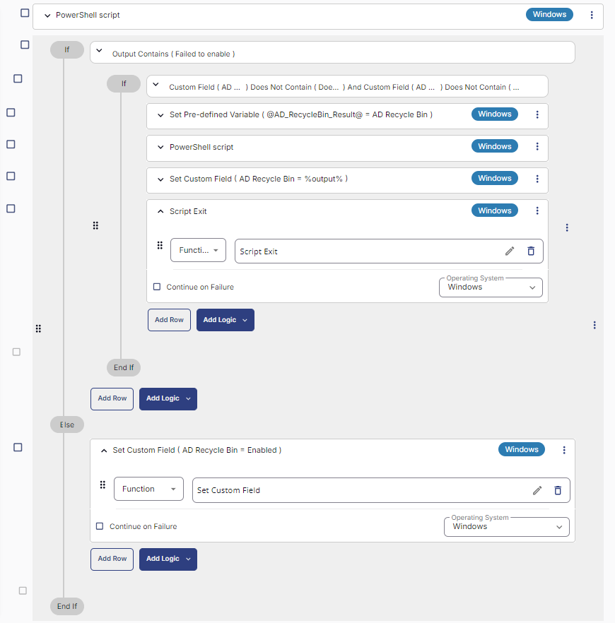  

## Script Deployment

This task must be scheduled on the [CW RMM - Device Group - Infrastructure Master - Without Recycle Bin](<../groups/Infrastructure Master - Without Recycle Bin.md>) group for auto deployment. The script can also be run manually if required.

Go to Automations > Tasks.  
Search for Enable AD Recycle Bin.  
Then click on Schedule and provide the necessary parameters for script completion.

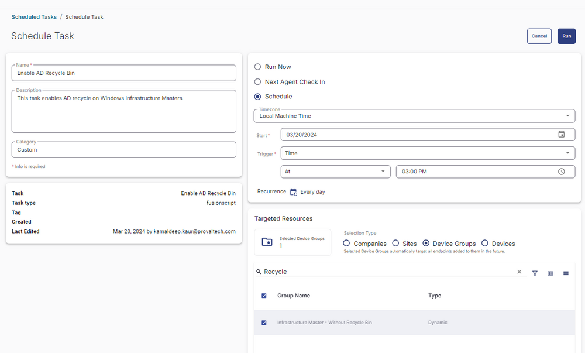  

## Output

- Script log


