## Summary

This script is designed to reboot the endpoints based on the custom field `@ServerRebootWindowStart@`, `@ServerRebootWindowEnd@`, and `@ServerRebootWindowDay@`. If the reboot time does not fall between the windows then reboot will not trigger.

**NOTE:** To exclude this client from the solution, please enter 'Exclude' in the `@ServerRebootWindowDay@` and `@WorkstationRebootWindowDay@` field. That will cause the script to exit and not take any actions on the target partner.

## Sample Run

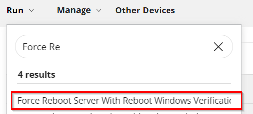
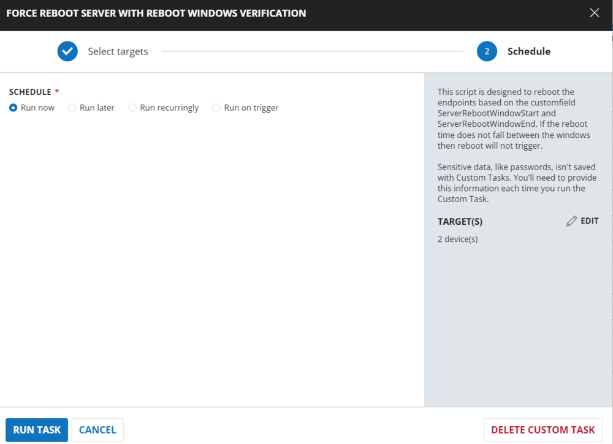

## Dependencies

[CW RMM - Custom Fields - Reboot Trigger/Schedule](<../custom-fields/Reboot TriggerSchedule.md>)

## Implementation

### Create Task

Force Reboot Server With Reboot Windows Verification: To implement this script, please create a new "Script Editor" style script in the system.


Name: Force Reboot Server With Reboot Windows Verification  
Description: This script is designed to reboot the endpoints based on the custom field `@ServerRebootWindowStart@`, `@ServerRebootWindowEnd@`, and `@ServerRebootWindowDay@`. If the reboot time does not fall between the windows then reboot will not trigger.  
Category: Maintenance

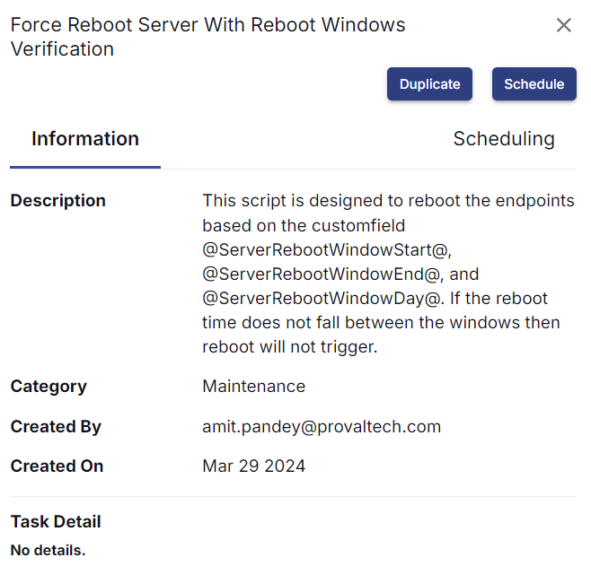

## Script

Start by making three separate rows. You can do this by clicking the "Add Row" button at the bottom of the script page.

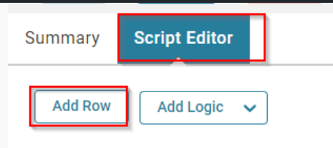

### Row 1: Function: Script Log


Paste the highlighted text: `Checking OS`

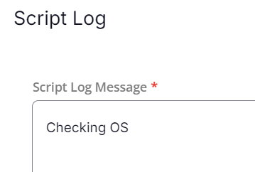

### Row 2: Function: PowerShell Script


Paste in the following PowerShell script and set the expected time of script execution to **600 seconds**.

```powershell
$os = Get-CimInstance -ClassName Win32_OperatingSystem
if ($os.ProductType -eq 1) {
    return 'Workstation'
} elseif ($os.ProductType -eq 2 -or $os.ProductType -eq 3) {
    return 'Server'
} else {
    return 'Unknown OS Type'
}
```

### Row 3: Function: Script Log


In the script log message, simply type `%output%` so that the script will send the results of the PowerShell script above to the output on the Automation tab for the target device.


### Row 4: Logic: If/Then


### Row 4a: Condition: Output Contains

In the IF part, enter `Server` in the right box of the "Output Does Not Contain" Part.

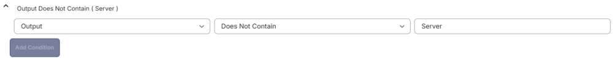

### Row 4b: Function: Script Log


In the script log message, type `The OS detected is confirmed not a Server. Please try the script 'Force Reboot Workstation with Reboot Windows Verification'. Exiting script without any action.` so that the script will send the results of the PowerShell script above to the output on the Automation tab for the target device.


### Row 4c: Function: Script Exit

Add a new row by clicking on the Add row button.


In the script exit message, leave it blank.

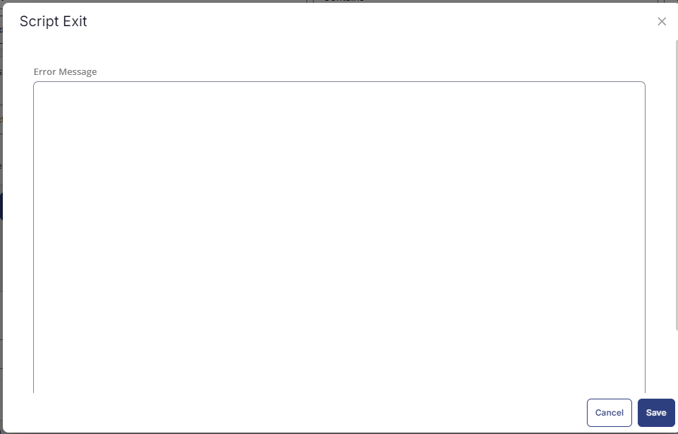

### Row 5: Logic: If/Then


### Row 5a: Condition: Custom Field Equals

In the IF part, enter `true` in the right box of the "Custom Field Equals" Part.


### Row 5b: Function: Script Log


In the script log message, type `Force reboot is allowed on the endpoint. Proceeding for reboot without windows validation.` so that the script will send the results of the PowerShell script above to the output on the Automation tab for the target device.

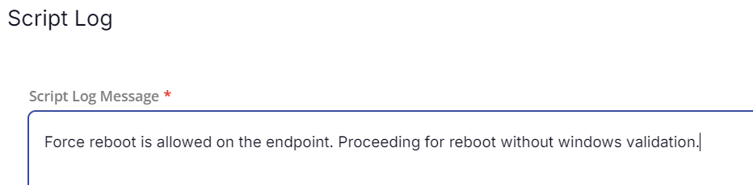

### Row 5c: Function: Command Prompt (CMD) Script

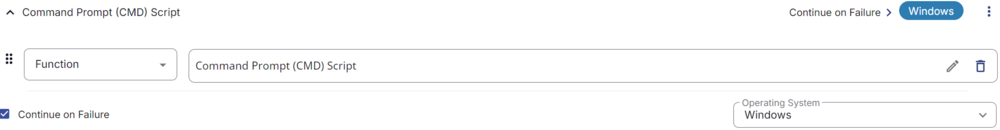
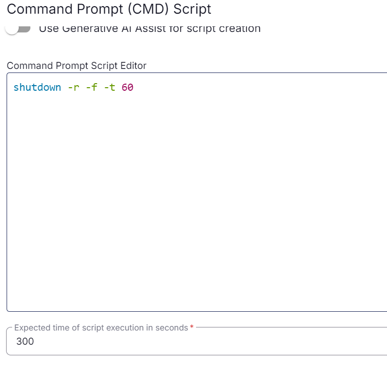

Run it as 'Continue on Failure' and paste.

Paste in the following PowerShell script and set the expected time of script execution to **300 seconds**.

```cmd
shutdown -r -f -t 60
```

### Row 5d: Function: Script Exit

Add a new row by clicking on the Add row button.


In the script exit message, leave it blank.


### Row 6: Function: Set Pre-defined Variable


Select the custom field 'ServerRebootWindowStart' and set the variable 'RebootWindowStart'.

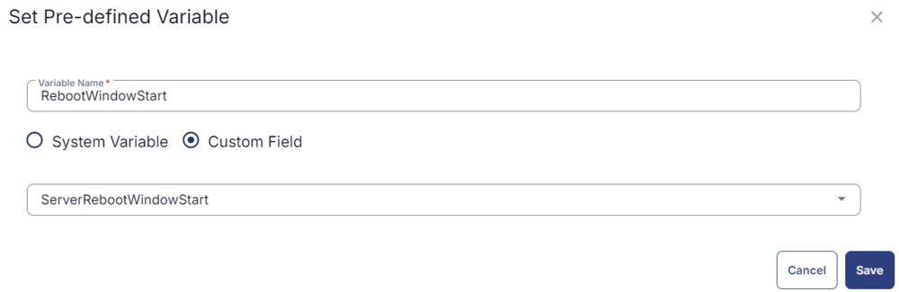

### Row 7: Function: Set Pre-defined Variable

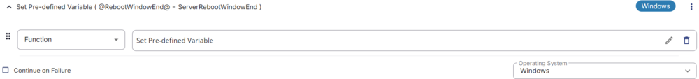

Select the custom field 'ServerRebootWindowEnd' and set the variable 'RebootWindowEnd'.


### Row 8: Function: Set Pre-defined Variable


Select the custom field 'ServerRebootWindowDay' and set the variable 'RebootWindowDay'.

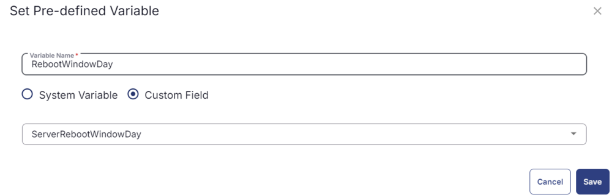

### Row 9: Logic: If/Then


### Row 9a: Condition: Custom Field Equals

In the IF part, enter `true` in the right box of the "Custom Field Equals" Part.


### Row 9b: Function: Script Log


In the script log message, type `This endpoint has 'Exclude Reboot' flag checked. Exiting script without any action.` so that the script will send the results of the PowerShell script above to the output on the Automation tab for the target device.

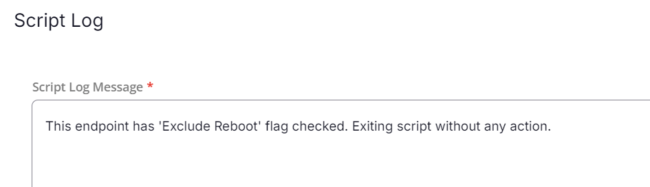

### Row 9c: Function: Script Exit

Add a new row by clicking on the Add row button.


In the script exit message, leave it blank.


### Row 10: Function: Script Log


In the script log message, type `Verifying that machine is in approved window between @RebootWindowStart@ and @RebootWindowEnd@ (Note: 0=12:00 AM, 23=11:00 PM) and Day @RebootWindowDay@.` so that the script will send the results of the PowerShell script above to the output on the Automation tab for the target device.


### Row 11: Function: PowerShell Script


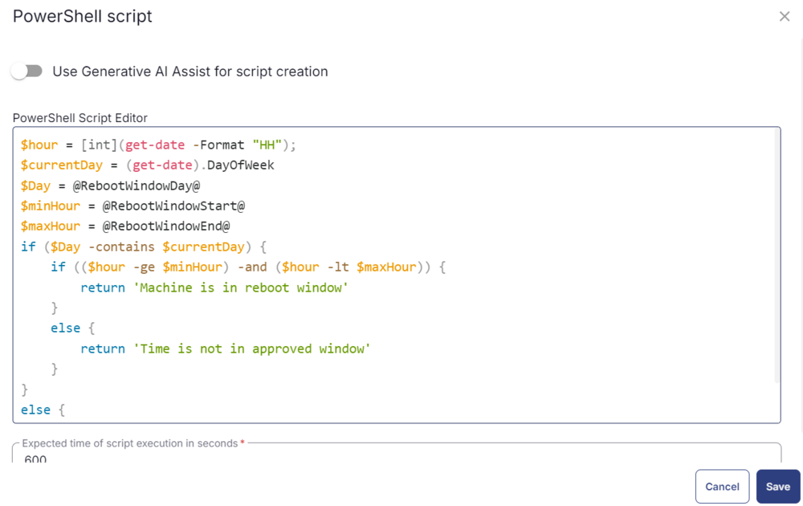

Paste in the following PowerShell script and set the expected time of script execution to **600 seconds**.

```powershell
$hour = [int](get-date -Format "HH");
$currentDay = (get-date).DayOfWeek
$Day = @RebootWindowDay@
$minHour = @RebootWindowStart@
$maxHour = @RebootWindowEnd@
if ($Day -contains $currentDay) {
    if (($hour -ge $minHour) -and ($hour -lt $maxHour)) {
        return 'Machine is in reboot window'
    }
    else {
        return 'Time is not in approved window'
    }
} else {
    return 'Day is not in approved window'
}
```

### Row 12: Function: Script Log


In the script log message, simply type `%output%` so that the script will send the results of the PowerShell script above to the output on the Automation tab for the target device.


### Row 13: Logic: If/Then


### Row 13a: Condition: Output Contains

In the IF part, enter `Machine is in reboot window` in the right box of the "Output Contain" Part.


### Row 13b: Function: Script Log


In the script log message, type `Proceeding for the reboot as the reboot falls under the reboot window provided in the script.` so that the script will send the results of the PowerShell script above to the output on the Automation tab for the target device.

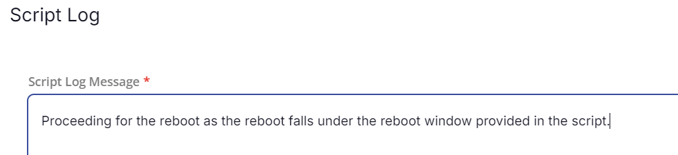

### Row 13c: Function: Command Prompt (CMD) Script


Run it as 'Continue on Failure' and paste.

Paste in the following PowerShell script and set the expected time of script execution to **300 seconds**.

```cmd
shutdown -r -f -t 60
```

### Row 13d: Function: Script Exit

Add a new row by clicking on the Add row button.


In the script exit message, leave it blank.


### Row 14: Complete

The complete script looks as shown below:

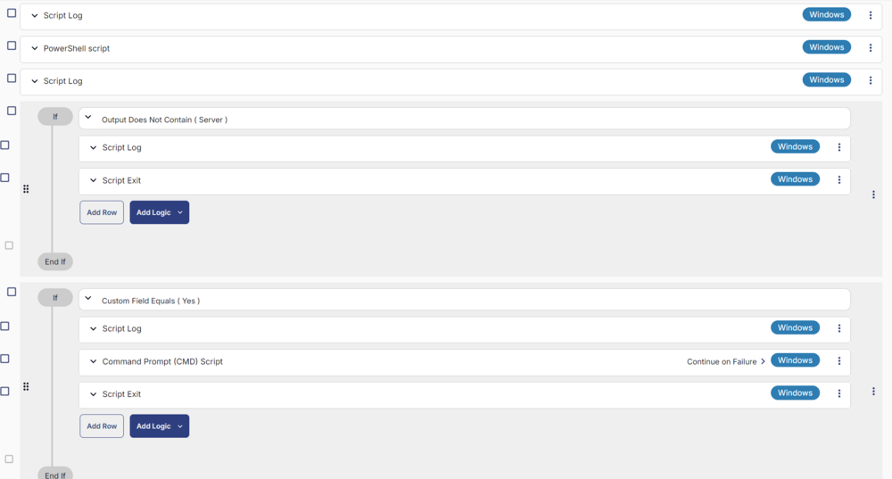
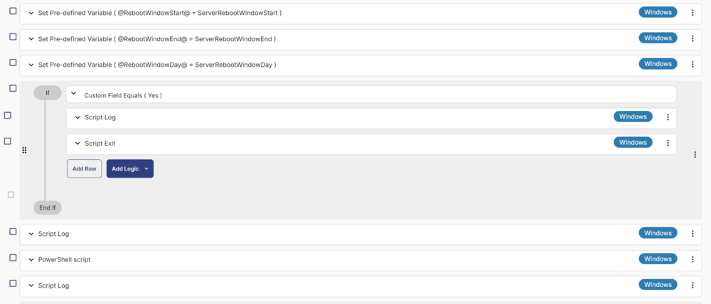
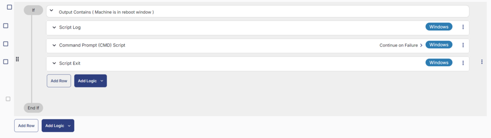

## Deployment

This task can be run manually or in a group. It will only reboot endpoints if the reboot falls under the reboot window provided at the company-level custom fields.

[CW RMM - Custom Fields - Reboot Trigger/Schedule](<../custom-fields/Reboot TriggerSchedule.md>)

- Go to `Automation` > `Tasks.`
- Search for `Force Reboot Server With Reboot Windows Verification` Task.
- Select the concerned task.
- Click on `Schedule` button to schedule the task/script.

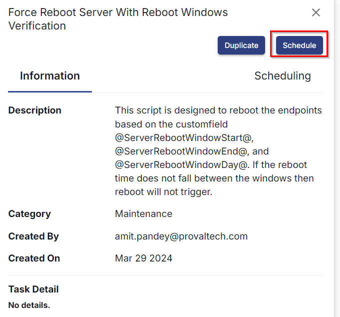

This screen will appear.

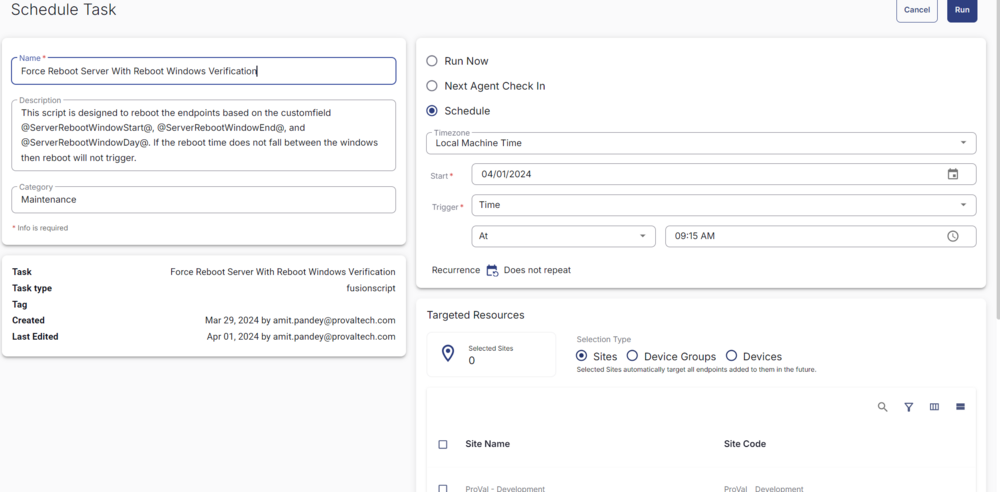

- Select the relevant time to run the script and click the 'Does not repeat' button.


- Select the target to schedule the 'Force Reboot Server With Reboot Windows Verification'.

For example:


- Now click the `Run` button once all customization is set to initiate the task.


- The task will start appearing in the Scheduled Tasks.

## Output

- Task & Sequences Log


