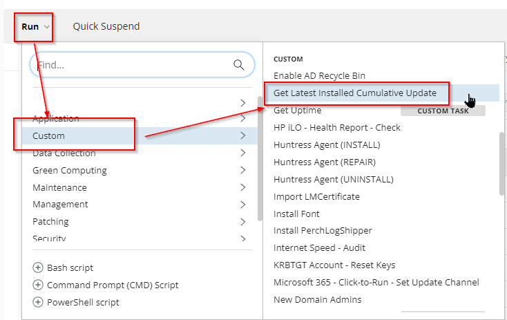
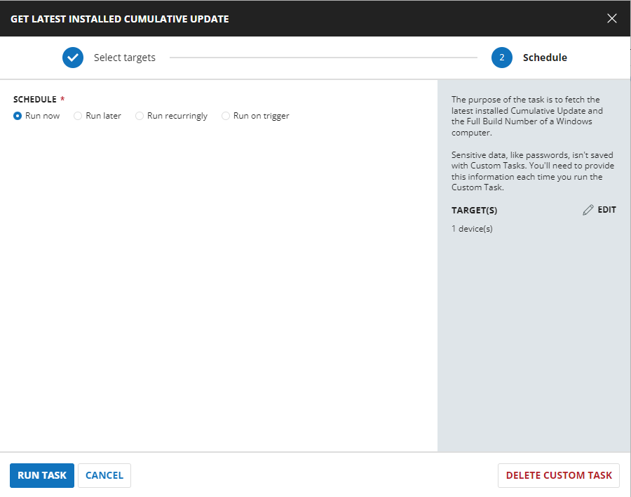
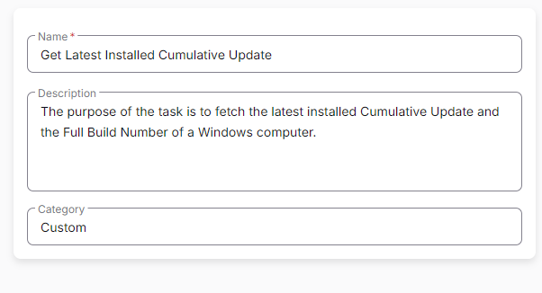

## Summary

The purpose of this task is to fetch the latest installed Cumulative Update and the Full Build Number of a Windows computer.

## Sample Run





## Dependencies

[Get-LatestInstalledCU.ps1](https://file.provaltech.com/repo/script/Get-LatestInstalledCU.ps1)

## Task Creation

Create a new `Script Editor` style script in the system to implement this task.


**Name:** Get Latest Installed Cumulative Update

**Description:** The purpose of this task is to fetch the latest installed Cumulative Update and the Full Build Number of a Windows computer.

**Category:** Custom



## Task

Navigate to the Script Editor section and start by adding a row. You can do this by clicking the `Add Row` button at the bottom of the script page.


A blank function will appear.


### Row 1 Function: PowerShell Script

Search and select the `PowerShell Script` function.


The following function will pop up on the screen:


Paste in the following PowerShell script and set the expected time of script execution to `900` seconds. Click the `Save` button.

```
#region Setup - Variables
$ProjectName = 'Get-LatestInstalledCU'
[Net.ServicePointManager]::SecurityProtocol = [enum]::ToObject([Net.SecurityProtocolType], 3072)
$BaseURL = 'https://file.provaltech.com/repo'
$PS1URL = "$BaseURL/script/$ProjectName.ps1"
$WorkingDirectory = "C:/ProgramData/_automation/script/$ProjectName"
$PS1Path = "$WorkingDirectory/$ProjectName.ps1"
$Workingpath = $WorkingDirectory
$LogPath = "$WorkingDirectory/$ProjectName-log.txt"
$ErrorLogPath = "$WorkingDirectory/$ProjectName-Error.txt"
#endregion

#region Setup - Folder Structure
New-Item -Path $WorkingDirectory -ItemType Directory -ErrorAction SilentlyContinue | Out-Null
$response = Invoke-WebRequest -Uri $PS1URL -UseBasicParsing
if (($response.StatusCode -ne 200) -and (!(Test-Path -Path $PS1Path))) {
    throw "No pre-downloaded script exists and the script '$PS1URL' failed to download. Exiting."
} elseif ($response.StatusCode -eq 200) {
    Remove-Item -Path $PS1Path -ErrorAction SilentlyContinue
    [System.IO.File]::WriteAllLines($PS1Path, $response.Content)
}
if (!(Test-Path -Path $PS1Path)) {
    throw 'An error occurred and the script was unable to be downloaded. Exiting.'
}
#endregion

#region Execution
$output = & $PS1Path
```

```
return "LastInstalledCU: $($output.LastInstalledCU). Version: $($output.OSBuild). ReleaseDate: $($output.ReleaseDate). KBID: $($output.KBID)"
```

### Row 2: Function: Script Log

In the script log message, simply type `%output%` so that the script will send the results of the PowerShell script above to the output on the Automation tab for the target device.


## Completed Task


## Output

- Script Log
