## Summary

The script will check and return the health status of the HP iLO devices, writing the output in a script log. It is a CW RMM implementation of [Get-HPiLOHealthReport](/docs/71faa943-e504-4e87-b8d1-39471af44780), an agnostic script.

## Sample Run

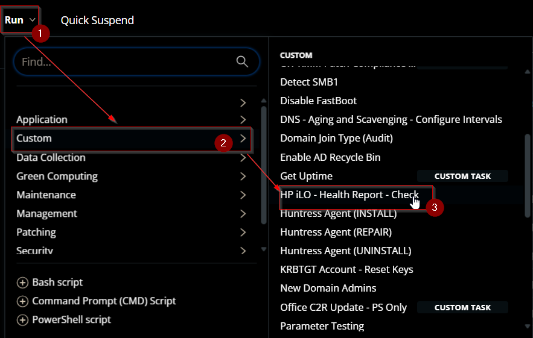

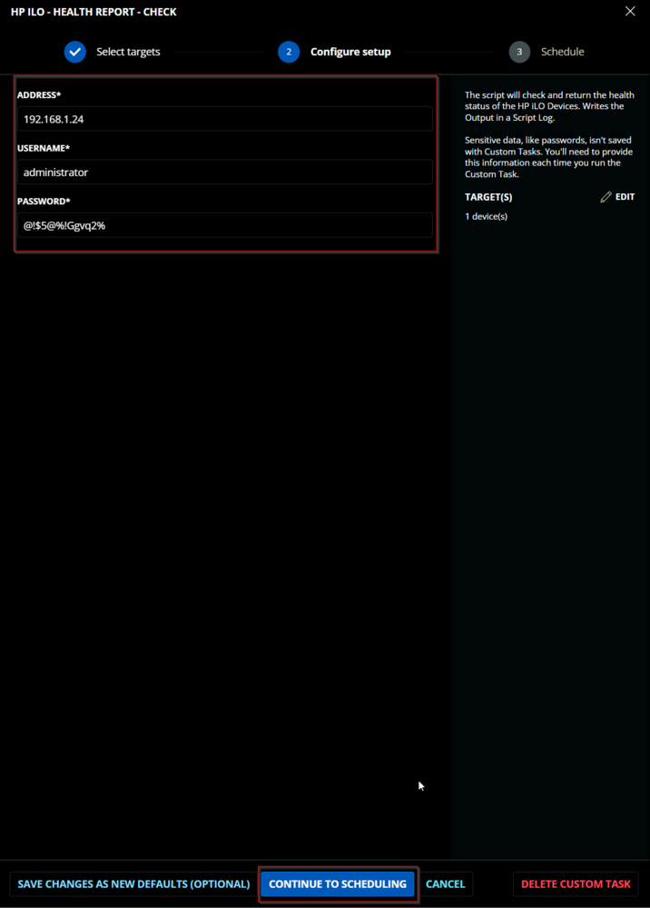

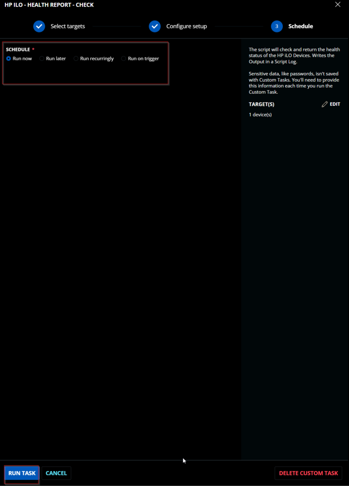

## Dependencies

[EPM - Data Collection - Agnostic - Get-HPiLOHealthReport](/docs/71faa943-e504-4e87-b8d1-39471af44780)

## User Parameters

| Name        | Example                     | Required | Type        | Description                                                                                     |
|-------------|-----------------------------|----------|-------------|-------------------------------------------------------------------------------------------------|
| `Address`   | 192.168.2.16, 192.168.7.13:54 | True     | Text String | IP address of the iLO device. Port number must be added if a custom port is being used.       |
| `Username`  | Administrator               | True     | Text String | Admin username to connect with the iLO device.                                               |
| `Password`  | @!#f2GW@f2!$                | True     | Text String | Password for the admin user.                                                                    |

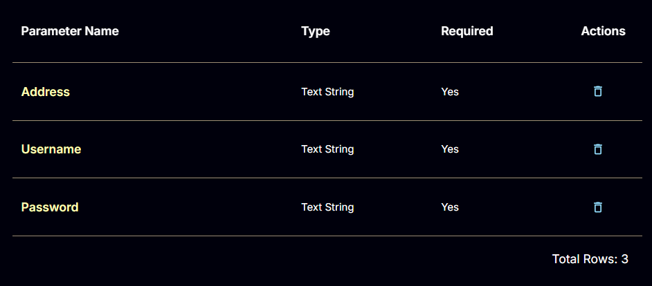

## Task Creation

Create a new `Script Editor` style script in the system to implement this task.


**Name:** `HP iLO - Health Report - Check`  
**Description:** `The script will check and return the health status of the HP iLO devices, writing the output in a script log.`  
**Category:** Custom

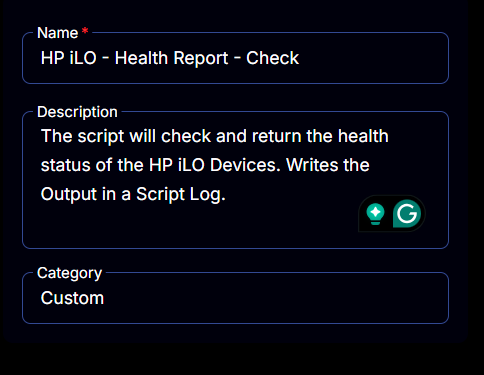

## Parameters

### Address:
Add a new parameter by clicking the `Add Parameter` button present at the top-right corner of the screen.


This screen will appear.


- Set `Address` in the `Parameter Name` field.
- Select `Text String` from the `Parameter Type` dropdown menu.
- Enable the `Required Field` button.
- Click the `Save` button.

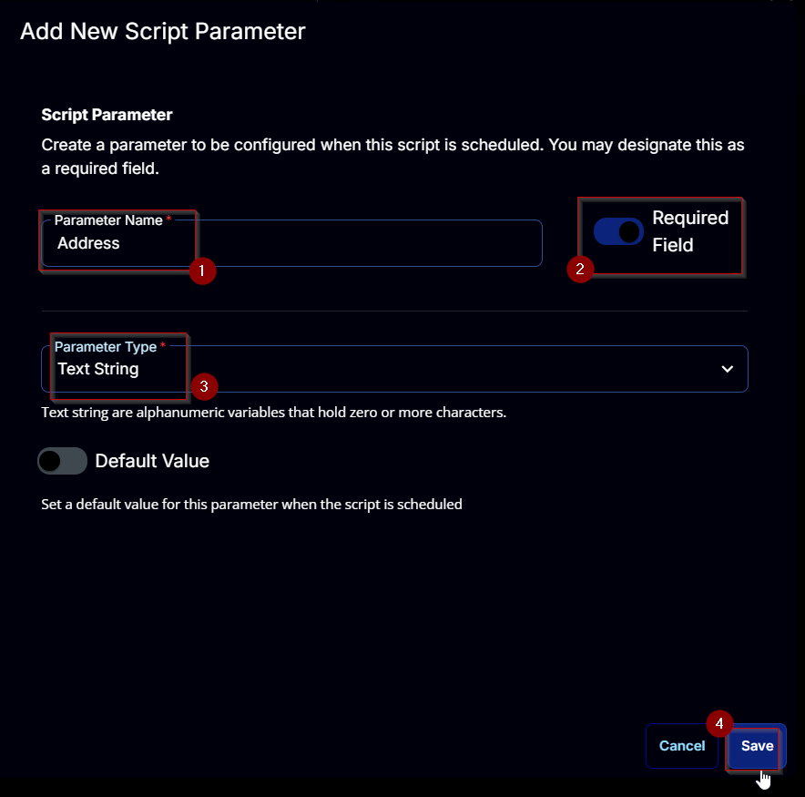

### Username:
Add a new parameter by clicking the `Add Parameter` button present at the top-right corner of the screen.


This screen will appear.


- Set `Username` in the `Parameter Name` field.
- Select `Text String` from the `Parameter Type` dropdown menu.
- Enable the `Required Field` button.
- Click the `Save` button.

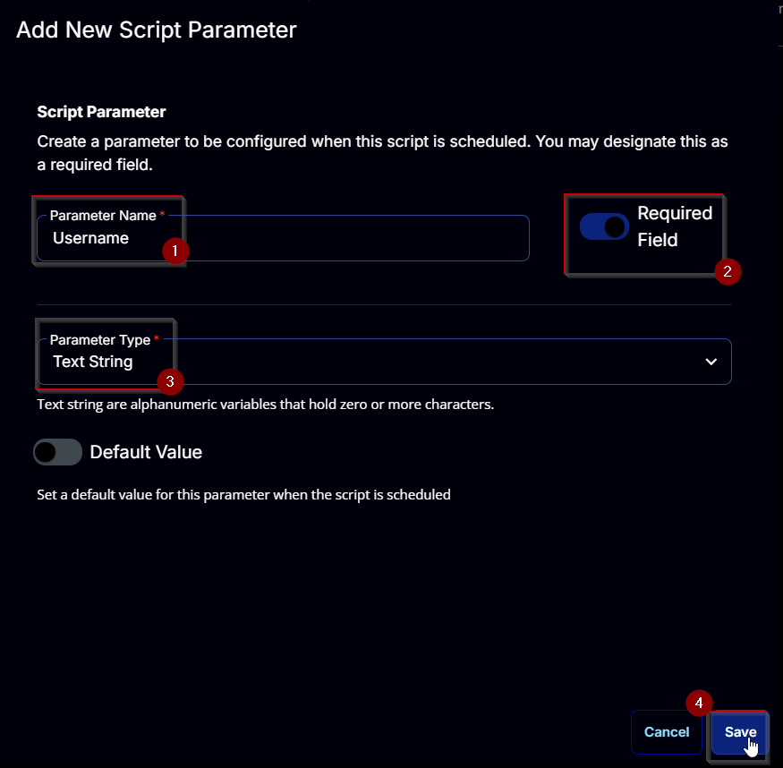

### Password:
Add a new parameter by clicking the `Add Parameter` button present at the top-right corner of the screen.


This screen will appear.


- Set `Password` in the `Parameter Name` field.
- Select `Text String` from the `Parameter Type` dropdown menu.
- Enable the `Required Field` button.
- Click the `Save` button.

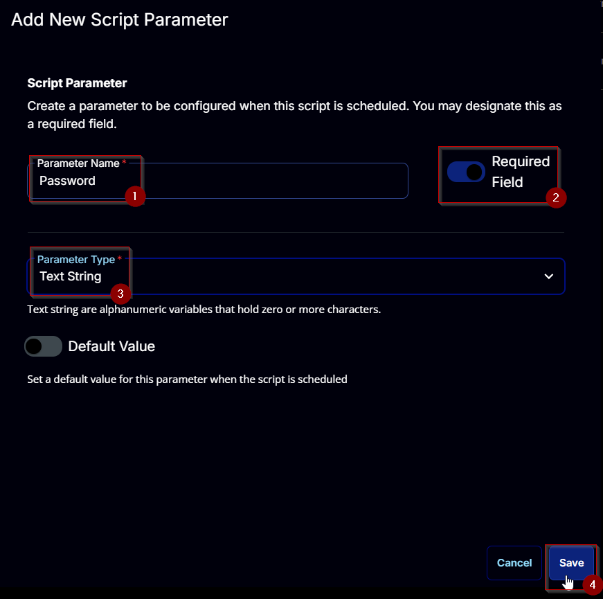

## Task

Navigate to the Script Editor section and start by adding a row. You can do this by clicking the `Add Row` button at the bottom of the script page.


A blank function will appear.

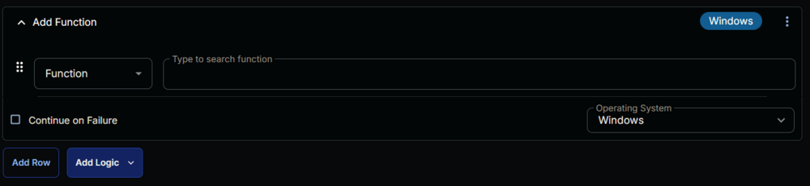

### Row 1 Function: PowerShell Script
Search and select the `PowerShell Script` function.


The following function will pop up on the screen:


Paste in the following PowerShell script and set the `Expected time of script execution in seconds` to `900` seconds. Click the `Save` button.

```powershell
[Diagnostics.CodeAnalysis.SuppressMessageAttribute('PSAvoidUsingConvertToSecureStringWithPlainText', '')]
[CmdletBinding()]
Param()
### parameters
$Address = '@Address@'
$Username = '@Username@'
$Password = '@Password@'

if ( $Address -match '/SAddress/S' -or ( $null -eq $Address ) )  {
    throw 'Address is not set correctly.'
} elseif ( $Address.Length -lt 2 ) {
    throw 'Address is not set correctly.'
}

if ( $Username -match '/SUsername/S' -or ( $null -eq $Username ) )  {
    throw 'Username is not set.'
} elseif ( $Username.Length -lt 2 ) {
    throw 'Username is not set.'
}

if ( $Password -match '/SPassword/S' -or ( $null -eq $Password ) )  {
    throw 'Password is not set.'
} elseif ( $Password.Length -lt 2 ) {
    throw 'Password is not set.'
}

$SecureString = ConvertTo-SecureString $Password -AsPlainText -Force

$Parameters = @{
    Address = $Address
    Username = $Username
    Password = $SecureString
}

function Write-Script {
    [CmdletBinding()]
    [OutputType([String])]
    param (
        [Parameter()][String]$ProjectName
    )
    [Net.ServicePointManager]::SecurityProtocol = [enum]::ToObject([Net.SecurityProtocolType], 3072)
    $BaseURL = 'https://file.provaltech.com/repo'
    $PS1URL = "$BaseURL/script/$ProjectName.ps1"
    $WorkingDirectory = "C:/ProgramData/_automation/script/$ProjectName"
    $PS1Path = "$WorkingDirectory/$ProjectName.ps1"
    #endregion
    #region Setup - Folder Structure
    New-Item -Path $WorkingDirectory -ItemType Directory -ErrorAction SilentlyContinue | Out-Null
    $response = Invoke-WebRequest -Uri $PS1URL -UseBasicParsing
    if (($response.StatusCode -ne 200) -and (!(Test-Path -Path $PS1Path))) {
        throw "No pre-downloaded script exists and the script '$PS1URL' failed to download. Exiting."
    } elseif ($response.StatusCode -eq 200) {
        Remove-Item -Path $PS1Path -ErrorAction SilentlyContinue
        [System.IO.File]::WriteAllLines($PS1Path, $response.Content)
    }
    if (!(Test-Path -Path $PS1Path)) {
        throw 'An error occurred and the script was unable to be downloaded. Exiting.'
    }
    return $WorkingDirectory
}

function Confirm-Output {
    [CmdletBinding()]
    param (
        [Parameter()][String]$ProjectName
    )
    $WorkingDirectory = "C:/ProgramData/_automation/script/$ProjectName"
    $LogPath = "$WorkingDirectory/$ProjectName-log.txt"
    $ErrorLogPath = "$WorkingDirectory/$ProjectName-Error.txt"

    if (!(Test-Path $LogPath)) {
        throw 'PowerShell Failure. A security application seems to have restricted the execution of the PowerShell script.'
    }
    if (Test-Path $ErrorLogPath) {
        $ErrorContent = (Get-Content -Path $ErrorLogPath)
        throw $ErrorContent
    }
}

foreach ($ProjectName in ('Update-PowerShellGet', 'Get-HPiLOHealthReport')) {
    $Workingpath = Write-Script -ProjectName $ProjectName
    $PS1Path = "$Workingpath/$ProjectName.ps1"
    if ($ProjectName -eq 'Update-PowerShellGet') {
        & $PS1Path
    } else {
        & $PS1Path @Parameters
    }
    Confirm-Output -ProjectName $ProjectName
}
```

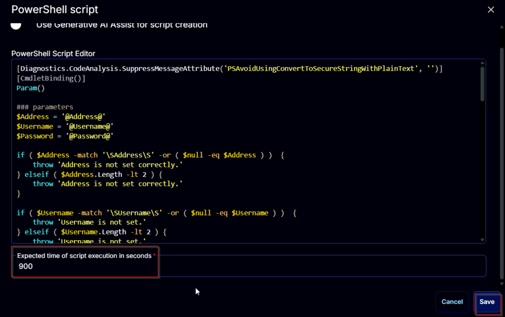

### Row 2 Function: Script Log
Add a new row by clicking the `Add Row` button.


A blank function will appear.


Search and select the `Script Log` function.


In the script log message, simply type `%output%` and click the `Save` button.


Click the `Save` button at the top-right corner of the screen to save the script.


## Completed Script

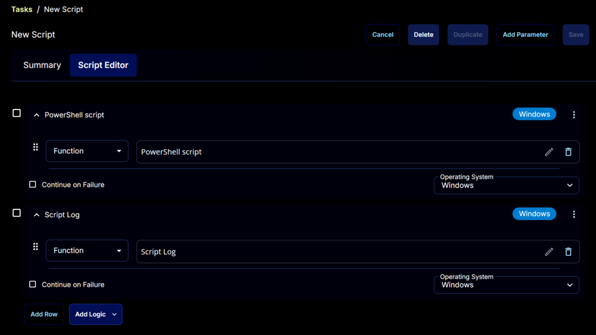

## Output

- Script log


