## Summary

Import a certificate to one or more local machine stores. The target certificate can be a .CER file, a .CRT file, or a self-signed cert that will be created.

CW RMM implementation of [Import-LMCertificate](https://proval.itglue.com/DOC-5078775-10363458) agnostic script.

## Sample Run

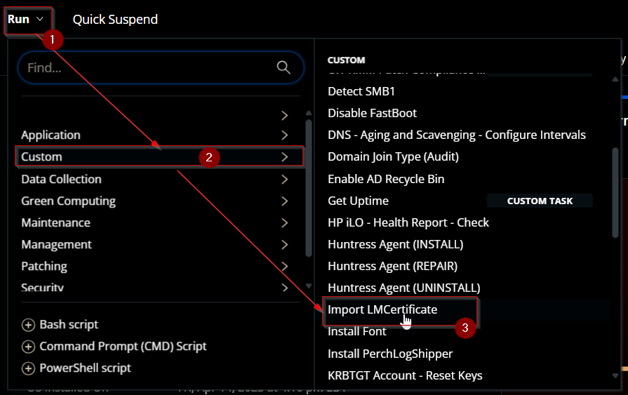

To create and import a self signed certificate:  
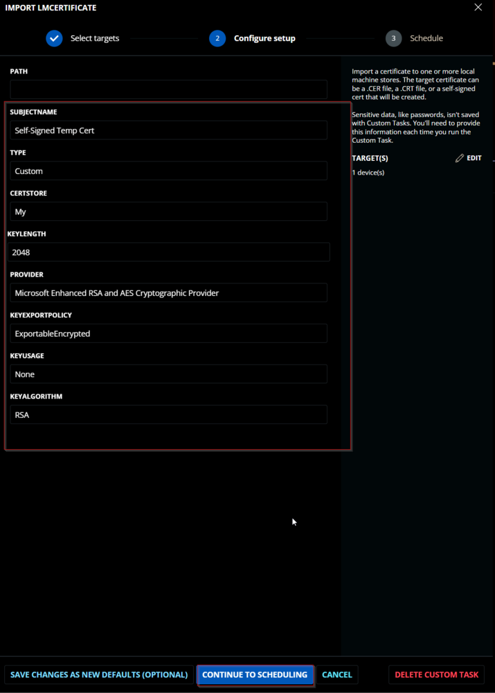

To import a certificate placed in local folder:  
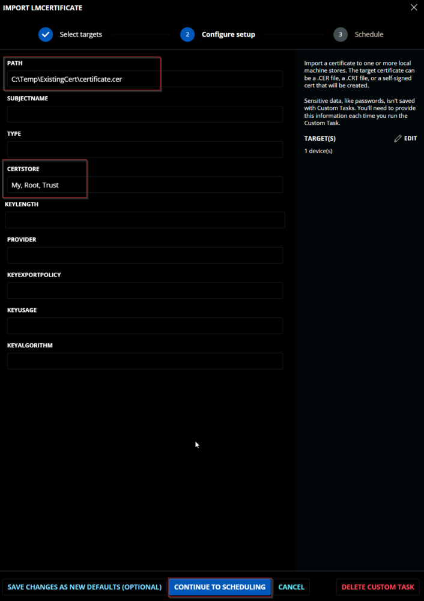  
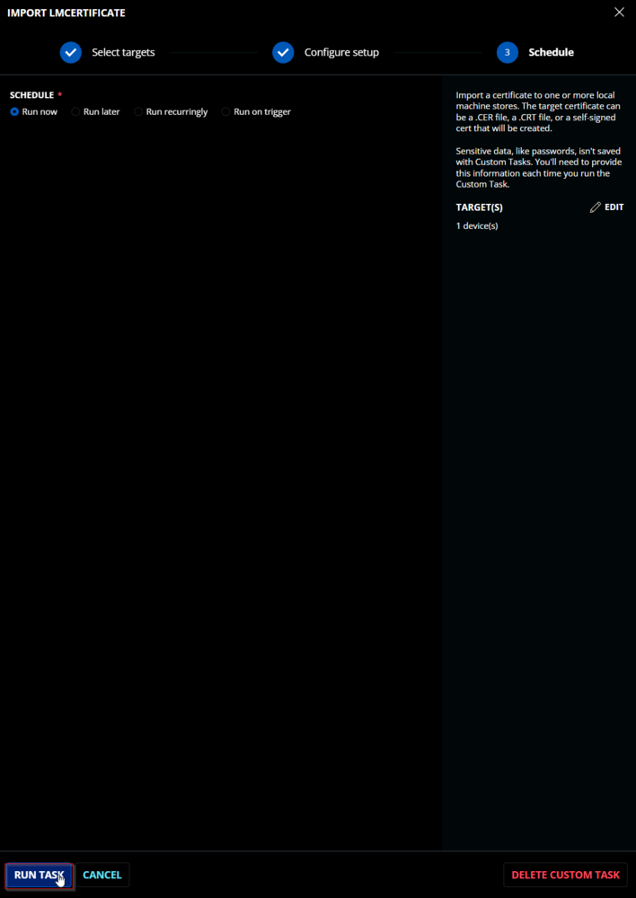

## Dependencies

[EPM - Windows Configuration - Import-LMCertificate](https://proval.itglue.com/DOC-5078775-10363458)

## User Parameters

### For Certificate Stored on Local Machine:

| Name      | Example                                   | Accepted Values                                                                                                                                                                                                                                 | Required | Default | Type        | Description                                             |
|-----------|-------------------------------------------|--------------------------------------------------------------------------------------------------------------------------------------------------------------------------------------------------------------------------------------------------|----------|---------|-------------|---------------------------------------------------------|
| Path      | C:/Users/MyUser/Downloads/ThisStrangeCert.cer | <br>                                                                                                                                                                                                                                             | True     | <br>   | Text String | The path to a certificate file to import.              |
| CertStore | My                                        | - My<br>- ROOT<br>- trust<br>- CA<br>- TrustedPublisher<br>- Disallowed<br>- AuthRoot<br>- TrustedPeople<br>- REQUEST<br>- SmartCardRoot<br>- AddressBook<br>- UserdDS                                                                           | True     | My      | Text String | The set of LocalMachine stores to store the target certificate in. |

### To Create and import a Self-Signed Certificate:

| Name            | Example          | Accepted Values                                                                 | Required | Default | Type        | Description                                             |
|-----------------|------------------|--------------------------------------------------------------------------------|----------|---------|-------------|---------------------------------------------------------|
| SubjectName     | ThisNewCert      | <br>                                                                          | True     | <br>   | Text String | The subject name for the created certificate.          |
| Type            | Custom           | - CodeSigningCert<br>- Custom<br>- DocumentEncryptionCert<br>- DocumentEncryptionCertLegacyCsp<br>- SSLServerAuthentication | True     | <br>   | Text String | The type of certificate to create.                     |
| CertStore       | My               | - My<br>- ROOT<br>- trust<br>- CA<br>- TrustedPublisher<br>- Disallowed<br>- AuthRoot<br>- TrustedPeople<br>- REQUEST<br>- SmartCardRoot<br>- AddressBook<br>- UserdDS | True     | My      | Text String | The set of LocalMachine stores to store the target certificate in. |
| KeyLength       | 2048             | KeyLength % 1024 = 0<br>Examples: 1024, 2048, 3072, 4096, 5120, 6144, 7168, 8192 | True     | 2048    | Number Value | The length of the key for the created certificate.      |
| Provider        | Microsoft Enhanced RSA and AES Cryptographic Provider | - Microsoft Base Cryptographic Provider v1.0<br>- Microsoft Base DSS and Diffie-Hellman Cryptographic Provider<br>- Microsoft Base DSS Cryptographic Provider<br>- Microsoft Base Smart Card Crypto Provider<br>- Microsoft DH SChannel Cryptographic Provider<br>- Microsoft Enhanced Cryptographic Provider v1.0<br>- Microsoft Enhanced DSS and Diffie-Hellman Cryptographic Provider<br>- Microsoft Enhanced RSA and AES Cryptographic Provider<br>- Microsoft RSA SChannel Cryptographic Provider<br>- Microsoft Strong Cryptographic Provider | True     | Microsoft Enhanced RSA and AES Cryptographic Provider | Text String | The provider for the created certificate.              |
| KeyExportPolicy  | ExportableEncrypted | - Exportable<br>- ExportableEncrypted<br>- NonExportable                       | True     | ExportableEncrypted | Text String | The export policy for the created certificate.         |
| KeyUsage        | None             | - CertSign<br>- CRLSign<br>- DataEncipherment<br>- DecipherOnly<br>- DigitalSignature<br>- EncipherOnly<br>- KeyAgreement<br>- KeyEncipherment<br>- None<br>- NonRepudiation | True     | None    | Text String | The Key Usage for a created certificate.               |
| KeyAlgorithm    | RSA              | - RSA<br>- ECDSA_nistP256<br>- ECDSA_nistP384<br>- ECDSA_brainpoolP256r1<br>- ECDSA_brainpoolP384r1<br>- ECDSA_brainpoolP512r1<br>- ECDSA_nistP192<br>- ECDSA_nistP224<br>- ECDSA_nistP521<br>- ECDSA_secP160k1<br>- ECDSA_secP160r1<br>- ECDSA_secP160r2<br>- ECDSA_secP192k1<br>- ECDSA_secP192r1<br>- ECDSA_secP224k1<br>- ECDSA_secP224r1<br>- ECDSA_secP256k1<br>- ECDSA_secP256r1<br>- ECDSA_secP384r1<br>- ECDSA_secP521r1<br>- ECDSA_brainpoolP160r1<br>- ECDSA_brainpoolP160t1<br>- ECDSA_brainpoolP192r1<br>- ECDSA_brainpoolP192t1<br>- ECDSA_brainpoolP224r1<br>- ECDSA_brainpoolP224t1<br>- ECDSA_brainpoolP256r1<br>- ECDSA_brainpoolP256t1<br>- ECDSA_brainpoolP320r1<br>- ECDSA_brainpoolP320t1<br>- ECDSA_brainpoolP384r1<br>- ECDSA_brainpoolP384t1<br>- ECDSA_brainpoolP512r1<br>- ECDSA_brainpoolP512t1<br>- ECDSA_ec192wapi<br>- ECDSA_nistP192<br>- ECDSA_nistP224<br>- ECDSA_nistP256<br>- ECDSA_nistP384<br>- ECDSA_nistP521<br>- ECDSA_secP160k1<br>- ECDSA_secP160r1<br>- ECDSA_secP160r2<br>- ECDSA_secP192k1<br>- ECDSA_secP192r1<br>- ECDSA_secP224k1<br>- ECDSA_secP224r1<br>- ECDSA_secP256k1<br>- ECDSA_secP256r1<br>- ECDSA_secP384r1<br>- ECDSA_secP521r1<br>- ECDSA_wtls7<br>- ECDSA_wtls9<br>- ECDSA_wtls12<br>- ECDSA_x962P192v1<br>- ECDSA_x962P192v2<br>- ECDSA_x962P192v3<br>- ECDSA_x962P239v1<br>- ECDSA_x962P239v2<br>- ECDSA_x962P239v3<br>- ECDSA_x962P256v1 | True     | RSA     | Text String | The Key Algorithm for the created certificate.        |

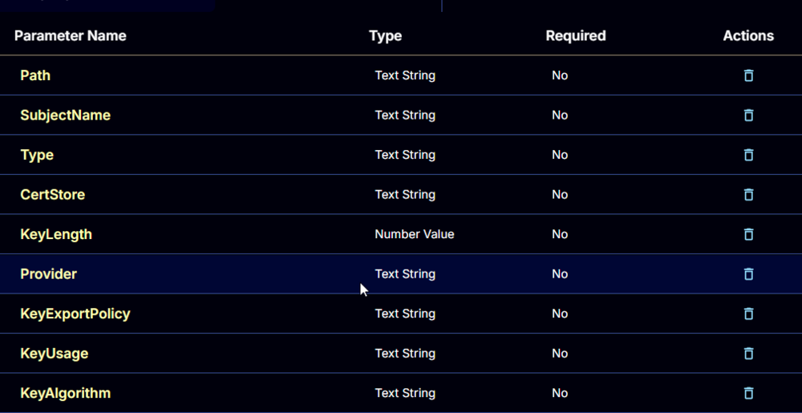

## Task Creation

Create a new `Script Editor` style script in the system to implement this Task.  
  


**Name:** `Import LMCertificate`  
**Description:** `Import a certificate to one or more local machine stores. The target certificate can be a .CER file, a .CRT file, or a self-signed cert that will be created.`  
**Category:** `Custom`  
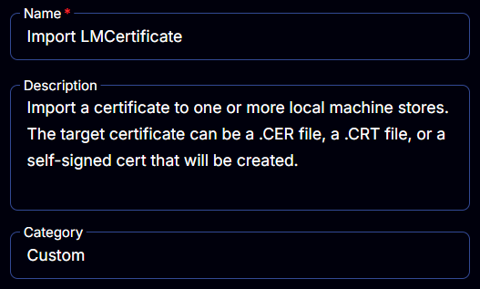

## Parameters

### Path:

Add a new parameter by clicking the `Add Parameter` button present at the top-right corner of the screen.  


This screen will appear.  


- Set `Path` in the `Parameter Name` field.
- Select `Text String` from the `Parameter Type` dropdown menu.
- Click the `Save` button.

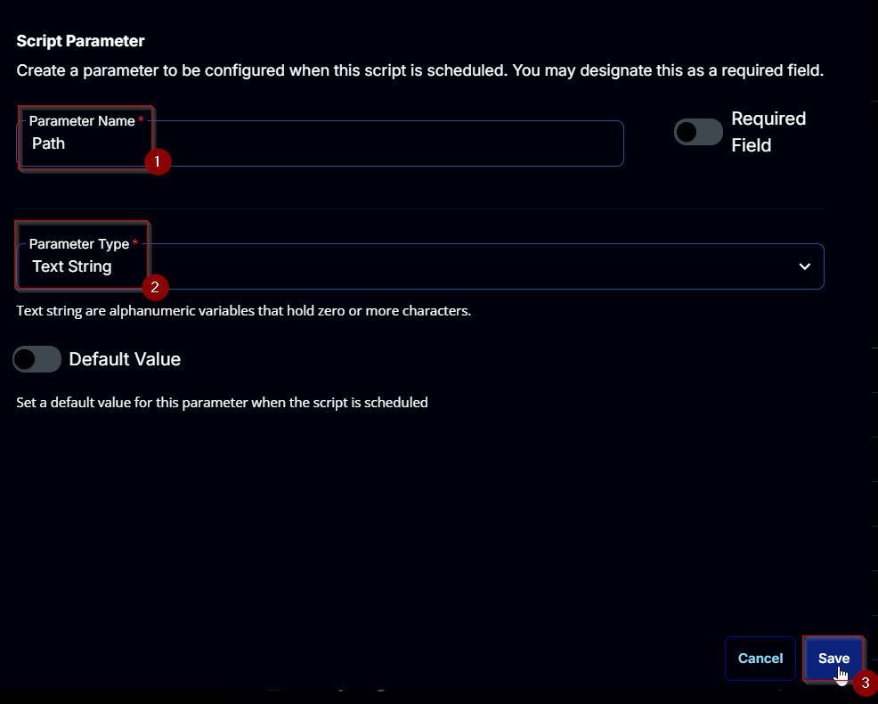

### SubjectName:

Add a new parameter by clicking the `Add Parameter` button present at the top-right corner of the screen.  


This screen will appear.  


- Set `SubjectName` in the `Parameter Name` field.
- Select `Text String` from the `Parameter Type` dropdown menu.
- Click the `Save` button.

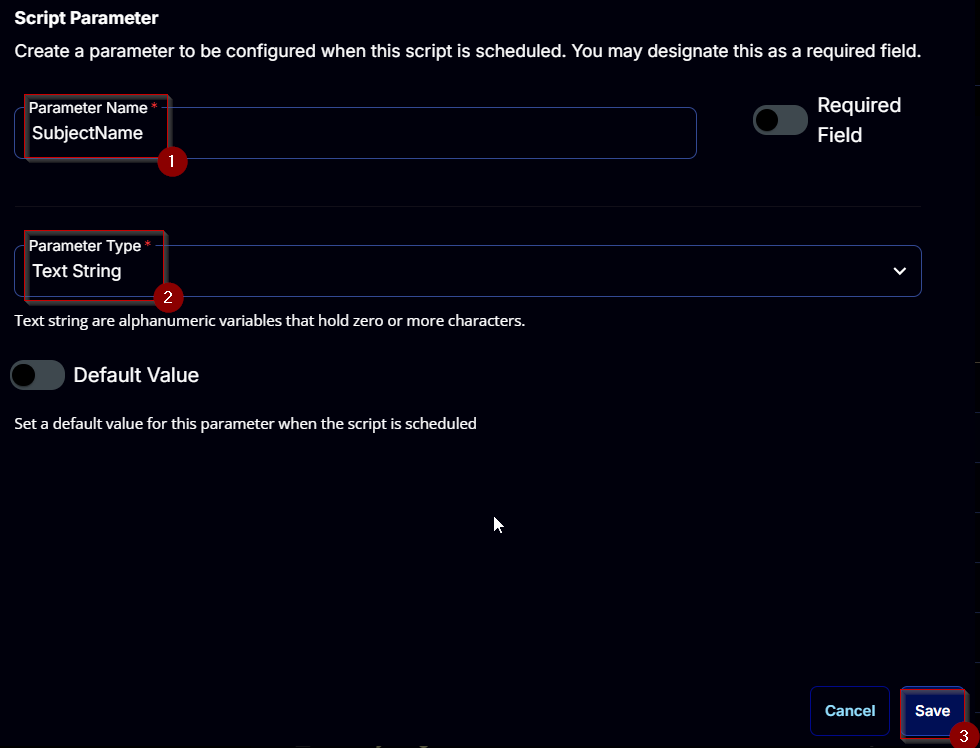

### Type:

Add a new parameter by clicking the `Add Parameter` button present at the top-right corner of the screen.  


This screen will appear.  


- Set `Type` in the `Parameter Name` field.
- Select `Text String` from the `Parameter Type` dropdown menu.
- Click the `Save` button.

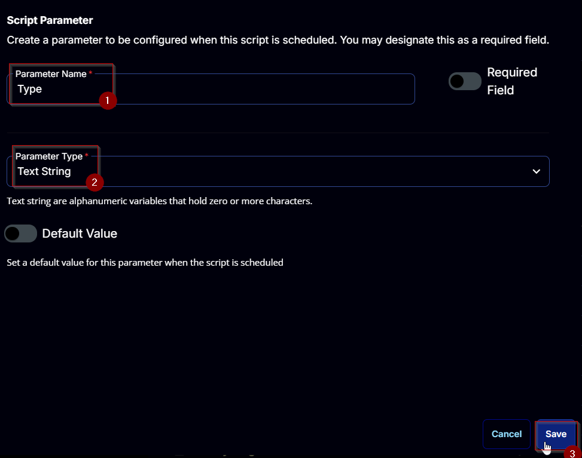

### CertStore:

Add a new parameter by clicking the `Add Parameter` button present at the top-right corner of the screen.  


This screen will appear.  


- Set `CertStore` in the `Parameter Name` field.
- Select `Text String` from the `Parameter Type` dropdown menu.
- Enable the `Default Value` button.
- Set `My` in the `Value` field.
- Click the `Save` button.

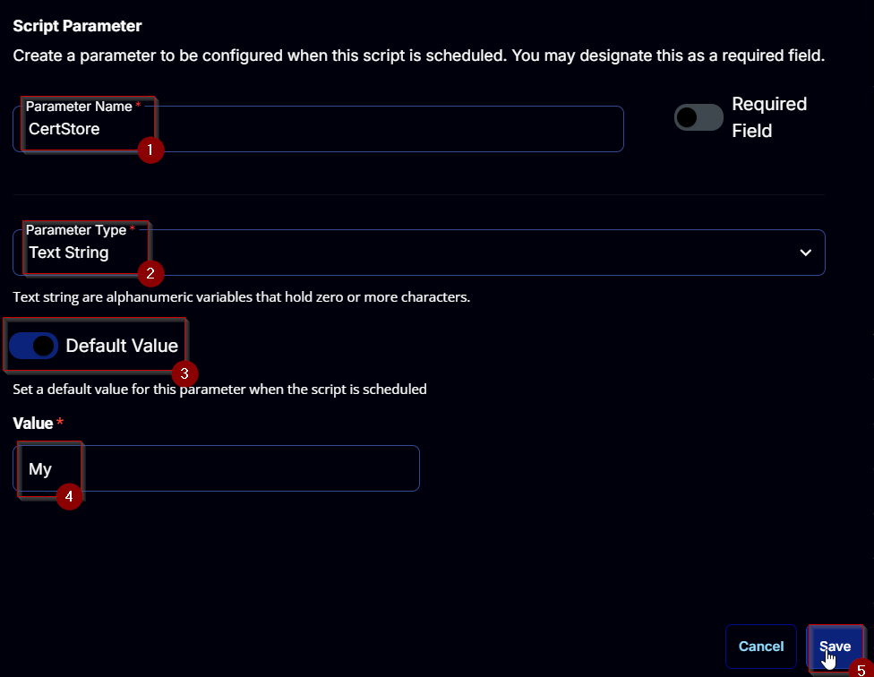

### KeyLength:

Add a new parameter by clicking the `Add Parameter` button present at the top-right corner of the screen.  


This screen will appear.  


- Set `KeyLength` in the `Parameter Name` field.
- Select `Number Value` from the `Parameter Type` dropdown menu.
- Enable the `Default Value` button.
- Set `2048` in the `Value` field.
- Click the `Save` button.


### Provider:

Add a new parameter by clicking the `Add Parameter` button present at the top-right corner of the screen.  


This screen will appear.  


- Set `Provider` in the `Parameter Name` field.
- Select `Text String` from the `Parameter Type` dropdown menu.
- Enable the `Default Value` button.
- Set `Microsoft Enhanced RSA and AES Cryptographic Provider` in the `Value` field.
- Click the `Save` button.

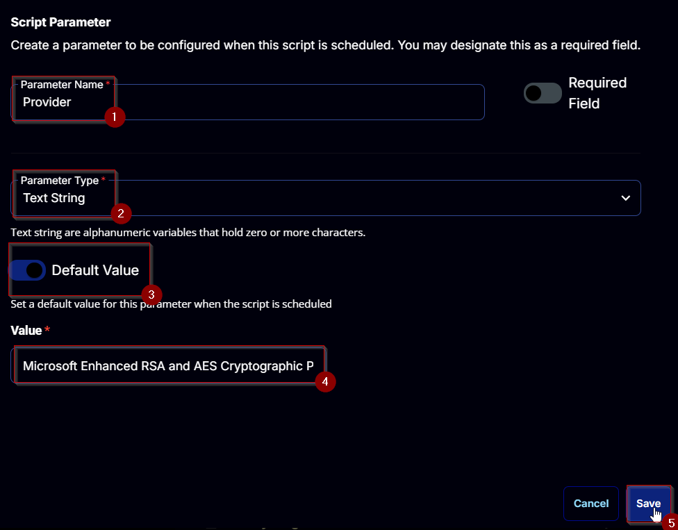

### KeyExportPolicy:

Add a new parameter by clicking the `Add Parameter` button present at the top-right corner of the screen.  


This screen will appear.  


- Set `KeyExportPolicy` in the `Parameter Name` field.
- Select `Text String` from the `Parameter Type` dropdown menu.
- Enable the `Default Value` button.
- Set `ExportableEncrypted` in the `Value` field.
- Click the `Save` button.

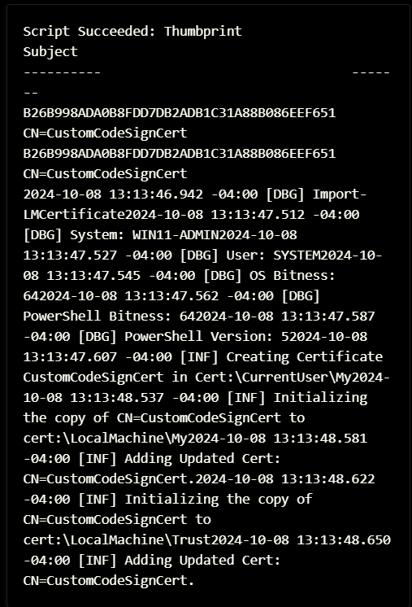

### KeyUsage:

Add a new parameter by clicking the `Add Parameter` button present at the top-right corner of the screen.  


This screen will appear.  


- Set `KeyUsage` in the `Parameter Name` field.
- Select `Text String` from the `Parameter Type` dropdown menu.
- Enable the `Default Value` button.
- Set `None` in the `Value` field.
- Click the `Save` button.

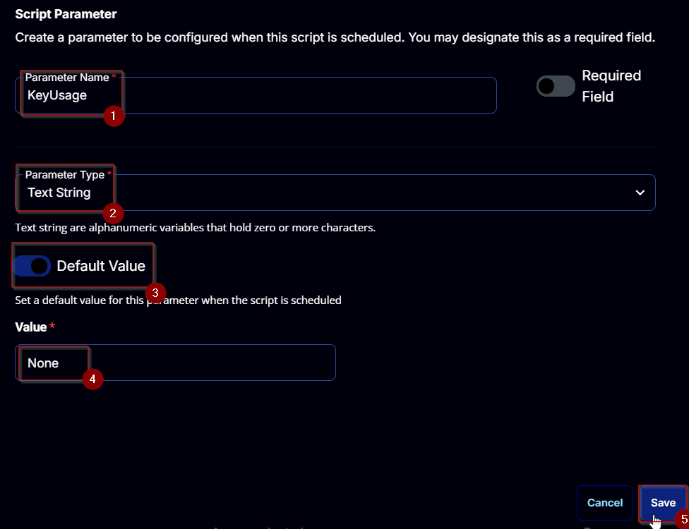

### KeyAlgorithm:

Add a new parameter by clicking the `Add Parameter` button present at the top-right corner of the screen.  


This screen will appear.  


- Set `KeyAlgorithm` in the `Parameter Name` field.
- Select `Text String` from the `Parameter Type` dropdown menu.
- Enable the `Default Value` button.
- Set `RSA` in the `Value` field.
- Click the `Save` button.

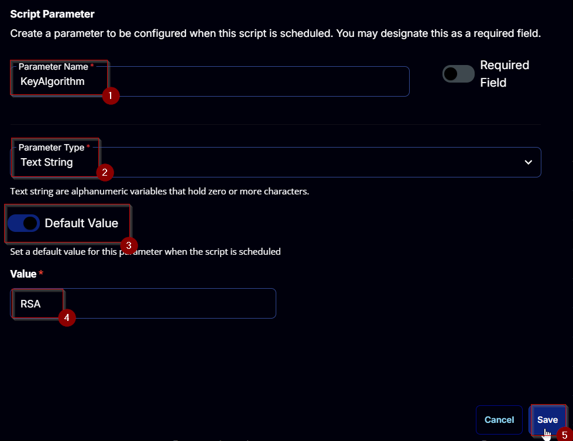

## Task

Navigate to the Script Editor Section and start by adding a row. You can do this by clicking the `Add Row` button at the bottom of the script page.  


A blank function will appear.  


### Row 1 Function: PowerShell Script

Search and select the `PowerShell Script` function.  
  


The following function will pop up on the screen:  


Paste in the following PowerShell script and set the `Expected time of script execution in seconds` to `300` seconds. Click the `Save` button.

```
#region parameters
$path = '@Path@'
$subjectName = '@SubjectName@'
$type = '@Type@'
$certStore = '@CertStore@'
$keyLength = '@KeyLength@'
$provider = '@Provider@'
$keyExportPolicy = '@KeyExportPolicy@'
$keyUsage = '@KeyUsage@'
$keyAlgorithm = '@KeyAlgorithm@'
$Parameters = @{}
if ( $path -match '://' ) {
    $Parameters.Add('Path', $path)
} elseif ( ($subjectName -NotMatch '/SSubjectName/S') -and ($subjectName -match '[A-z0-9_]') ) {
    $Parameters.Add('SubjectName', $subjectName)
    if ( $type -in ('CodeSigningCert', 'Custom', 'DocumentEncryptionCert', 'DocumentEncryptionCertLegacyCsp', 'SSLServerAuthentication') ) {
        $Parameters.Add('Type', $type)
    } else {
        throw 'Supported Types for a Selft Signed Certificate are: ''CodeSigningCert'', ''Custom'', ''DocumentEncryptionCert'', ''DocumentEncryptionCertLegacyCsp'', ''SSLServerAuthentication''.'
    }
    if ( ($keyLength -notmatch '^[0-9]{4,}$') -or ([String]::IsNullOrWhiteSpace($keyLength)) ) {
        $keyLength = 2048
    } elseif ( $keyLength % 1024 -ne 0) {
        $keyLength = 2048
    }
    $Parameters.Add('KeyLength', $keyLength)
    if ( [String]::IsNullOrWhiteSpace($provider) ) {
        $provider = 'Microsoft Enhanced RSA and AES Cryptographic Provider'
    } elseif ( !((Get-ChildItem 'HKLM:/SOFTWARE/Microsoft/Cryptography/Defaults/Provider').PSChildName -contains $provider) ) {
        $provider = 'Microsoft Enhanced RSA and AES Cryptographic Provider'
    }
    $Parameters.Add('Provider', $provider)
    if ( $keyExportPolicy -notin ('Exportable', 'ExportableEncrypted', 'NonExportable') ) {
        $keyExportPolicy = 'ExportableEncrypted'
    }
    $Parameters.Add('KeyExportPolicy', $keyExportPolicy)
    if ( $keyUsage -notin ('CertSign', 'CRLSign', 'DataEncipherment', 'DecipherOnly', 'DigitalSignature', 'EncipherOnly', 'KeyAgreement', 'KeyEncipherment', 'None', 'NonRepudiation') ) {
        $keyUsage = 'None'
    }
    $Parameters.Add('KeyUsage', $keyUsage)
    $ecdsaList = ((certutil -displayEccCurve | Select-String -Pattern '/d+/.').Line | Select-String -Pattern '.*?/s').Matches.Value | ForEach-Object { "ECDSA_$($_.Trim())" }
    if ( [String]::IsNullOrWhiteSpace($keyAlgorithm)  ) {
        $KeyAlgorithm = 'RSA'
    } elseif ( !($ecdsaList -contains $KeyAlgorithm) ) {
        $KeyAlgorithm = 'RSA'
    }
    $Parameters.Add('KeyAlgorithm', $keyAlgorithm)
} else {
    throw 'Invalid input parameters. Either the ''SubjectName'' for the Self Signed Certificate or the ''Path'' to the Certificate must be provided.'
}
```

```
if ( ($certStore -match '/SCertStore/S') -or ([String]::IsNullOrWhiteSpace($certStore)) ) {
    $stores = 'My'
} else {
    $certstore = $($certstore -split ',').trim()
    $stores = @()
    foreach ($store in $certstore) {
        if ( ('My', 'ROOT', 'trust', 'CA', 'TrustedPublisher', 'Disallowed', 'AuthRoot', 'TrustedPeople', 'REQUEST', 'SmartCardRoot', 'AddressBook', 'UserdDS') -contains $store ) {
            $stores += $store
        }
    }
    if ( !($stores) ) {
        $stores = 'My'
    }
}
$Parameters.Add('CertStore', $stores)
```

```
#region Setup - Variables
$ProjectName = 'Import-LMCertificate'
[Net.ServicePointManager]::SecurityProtocol = [enum]::ToObject([Net.SecurityProtocolType], 3072)
$BaseURL = 'https://file.provaltech.com/repo'
$PS1URL = "$BaseURL/script/$ProjectName.ps1"
$WorkingDirectory = "C:/ProgramData/_automation/script/$ProjectName"
$PS1Path = "$WorkingDirectory/$ProjectName.ps1"
$WorkingPath = $WorkingDirectory
$LogPath = "$WorkingDirectory/$ProjectName-log.txt"
$ErrorLogPath = "$WorkingDirectory/$ProjectName-Error.txt"
#endregion
#region Setup - Folder Structure
New-Item -Path $WorkingDirectory -ItemType Directory -ErrorAction SilentlyContinue | Out-Null
$response = Invoke-WebRequest -Uri $PS1URL -UseBasicParsing
if (($response.StatusCode -ne 200) -and (!(Test-Path -Path $PS1Path))) {
    throw "No pre-downloaded script exists and the script '$PS1URL' failed to download. Exiting."
} elseif ($response.StatusCode -eq 200) {
    Remove-Item -Path $PS1Path -ErrorAction SilentlyContinue
    [System.IO.File]::WriteAllLines($PS1Path, $response.Content)
}
if (!(Test-Path -Path $PS1Path)) {
    throw 'An error occurred and the script was unable to be downloaded. Exiting.'
}
#endregion
#region Execution
if ($Parameters) {
    & $PS1Path @Parameters
} else {
    & $PS1Path
}
#endregion
#region log verification
if ( !(Test-Path $LogPath) ) {
    throw 'PowerShell Failure. A Security application seems to have restricted the execution of the PowerShell Script.'
}
if ( Test-Path $ErrorLogPath ) {
    $ErrorContent = ( Get-Content -Path $ErrorLogPath )
    throw $ErrorContent
}
Get-Content -Path $LogPath
#endregion
```

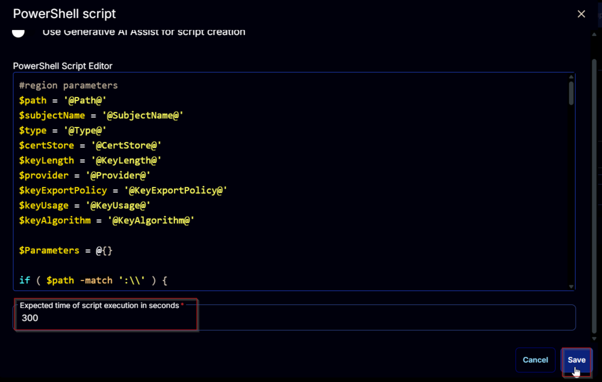

### Row 2 Function: Script Log

Add a new row by clicking the `Add Row` button.  


A blank function will appear.  


Search and select the `Script Log` function.  


The following function will pop up on the screen:  


In the script log message, simply type `%Output%` and click the `Save` button  


Click the `Save` button at the top-right corner of the screen to save the script.  


## Completed Task


## Output

- Script Log  


