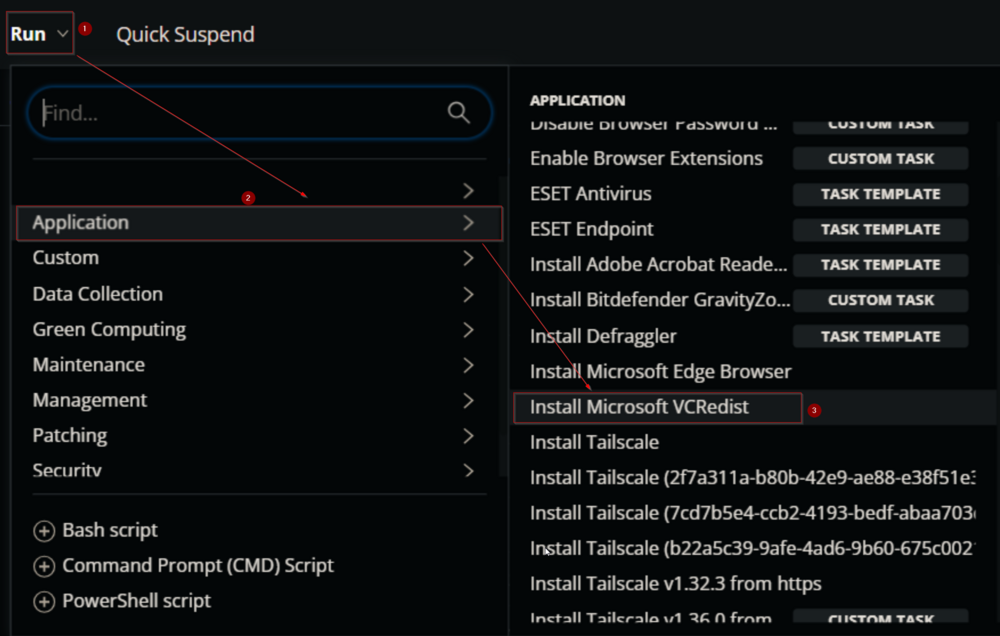
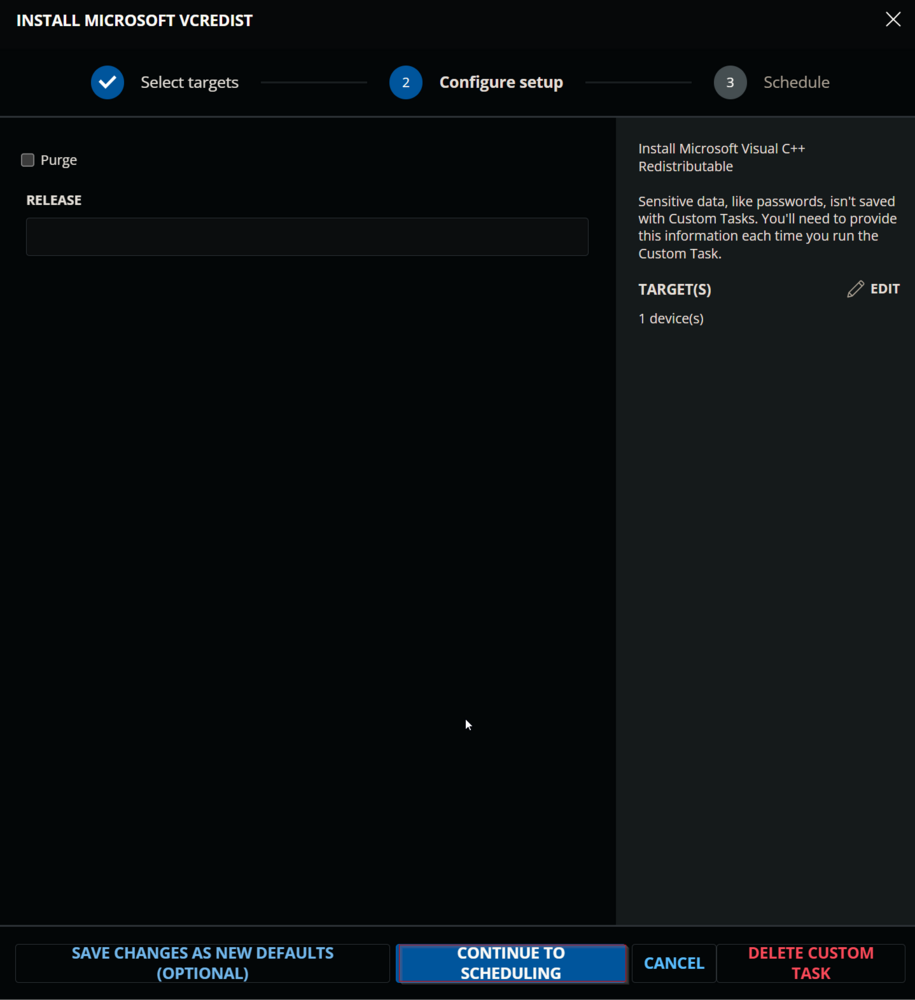
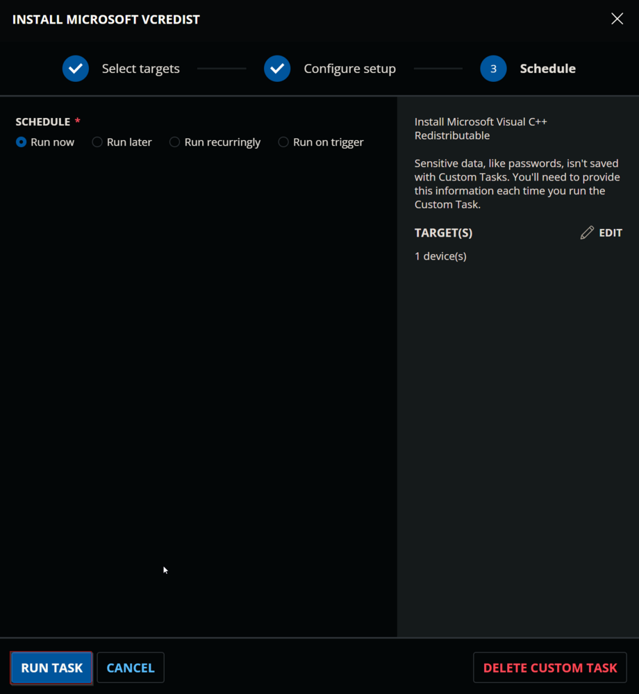
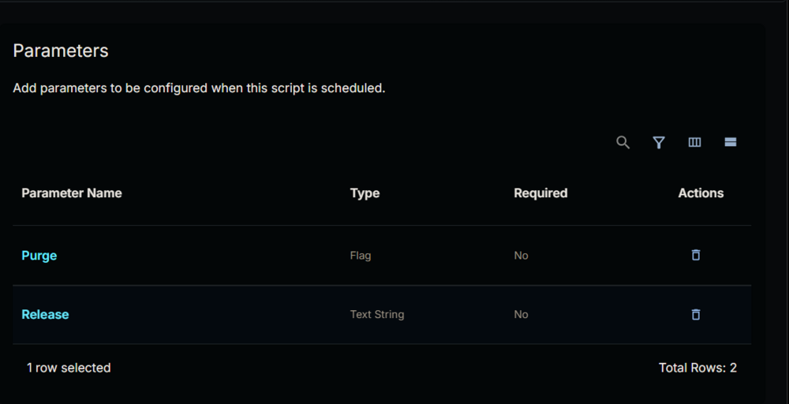
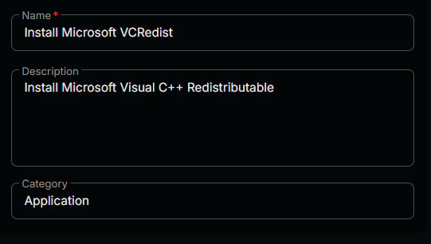
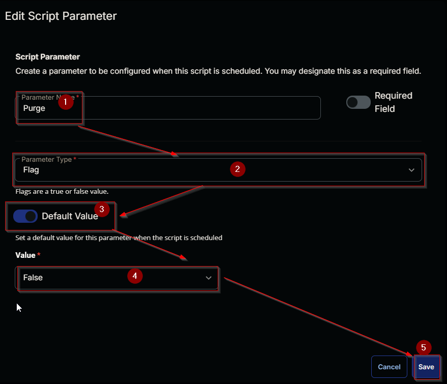
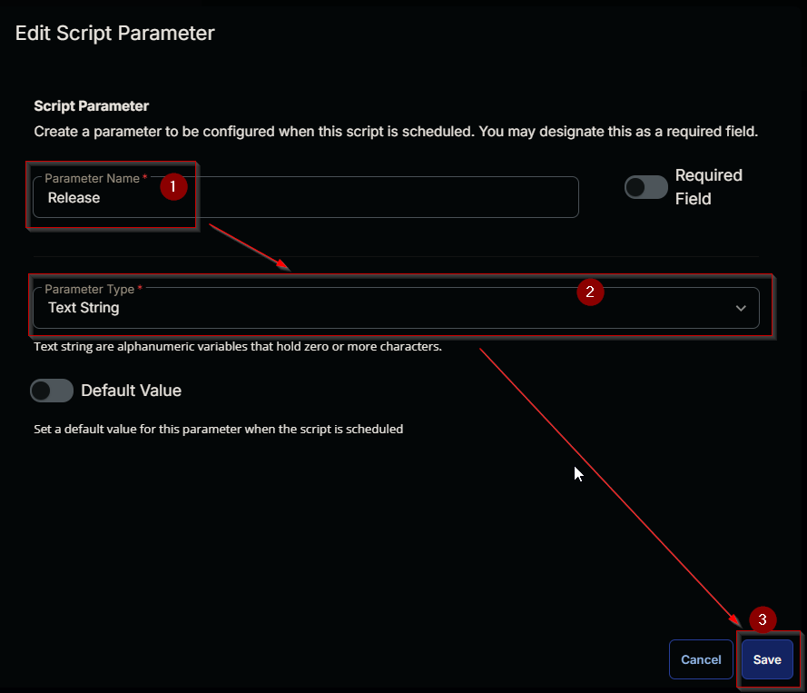
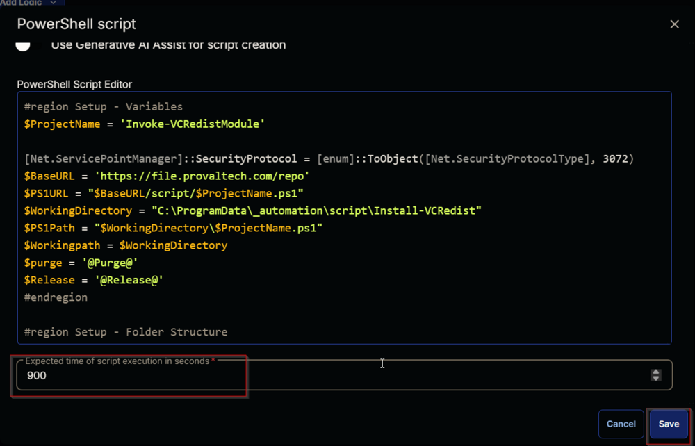
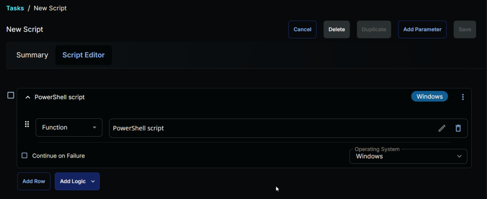

## Summary

A CW RMM implementation of the [Invoke-VcRedistModule](https://proval.itglue.com/DOC-5078775) agnostic script to install Microsoft Visual C++ Redistributable. By default, the task will install the supported redistributable unless a user parameter is set.

## Sample Run

  
  
  

#### User Parameters

| Name     | Example               | Required | Description                                                           |
|----------|-----------------------|----------|-----------------------------------------------------------------------|
| Release  | 20192012,2013,2022    | False    | Set the release id(s) of the Redistributable to install.            |
| Purge    |                       | False    | Flagging this parameter will remove the unsupported Redistributable and install the supported Redistributable. |

  

## Task Creation

Create a new `Script Editor` style script in the system to implement this Task.  
  
  

**Name:** Install Microsoft VCRedist  
**Description:** Install Microsoft Visual C++ Redistributable  
**Category:** Application  

  

### Parameters

Add a new parameter by clicking the `Add Parameter` button present at the top-right corner of the screen.  
  

This screen will appear.  
  

- Set `purge` in the `Parameter Name` field.
- Select `Flag` from the `Parameter Type` dropdown menu.
- Enable the `Default Value` option.
- Select `False` from the `Value` dropdown menu.
- Click the `Save` button.  
  
- It will ask for confirmation to proceed. Click the `Confirm` button to create the parameter.  
  

Add another parameter by clicking the `Add Parameter` button present at the top-right corner of the screen.  
  

This screen will appear.  
  

- Set `Release` in the `Parameter Name` field.
- Select `Text String` from the `Parameter Type` dropdown menu.
- Click the `Save` button.  
  
- It will ask for confirmation to proceed. Click the `Confirm` button to create the parameter.  
  

### Task

Navigate to the Script Editor Section and start by adding a row. You can do this by clicking the `Add Row` button at the bottom of the script page.  
  

A blank function will appear.  
  

#### Row 1 Function: PowerShell Script

Search and select the `PowerShell Script` function.  
  
  

The following function will pop up on the screen:  
  

Paste in the following PowerShell script and set the expected time of script execution to `900` seconds. Click the `Save` button.

```powershell
#region Setup - Variables
$ProjectName = 'Invoke-VCRedistModule'
[Net.ServicePointManager]::SecurityProtocol = [enum]::ToObject([Net.SecurityProtocolType], 3072)
$BaseURL = 'https://file.provaltech.com/repo'
$PS1URL = "$BaseURL/script/$ProjectName.ps1"
$WorkingDirectory = "C:/ProgramData/_automation/script/Install-VCRedist"
$PS1Path = "$WorkingDirectory/$ProjectName.ps1"
$Workingpath = $WorkingDirectory
$purge = '@Purge@'
$Release = '@Release@'
#endregion

#region Setup - Folder Structure
mkdir -Path $WorkingDirectory -ErrorAction SilentlyContinue | Out-Null
$response = Invoke-WebRequest -Uri $PS1URL -UseBasicParsing
if (($response.StatusCode -ne 200) -and (!(Test-Path -Path $PS1Path))) {
    Write-Error -Message "No pre-downloaded script exists and the script '$PS1URL' failed to download. Exiting."
    return
} elseif ($response.StatusCode -eq 200) {
    Remove-Item -Path $PS1Path -ErrorAction SilentlyContinue
    [System.IO.File]::WriteAllLines($PS1Path, $response.Content)
}
if (!(Test-Path -Path $PS1Path)) {
    Write-Error -Message 'An error occurred and the script was unable to be downloaded. Exiting.'
    return
}
#endregion

#region Execution
if ( $purge -and $purge -NotMatch 'Purge' -and $purge -match '1|(Yes)|(True)' ) {
    & $PS1Path -purge -Force
} elseif ( $Release -and $Release -NotMatch 'Release' -and $Release -match '[0-9]' ) {
    & $PS1Path -Release @Release@ -Force
} else {
    & $PS1Path -Install -Supported -Force
}
#endregion
```

  

Click the `Save` button at the top-right corner of the screen to save the script.  
  

## Completed Task

  

## Output

- Script Log
