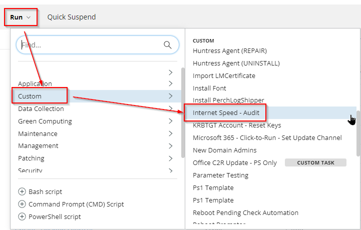
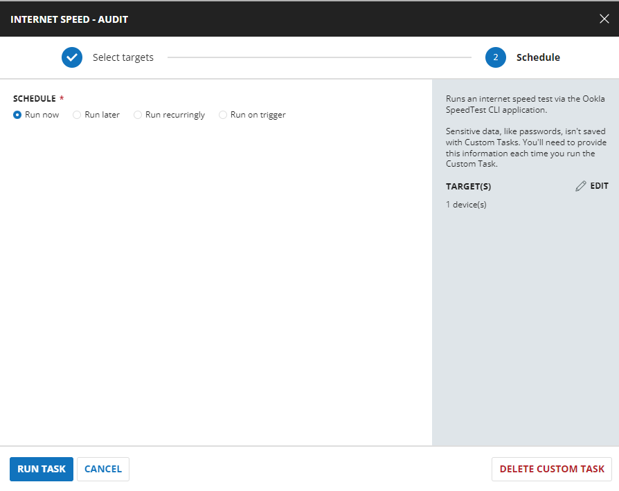

## Summary

This document describes how to run an internet speed test using the Ookla SpeedTest CLI application.

## Sample Run





## Dependencies

[Download Test-InternetSpeed.ps1](https://file.provaltech.com/repo/script/Test-InternetSpeed.ps1)

## Task Creation

Create a new `Script Editor` style script in the system to implement this task.


**Name:** Internet Speed - Audit  
**Description:** Runs an internet speed test via the Ookla SpeedTest CLI application.  
**Category:** Custom  


## Task

Navigate to the Script Editor section and start by adding a row. You can do this by clicking the `Add Row` button at the bottom of the script page.


A blank function will appear.


### Row 1 Function: PowerShell Script

Search and select the `PowerShell Script` function.


The following function will pop up on the screen:


Paste in the following PowerShell script and set the expected time of script execution to `600` seconds. Click the `Save` button.

```
#region Setup - Variables
$ProjectName = 'Test-InternetSpeed'
[Net.ServicePointManager]::SecurityProtocol = [enum]::ToObject([Net.SecurityProtocolType], 3072)
$BaseURL = 'https://file.provaltech.com/repo'
$PS1URL = "$BaseURL/script/$ProjectName.ps1"
$WorkingDirectory = "C:/ProgramData/_automation/script/$ProjectName"
$PS1Path = "$WorkingDirectory/$ProjectName.ps1"
$Workingpath = $WorkingDirectory
$LogPath = "$WorkingDirectory/$ProjectName-log.txt"
$ErrorLogPath = "$WorkingDirectory/$ProjectName-Error.txt"
#endregion
#region Setup - Folder Structure
New-Item -Path $WorkingDirectory -ItemType Directory -ErrorAction SilentlyContinue | Out-Null
$response = Invoke-WebRequest -Uri $PS1URL -UseBasicParsing
if (($response.StatusCode -ne 200) -and (!(Test-Path -Path $PS1Path))) {
    throw "No pre-downloaded script exists and the script '$PS1URL' failed to download. Exiting."
} elseif ($response.StatusCode -eq 200) {
    Remove-Item -Path $PS1Path -ErrorAction SilentlyContinue
    [System.IO.File]::WriteAllLines($PS1Path, $response.Content)
}
if (!(Test-Path -Path $PS1Path)) {
    throw 'An error occurred and the script was unable to be downloaded. Exiting.'
}
```

```
$result = & $PS1Path 2>$null 6>$null
if($result.DownloadMbps) {
    return "(
    '$([DateTime]::Parse($result.timestamp).ToString('yyyy-MM-dd HH:mm:ss'))',
    $($result.ping.jitter),
    $($result.ping.latency),
    $($result.download.bandwidth),
    $($result.download.bytes),
    $($result.download.elapsed),
    $($result.upload.bandwidth),
    $($result.upload.bytes),
    $($result.upload.elapsed),
    $(if($result.packetloss) {$result.packetloss} else {0}),
    '$($result.isp)',
    '$($result.interface.internalIp)',
    '$($result.interface.macAddr)',
    $([int][bool]$result.interface.isVpn),
    '$($result.interface.externalIp)',
    '$($result.server.host)',
    '$($result.server.name)',
    '$($result.server.location)',
    '$($result.server.country)',
    '$($result.server.ip)',
    '$($result.result.id)',
    '$($result.result.url)',
    $($result.downloadMbps),
    $($result.uploadMbps)
    )"
}
```

### Row 2: Function: Script Log

In the script log message, simply type `%output%` so that the script will send the results of the PowerShell script above to the output on the Automation tab for the target device.


## Completed Task


## Output

- Script Log
