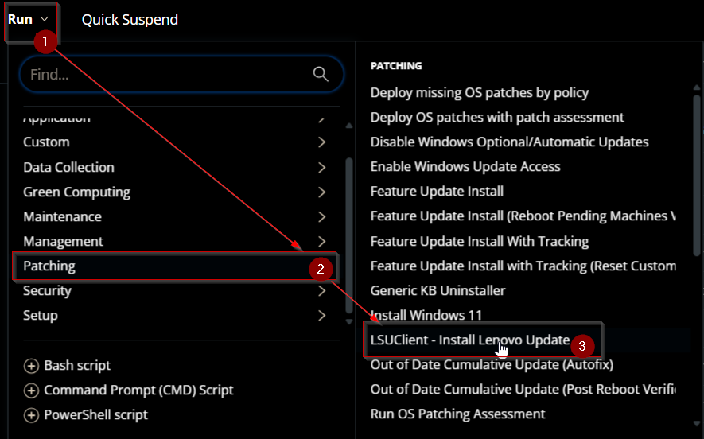
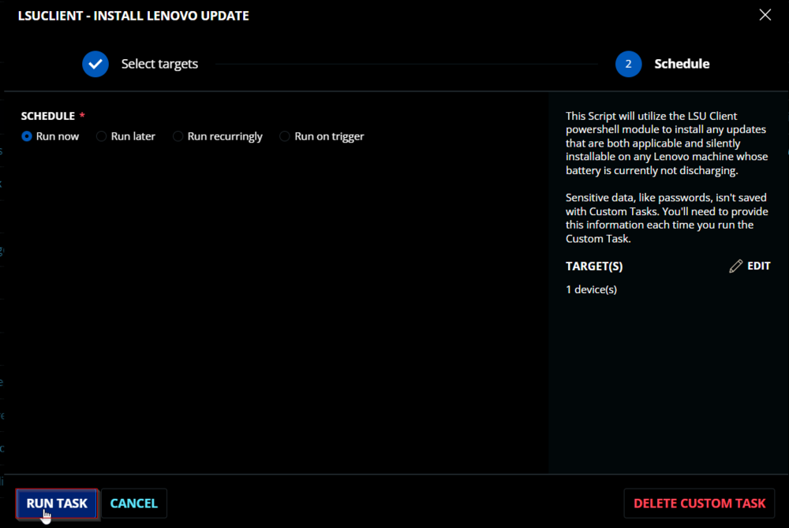
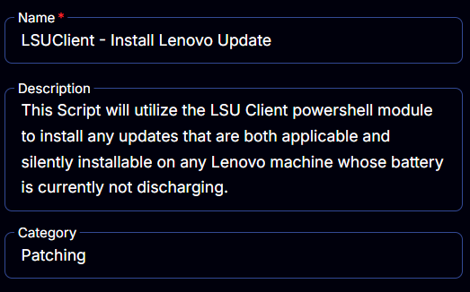
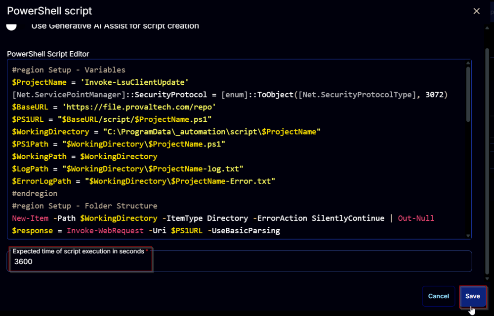

## Summary

This Script will utilize the LSU Client powershell module to install any updates that are both applicable and silently installable on any Lenovo machine whose battery is currently not discharging.

CW RMM implementation of [Invoke-LSUClientUpdate](https://proval.itglue.com/DOC-5078775-11429402) agnostic script.

## Sample Run





## Dependencies

[EPM - Vendor Specific - Agnostic - Invoke-LSUClientUpdate](https://proval.itglue.com/DOC-5078775-11429402)

## Task Creation

Create a new `Script Editor` style script in the system to implement this Task.


**Name:** `LSUClient - Install Lenovo Update`

**Description:** `This Script will utilize the LSU Client powershell module to install any updates that are both applicable and silently installable on any Lenovo machine whose battery is currently not discharging.`

**Category:** `Patching`



## Task

Navigate to the Script Editor Section and start by adding a row. You can do this by clicking the `Add Row` button at the bottom of the script page.


A blank function will appear.


### Row 1 Function: PowerShell Script

Search and select the `PowerShell Script` function.


The following function will pop up on the screen:


Paste in the following PowerShell script and set the `Expected time of script execution in seconds` to `3600` seconds. Click the `Save` button.

```
#region Setup - Variables
$ProjectName = 'Invoke-LsuClientUpdate'
[Net.ServicePointManager]::SecurityProtocol = [enum]::ToObject([Net.SecurityProtocolType], 3072)
$BaseURL = 'https://file.provaltech.com/repo'
$PS1URL = "$BaseURL/script/$ProjectName.ps1"
$WorkingDirectory = "C:/ProgramData/_automation/script/$ProjectName"
$PS1Path = "$WorkingDirectory/$ProjectName.ps1"
$WorkingPath = $WorkingDirectory
$LogPath = "$WorkingDirectory/$ProjectName-log.txt"
$ErrorLogPath = "$WorkingDirectory/$ProjectName-Error.txt"
#endregion
#region Setup - Folder Structure
New-Item -Path $WorkingDirectory -ItemType Directory -ErrorAction SilentlyContinue | Out-Null
$response = Invoke-WebRequest -Uri $PS1URL -UseBasicParsing
if (($response.StatusCode -ne 200) -and (!(Test-Path -Path $PS1Path))) {
    throw "No pre-downloaded script exists and the script '$PS1URL' failed to download. Exiting."
} elseif ($response.StatusCode -eq 200) {
    Remove-Item -Path $PS1Path -ErrorAction SilentlyContinue
    [System.IO.File]::WriteAllLines($PS1Path, $response.Content)
}
if (!(Test-Path -Path $PS1Path)) {
    throw 'An error occurred and the script was unable to be downloaded. Exiting.'
}
#endregion
#region Execution
if ($Parameters) {
    & $PS1Path @Parameters
} else {
    & $PS1Path
}
#endregion
#region log verification
if ( !(Test-Path $LogPath) ) {
    throw 'PowerShell Failure. A Security application seems to have restricted the execution of the PowerShell Script.'
}
if ( Test-Path $ErrorLogPath ) {
    $ErrorContent = ( Get-Content -Path $ErrorLogPath )
    throw $ErrorContent
}
Get-Content -Path $LogPath
#endregion
```



### Row 2 Function: Script Log

Add a new row by clicking the `Add Row` button.


A blank function will appear.


Search and select the `Script Log` function.


The following function will pop up on the screen:


In the script log message, simply type `%Output%` and click the `Save` button.


Click the `Save` button at the top-right corner of the screen to save the script.


## Completed Task


## Output

- Script log


