## Summary
This is the RMM Implementation of Lock Stolen System Script. This task is used to track and lock down stolen systems.

## Dependencies
[Custom Fields](<../custom-fields/ENDPOINT-StolenDevices.md>)

## User Parameters

| Name             | Example     | Accepted Values | Required | Default     | Type        | Description                                                    |
|------------------|-------------|-----------------|----------|-------------|-------------|----------------------------------------------------------------|
| BitlockerPassword| password123!|                 | True     | P@$$word123 | Text String | The password to use to enable BitLocker on the target machine  |
| BitlockerMessage | This system been marked as lost, please contact support@provaltech.com |                 | True     | This system been marked as lost, please contact support@provaltech.com | Text String | The message to display on the BitLocker lock screen.  |

## Task Creation
Create a new `Script Editor` style script in the system to implement this task.  
  


**Name:** Lock Stolen System
**Description:** This task is used to track and lock down stolen systems
**Category:** Custom  
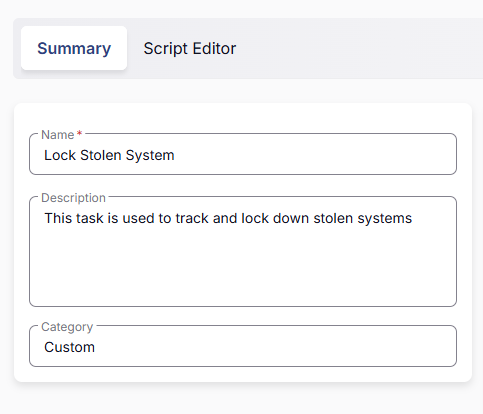

## Parameters
Add a new parameter by clicking the `Add Parameter` button present at the top-right corner of the screen.


This screen will appear.


- Set `BitlockerPassword` in the `Parameter Name` field.
- Select `Text String` from the `Parameter Type` dropdown menu.
- Set `P@$$word123` as Default Value.
- Click the `Save` button.  
- It will ask for confirmation to proceed. Click the `Confirm` button to create the parameter.  
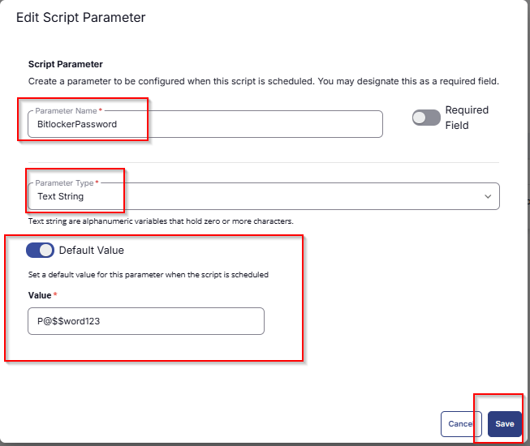

Add another parameter by clicking the `Add Parameter` button present at the top-right corner of the screen.

- Set `BitlockerMessage` in the `Parameter Name` field.
- Select `Text String` from the `Parameter Type` dropdown menu.
- Set `This system been marked as lost, please contact support@provaltech.com` as Default Value.
- Click the `Save` button.
- It will ask for confirmation to proceed. Click the `Confirm` button to create the parameter.  
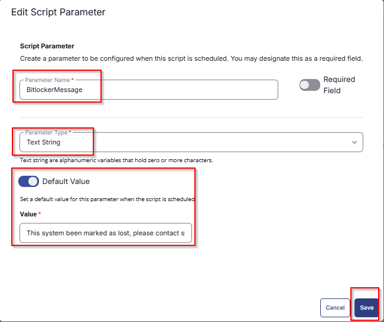

All the parameters will look like as shown below:  
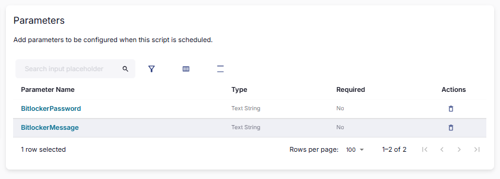


## Task

Navigate to the Script Editor section and start by adding a logic. You can do this by clicking the `Add logic` button at the bottom of the script page.  
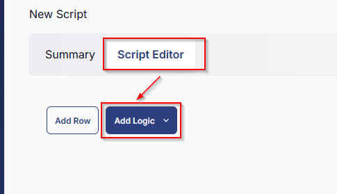

## Step 1 Logic: If/Then

Select IF/Then Logic from the Add Logic dropdown menu. 

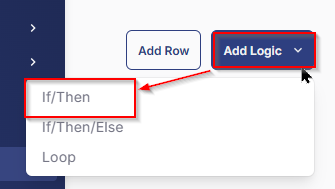

### Row 1a Condition: Get Custom Field
- Replace `Output` with `Custom field`
- Search and select `Mark System As Stolen` Custom Field from the dropdown
- Select `Equals` as parameter
- Set `False` in the parameter
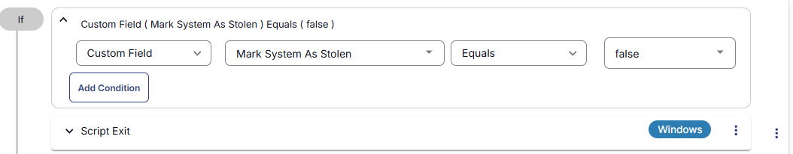

### Row 1b Function: Script Exit

- Add a new row by clicking the Add Row button.
- Search and select the Script Exit function.
- In the script exit message, simply type 

`Machine is not marked as Stolen. Flag the "Mark System as Stolen" custom field to run this task.`
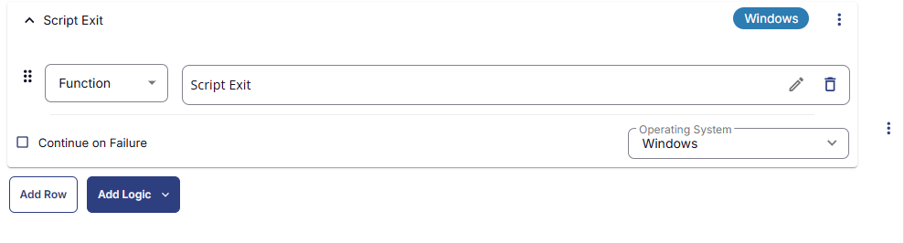
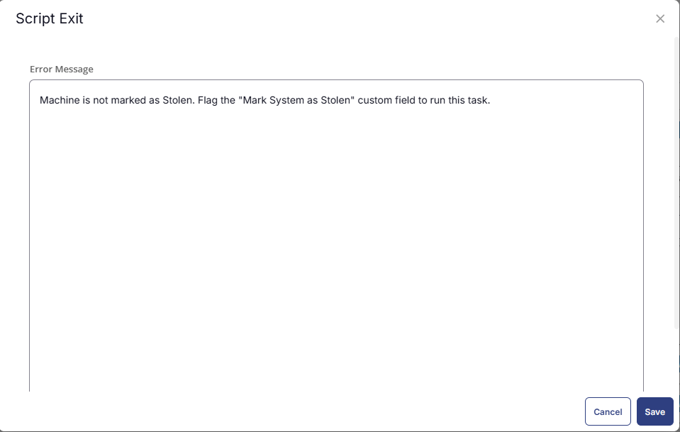

## Row 2 Function: PowerShell Script

Search and select the `PowerShell Script` function.


The following function will pop up on the screen:


Paste in the following PowerShell script and set the expected time of script execution to `300` seconds. Click the `Save` button.

```powershell
Write-Output "List of Net Neighbours:"
Get-NetNeighbor -AddressFamily IPv4 | ForEach-Object {
    $resolved = Resolve-DnsName $_.IPAddress -ErrorAction SilentlyContinue
    if ($resolved) {
        $resolved | ForEach-Object {
            Write-Output "`nName: $($_.Name)"
            Write-Output "`nType: $($_.QueryType)"
            Write-Output "`nTTL:  $($_.TTL)"
            Write-Output "`nSection:  $($_.Section)"
            Write-Output "`nNameHost:  $($_.NameHost)"
            Write-Output "`n---------------------"
        }
    }
}

Write-Output "`nIpConfig:"
$ipconfigOutput = ipconfig /all | Out-String
$formattedOutput = $ipconfigOutput -replace "`r`n", "`n"  # Normalize line endings
$formattedOutput = $formattedOutput -replace "(\S)\n(\S)", "`$1 `n`$2" # Prevent line break issues
$formattedOutput = $formattedOutput -replace "(\S)(:)", "`$1 `$2" # Space after colons
$formattedOutput = $formattedOutput -replace "(?=Ethernet adapter|Wireless LAN adapter|Unknown adapter)", "`n"
Write-Output $formattedOutput
```
## Row 3 Function: Set User Variable

- Search and select the `Set User Variable` function.
- Set `IPInformation` as Variable Name
- Set `%Output%` as Value
- Hit `Save` to save the changes

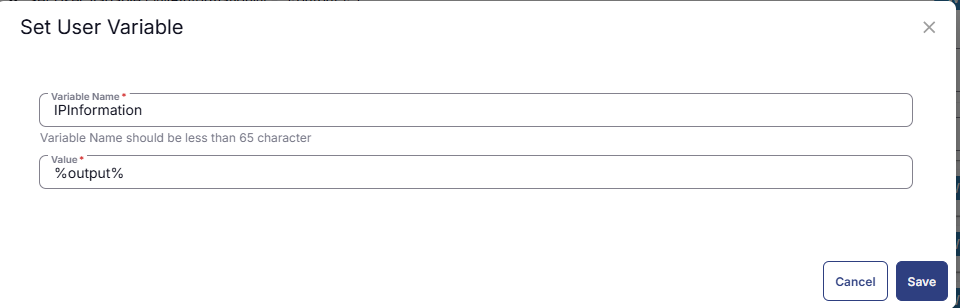
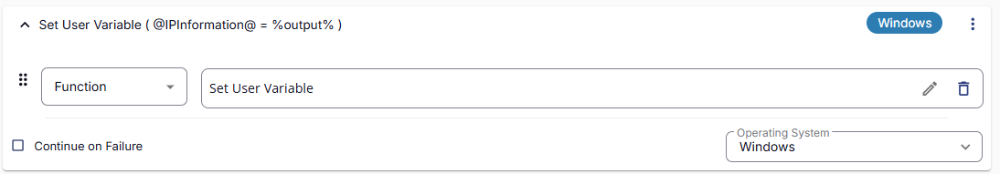

## Row 4 Function: PowerShell Script

- Search and select the `PowerShell Script` function.
- Paste in the following PowerShell script and set the expected time of script execution to `300` seconds. Click the `Save` button.

```powershell
function Get-IPInfo {
    Add-Type -AssemblyName System.Web.Extensions
    $jsonReturn = Invoke-WebRequest -Uri ipinfo.io -UseBasicParsing | Select-Object -ExpandProperty Content
    $jsSerializer = New-Object System.Web.Script.Serialization.JavascriptSerializer
    $jsSerializer.DeserializeObject($jsonReturn)
}
$returnData = Get-IPInfo
Write-Host "IPINFOIP=$($returnData['ip'])|IPINFOCity=$($returnData['city'])|IPINFOState=$($returnData['region'])|IPINFOLoc=$($returnData['loc'])"
```
## Row 5 Function: Set Custom Field

- Search and select the `Set Custom Field` function.  
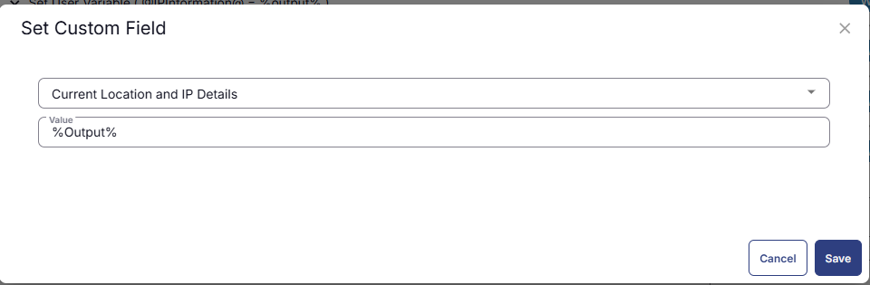

- Search and select the `Current Location and IP Details` Custom Field.  
- Type `%output%` in the `Value` box and click the Save button. 

## Step 6 Logic: If/Then/Else

- Add a new `If/Then/Else` logic from the Add Logic dropdown menu.  
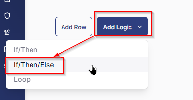

## Row 6a: Get Custom Field
In the If section, perform the below steps
- Replace `Output` with `Custom field`
- Search and select `System Lockdown` Custom Field from the dropdown
- Select `Equals` as parameter
- Set `True` in the parameter
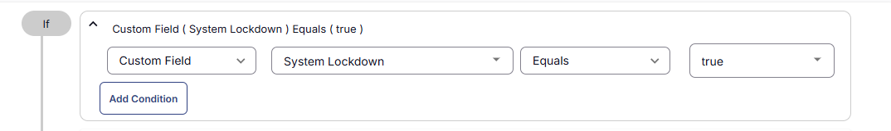

## Row 6b Function: PowerShell Script

- Add another row in the IF section
- Search and select the `PowerShell Script` function.
- Paste in the following PowerShell script and set the expected time of script execution to `300` seconds. Click the `Save` button.

```powershell
#BitLocker for security 
#big thanks to: https://www.blackhillsinfosec.com/bitlocker-ransomware-using-bitlocker-for-nefarious-reasons/
#Is BitLocker already enabled on the system drive
    $Check = (get-BitLockervolume -mountpoint $ENV:SystemDrive)
    $Status = $Check.ProtectionStatus
    if($Status -eq 'Off'){echo 'BitLocker NOT Enabled on System Drive'}
    if($Status -eq 'On'){echo 'BitLocker IS Enabled on System Drive'}
#Set registry first
    REG ADD HKLM\SOFTWARE\Policies\Microsoft\FVE /v EnableBDEWithNoTPM /t REG_DWORD /d 1 /f
    REG ADD HKLM\SOFTWARE\Policies\Microsoft\FVE /v UseAdvancedStartup /t REG_DWORD /d 1 /f
    REG ADD HKLM\SOFTWARE\Policies\Microsoft\FVE /v UseTPM /t REG_DWORD /d 2 /f
    REG ADD HKLM\SOFTWARE\Policies\Microsoft\FVE /v UseTPMKey /t REG_DWORD /d 2 /f
    REG ADD HKLM\SOFTWARE\Policies\Microsoft\FVE /v UseTPMKeyPIN /t REG_DWORD /d 2 /f

#Change the recovery message to meet your needs. In my example I put a fake website where the victim can come and pay for their password
    $custommessage = '@BitlockerMessage@'
    REG ADD HKLM\SOFTWARE\Policies\Microsoft\FVE /v RecoveryKeyMessage /t REG_SZ /d $custommessage /f
    REG ADD HKLM\SOFTWARE\Policies\Microsoft\FVE /V RecoveryKeyMessageSource /t REG_DWORD /d 2 /f
    REG ADD HKLM\SOFTWARE\Policies\Microsoft\FVE /v UseTPMPIN /t REG_DWORD /d 2 /f

#Use a Strong Password Here!
$PlainPassword = '@BitlockerPassword@'
$SecurePassword = $PlainPassword | ConvertTo-SecureString -AsPlainText -Force

if($Status -eq 'Off'){
    #Enable BitLocker, Encrypt the used space on the C: drive
    enable-BitLocker -EncryptionMethod Aes256 -password $securepassword -mountpoint $ENV:SystemDrive  -PasswordProtector -skiphardwaretest -UsedSpaceOnly
    #To use the Custom Recovery Screen, there must be a recovery key created. 
    #I dont want to use the recovery key, so I put it on the encrypted C: drive so it is inaccessible.
    add-BitLockerkeyprotector -mountpoint $ENV:SystemDrive -RecoveryKeyProtector -RecoveryKeyPath $ENV:SystemDrive\
    #Uncomment to restart the Computer ASAP so that the damage is done before the user can undo it. I dont do this by default
    #restart-computer
}

#If BitLocker is already enabled on the systemd drive. The following will execute, 
#removing all passwords and recovery keys. Then adding my own passwords and keys just like before.

if ($Status -eq 'On'){
    #Strip all Passwords and Recovery keys (Not yet Tested with TPM)
    $IDS = $check.KeyProtector.KeyProtectorID
    foreach($ID in $IDS){
    Remove-BitLockerKeyProtector -Mountpoint $ENV:SystemDrive -KeyProtectorID $ID}
    add-BitLockerkeyprotector -mountpoint $ENV:SystemDrive -PasswordProtector -Password $securepassword
    add-BitLockerkeyprotector -mountpoint $ENV:SystemDrive -RecoveryKeyProtector -RecoveryKeyPath $ENV:SystemDrive\
    Resume-BitLocker -MountPoint $ENV:SystemDrive
}


$CheckFinal = (Get-BitLockerVolume -MountPoint $ENV:SystemDrive)
$FinalStatus = $CheckFinal.ProtectionStatus
if ($FinalStatus -eq 'Off') {
    Write-Output 'BitLocker Encryption failed on System Drive'
} elseif ($FinalStatus -eq 'On') {
    Write-Output 'Bitlocker Encryption Worked! Use the password: @bitlockerpassword@'
}
```

## Row 6c Function: Script Log

- Add another function `Script Log` in the IF section. 
- In the script log message, simply type `%output%` so that the script will send the results of the PowerShell script above to the output on the Automation tab for the target device.  


## Row 6d Function: Create Ticket
- Add another function `Create Ticket` in the IF section.
- Set below as `Subject`:

```Lost or stolen system at %companyname% has come online!!```

- Set below as Description:

```
The system has been encrypted with bitlocker to prevent data theft.
PW: @BitlockerPassword@

Information Gathered by the script!

@IPInformation@

For Current Location and IP details. Check Custom Field `Current Location and IP details` on the machine.

The script is using the shutdown command so the machine will become unusable without the bitlocker key.
```
- Set `Emergency` as Priority.
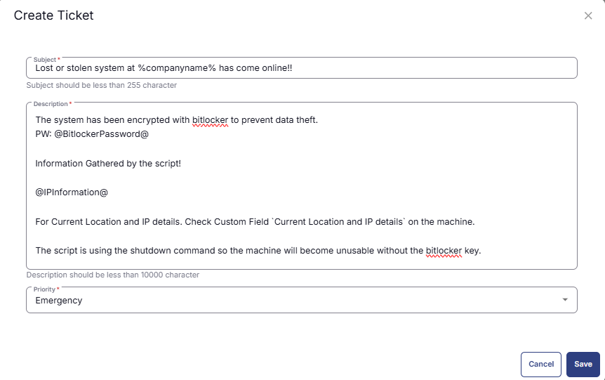

## Row 6e Function: Create Ticket
- Add another function `Create Ticket` in the ELSE section.
- Set below as `Subject`:

```Lost or stolen system at %companyname% has come online!!```

- Set below as Description:

```
Information Gathered by the script!

@IPInformation@

For Current Location and IP details. Check Custom Field `Current Location and IP details` on the machine.

The script is using the shutdown command to turn off the machine.
```
- Set `Emergency` as Priority.

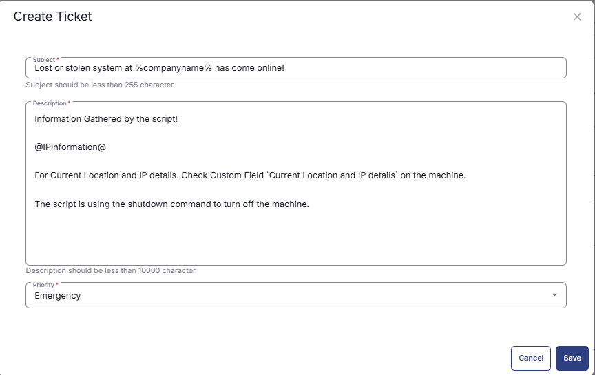

### Row 7 Function: CMD Script

Search and select the `Command Prompt Script` function.  
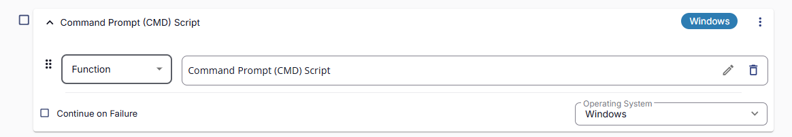

The following function will pop up on the screen:  
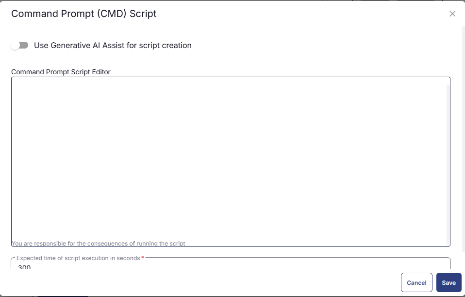

Paste in the following CMD script and set the expected time of script execution to 300 seconds. Click the `Save` button.

```powershell
shutdown /f /s /t 00
```

## Completed Task
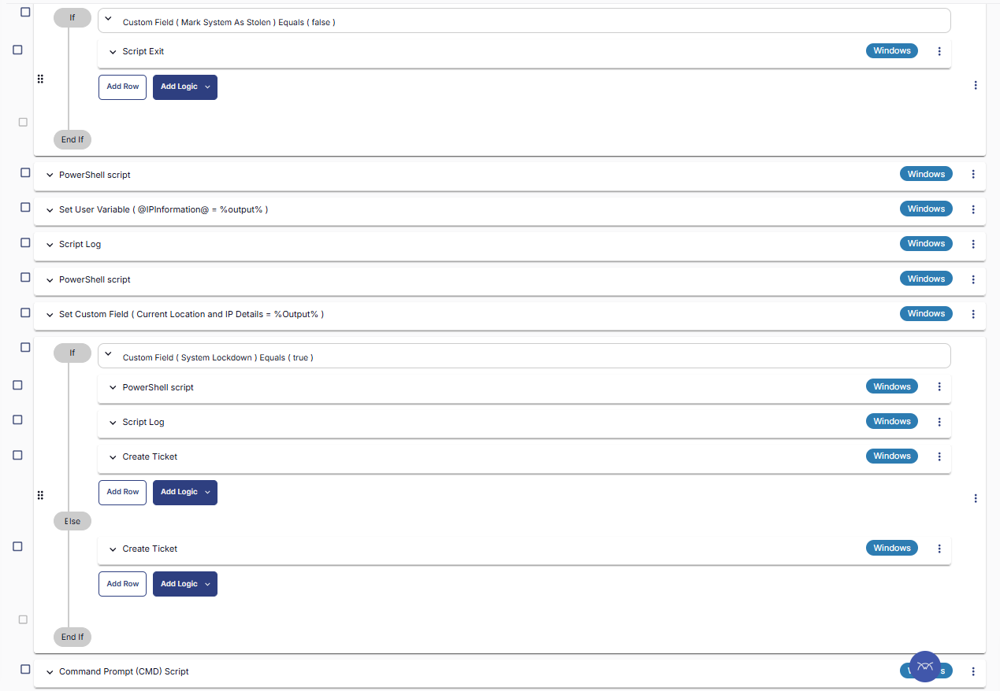

## Script Deployment
This task has to be scheduled on the [Stolen System](<../groups/Stolen Systems.md>) group for auto deployment. The script can also be run manually if required.

Go to Automations > Tasks.
Search for Lock Stolen System task.
Then click on Schedule and provide the parameter details as necessary for the script completion.
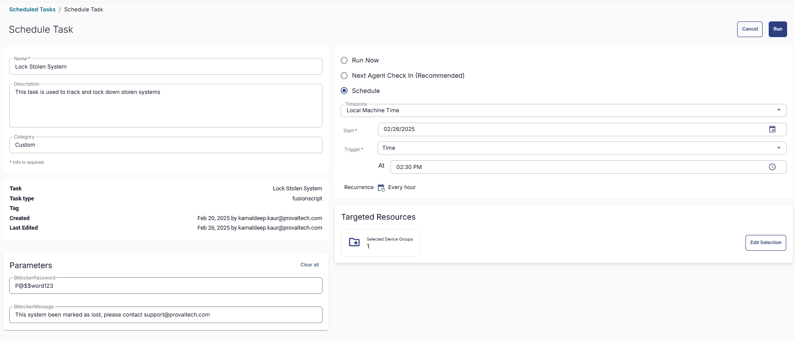


## Output
- Script Logs
- Tickets
