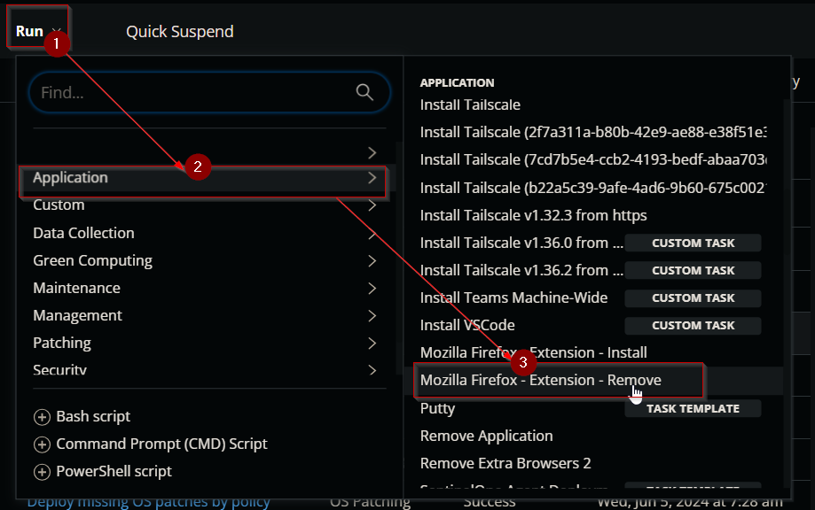
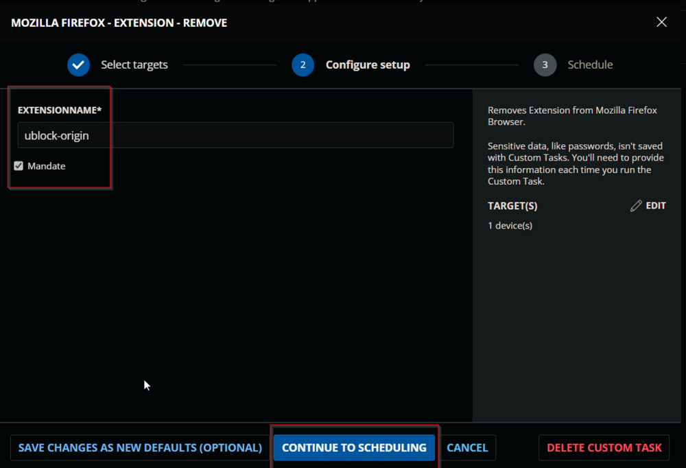
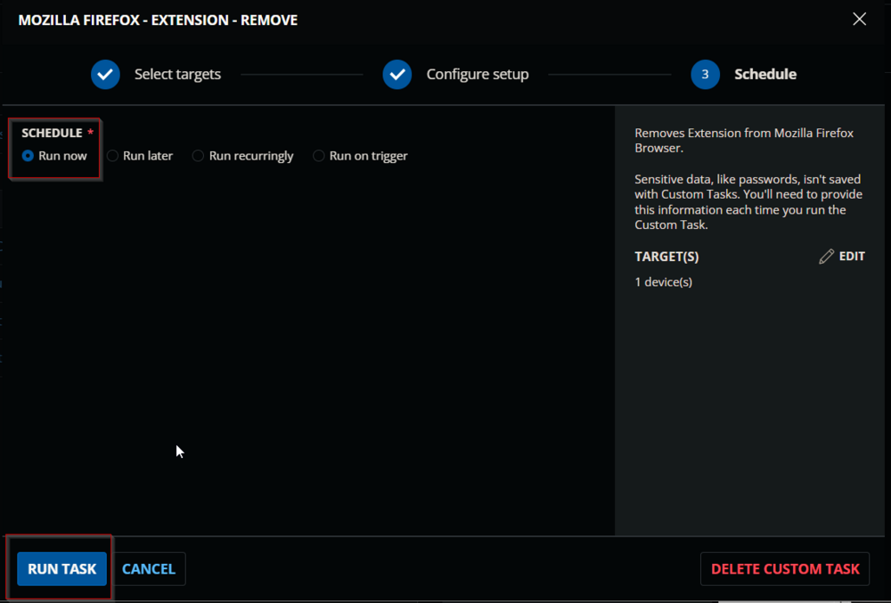
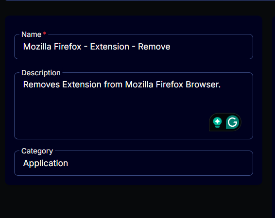
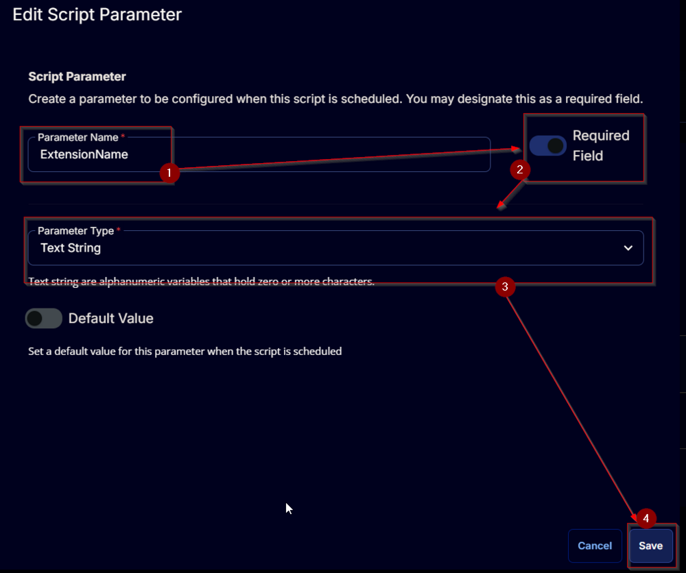
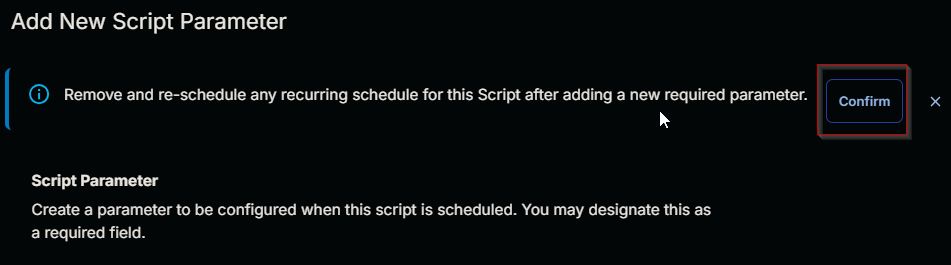
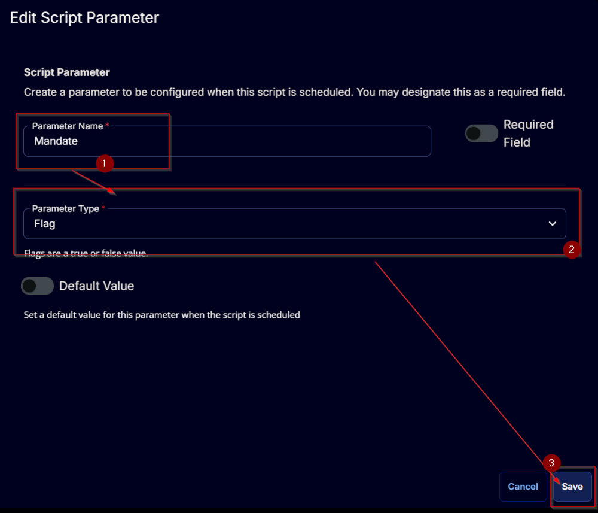

## Summary

This document describes how to remove an extension from the Mozilla Firefox browser.

## Sample Run

  
  
  

## Dependencies

[SWM - Software Configuration - Unregister-FirefoxExtension](<../../powershell/Unregister-FirefoxExtension.md>)

## User Parameters

| Name          | Example            | Required | Description                                                            |
|---------------|--------------------|----------|------------------------------------------------------------------------|
| ExtensionName | 'Unblock-Origin'    | True     | The name of the extension to remove.                                   |
| Mandate       |                    | False    | Use this switch to prevent future installation of the target addon in Firefox. |

## Task Creation

Create a new `Script Editor` style script in the system to implement this task.  
  
  

**Name:** Mozilla Firefox - Extension - Remove  
**Description:** Removes an extension from the Mozilla Firefox browser.  
**Category:** Application  
  

## Parameters

Add a new parameter by clicking the `Add Parameter` button present at the top-right corner of the screen.  
  

This screen will appear.  
  

- Set `ExtensionName` in the `Parameter Name` field.
- Enable the `Required Field` option.
- Select `Text String` from the `Parameter Type` dropdown menu.
- Click the `Save` button.  
  
- It will ask for confirmation to proceed. Click the `Confirm` button to create the parameter.  
  

Add another parameter by clicking the `Add Parameter` button present at the top-right corner of the screen.  
  

This screen will appear.  
  

- Set `Mandate` in the `Parameter Name` field.
- Select `Flag` from the `Parameter Type` dropdown menu.
- Click the `Save` button.  
  
- It will ask for confirmation to proceed. Click the `Confirm` button to create the parameter.  
  
  

## Task

Navigate to the Script Editor section and start by adding a row. You can do this by clicking the `Add Row` button at the bottom of the script page.  
  

A blank function will appear.  
  

### Row 1 Function: PowerShell Script

Search and select the `PowerShell Script` function.  
  
  

The following function will pop up on the screen:  
  

Paste in the following PowerShell script and set the expected time of script execution to `900` seconds. Click the `Save` button.  

```
$ExtensionName = "@ExtensionName@"
$Mandate = '@Mandate@'
$ProjectName = 'Unregister-FirefoxExtension'
$WorkingDirectory = "C:/ProgramData/_Automation/Script/$ProjectName"
$ScriptPath = "$WorkingDirectory/$ProjectName.ps1"
$BaseURL = 'https://file.provaltech.com/repo'
$PS1URL = "$BaseURL/Script/$ProjectName.ps1"
$LogPath = "$WorkingDirectory/$ProjectName-log.txt"
$ErrorLogPath = "$WorkingDirectory/$ProjectName-Error.txt"

[Net.ServicePointManager]::SecurityProtocol = [Enum]::ToObject([Net.SecurityProtocolType], 3072)
Remove-Item $WorkingDirectory -Force -Recurse -ErrorAction SilentlyContinue | Out-Null
Mkdir $WorkingDirectory 3>&1 2>&1 1>$Null
try {(New-Object System.Net.WebClient).DownloadFile($PS1URL, $ScriptPath)} catch {throw 'Script Download Failure'}

if ($Mandate -match '1|True|Yes') {
    & $ScriptPath -ExtensionName $ExtensionName -Mandate
} else {
    & $ScriptPath -ExtensionName $ExtensionName
}

if (!(Test-Path $LogPath)) {
    Throw 'PowerShell Failure. A Security application seems to have restricted the execution of the PowerShell Script.'
}

if (Test-Path $ErrorLogPath) {
    $ErrorContent = (Get-Content -Path $ErrorLogPath)
    throw $ErrorContent
}

Get-Content -Path $LogPath
```

  

Click the `Save` button at the top-right corner of the screen to save the script.  
  

## Completed Task

  

## Output

- Script Log


