## Summary

The task involves executing a PowerShell script on the domain controllers to retrieve information about recently created domain administrators or users who have been added to an administrative group since the last execution of this task. Subsequently, the acquired data is formatted and stored in [Custom Field - New Domain Admins](/docs/376db2a5-e76b-426f-b696-6791c83ab626), facilitating enhanced auditing and monitoring processes.

Importantly, this task should be scheduled against the primary domain controller for each domain.

## Update Notice: 27-December-2024

The task has been updated to create a ticket. Therefore, the `New Domain Admins` monitor is no longer needed. Please remove the monitor set before updating the task.

## Sample Run

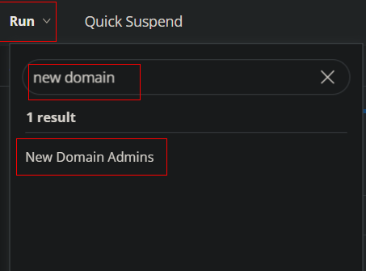  
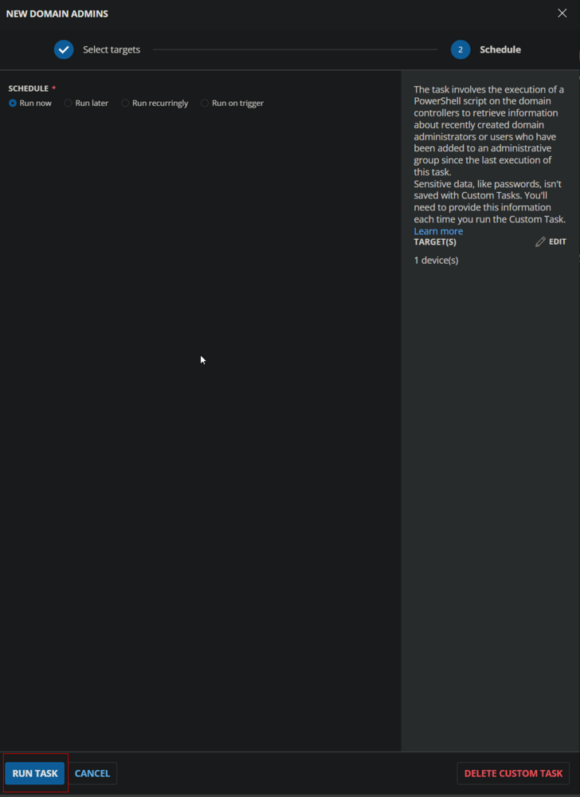  

## Dependencies

- [CW RMM - Custom Field - New Domain Admins](/docs/376db2a5-e76b-426f-b696-6791c83ab626)
- [CW RMM - Machine Group - Infrastructure Master](/docs/c2c2d22b-f735-4ec5-91a6-a014ab2e84a8)
- [CW RMM - Machine Group - Domain Controllers](/docs/eeeb4ee0-d683-44fd-81cf-7f8872b71c68)
- [CW RMM - Custom Field - Is Primary Domain Controller](/docs/b6a7c804-693c-4cf5-a60e-61dcb10ddcae)
- [CW RMM - Task - Validate Primary Domain Controller](/docs/7bc6ac21-322d-4630-836f-f00e93b94168)

## Variables

| Name   | Description                             |
|--------|-----------------------------------------|
| Output | Output of the PowerShell script        |

### Implementation

Create the Custom Field [CW RMM - Custom Field - New Domain Admins](/docs/376db2a5-e76b-426f-b696-6791c83ab626).

## Create Script

Create a new "Script Editor" style script in the system to implement this task.

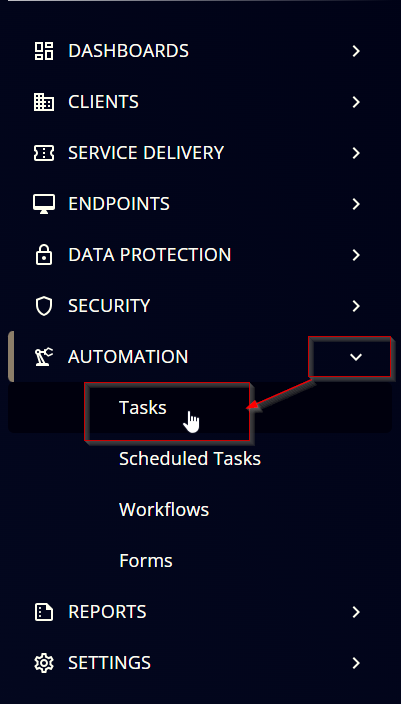  
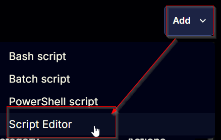  

**Name:** New Domain Admins  
**Description:** The task involves executing a PowerShell script on the domain controllers to retrieve information about recently created domain administrators or users who have been added to an administrative group since the last execution of this task.  
**Category:** Custom  

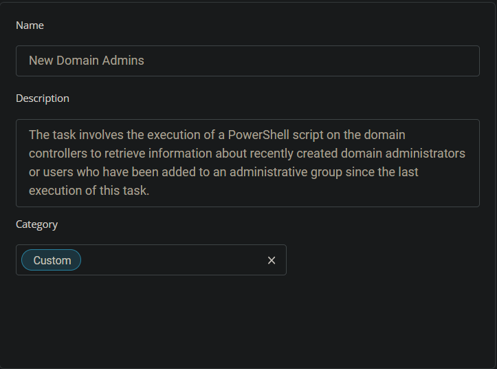  

### Script

Start by adding a row. You can do this by clicking the "Add Row" button at the bottom of the script page.

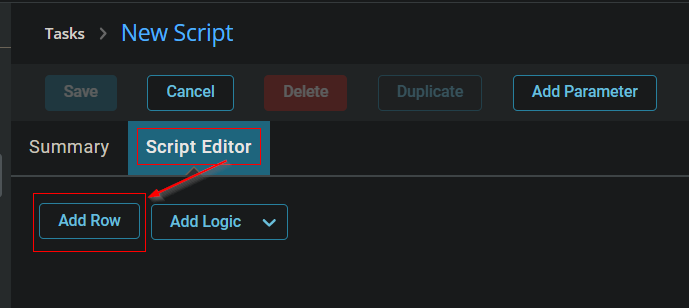  

#### Row 1 Function: PowerShell Script

  
  

Paste in the following PowerShell script and set the expected time of script execution to `300` seconds. This PowerShell function will validate whether the endpoint is a domain controller or not.

```powershell
$check = ( Get-CimInstance -Class Win32_ComputerSystem -ErrorAction SilentlyContinue ).DomainRole
if ( $check -in ( 4,5 ) ) {
    return 'domain controller'
} elseif ( $check -eq 1 ) {
    return 'domain joined'
} else {
    return 'Workgroup'
}
```

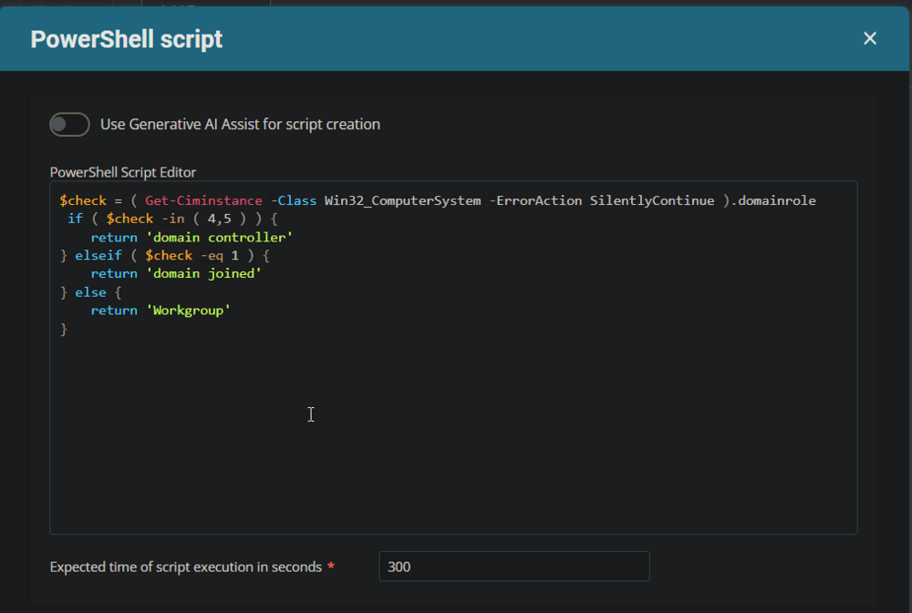  

#### Row 2 Logic: If Then

  
  

##### Row 2a Condition: Output Does Not Contain

Click the dropdown `Contains` and select `Does Not Contain`, then enter `domain controller` in the text box.

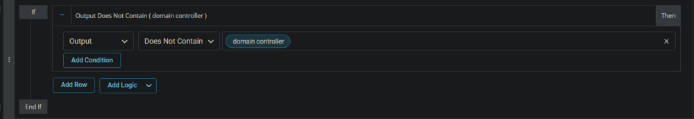  

##### Row 2b Function: Script Exit

Add a new row by clicking on the Add row button.  
  

Select `Script Exit` Function.

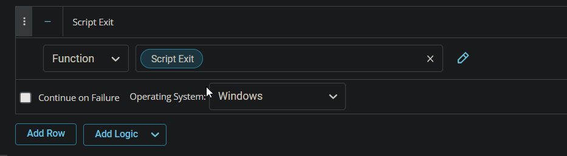  

Add this message to the `Error Message` field that will appear after selecting the `Script Exit` function.

**Error Message:** This script is designed to work for a domain controller only.

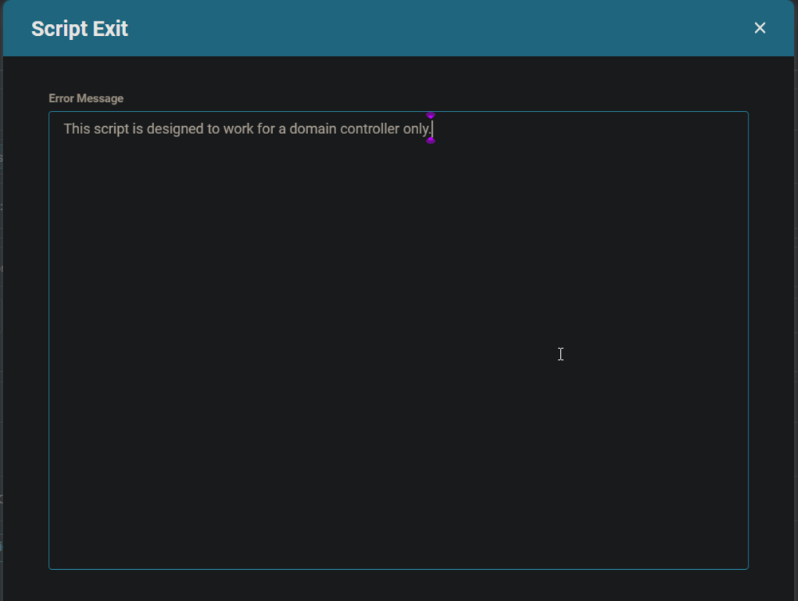  
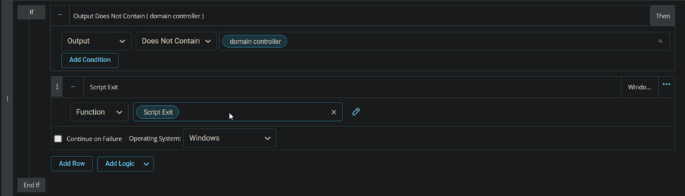  

#### Row 3 Function: PowerShell Script

Add a new row by clicking on the Add row button.

  

Select `PowerShell Script` function.

  
  

Paste in the following PowerShell script and set the expected time of script execution to `300` seconds.

```powershell
### Region Strapper ###
$ProgressPreference = 'SilentlyContinue'
[Net.ServicePointManager]::SecurityProtocol = [Enum]::ToObject([Net.SecurityProtocolType], 3072)
Get-PackageProvider -Name NuGet -ForceBootstrap | Out-Null
Set-PSRepository -Name PSGallery -InstallationPolicy Trusted
try {
    Update-Module -Name Strapper -ErrorAction Stop
} catch {
    Install-Module -Name Strapper -Repository PSGallery -SkipPublisherCheck -Force
    Get-Module -Name Strapper -ListAvailable | Where-Object { $_.Version -ne (Get-InstalledModule -Name Strapper).Version } | ForEach-Object { Uninstall-Module -Name Strapper -MaximumVersion $_.Version }
}
(Import-Module -Name 'Strapper') 3>&1 2>&1 1>$null
Set-StrapperEnvironment
#endregion
```

```powershell
$adminTableName = 'domainadmin'
$previousDomainAdmins = try { Get-StoredObject -TableName $adminTableName -WarningAction SilentlyContinue } catch { $null }
$adminGroupMembers = Get-ADGroupMember -Identity Administrators -Recursive | Where-Object { $_.ObjectClass -eq 'User' } | Select-Object -Property DistinguishedName, Name, ObjectClass, ObjectGUID, SamAccountName, SID -Unique
if (!$previousDomainAdmins) {
    Write-Log -Text 'No previous runs of the script were detected. Creating new chain.' -Level Information
} elseif ($newDomainAdmins = $adminGroupMembers | Where-Object { $_.SID.Value -notin $previousDomainAdmins.SID.Value }) {
    Write-Log -Text "$($newDomainAdmins.Count) new domain admin(s) detected." -Level Information
    Write-Output "New Domain admin(s): $(foreach ($admin in $newDomainAdmins) { "'$($admin.SamAccountName)';" })"
} else {
    Write-Log -Text 'No new domain admin detected.' -Level Information
    Write-Output 'No new domain admin detected.'
}
$adminGroupMembers | Write-StoredObject -TableName $adminTableName -Clobber -WarningAction SilentlyContinue -Depth 2
```

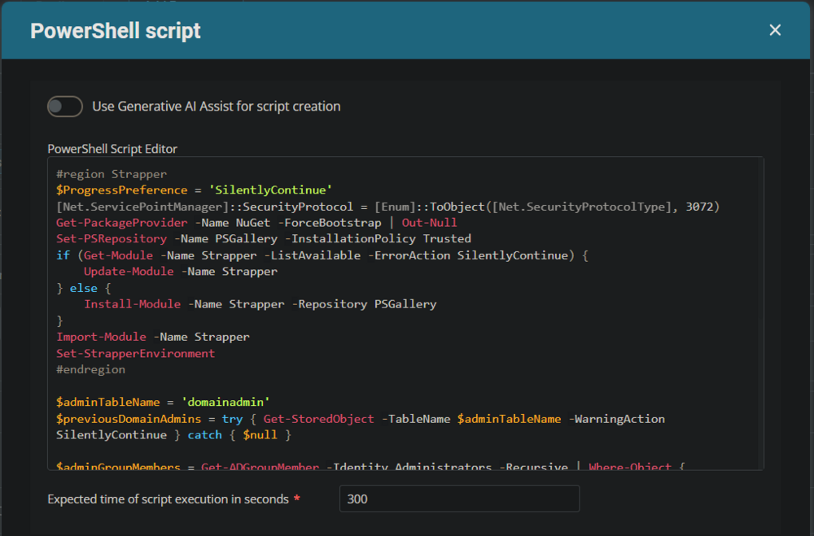  

#### Row 4 Function: Set Custom Field

Add a new row by clicking on the Add row button.

  

Select `Set Custom Field` Function.

  

When you select `Set Custom Field`, a new window will open.

  

In this window, search for the `New Domain Admins` field.

**Custom Field:** New Domain Admins  
**Value:** %Output% 

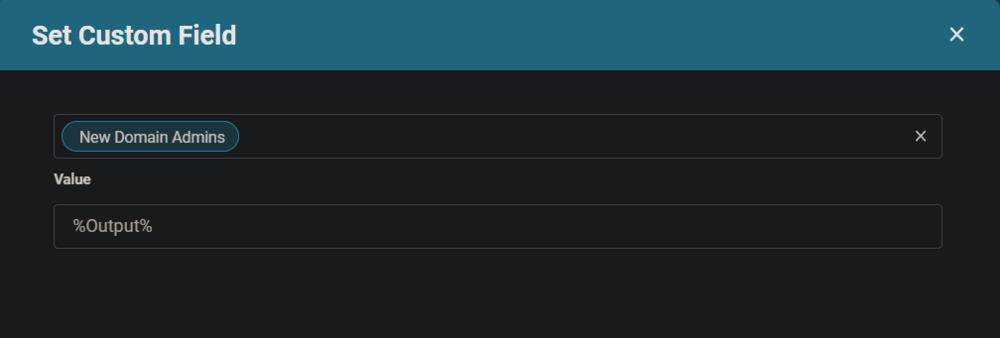  

#### Row 5 Function: Script Log

Add a new row by clicking on the Add row button.

  

Select `Script Log` function.

  

In the script log message, simply type `%output%` so that the script will send the results of the PowerShell script above to the output on the Automation tab for the target device.

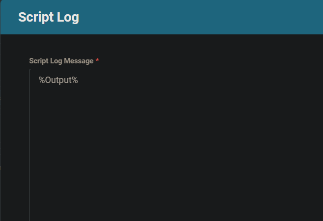  
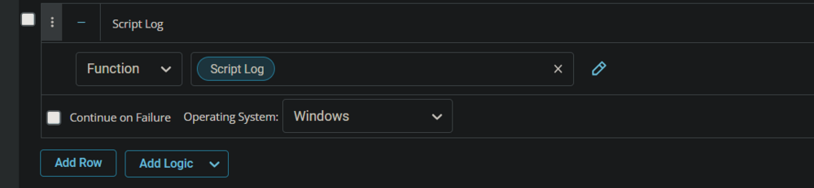  

#### Row 6 Logic: If Then

  
  

##### Row 6a Condition: Output Contains

Click the dropdown `Contains` and select `Contains`, then enter `New Domain admin(s):` in the text box.

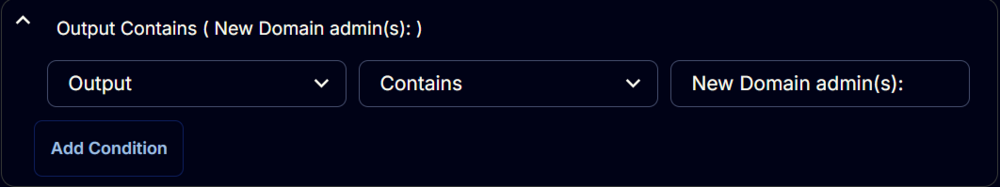  

##### Row 6b Function: Set Pre-defined Variable

Add a new row by clicking on the Add row button.

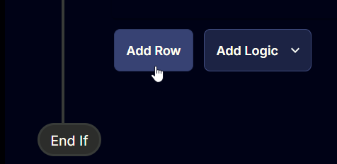  

Select `Set Pre-defined Variable` Function.

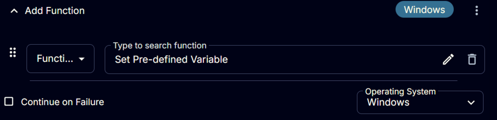  

This pop-up box will appear.

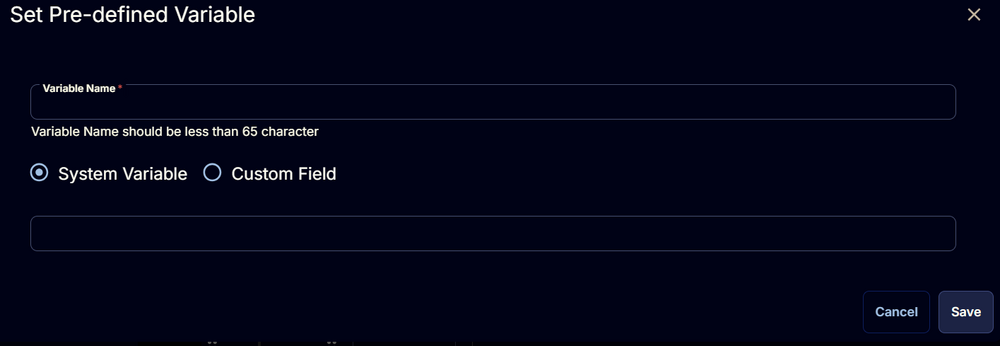  

Select the `System Variable` button, set `Computer` for the `Variable Name` and `friendlyName` for the `System Variable`. `friendlyName` can be found in the `Asset` section. Click the `Save` button to save changes.  

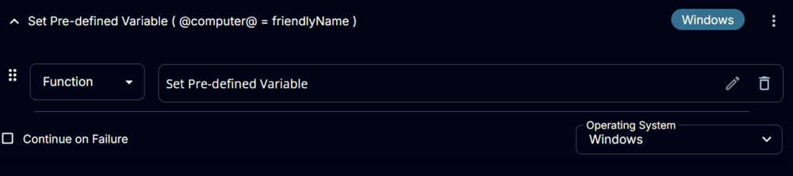  

##### Row 6c Function: Create Ticket

Add a new row by clicking on the Add row button.

  

Select the `Create Ticket` function.

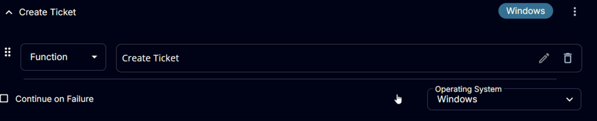  

This function will appear.

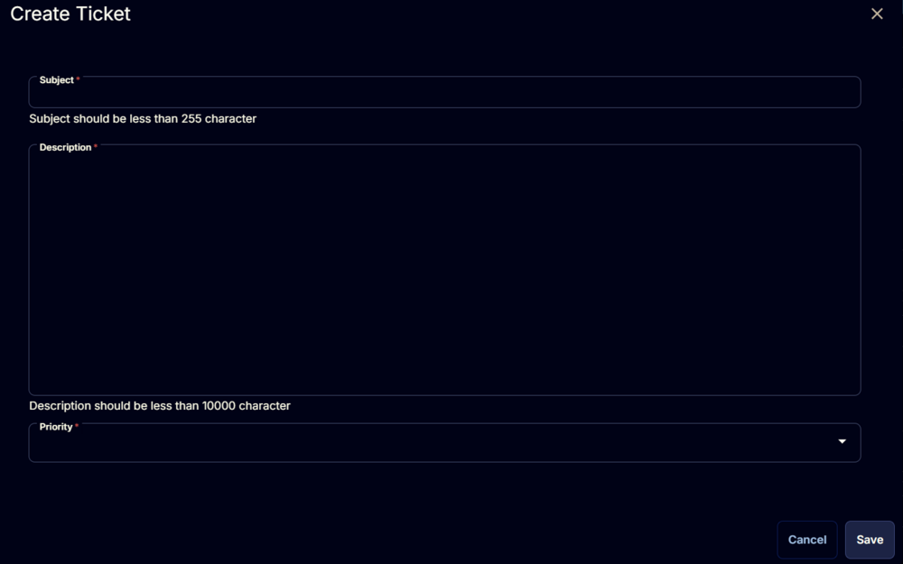  

**Subject:** `New domain admin detected on @computer@ at %companyname%`  
**Description:** `%Output%`  
**Priority:** `Medium`  

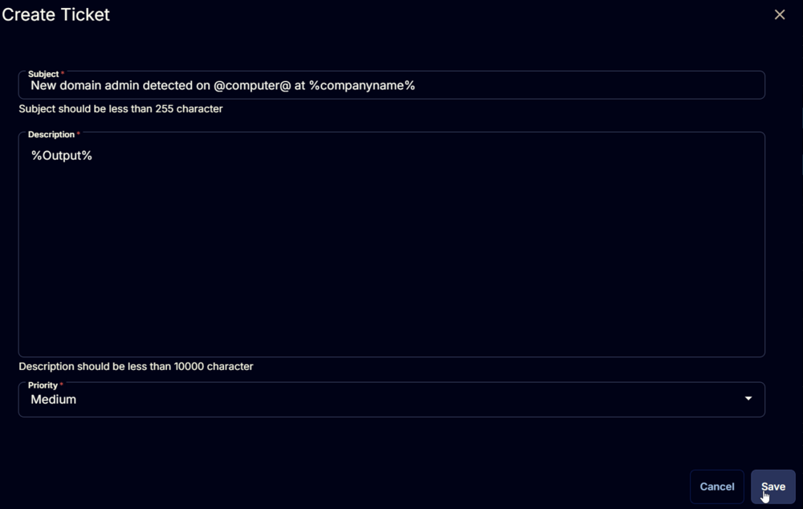  

Once all items are added, please save the task. The final task should look like the screenshot below.

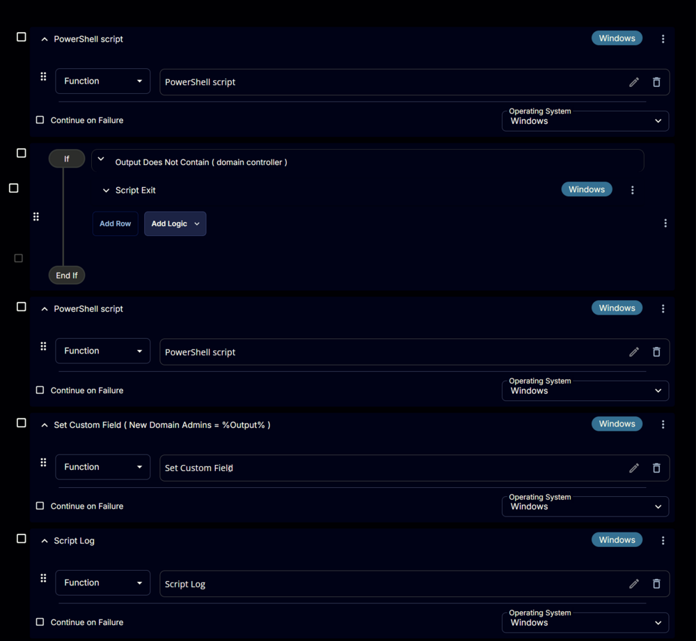  
  

## Deployment

It is suggested to run the task once per hour against the primary domain controllers or infrastructure masters.

- Go to `Automation` > `Tasks`.
- Search for `New Domain Admins Task`.
- Select the concerned task.
- Click on the `Schedule` button to schedule the task/script.  

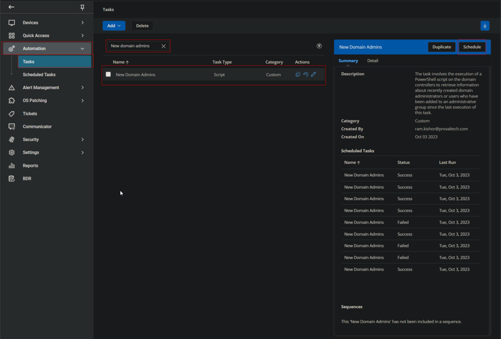  

This screen will appear.  

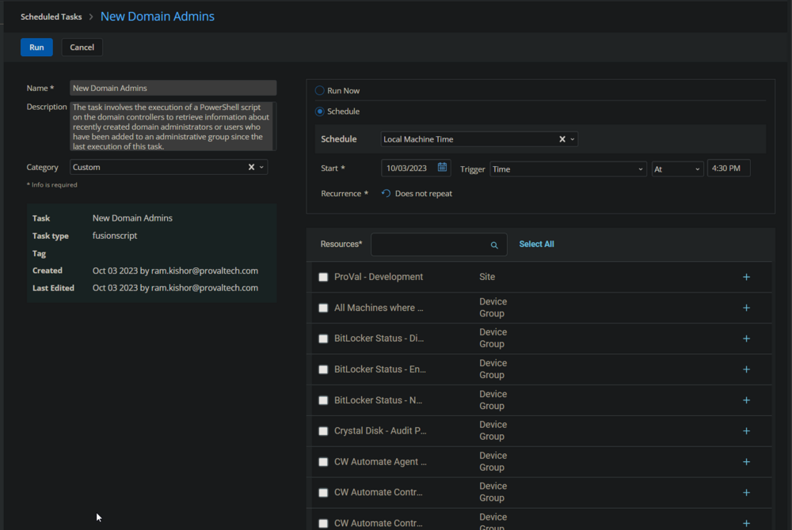  

Click the `Does not repeat` button.  

  

This pop-up box will appear.  

  

Select the `Hour(s)` option from the Repeat dropdown.  

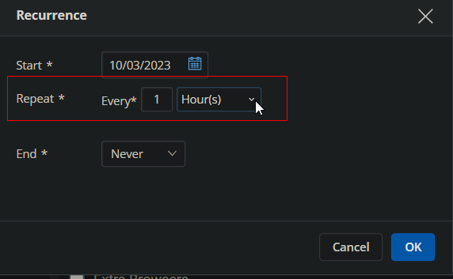  
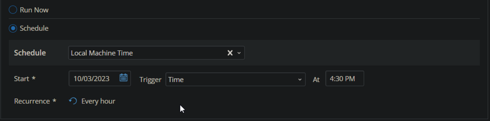  

Search for `Infrastructure` in the `Resources*` and select the `Infrastructure Master` group.  

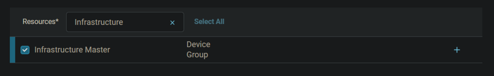  

Now click the `Run` button to initiate the task.  

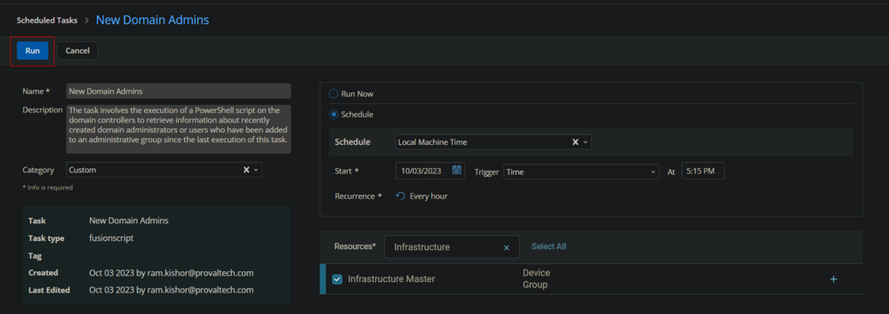  

The task will start appearing in the Scheduled Tasks.  

  
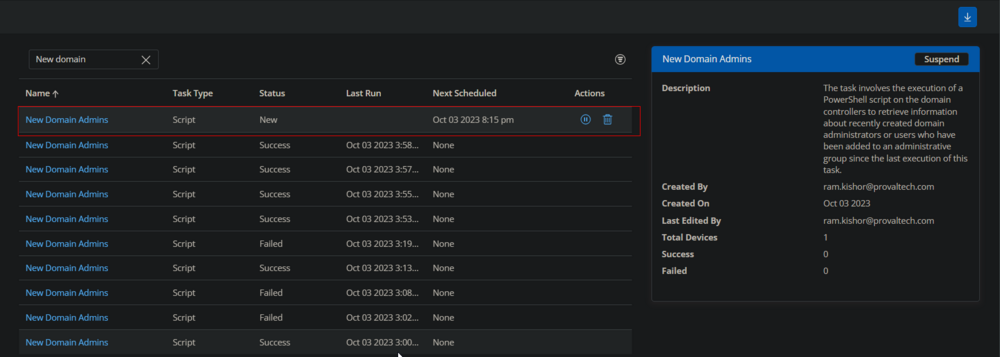  

## Output

- **Script Log**  
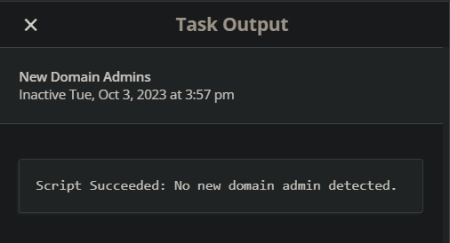  
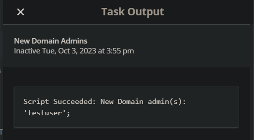  
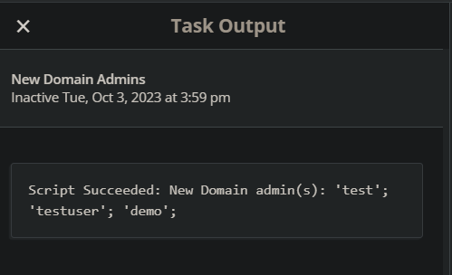  

- **Custom Field**  
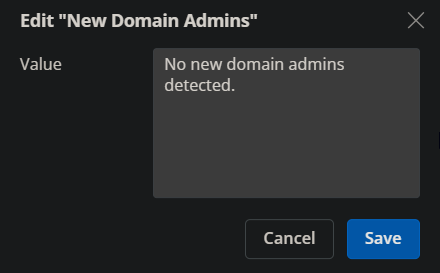  
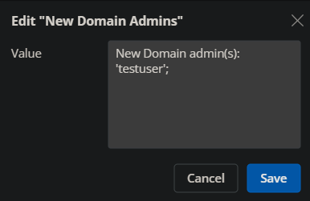  
  

- **Ticket**  
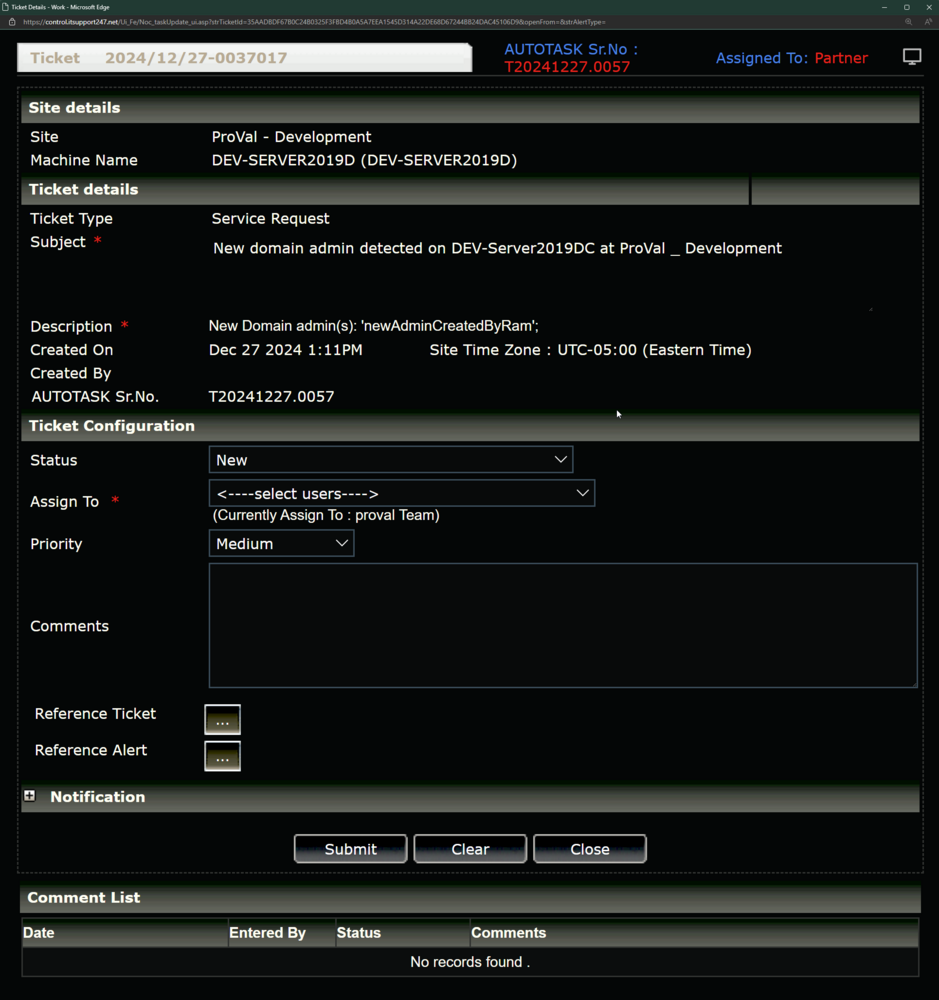  


