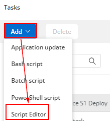
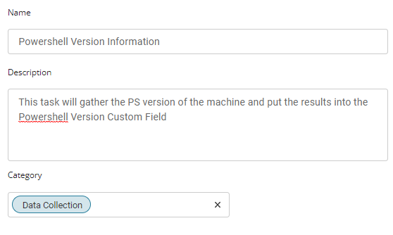
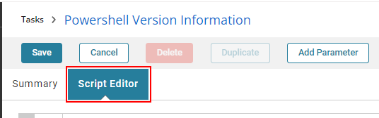
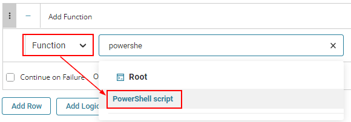
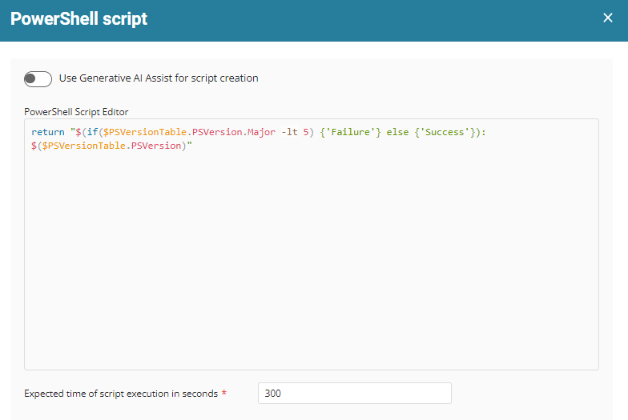
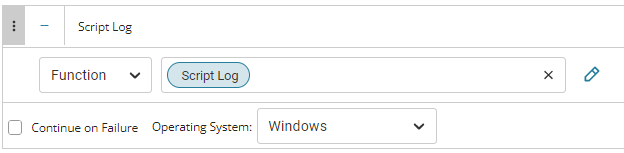
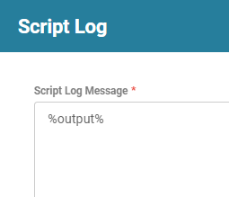
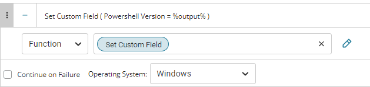
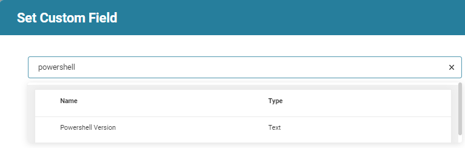
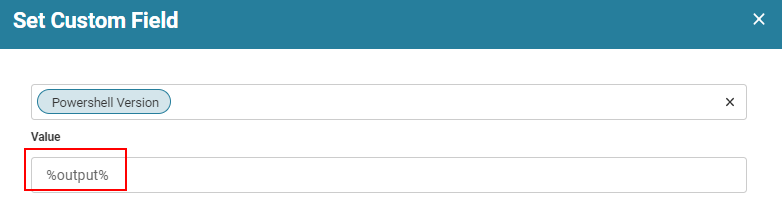

## Summary

This task will gather the PS version of the machine and put the results into the Powershell Version Custom Field.

*The custom field is required before this script will run properly. Please ensure that the PowerShell Version Custom Field is present.*

## Manual Run

This script does not have any parameters and can be run against any online Windows device.

## Dependencies

[CW RMM - Custom Field - PowerShell Version](https://proval.itglue.com/DOC-5078775-12824368)

## Variables

Document the various variables in the script. Delete any section that is not relevant to your script.

| Name       | Description                                                                                   |
|------------|-----------------------------------------------------------------------------------------------|
| %output%   | The output is retrieved by PowerShell and will be inserted into the custom field.            |

## Create Script

To implement this script, please create a new "Script Editor" style script in the system.

  
  

**Name:** PowerShell Version Information  
**Description:** This task will gather the PS version of the machine and put the results into the Powershell Version Custom Field  
**Category:** Data Collection  

  

### Script Editor

From the script editor tab  
  

Add three (3) new "Rows"

#### Row 1 function: PowerShell

  

This will bring up the PowerShell Editor. Paste the PowerShell into the PowerShell Script Editor Field  
  

```
return "$(if($PSVersionTable.PSVersion.Major -lt 5) {'Failure'} else {'Success'}): $($PSVersionTable.PSVersion)"
```

Please leave the timeout set to 300 seconds.

#### Row 2 function: Script Log

  

This will open up the script log editor.  
  

Please type in %output% into this field. This will display the results of the above PowerShell in the script logs. This makes it easier to audit what happened when the script was run.

#### Row 3 function: Set Custom Field

*NOTE: The custom field must be created first.*  
  

When you select the "Set Custom Field" function you will get a dialog box used to write the output to a specific custom field.  

Search for the custom field:  
  
  

Please write in %output% to the "PowerShell Version" custom field. This will write the results of the PowerShell script to the PowerShell Version Custom Field.

## Script Deployment

ProVal recommends scheduling this task using a monitor and a machine group. Please review the [Solutions](https://proval.itglue.com/5078775/docs/12824365#version=published&documentMode=view) Document here for best practice implementation.

## Output

- Script log
- Custom Field


