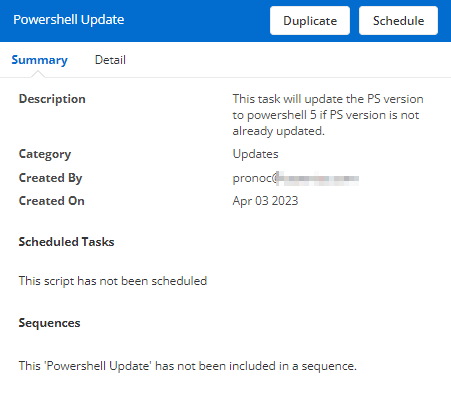
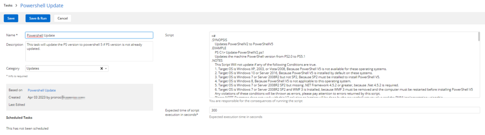

## Summary

This task will update the PS version to PowerShell 5 if the PowerShell version is not already updated.

## Manual Run

This script does not have any parameters and can be run against any online Windows device.

## Dependencies

None. This script can be run against any Windows device.

## Create Script

To implement this script, please create a new "PowerShell" style script in the system.


**Name:** PowerShell Update  
**Description:** This task will update the PS version to PowerShell 5 if the PowerShell version is not already updated.  
**Category:** Updates  



### Script



Paste the below PowerShell script directly into the "Script" field.

```
<#
.SYNOPSIS
    Updates PowerShellV2 to PowerShellV5
.EXAMPLE
    PS C:/> Update-PowerShellV2.ps1
    Updates the machine PowerShell version from PS2.0 to PS5.1
.NOTES
    This Script Will not update if any of the following Conditions are true.
    1. Target OS is Windows XP, 2003, or Vista/2008, Because PowerShell V5 is not available for these operating systems.
    2. Target OS is Windows 10 or Server 2016, Because PowerShell V5 is installed by default on these systems.
    3. Target OS is Windows 7 or Server 2008R2 but not SP2, Because SP2 must be installed to install PowerShell V5.
    4. Target OS is Windows 8, Because PowerShell V5 is not applicable to this operating system.
    5. Target OS is Windows 7 or Server 2008R2 SP2 but missing .NET Framework 4.5.2 or greater, because .Net 4.5.2 is required.
    6. Target OS is Windows 7 or Server 2008R2 SP2 and WMF 3 is Installed, because WMF 3 must be removed and the computer must be restarted before installing PowerShell V5
    Any violations of these conditions will be thrown as errors, please pay attention to errors returned by this script.
    Please NOTE Bootstrap does not work with this V2 solution so logging will be done by the powershell return value and the RMM implementation using this.
#>
[Diagnostics.CodeAnalysis.SuppressMessageAttribute('PSAvoidUsingWMICmdlet', '', Justification = 'Required for older Windows/PowerShell versions.')]
[Diagnostics.CodeAnalysis.SuppressMessageAttribute('PSAvoidUsingWriteHost', '', Justification = 'Required for older Windows/PowerShell versions.')]
param ()
### Process ###
$urlWin81x86 = 'https://download.microsoft.com/download/6/F/5/6F5FF66C-6775-42B0-86C4-47D41F2DA187/Win8.1-KB3191564-x86.msu'
$urlWin2k12R2andWin81x64 = 'https://download.microsoft.com/download/6/F/5/6F5FF66C-6775-42B0-86C4-47D41F2DA187/Win8.1AndW2K12R2-KB3191564-x64.msu'
$urlWin7x86 = 'https://download.microsoft.com/download/6/F/5/6F5FF66C-6775-42B0-86C4-47D41F2DA187/Win7-KB3191566-x86.zip'
$urlWin2k8R2andWin7x64 = 'https://download.microsoft.com/download/6/F/5/6F5FF66C-6775-42B0-86C4-47D41F2DA187/Win7AndW2K8R2-KB3191566-x64.zip'
$urlWin2012 = 'https://download.microsoft.com/download/6/F/5/6F5FF66C-6775-42B0-86C4-47D41F2DA187/W2K12-KB3191565-x64.msu'
$targetPSVersion = [Version]'5.1.14409.1005'

$osversionLookup = @{
    '5.1.2600' = 'XP';
    '5.1.3790' = '2003';
    '6.0.6001' = 'Vista/2008';
    '6.1.7600' = 'Win7/2008R2';
    '6.1.7601' = 'Win7 SP1/2008R2 SP1'; # SP1 or later.
    '6.2.9200' = 'Win8/2012';
    '6.3.9600' = 'Win8.1/2012R2';
    '10.0.*' = 'Windows 10/Server 2016'
}

$osversion = (Get-WmiObject -Class win32_operatingsystem).version
$ProductName = (Get-ItemProperty -Path 'HKLM:/SOFTWARE/Microsoft/Windows NT/CurrentVersion' -Name 'ProductName').ProductName
$EditionId = (Get-ItemProperty -Path 'HKLM:/SOFTWARE/Microsoft/Windows NT/CurrentVersion' -Name 'EditionID').EditionId

Write-Host "Running on: $ProductName, ($EditionId), Windows Version: $osVersion"

if ([version]($PSVersionTable.PSVersion) -ge $targetPSVersion) {
    Return "An equal or greater PowerShell version is already installed. Installed: ($($PSVersionTable.PSVersion))"
}
Write-Host "Installing for OS: $($osversionLookup[$osVersion])"

switch ($osversionLookup[$osVersion]) {
    'Vista/2008' { Throw "Windows $($osversionLookup[$osVersion]) does not support versions of PowerShell greater than 3." }
    'Win7/2008R2' { Throw "PowerShell $targetPSVersion requires Service Pack 1 for Windows $($osversionLookup[$osVersion])." }
    'Win8/2012' {
        if ($os.ProductType -gt 1) {
            #Windows 2012
            $url = $urlWin2012
        } else {
            #Windows 8
            throw "PowerShell $targetPSVersion is not supported on Windows 8. You must upgrade to Windows 8.1 to install WMF/PowerShell 5.0."
        }
    }
    'Win8.1/2012R2' {
        #check bitness then set url to either url value
        if ((Get-WmiObject win32_operatingsystem | Select-Object osarchitecture -ExpandProperty osarchitecture) -match '64') {
            $url = $urlWin2k12R2andWin81x64
        } else {
            $url = $urlWin81x86
        }
    }
    'Windows 10/Server 2016' {
        Return 'Windows 10+ / Server 2016+ has WMF/PowerShell 5 pre-installed which is maintained by Windows Updates.'
    }
    'Win7 SP1/2008R2 SP1' {
        if ((Get-ItemProperty 'HKLM:/SOFTWARE/Microsoft/NET Framework Setup/NDP/v4/Full' -ErrorAction SilentlyContinue | Select-Object -ExpandProperty Release -ErrorAction SilentlyContinue) -lt 378389) {
            throw '.NET Framework 4.5.2 or later required. Please install .NET Framework 4.5.2 or above and re-run.'
        } elseif ((Get-WmiObject win32_operatingsystem | Select-Object osarchitecture -ExpandProperty osarchitecture) -match '64') {
            $url = $urlWin2k8R2andWin7x64
        } else {
            $url = $urlWin7x86
        }
    }
    default {
        throw "PowerShell $targetPSVersion is not supported on $ProductName, ($EditionId), Windows Kernel: $osVersion"
    }
}
if ((Get-Service wuauserv).StartType -eq 'Disabled') {
    throw 'The Windows Update Service is disabled. PowerShell updates are distributed as Windows updates and so require the service. Consider temporarily enabling it before running this script.'
}

Write-Host "Target download URL: $url"
$downloadFileName = $url -split '/' | Select-Object -Last 1
$downloadFilePath = "$env:TEMP/$downloadFileName"
$pathToMSU = "$env:TEMP/$downloadFileName"
(New-Object Net.WebClient).DownloadFile($url, $downloadFilePath)
if ($url -match '.zip') {
    $filename = $downloadFileName -replace '.zip', '.msu'
    $zipfile = (New-Object -Com Shell.Application).NameSpace($downloadFilePath)
    $destination = (New-Object -Com Shell.Application).NameSpace($env:TEMP)
    $destination.CopyHere($zipfile.Items())
    $pathToMSU = "$env:TEMP/$filename"
} else {
    $pathToMSU = $downloadFilePath
}

$installresults = Start-Process -FilePath 'wusa.exe' -ArgumentList "`"$pathToMSU`" /quiet /norestart" -PassThru

do {
    Write-Host "Installing PowerShell $targetPSVersion. Completed: $($installresults.HasExited)"
    Start-Sleep -Seconds 15
} until ($installresults.HasExited -eq $true)
return 'Please reboot this machine to complete the installation of PowerShell V5.'
```

## Script Deployment

The script is intended to run from the "[CW RMM - Custom Monitor - PowerShell Version](https://proval.itglue.com/DOC-5078775-12824363)" monitor as the "Run Automated Task."

This script can also run manually against any Windows-based device.

## Output

- Script log


