## Summary

This task deploys the SentinelOne agent on Windows, Linux, and Mac machines.

## Sample Run

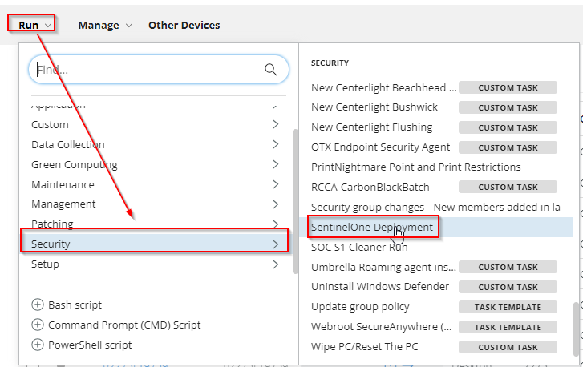

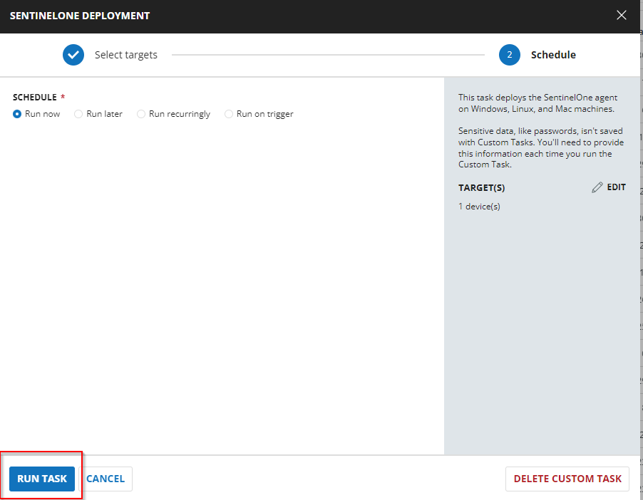

## Dependencies

[CW RMM - Solution - SentinelOne Deployment](https://proval.itglue.com/DOC-5078775-15822040)

## Variables

| Name         | Description                                         |
|--------------|-----------------------------------------------------|
| S1SiteToken  | Site Token to install SentinelOne agent             |
| Output       | Output of the previously executed PowerShell script. |

## Task Creation

Create a new `Script Editor` style script in the system to implement this Task.


**Name:** SentinelOne Deployment  
**Description:** This task deploys the SentinelOne agent on Windows, Linux, and Mac machines.  
**Category:** Security  
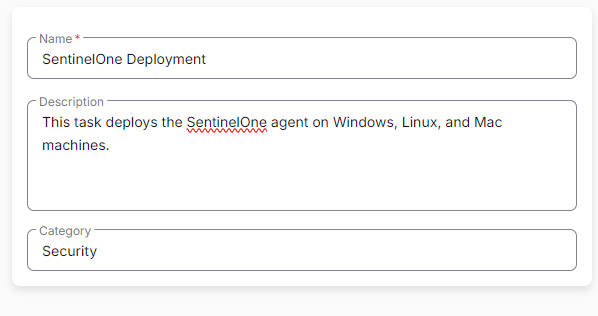

## Task

Navigate to the Script Editor Section and start by adding a row. You can do this by clicking the `Add Row` button at the bottom of the script page.


A blank function will appear.


### Row 1 Logic: If/Then/Else

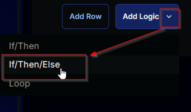

#### ROW 1a Condition: Custom Field Contains

Select the `Custom Field` from the dropdown menu.

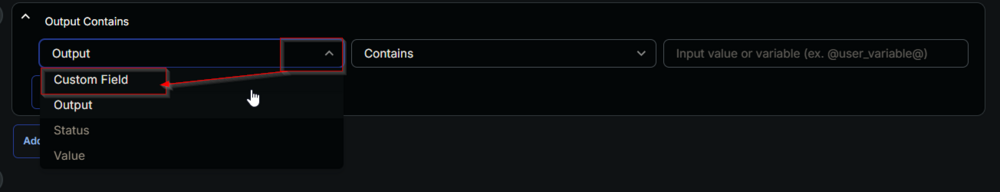
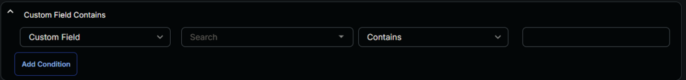

Search and select the `SentinelOne Group Key` custom field and type `NA` in the comparator and change Contains to Does not Equal and press `Enter`.

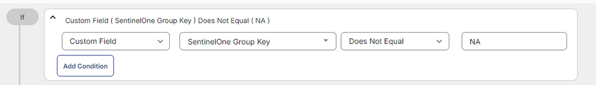

#### ROW 1b Function: Set Pre-defined Variable

Search and select the `Set Pre-defined Variable` function.

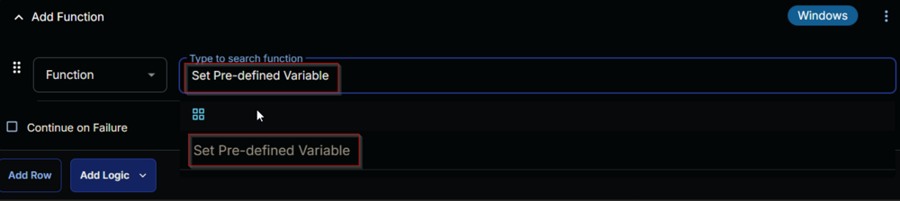
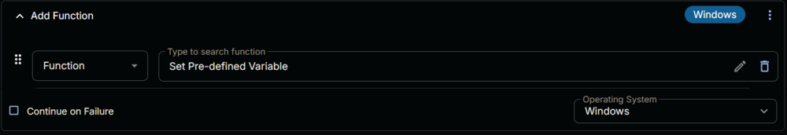

The following function will pop up on the screen:

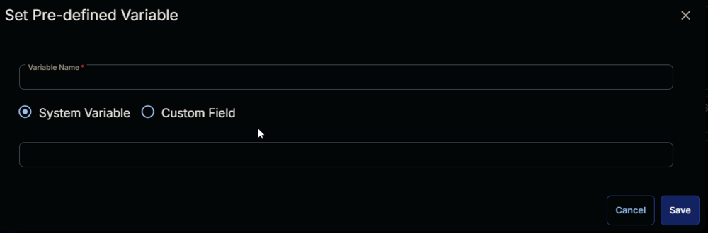

- Type `S1SiteToken` in the `Variable Name` field.
- Select the `Custom Field` Radio button.
- Search and select the Site-level `SentinelOne Group Key` Custom Field in the `Search Custom Field` field.
- Click the `Save` button to save the changes.
- Select `Windows` as Operating System.

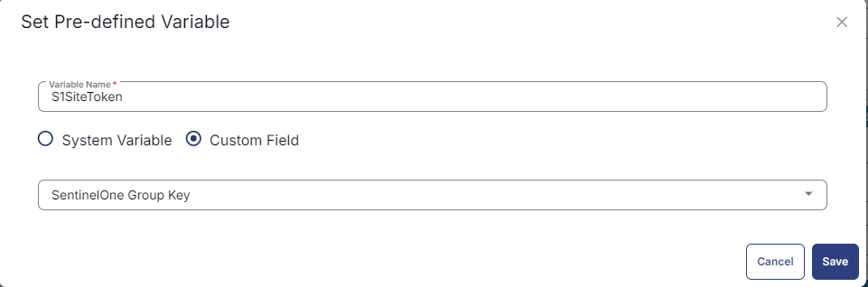
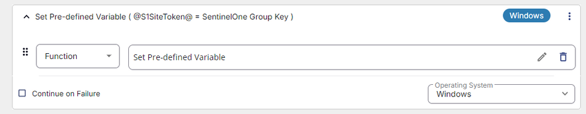

#### ROW 1c Function: Set Pre-defined Variable

Repeat the Row 1b steps but limit the pre-defined variable to MAC machines.

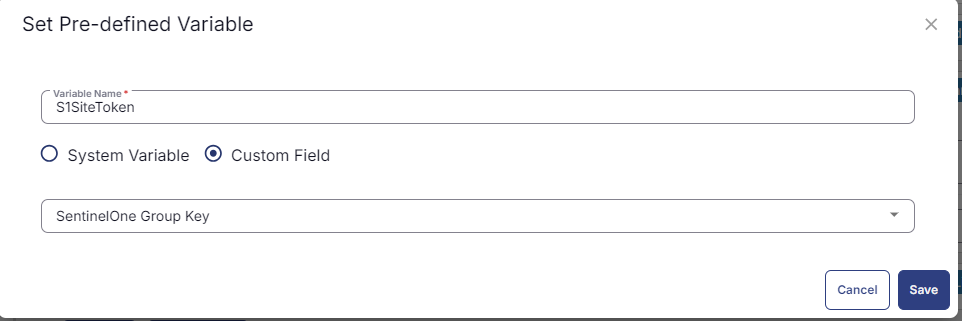
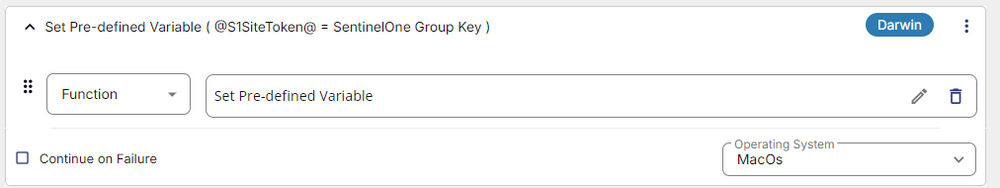

#### ROW 1d Function: Set Pre-defined Variable

Repeat the Row 1b steps but limit the pre-defined variable to Linux machines.


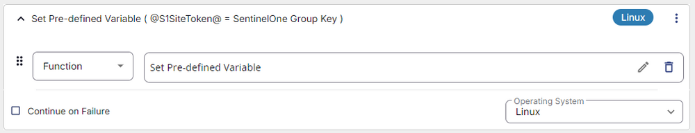

#### ROW 1e Logic: If/Then/Else

Add if/then/else logic in the else section.


##### ROW 1e(i) Condition: Custom Field Contains

Select the `Custom Field` from the dropdown menu inside the If section of the inner If else.


Search and select the `SentinelOne Site Key` custom field and type `NA` in the comparator and change Contains to Does not Equal and press `Enter`.

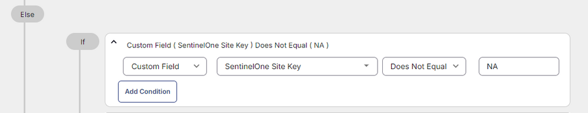

##### ROW 1e(ii) Function: Set Pre-defined Variable

Search and select the `Set Pre-defined Variable` function inside the If section of the inner If else.


The following function will pop up on the screen:


- Type `S1SiteToken` in the `Variable Name` field.
- Select the `Custom Field` Radio button.
- Search and select the Site-level `SentinelOne SiteKey` Custom Field in the `Search Custom Field` field.
- Click the `Save` button to save the changes.
- Select `Windows` as Operating System.


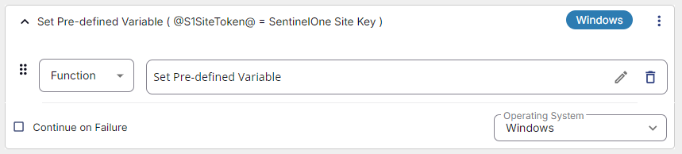

##### ROW 1e(iii) Function: Set Pre-defined Variable

Repeat the ROW 1e(ii) steps but limit the pre-defined variable to MAC machines.

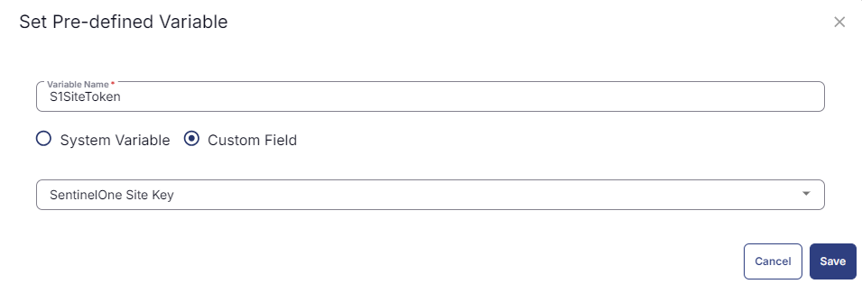
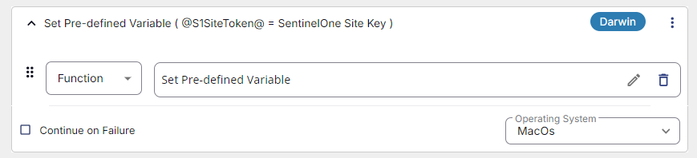

##### ROW 1e(iv) Function: Set Pre-defined Variable

Repeat the ROW 1e(ii) steps but limit the pre-defined variable to Linux machines.


##### ROW 1e(v) Function: Script Exit

Click the `Add Row` button inside the `else` section of inner if/else.


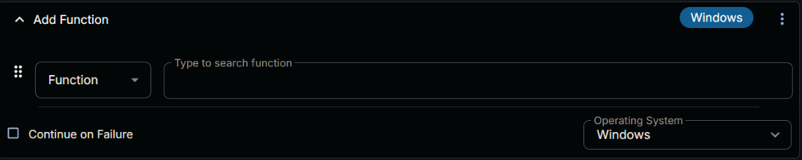

Search and select the `Script Exit` function in the newly appeared row.

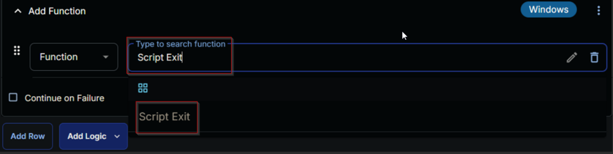
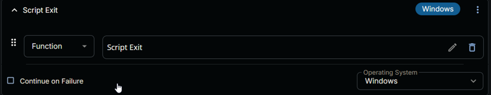

The following function will pop up on the screen:

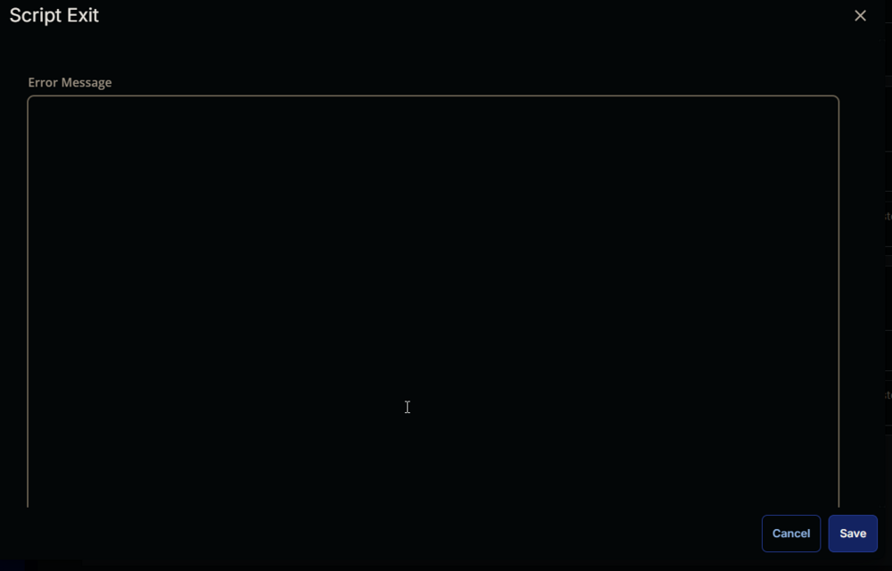

Type the below error message inside the `Error Message` box and hit save.

```
SentinelOne Group/Site key were not set. Please review the Company/Site custom fields and fill either of them, and then re-run the script.
```

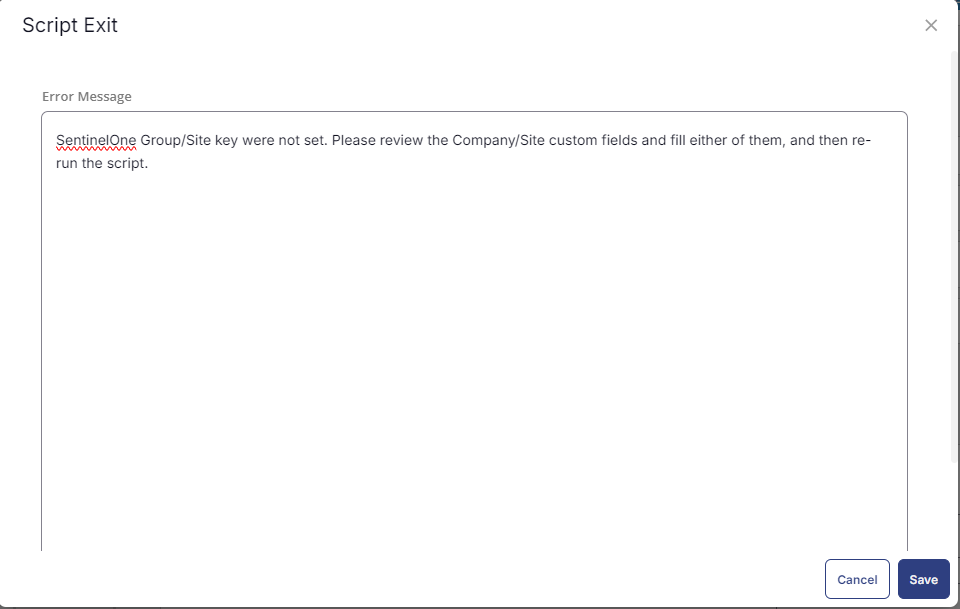

##### ROW 1e(vi) Function: Script Exit

Repeat the ROW 1e(v) steps but limit the Script Exit function to MAC machines.

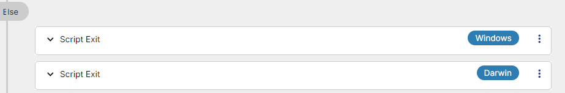

##### ROW 1e(vii) Function: Script Exit

Repeat the ROW 1e(v) steps but limit the Script Exit function to Linux machines.

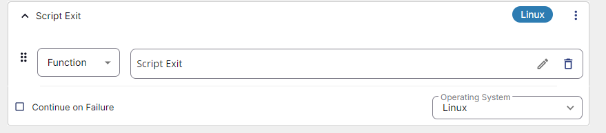

### Row 2 Function: PowerShell Script

Add a new row by clicking on the `Add Row` button.

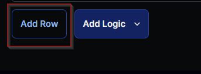

A blank function will appear.


Search and select the `PowerShell Script` function.

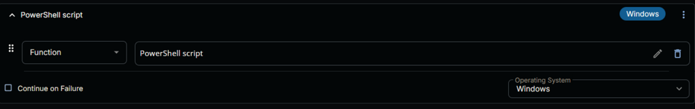

The following function will pop up on the screen:


Paste in the following PowerShell script and leave the expected time of script execution to `300` seconds. Click the `Save` button.

```
$regInstallPath = 'HKLM://SYSTEM//CurrentControlSet//Services//SentinelAgent//config'
if (Test-Path -Path $regInstallPath) {
    return 'SUCCESS - SentinelOne agent already installed.'
}
$siteToken = '@S1SiteToken@'
$tempDirectory = "$env:SystemDrive//temp"
$installerPath = "$tempDirectory//SentinelOneAgent-Windows.msi"
$downloadUri = "https://cwa.connectwise.com/tools/sentinelone/SentinelOneAgent-Windows_$(if([System.Environment]::Is64BitOperatingSystem) { '64' } else { '32' })bit.msi"
mkdir $tempDirectory -ErrorAction SilentlyContinue | Out-Null
(New-Object System.Net.WebClient).DownloadFile($downloadUri, $installerPath)
if (!(Test-Path $installerPath)) {
    return 'ERROR - File download failed.'
}
Start-Process -FilePath "$env:windir//system32//msiexec.exe" -ArgumentList '/i', $installerPath, "SITE_TOKEN=$siteToken", '/QUIET', '/NORESTART', '/L*V', "$tempDirectory//S1Install.log" -Wait | Out-Null
if (Test-Path -Path $regInstallPath) {
    return 'SUCCESS - SentinelOne agent installed.'
} else {
    return 'ERROR - SentinelOne agent failed to install.'
}
```

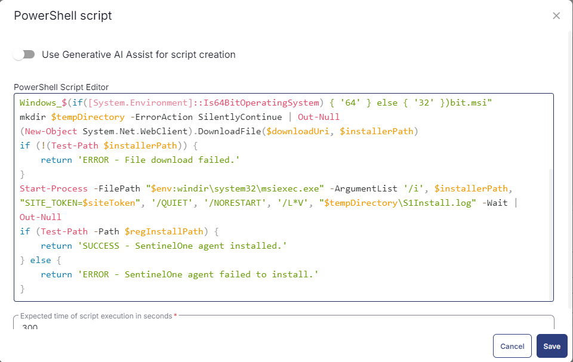

Limit this PowerShell function to run on `Windows` machines only.

## Row 3 Function: Bash Script

Add another row and select the `Bash Script` function.

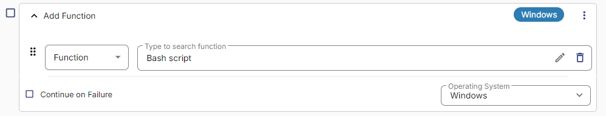

The following function will pop up on the screen:

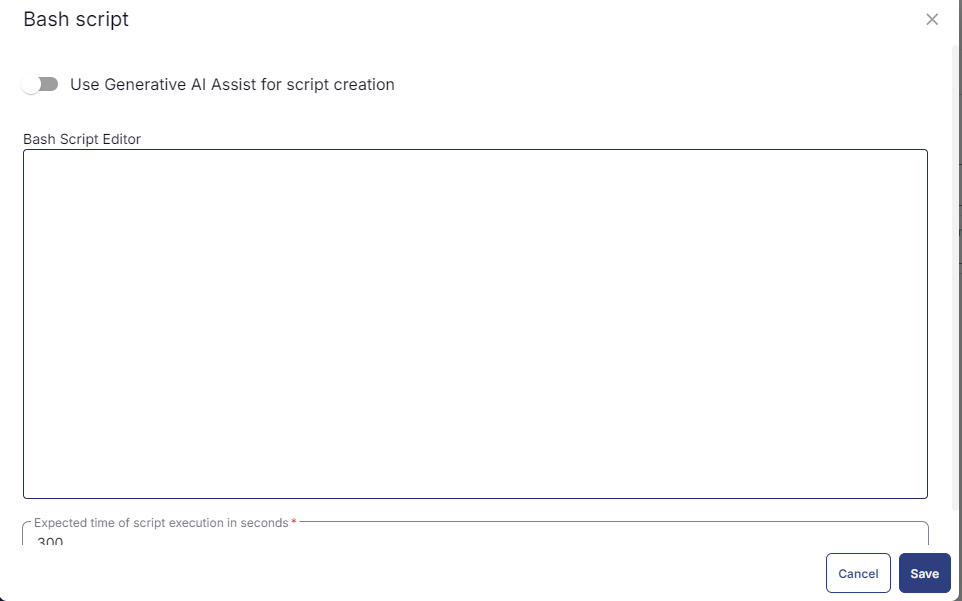

Paste in the following Bash script and leave the expected time of script execution to `300` seconds. Click the `Save` button.

```
echo '@S1SiteToken@' > "/tmp/com.sentinelone.registration-token"

sleep 5

curl -o "/tmp/SentinelOneAgent-macos.pkg" "https://cwa.connectwise.com/tools/sentinelone/SentinelOneAgent-macos.pkg"

sleep 5

if [ -f "/Library/Sentinel/sentinel-agent.bundle/Contents/MacOS/SentinelAgent.app/Contents/MacOS/SentinelAgent" ]; then
    echo "SUCCESS - SentineOne agent already installed."
    exit 0
fi

sudo installer -pkg "/tmp/SentinelOneAgent-macos.pkg" -target /

sleep 5

if [ -f "/Library/Sentinel/sentinel-agent.bundle/Contents/MacOS/SentinelAgent.app/Contents/MacOS/SentinelAgent" ]; then
    echo "SUCCESS - SentineOne agent installed."
    exit 0
else 
    echo "ERROR - SentinelOne agent failed to install."
    exit 1
fi
```

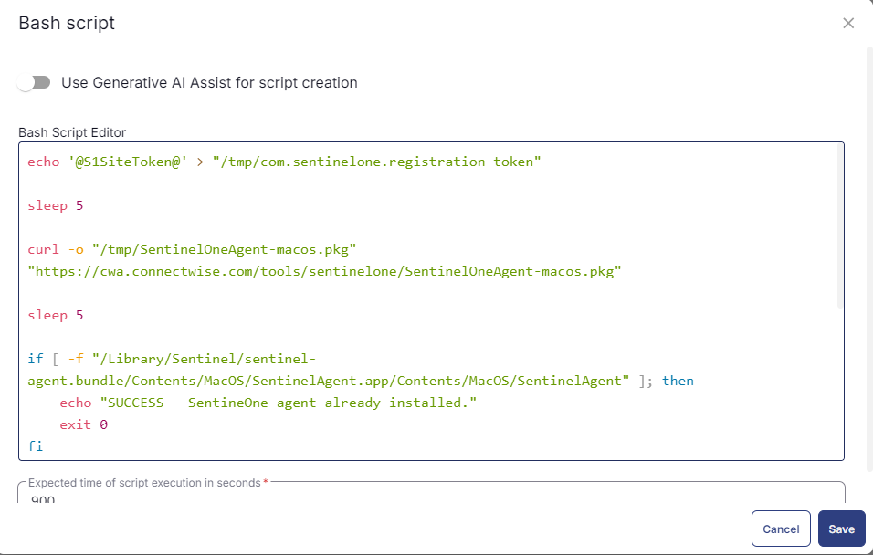

Limit the bash file to run on `Mac` machines only.

## Row 4 Function: Bash Script

Add another row and select the `Bash Script` function.


The following function will pop up on the screen:


Paste in the following Bash script and leave the expected time of script execution to `300` seconds. Click the `Save` button.

```
#!/bin/bash
# https://community.automox.com/find-share-worklets-12/worklet-install-sentinelone-agent-linux-1807
rpm_filename="SentinelAgent-Linux_x86-64.rpm"
deb_filename="SentinelAgent-Linux_x86-64.deb"
site_token="@S1SiteToken@"

rpm_installer="$(pwd)/$rpm_filename"
deb_installer="$(pwd)/$deb_filename"

# Check if SentinelOne is already installed
if sudo sentinelctl version > /dev/null; then
  echo "Software is already installed"
  exit 0
fi

install_command=""
# Define install command based on system type
if [ -x "$(command -v dpkg)" ]; then
  echo "Installing $deb_installer"
  curl -o "$deb_installer" "https://s3.amazonaws.com/update2.itsupport247.net/SentinelOne/sentinelone_latest/SentinelAgent-Linux_x86-64.deb"
  install_command="sudo dpkg -i $deb_installer"
elif [ -x "$(command -v rpm)" ]; then
  echo "Installing $rpm_installer"
  curl -o "$rpm_installer" "https://s3.amazonaws.com/update2.itsupport247.net/SentinelOne/sentinelone_latest/SentinelAgent-Linux_x86-64.rpm"
  install_command="sudo rpm -i --nodigest $rpm_installer"
else
  echo "Unable to install software; either rpm or dpkg package manager must be present on system"
  exit 1
fi

if eval "$install_command"; then
  echo "Software successfully installed"

  echo "Registering SentinelOne agent"
  sudo /opt/sentinelone/bin/sentinelctl management token set "$site_token"
  sudo /opt/sentinelone/bin/sentinelctl control start
  exit 0
else
  echo "Software failed to install"
  exit 1
fi
```

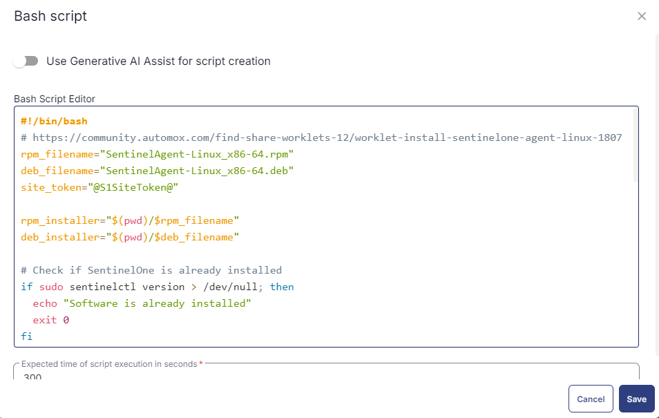

Limit the bash file to run on `Linux` machines only.

## Row 5 Function: Set Custom Field

Add a new row by clicking the `Add Row` button.

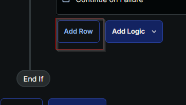

Search and select `Set Custom Field` function.

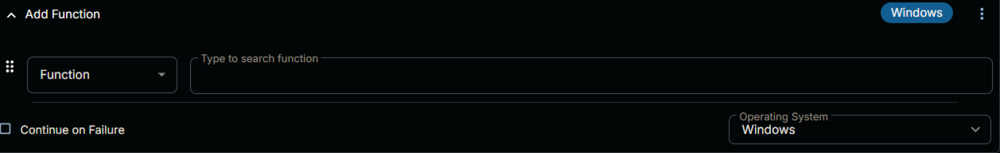

Search and select `SentinelOne Deployment Result` in the `Search Custom Field` field and set `%output%` in the `Value` field and click the `Save` button.

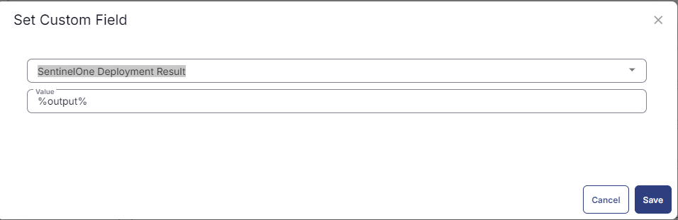

Limit the function to Windows machines.

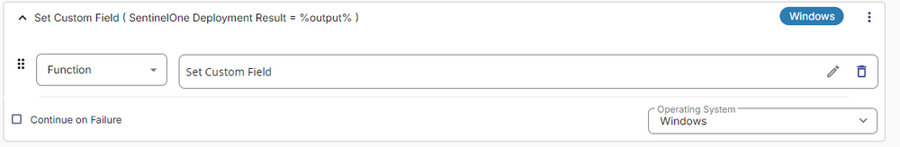

## Row 6 Function: Set Custom Field

Repeat the ROW 5 steps but limit the function to Mac machines.

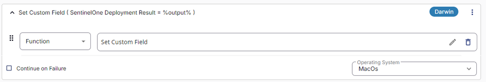

## Row 7 Function: Set Custom Field

Repeat the ROW 5 steps but limit the function to Linux machines.

## Completed Script

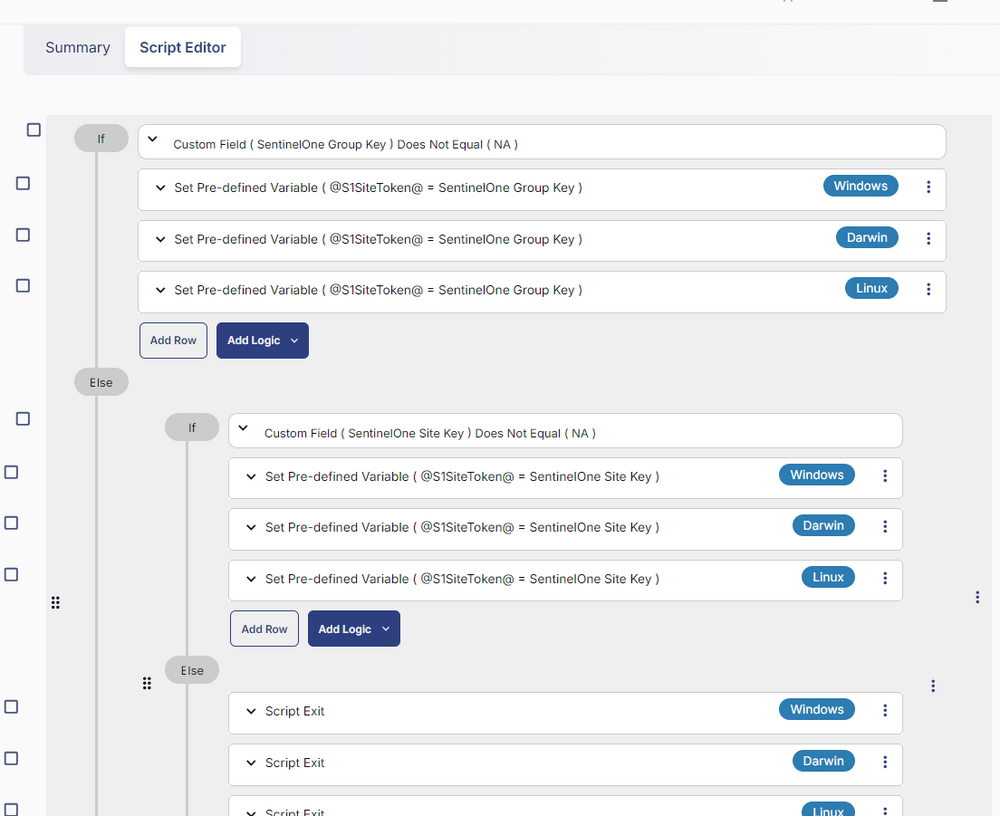

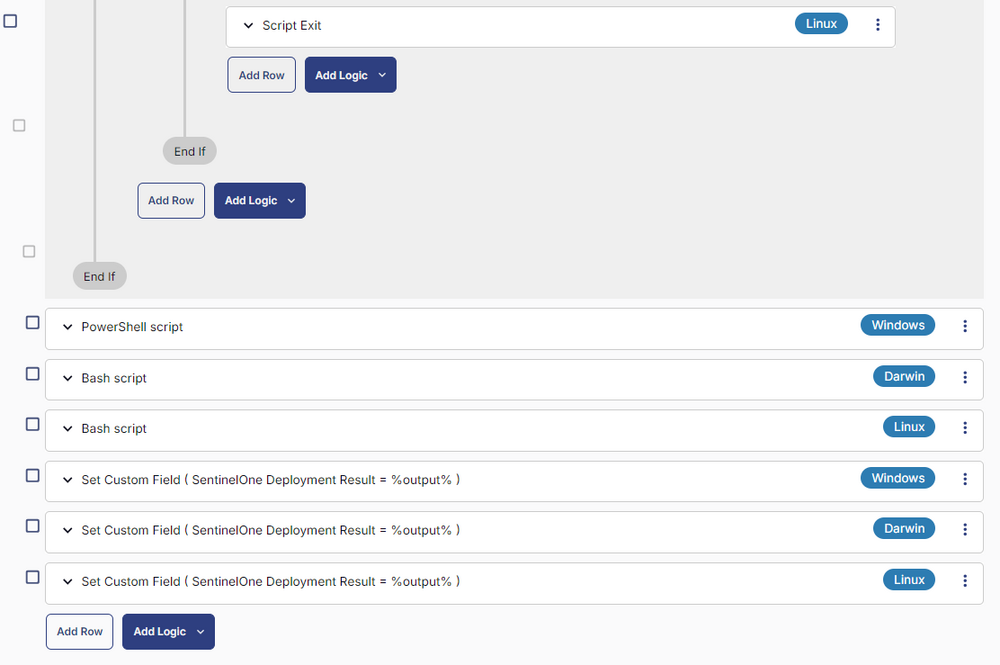

## Deployment

This task has to be scheduled on `SentinelOne Deployment` group for auto deployment. Script can also be run manually if required.

Go to Automations > Tasks.  
Search for SentinelOne Deployment.  
Then click on Schedule and provide the parameters detail as it is necessary for the script completion.

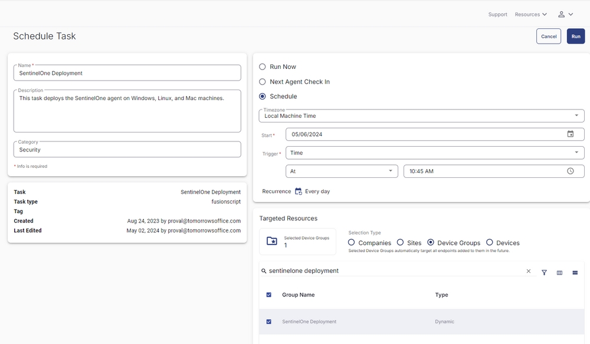

## Output

- Script Log
- Custom Field


