## Summary

This document outlines how to set an enforced homepage in popular browsers like Brave, Chrome, and Edge.

## Sample Run

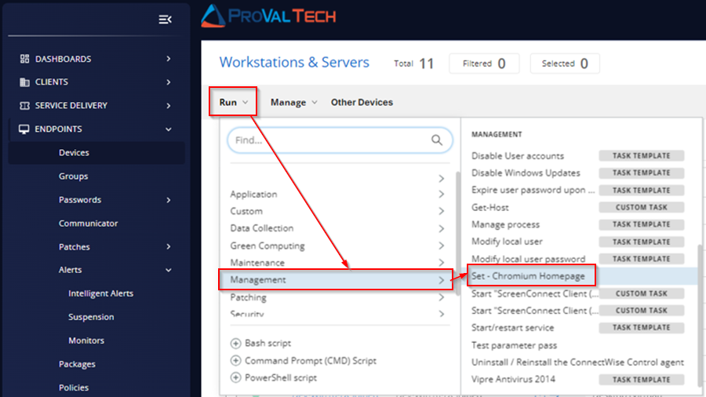

To add [https://www.google.com/](https://www.google.com/) to the homepage for Edge:

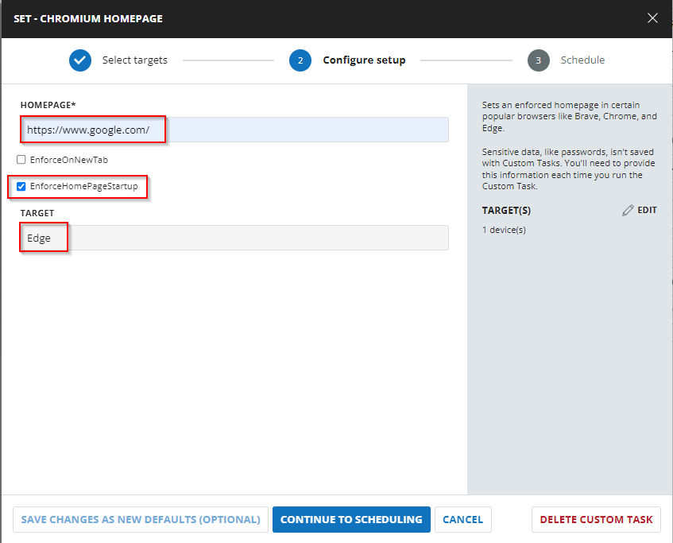

Select `Run Now` and click on `Run Task`:

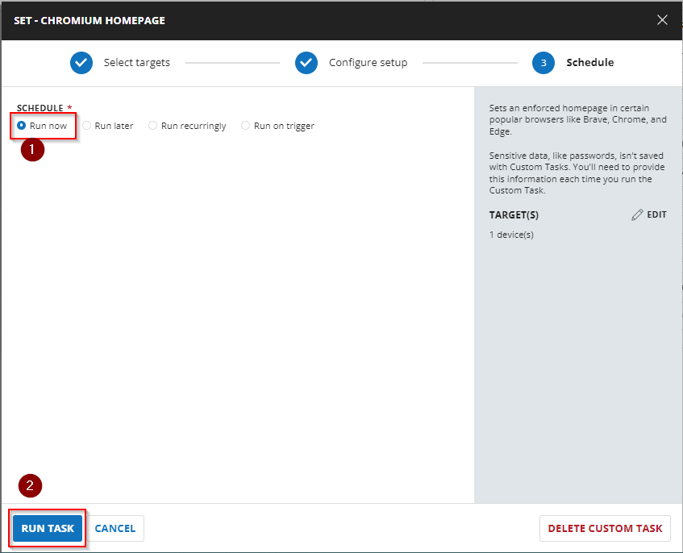

## Dependencies

[Set-ChromeHomepage](https://proval.itglue.com/DOC-5078775-7347741)

## User Parameters

| Name                     | Example                          | Required | Description                                                                                               |
|--------------------------|----------------------------------|----------|-----------------------------------------------------------------------------------------------------------|
| Homepage                 | [https://www.google.com/](https://www.google.com/) | True     | String value of the homepage to set in the browser.                                                      |
| EnforceOnNewTab         | --                               | False    | Include this switch to force the homepage on each new tab instead of the new tab page.                  |
| EnforceHomepageStartup    | --                               | False    | Include this switch to force the homepage to be the only open tab at startup of the browser.             |
| Target                   | Brave, Chrome, Edge              | False    | This designates the targeted Chromium-based browser to apply the setting to. You can leave the field blank if you want to set the same homepage for all the Chromium browsers available. |

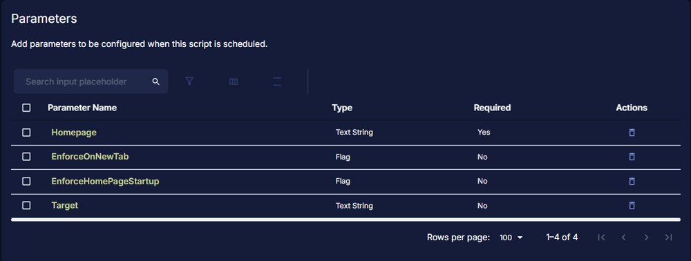

## Implementation

Create a new `Script Editor` style script in the system to implement this task.


**Name:** Set - Chromium Homepage  
**Description:** Sets an enforced homepage in certain popular browsers like Brave, Chrome, and Edge.  
**Category:** Management

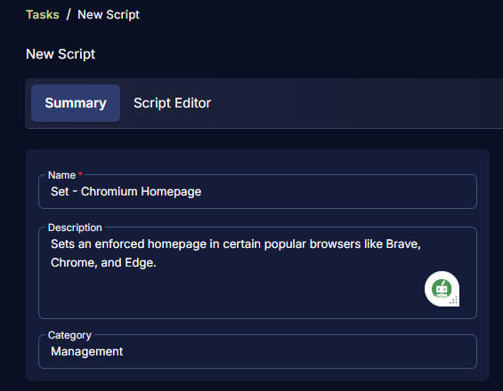

## Parameters

Add a new parameter by clicking the `Add Parameter` button present at the top-right corner of the screen.


This screen will appear.

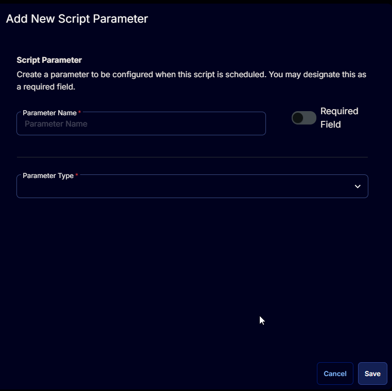

### Homepage

- Set `Homepage` in the `Parameter Name` field.
- Select `Text String` from the `Parameter Type` dropdown menu.
- Toggle ON the `Required Field` button.
- Click the `Save` button.

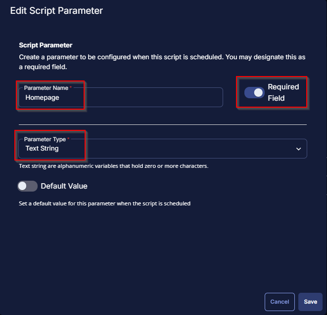

Click the `Confirm` button to save the parameter.

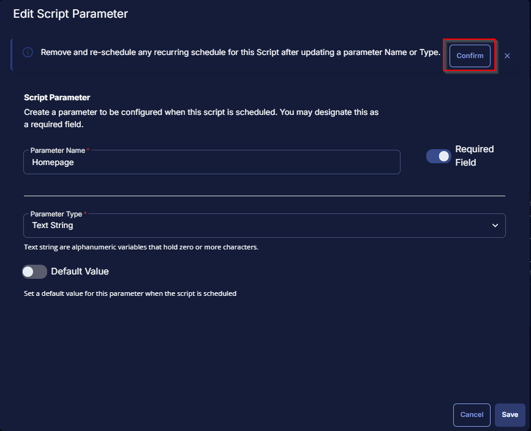

### EnforceOnNewTab

- Set `EnforceOnNewTab` in the `Parameter Name` field.
- Select `Flag` from the `Parameter Type` dropdown menu.
- Click the `Save` button.

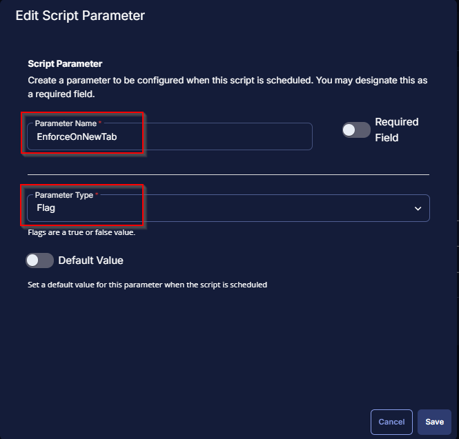

Click the `Confirm` button to save the parameter.

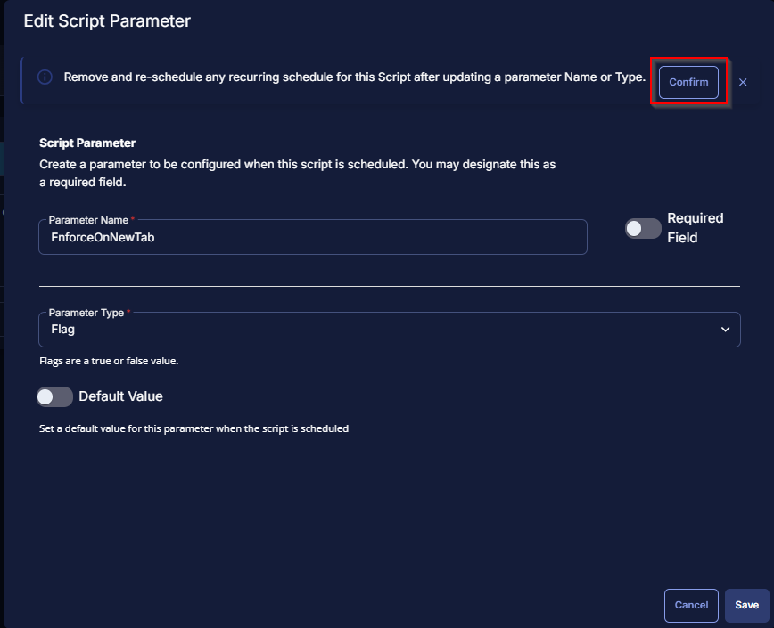

### EnforceHomepageStartup

- Set `EnforceHomepageStartup` in the `Parameter Name` field.
- Select `Flag` from the `Parameter Type` dropdown menu.
- Click the `Save` button.

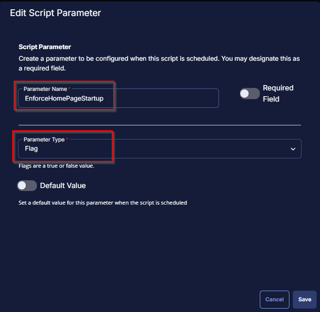

Click the `Confirm` button to save the parameter.

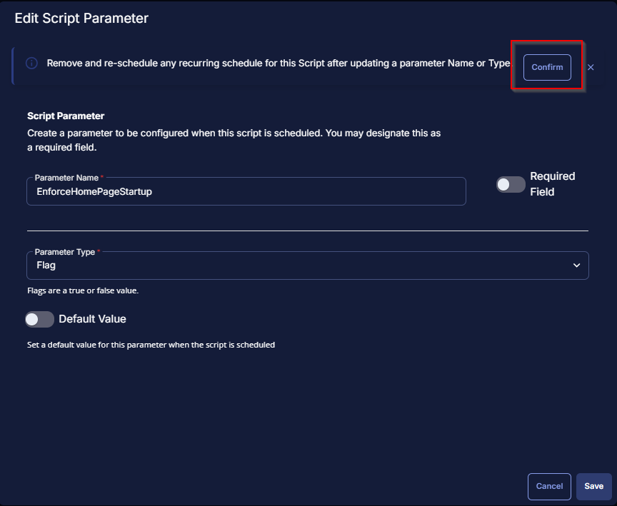

### Target

- Set `Target` in the `Parameter Name` field.
- Select `Text String` from the `Parameter Type` dropdown menu.
- Click the `Save` button.

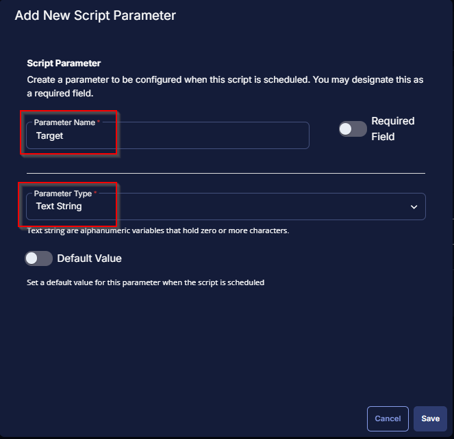

Click the `Confirm` button to save the parameter.

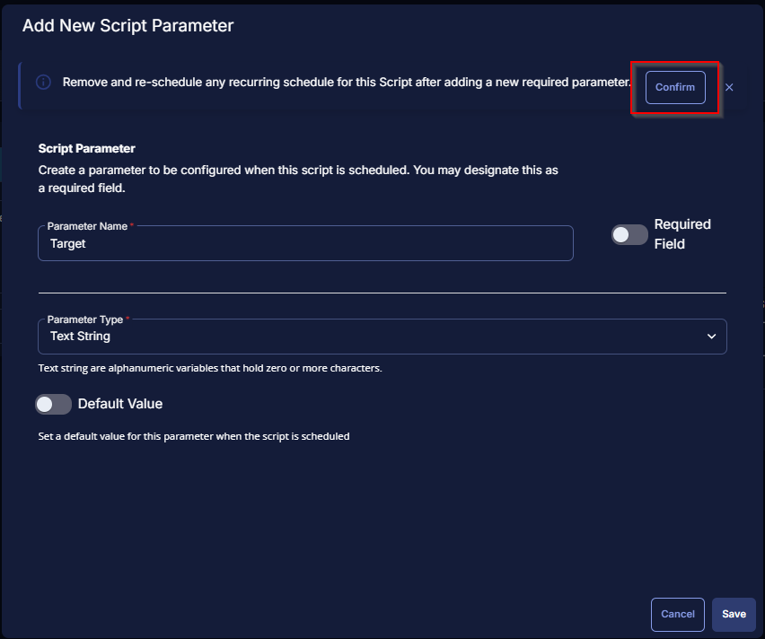

Once all the parameters are created, it should look like this:

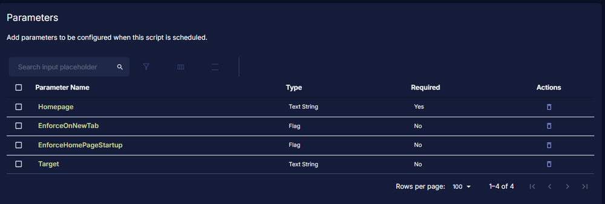

Proceed with the steps below to create a task.

## Task

Navigate to the Script Editor section and start by adding a row. You can do this by clicking the `Add Row` button at the bottom of the script page.

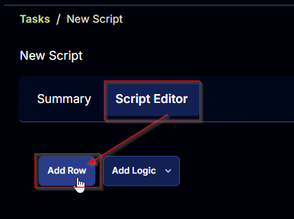

A blank function will appear.


### Row 1 Function: PowerShell Script

Search and select the `PowerShell Script` function.


The following function will pop up on the screen:

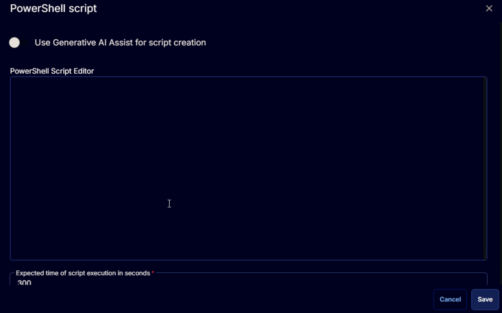

Copy the below PowerShell commands and paste them in the `PowerShell Script Editor` box:

```
# Parameters and Globals
# Be sure that the name of the hashtable property matches the name of the parameter of the script that you are calling.

$Homepage = '@Homepage@'
$EnforceOnNewTab = '@EnforceOnNewTab@'
$EnforceHomePageStartup = '@EnforceHomePageStartup@'
$Target = '@Target@'

if ( $Homepage -match '//SHomePage//S' -or ([String]::IsNullOrWhiteSpace($Homepage)) ) {
    throw 'Homepage is not set correctly.'
} elseif ( $Homepage.Length -lt 2 ) {
    throw 'Homepage is not set correctly.'
}

$Parameters = @{
    HomePage = $Homepage
}

if ( $EnforceOnNewTab -match '1|Yes|True' ) {
    $parameters.Add( 'EnforceOnNewTab', $true )
}

if ( $EnforceHomePageStartup -match '1|Yes|True' ) {
    $parameters.Add( 'EnforceHomePageStartup', $true )
}

$Browser = @()
if ( $Target -match '//STarget//S' -or ([String]::IsNullOrWhiteSpace($Target)) ) {
    $Browser += 'Brave', 'Chrome', 'Edge'
} elseif ( $target.Length -lt 2  ) {
    $Browser += 'Brave', 'Chrome', 'Edge'
} else {
    if ( $target -match 'Brave' ) {
        $Browser += 'Brave'
    }
    if ( $target -match 'Chrome' ) {
        $Browser += 'Chrome'
    }
    if ( $target -match 'Edge' ) {
        $Browser += 'Edge'
    }
}
$parameters.Add( 'Target', $Browser )

#region Setup - Variables
$ProjectName = 'Set-ChromiumHomepage'
[Net.ServicePointManager]::SecurityProtocol = [enum]::ToObject([Net.SecurityProtocolType], 3072)
$BaseURL = 'https://file.provaltech.com/repo/'
$PS1URL = "$BaseURL/script/$ProjectName.ps1"
$WorkingDirectory = "C://ProgramData//_automation//script//$ProjectName/"
$PS1Path = "$WorkingDirectory//$ProjectName.ps1"
$Workingpath = $WorkingDirectory
$LogPath = "$WorkingDirectory//$ProjectName-log.txt"
$ErrorLogPath = "$WorkingDirectory//$ProjectName-Error.txt"
#endregion
#region Setup - Folder Structure
New-Item -Path $WorkingDirectory -ItemType Directory -ErrorAction SilentlyContinue | Out-Null
$response = Invoke-WebRequest -Uri $PS1URL -UseBasicParsing
if (($response.StatusCode -ne 200) -and (!(Test-Path -Path $PS1Path))) {
    throw "No pre-downloaded script exists and the script '$PS1URL' failed to download. Exiting."
} elseif ($response.StatusCode -eq 200) {
    Remove-Item -Path $PS1Path -ErrorAction SilentlyContinue
    [System.IO.File]::WriteAllLines($PS1Path, $response.Content)
}
if (!(Test-Path -Path $PS1Path)) {
    throw 'An error occurred and the script was unable to be downloaded. Exiting.'
}
#endregion
#region Execution
if ($Parameters) {
    & $PS1Path @Parameters
} else {
    & $PS1Path
}
#endregion

if (!(Test-Path $LogPath)) {
    throw 'PowerShell Failure. A Security application seems to have restricted the execution of the PowerShell Script.'
}
if (Test-Path $ErrorLogPath) {
    $ErrorContent = (Get-Content -Path $ErrorLogPath)
    throw $ErrorContent
}
Get-Content -Path $LogPath
```

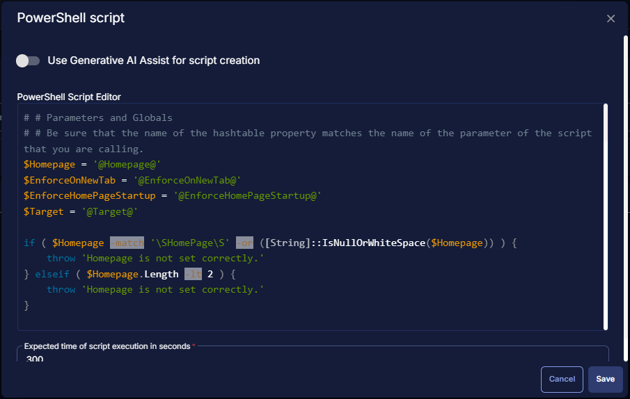

### Row 2 Function: Script Log

Add a new row by clicking the `Add Row` button.


A blank function will appear.


Search and select the `Script Log` function.


The following function will pop up on the screen:


In the script log message, simply type `%output%` and click the `Save` button.

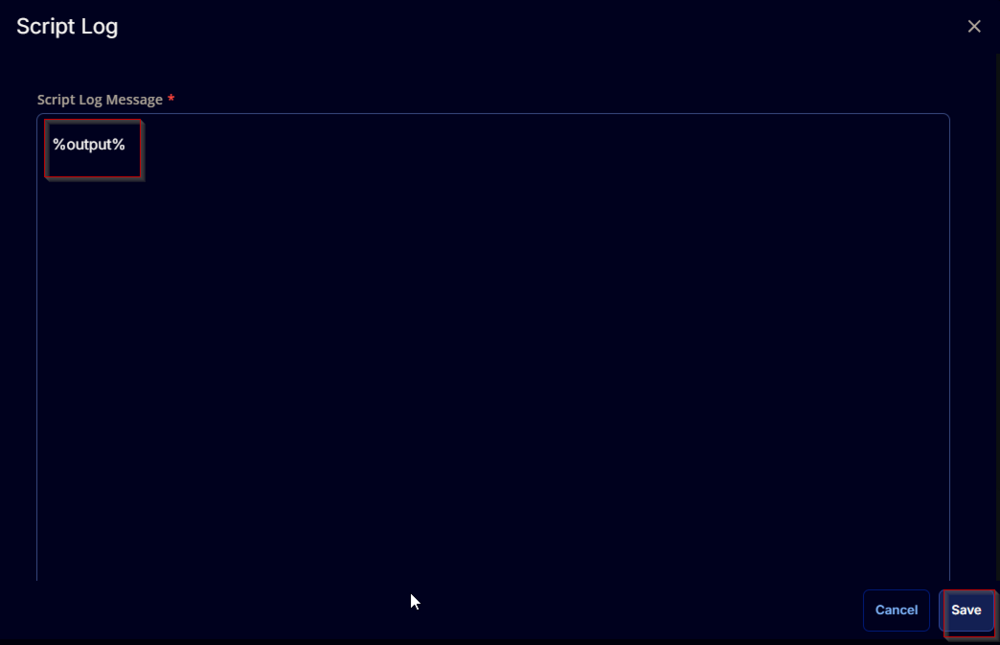

Click the `Save` button at the top-right corner of the screen to save the script.


## Completed Task

The Script Editor should look like this:

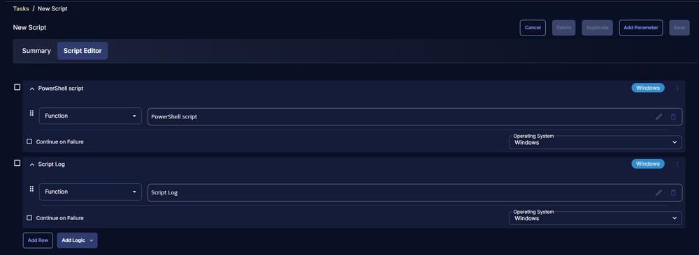

## Output

- Script log

