## Summary

Applies a homepage to Firefox. CW RMM implementation of [Set-FirefoxHomepage](<../../powershell/Set-FirefoxHomepage.md>).

## Sample Run

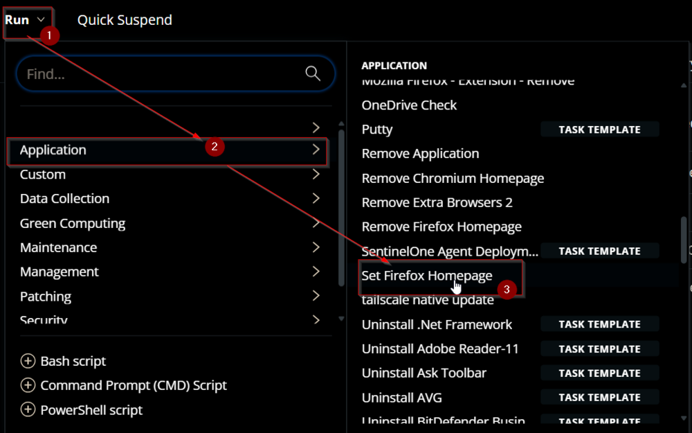  
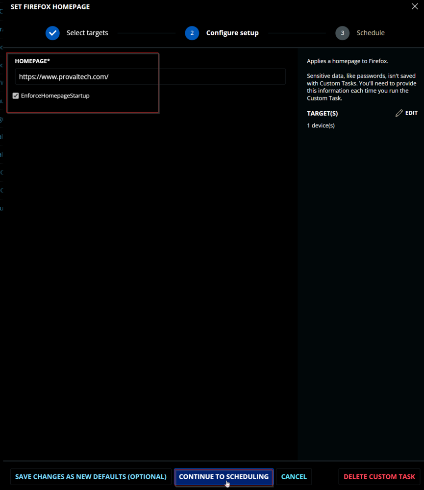  
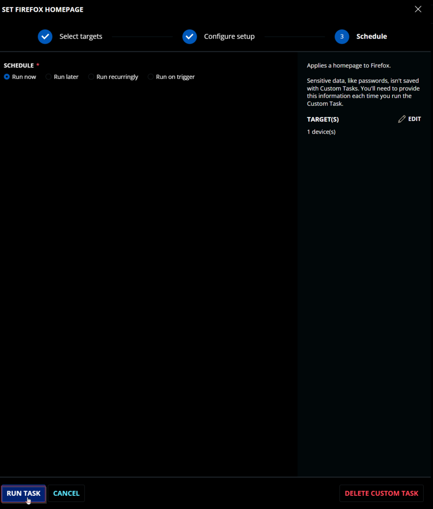  

## Dependencies

[SWM - Software Configuration - Set-FirefoxHomepage](<../../powershell/Set-FirefoxHomepage.md>)  

## User Parameters

| Name                        | Example                               | Required | Type         | Description                           |
|-----------------------------|---------------------------------------|----------|--------------|---------------------------------------|
| `Homepage`                  | [https://www.provaltech.com](https://www.provaltech.com) | True     | Text String  | The URL to the desired homepage.      |
| `EnforceHomepageStartup`    | 0/1                                   | False    | Flag         | Sets the browser to display the homepage on startup. |

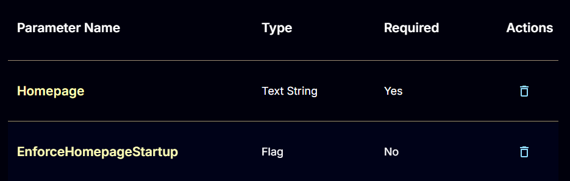  

## Task Creation

Create a new `Script Editor` style script in the system to implement this Task.  
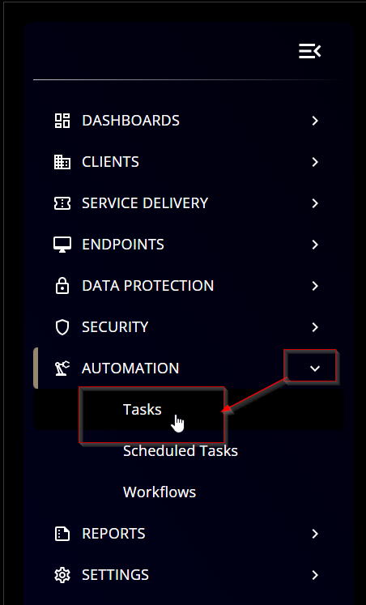  
  

**Name:** `Set Firefox Homepage`  
**Description:** `Applies a homepage to Firefox.`  
**Category:** `Application`  
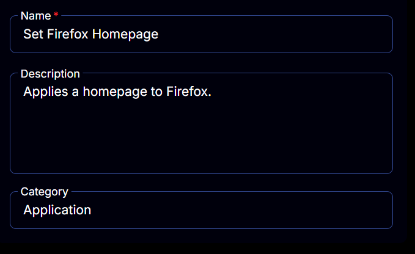  

## Parameters

### Homepage:
Add a new parameter by clicking the `Add Parameter` button present at the top-right corner of the screen.  
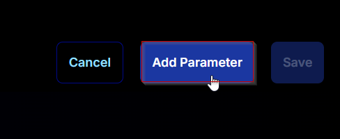  

This screen will appear.  
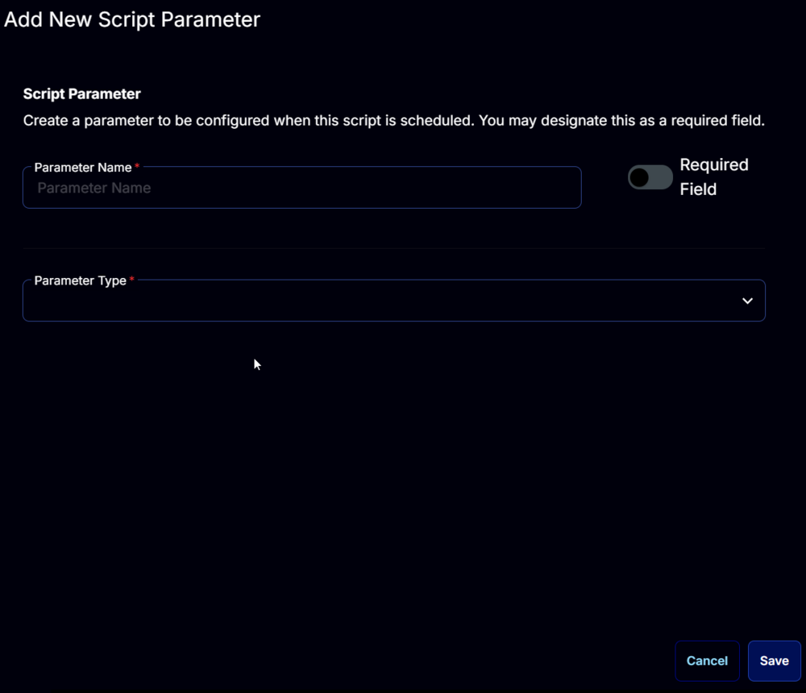  

- Set `Homepage` in the `Parameter Name` field.
- Enable the `Required Field` button.
- Select `Text String` from the `Parameter Type` dropdown menu.
- Click the `Save` button.  

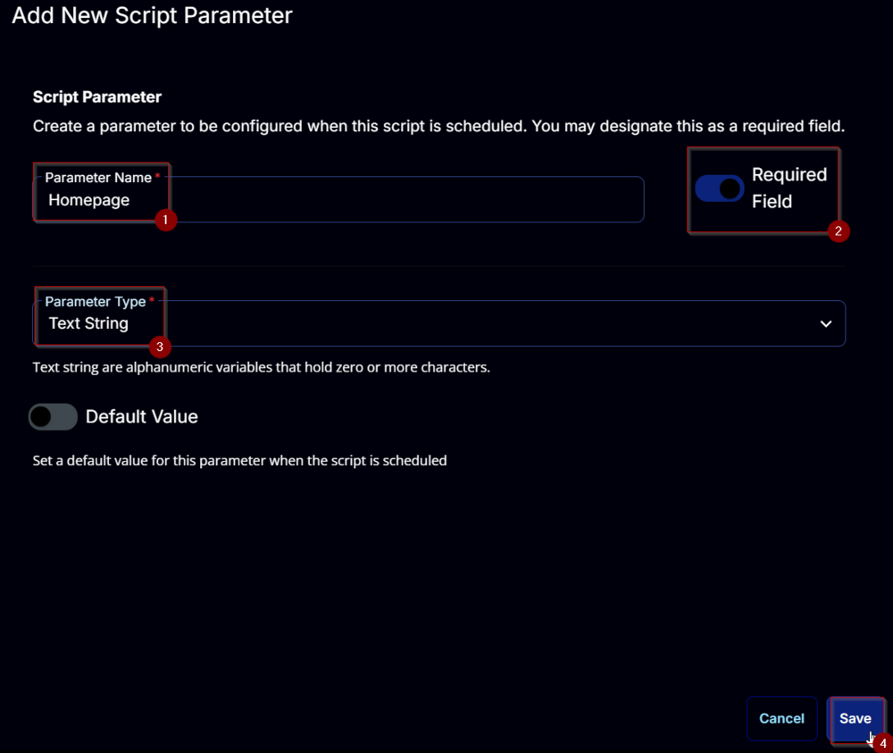  

### EnforceHomepageStartup:
Add a new parameter by clicking the `Add Parameter` button present at the top-right corner of the screen.  
  

This screen will appear.  
  

- Set `EnforceHomepageStartup` in the `Parameter Name` field.
- Select `Flag` from the `Parameter Type` dropdown menu.
- Click the `Save` button.  

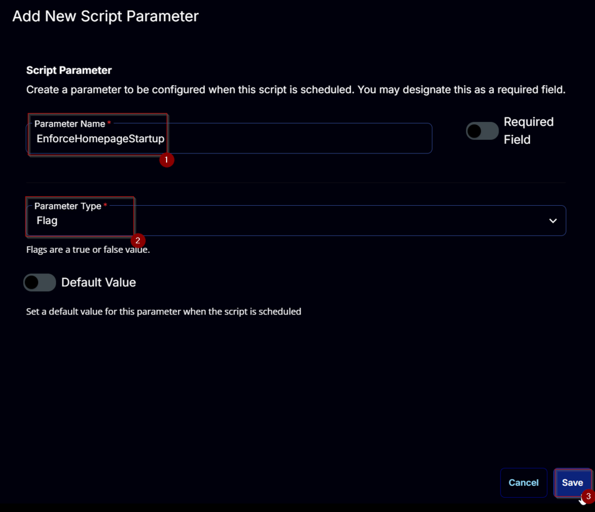  

## Task

Navigate to the Script Editor Section and start by adding a row. You can do this by clicking the `Add Row` button at the bottom of the script page.  
  

A blank function will appear.  
  

### Row 1 Function: PowerShell Script
Search and select the `PowerShell Script` function.  
  
  

The following function will pop up on the screen:  
  

Paste in the following PowerShell script and set the `Expected time of script execution in seconds` to `300` seconds. Click the `Save` button.  

```powershell
#region parameters
$Homepage = '@Homepage@'
$EnforceHomepageStartup = '@EnforceHomepageStartup@'
if ( $Homepage -match '/SHomePage/S' -or ($null -eq $Homepage) ) {
    throw 'Homepage is not set correctly.'
} elseif ( $Homepage.Length -lt 2 ) {
    throw 'Homepage is not set correctly.'
}
$parameters = @{
    Homepage = $Homepage
}
if ( $EnforceHomepageStartup -match '1|Yes|True' ) {
    $parameters.Add('EnforceHomepageStartup', $true)
}
#endregion

#region Setup - Variables
$ProjectName = 'Set-FirefoxHomepage'
[Net.ServicePointManager]::SecurityProtocol = [enum]::ToObject([Net.SecurityProtocolType], 3072)
$BaseURL = 'https://file.provaltech.com/repo'
$PS1URL = "$BaseURL/script/$ProjectName.ps1"
$WorkingDirectory = "C:/ProgramData/_automation/script/$ProjectName"
$PS1Path = "$WorkingDirectory/$ProjectName.ps1"
$Workingpath = $WorkingDirectory
$LogPath = "$WorkingDirectory/$ProjectName-log.txt"
$ErrorLogPath = "$WorkingDirectory/$ProjectName-Error.txt"
#endregion

#region Setup - Folder Structure
New-Item -Path $WorkingDirectory -ItemType Directory -ErrorAction SilentlyContinue | Out-Null
$response = Invoke-WebRequest -Uri $PS1URL -UseBasicParsing
if (($response.StatusCode -ne 200) -and (!(Test-Path -Path $PS1Path))) {
    throw "No pre-downloaded script exists and the script '$PS1URL' failed to download. Exiting."
} elseif ($response.StatusCode -eq 200) {
    Remove-Item -Path $PS1Path -ErrorAction SilentlyContinue
    [System.IO.File]::WriteAllLines($PS1Path, $response.Content)
}
if (!(Test-Path -Path $PS1Path)) {
    throw 'An error occurred and the script was unable to be downloaded. Exiting.'
}
#endregion

#region Execution
if ($Parameters) {
    & $PS1Path @Parameters
} else {
    & $PS1Path
}
#endregion

if ( !(Test-Path $LogPath) ) {
    throw 'PowerShell Failure. A Security application seems to have restricted the execution of the PowerShell Script.'
}
if ( Test-Path $ErrorLogPath ) {
    $ErrorContent = ( Get-Content -Path $ErrorLogPath )
    throw $ErrorContent
}
Get-Content -Path $LogPath
```

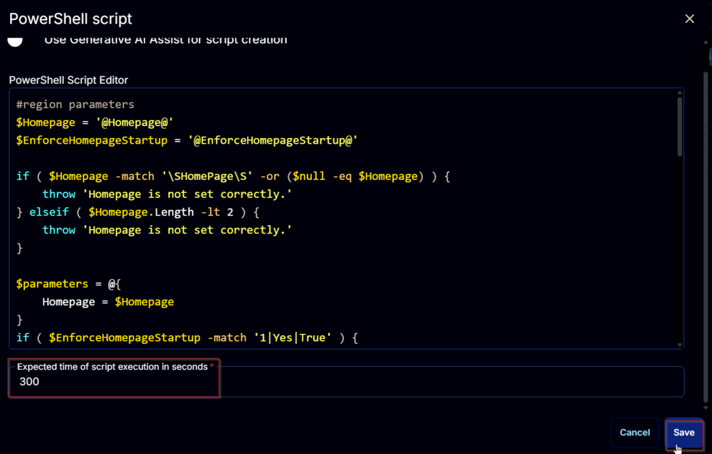  

### Row 2 Function: Script Log
Add a new row by clicking the `Add Row` button.  
  

A blank function will appear.  
  

Search and select the `Script Log` function.  
  

The following function will pop up on the screen:  
  

In the script log message, simply type `%Output%` and click the `Save` button.  
  

Click the `Save` button at the top-right corner of the screen to save the script.  
  

## Completed Script

  

## Output

- Script Log  
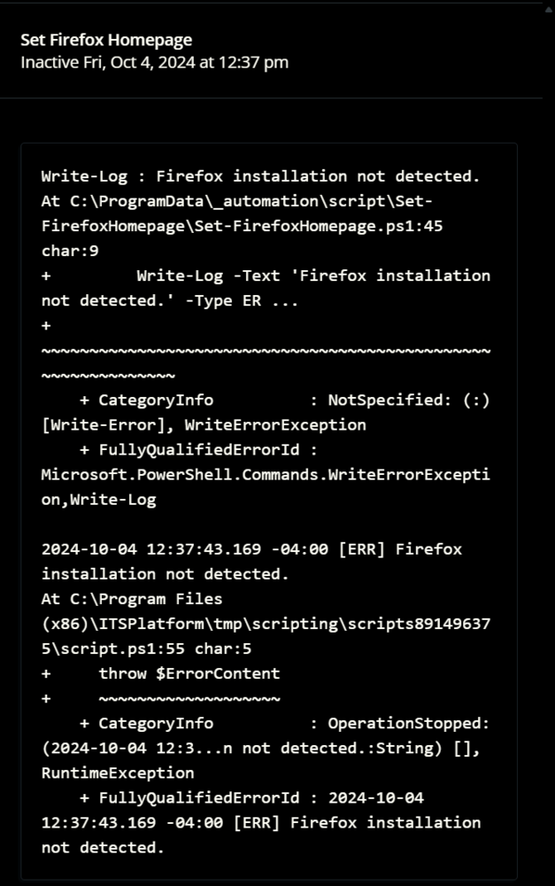  


