## Summary

This is an RMM implementation of the agnostic script [EPM - User Management - Agnostic - Script - Set-LastLoggedOnUser](<../../powershell/Set-LastLoggedOnUser.md>) to manage the last logged-in user's information displayed on the Windows login screen.

## Sample Run

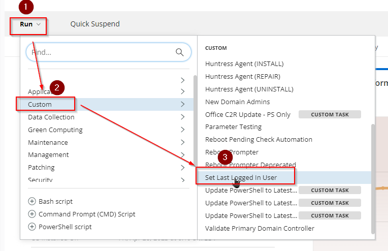

- Select the parameters below to clear the last logged-in user's information from the login screen. The computer must be restarted manually afterward to implement the changes.  
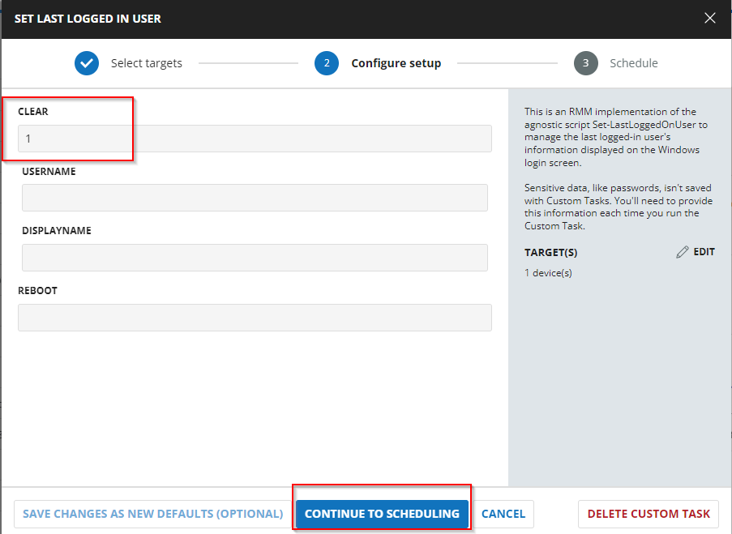  
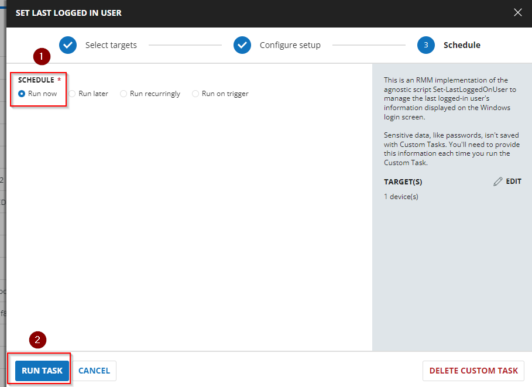

- Similarly, to clear the last logged-in user's information from the login screen and forcefully restart the computer, select the parameters below.  
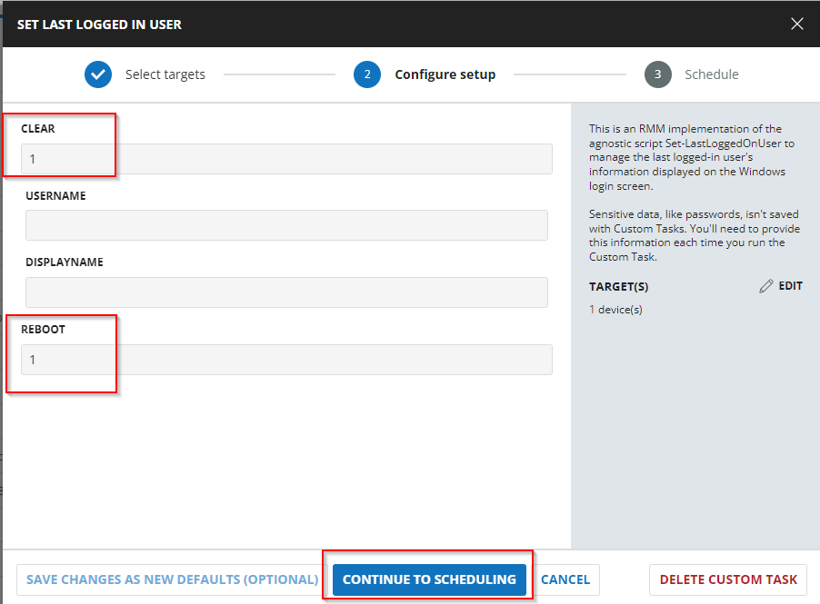

- The parameters below set the specified local user as the last logged-in user. The computer must be restarted manually afterward to implement the changes.  
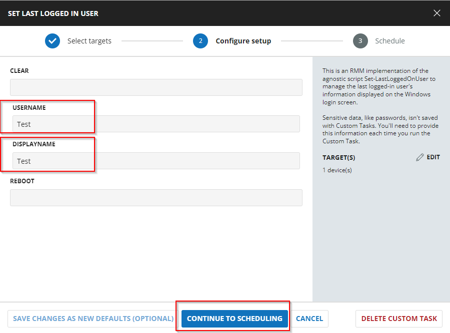

- The parameters below set the specified domain user as the last logged-in user and forcefully restart the computer.  
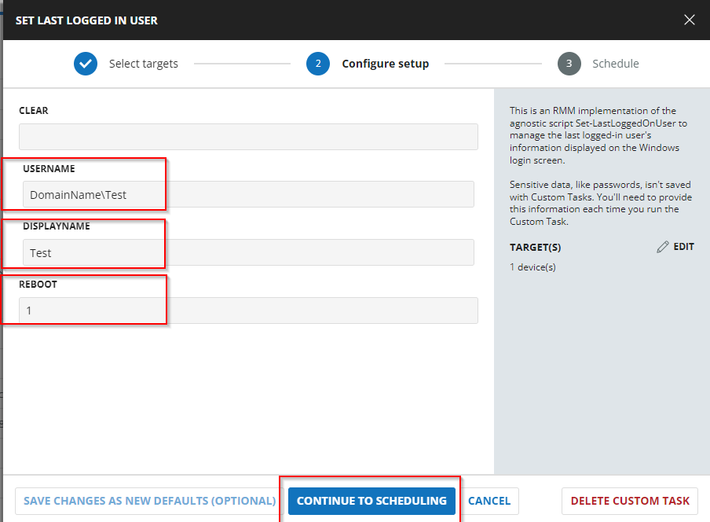

## Dependencies

[EPM - User Management - Agnostic - Script - Set-LastLoggedOnUser](<../../powershell/Set-LastLoggedOnUser.md>)

## User Parameters

| Name        | Example              | Required | Description                                                                                     |
|-------------|----------------------|----------|-------------------------------------------------------------------------------------------------|
| Clear       | 1                    | True     | Clears the last logged-in user's information from the login screen.                            |
| UserName    | Domain/UserName      | False    | Sets the specified username as the last logged-in user. The username should be in the format 'Domain/User' or 'User'. |
| DisplayName | User Name            | False    | Optionally specifies the display name to set for the last logged-in user. If not provided, it defaults to the username. |
| Reboot      | 1                    | False    | Optionally restarts the computer to apply the changes immediately.                             |

## Task Creation

Create a new `Script Editor` style script in the system to implement this Task.


**Name:** Set Last Logged In User  
**Description:** This script manages the last logged-in user's information displayed on the Windows login screen and can optionally restart the computer to apply changes.  
**Category:** Custom  
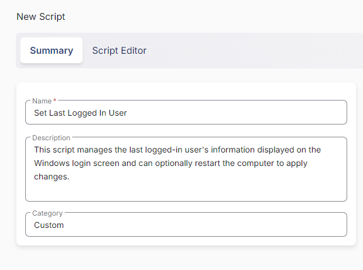

## Parameters

Add a new parameter by clicking the `Add Parameter` button present at the top-right corner of the screen.  


This screen will appear.  


- Set `Clear` in the `Parameter Name` field.
- Select `Number Value` from the `Parameter Type` dropdown menu.
- Click the `Save` button.  
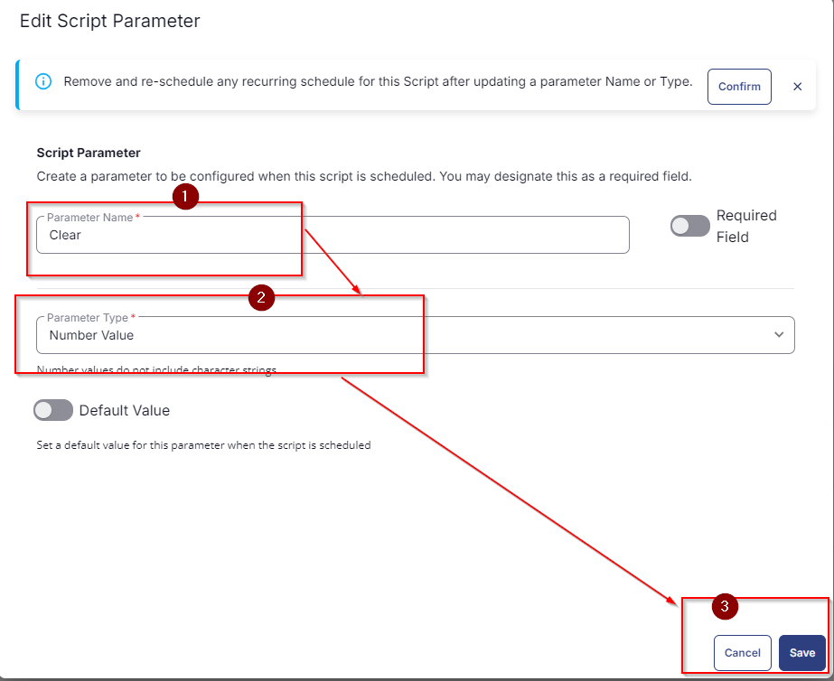

- It will ask for confirmation to proceed. Click the `Confirm` button to create the parameter.  


Add another parameter by clicking the `Add Parameter` button present at the top-right corner of the screen.  


- Set `UserName` in the `Parameter Name` field.
- Select `Text String` from the `Parameter Type` dropdown menu.
- Click the `Save` button.  
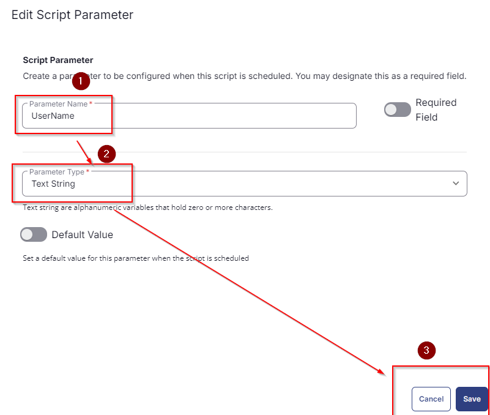

- It will ask for confirmation to proceed. Click the `Confirm` button to create the parameter.

Add another parameter by clicking the `Add Parameter` button present at the top-right corner of the screen.

- Set `DisplayName` in the `Parameter Name` field.
- Select `Text String` from the `Parameter Type` dropdown menu.
- Click the `Save` button.
- It will ask for confirmation to proceed. Click the `Confirm` button to create the parameter.

Add another parameter by clicking the `Add Parameter` button present at the top-right corner of the screen.

- Set `Reboot` in the `Parameter Name` field.
- Select `Number Value` from the `Parameter Type` dropdown menu.
- Click the `Save` button.
- It will ask for confirmation to proceed. Click the `Confirm` button to create the parameter.

All the parameters will look like the following:  
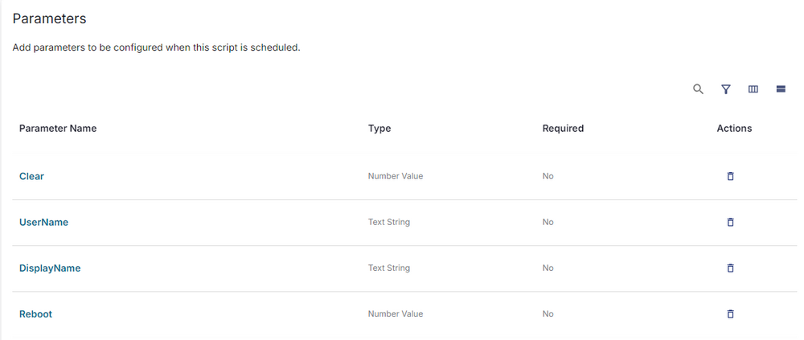

## Task

Navigate to the Script Editor Section and start by adding a row. You can do this by clicking the `Add Row` button at the bottom of the script page.  


A blank function will appear.  


### Row 1 Function: PowerShell Script

Search and select the `PowerShell Script` function.  


The following function will pop up on the screen:  


Paste the following PowerShell script and set the expected time of script execution to `900` seconds. Click the `Save` button.

```powershell
$Clear = "@Clear@"
$UserName = "@UserName@"
$DisplayName = "@DisplayName@"
$Reboot = "@Reboot@"

#region Setup - Variables
$ProjectName = 'Set-LastLoggedOnUser'
# Parameters and Globals
# Be sure that the name of the hashtable property matches the name of the parameter of the script that you are calling.
if ($Clear -eq 1) {
    $parameters = @{
        Clear = $true
        Restart = $Reboot -eq 1
    }
} else {
    $parameters = @{
        UserName = $UserName
        DisplayName = if ($DisplayName -match '[0-9A-z_]') { $DisplayName } else { $($UserName -split '////')[-1] }
        Restart = $Reboot -eq 1
    }
}

[Net.ServicePointManager]::SecurityProtocol = [enum]::ToObject([Net.SecurityProtocolType], 3072)
$BaseURL = 'https://file.provaltech.com/repo'
$PS1URL = "$BaseURL/script/$ProjectName.ps1"
$WorkingDirectory = "C://ProgramData//_automation//script//$ProjectName"
$PS1Path = "$WorkingDirectory//$ProjectName.ps1"
$Workingpath = $WorkingDirectory
$LogPath = "$WorkingDirectory//$ProjectName-log.txt"
$ErrorLogPath = "$WorkingDirectory//$ProjectName-Error.txt"
#endregion

#region Setup - Folder Structure
mkdir -Path $WorkingDirectory -ErrorAction SilentlyContinue | Out-Null
$response = Invoke-WebRequest -Uri $PS1URL -UseBasicParsing
if (($response.StatusCode -ne 200) -and (!(Test-Path -Path $PS1Path))) {
    Write-Error -Message "No pre-downloaded script exists and the script '$PS1URL' failed to download. Exiting."
    return
} elseif ($response.StatusCode -eq 200) {
    Remove-Item -Path $PS1Path -ErrorAction SilentlyContinue
    [System.IO.File]::WriteAllLines($PS1Path, $response.Content)
}
if (!(Test-Path -Path $PS1Path)) {
    Write-Error -Message 'An error occurred and the script was unable to be downloaded. Exiting.'
    return
}
#endregion

#region Execution
if ($Parameters) {
    & $PS1Path @Parameters
} else {
    & $PS1Path
}
#endregion

if (!(Test-Path $LogPath)) {
    Throw 'PowerShell Failure. A Security application seems to have restricted the execution of the PowerShell Script.'
}

if (Test-Path $ErrorLogPath) {
    $ErrorContent = (Get-Content -Path $ErrorLogPath)
    throw $ErrorContent
}

Get-Content -Path $LogPath
```

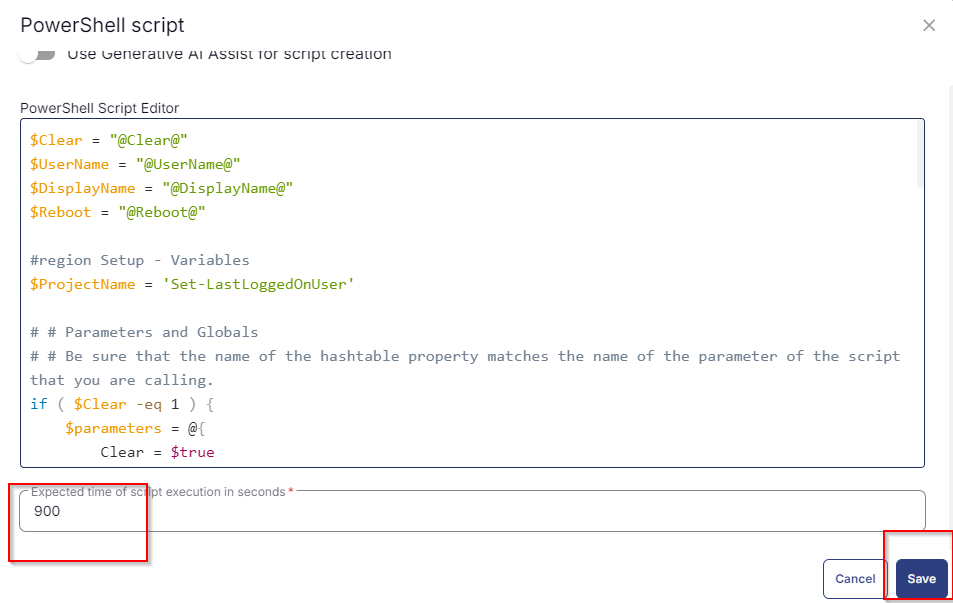

Click the `Save` button at the top-right corner of the screen to save the script.

## Completed Task

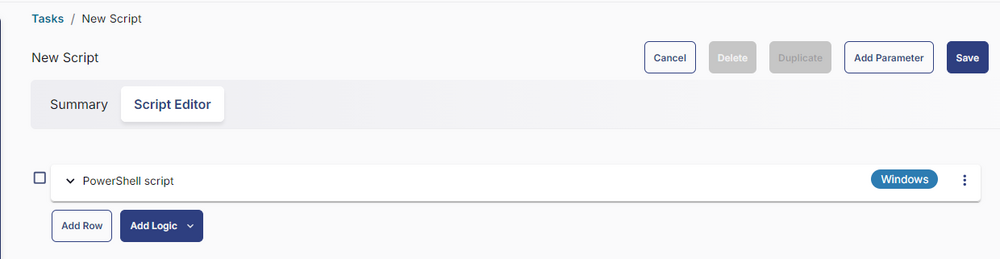

## Output

- Script Log

