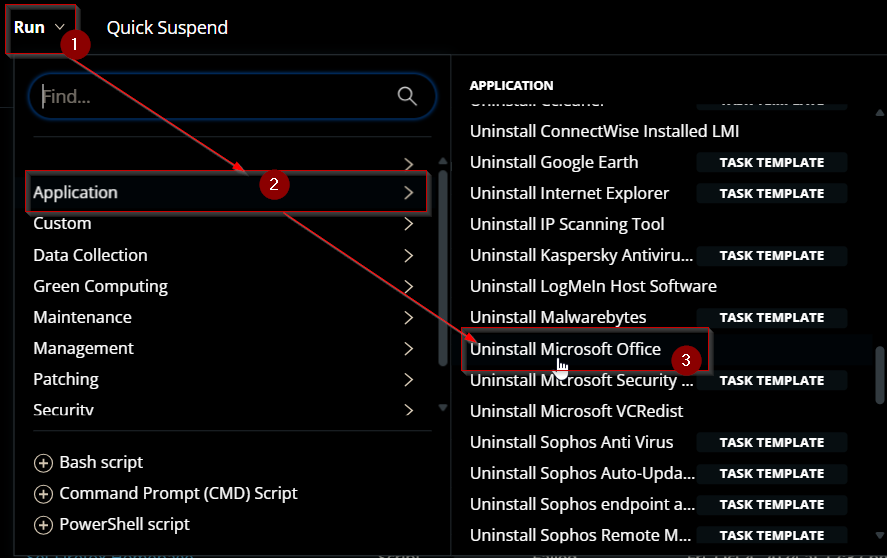
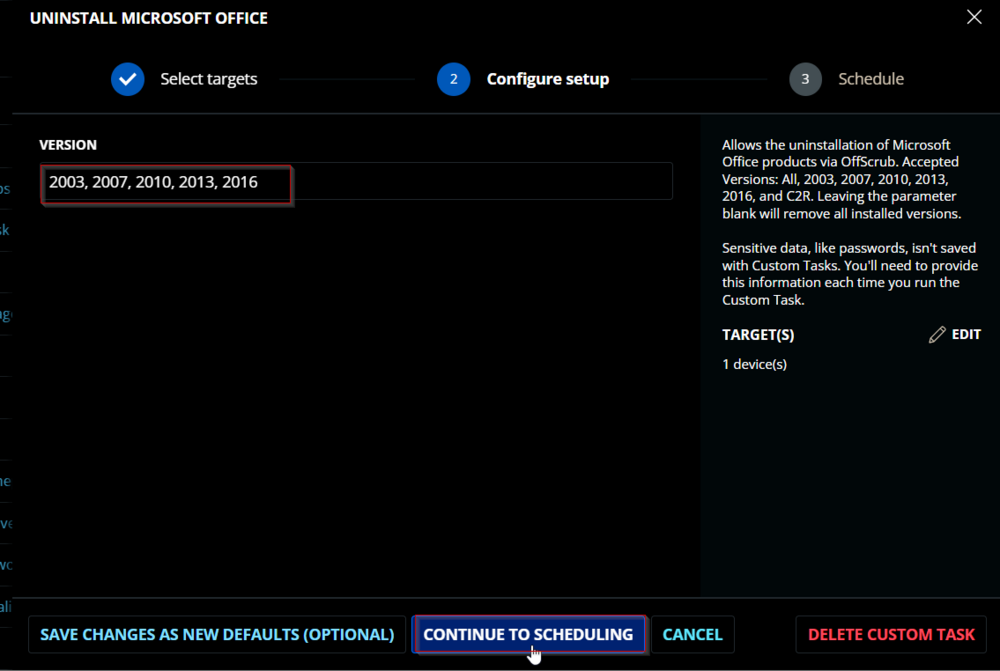
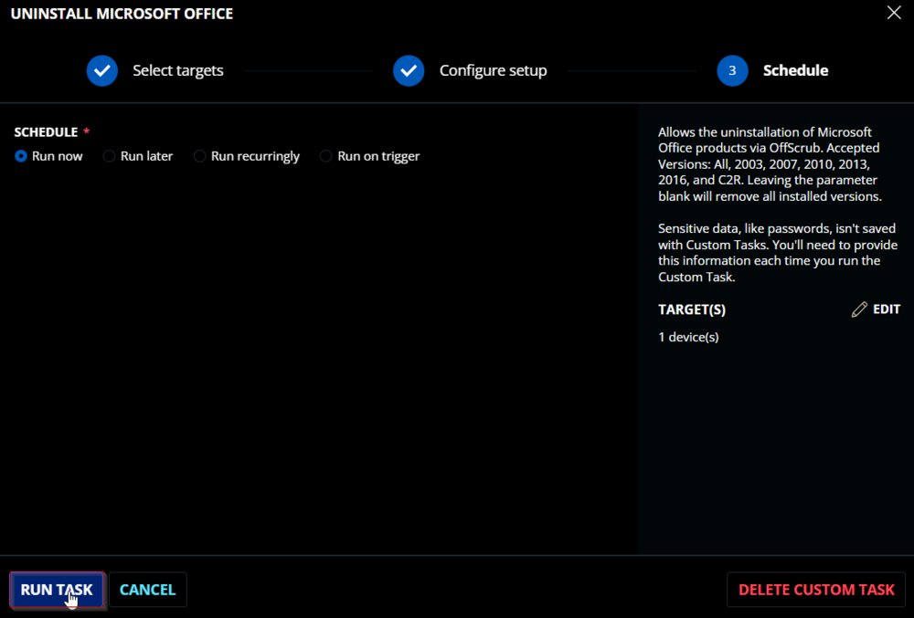
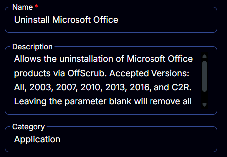
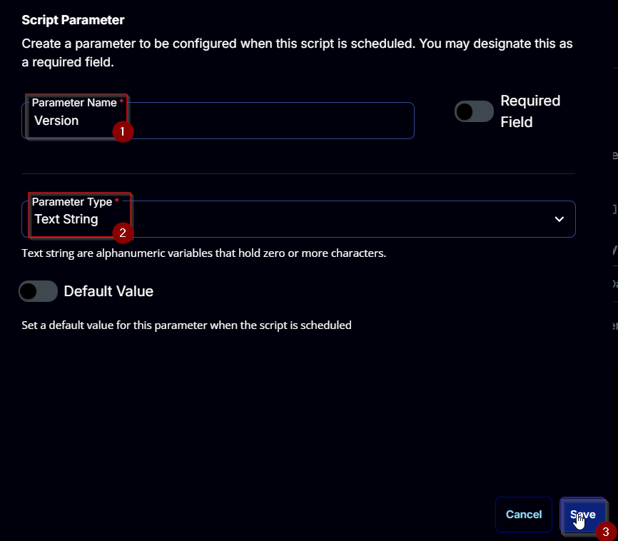
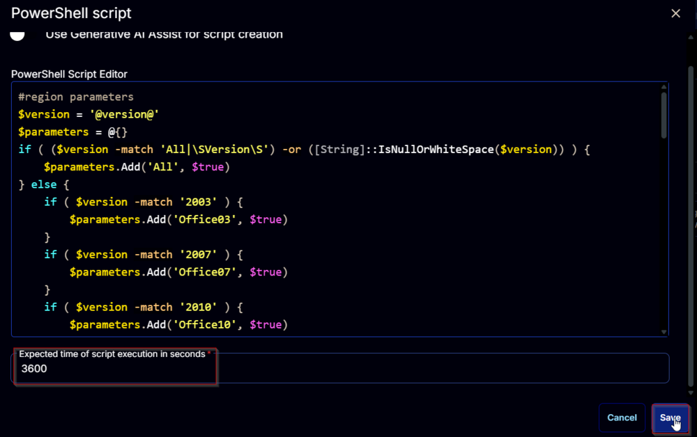

## Summary

Allows the uninstallation of Microsoft Office products via OffScrub. Accepted Versions: All, 2003, 2007, 2010, 2013, 2016, and C2R. Leaving the parameter blank will remove all installed versions.

CW RMM implementation of [Invoke-OfficeScrub](https://proval.itglue.com/DOC-5078775-7593306) agnostic script.

## Sample Run



**To remove all installed versions:**


**To remove selected versions:**





## Dependencies

[SWM - Software Uninstall - Invoke-OfficeScrub](https://proval.itglue.com/DOC-5078775-7593306)

## User Parameters

| Name    | Example                        | Accepted Values                                              | Required | Default | Type          | Description                                                                                   |
|---------|--------------------------------|-------------------------------------------------------------|----------|---------|---------------|-----------------------------------------------------------------------------------------------|
| Version | - All                          | - 2003- 2007- 2010- 2013- 2016- c2r- All | True     | All     | Text String   | Office Version to remove. Leaving it blank is equivalent to `All`.                          |


## Task Creation

Create a new `Script Editor` style script in the system to implement this Task.


**Name:** `Uninstall Microsoft Office`

**Description:** `Allows the uninstallation of Microsoft Office products via OffScrub. Accepted Versions: All, 2003, 2007, 2010, 2013, 2016, and C2R. Leaving the parameter blank will remove all installed versions.`

**Category:** `Application`



## Parameters

### Version:

Add a new parameter by clicking the `Add Parameter` button present at the top-right corner of the screen.


This screen will appear.


- Set `Version` in the `Parameter Name` field.
- Select `Text String` from the `Parameter Type` dropdown menu.
- Click the `Save` button.



## Task

Navigate to the Script Editor Section and start by adding a row. You can do this by clicking the `Add Row` button at the bottom of the script page.


A blank function will appear.


### Row 1 Function: PowerShell Script

Search and select the `PowerShell Script` function.


The following function will pop up on the screen:


Paste in the following PowerShell script and set the `Expected time of script execution in seconds` to `3600` seconds. Click the `Save` button.

```
#region parameters
$version = '@version@'
$parameters = @{}
if ( ($version -match 'All|//SVersion//S') -or ([String]::IsNullOrWhiteSpace($version)) ) {
    $parameters.Add('All', $true)
} else {
    if ( $version -match '2003' ) {
        $parameters.Add('Office03', $true)
    }
    if ( $version -match '2007' ) {
        $parameters.Add('Office07', $true)
    }
    if ( $version -match '2010' ) {
        $parameters.Add('Office10', $true)
    }
    if ( $version -match '2013' ) {
        $parameters.Add('Office13', $true)
    }
    if ( $version -match '2016' ) {
        $parameters.Add('Office16', $true)
    }
    if ( $version -match 'C2R' ) {
        $parameters.Add('Officec2r', $true)
    }
}
if ( !($parameters) ) {
    throw 'Invalid version specified. Please specify either ''All'', ''2003'', ''2007'', ''2010'', ''2013'', ''2016'', or ''C2R''.'
}
#endregion
#region Setup - Variables
$ProjectName = 'Invoke-OfficeScrub'
[Net.ServicePointManager]::SecurityProtocol = [enum]::ToObject([Net.SecurityProtocolType], 3072)
$BaseURL = 'https://file.provaltech.com/repo'
$PS1URL = "$BaseURL/script/$ProjectName.ps1"
$WorkingDirectory = "C://ProgramData//_automation//script//$ProjectName"
$PS1Path = "$WorkingDirectory//$ProjectName.ps1"
$WorkingPath = $WorkingDirectory
$LogPath = "$WorkingDirectory//$ProjectName-log.txt"
$ErrorLogPath = "$WorkingDirectory//$ProjectName-Error.txt"
#endregion
#region Setup - Folder Structure
New-Item -Path $WorkingDirectory -ItemType Directory -ErrorAction SilentlyContinue | Out-Null
$response = Invoke-WebRequest -Uri $PS1URL -UseBasicParsing
if (($response.StatusCode -ne 200) -and (!(Test-Path -Path $PS1Path))) {
    throw "No pre-downloaded script exists and the script '$PS1URL' failed to download. Exiting."
} elseif ($response.StatusCode -eq 200) {
    Remove-Item -Path $PS1Path -ErrorAction SilentlyContinue
    [System.IO.File]::WriteAllLines($PS1Path, $response.Content)
}
if (!(Test-Path -Path $PS1Path)) {
    throw 'An error occurred and the script was unable to be downloaded. Exiting.'
}
#endregion
#region Execution
if ($Parameters) {
    & $PS1Path @Parameters
} else {
    & $PS1Path
}
#endregion
#region log verification
if ( !(Test-Path $LogPath) ) {
    throw 'PowerShell Failure. A Security application seems to have restricted the execution of the PowerShell Script.'
}
if ( Test-Path $ErrorLogPath ) {
    $ErrorContent = ( Get-Content -Path $ErrorLogPath )
    throw $ErrorContent
}
Get-Content -Path $LogPath
#endregion
```



### Row 2 Function: Script Log

Add a new row by clicking the `Add Row` button.


A blank function will appear.


Search and select the `Script Log` function.


The following function will pop up on the screen:


In the script log message, simply type `%Output%` and click the `Save` button.


Click the `Save` button at the top-right corner of the screen to save the script.


## Completed Script


## Output

- Script log


