## Summary

Check and confirm the Windows 11 installation status after running the Windows 11 Installer (Beta) task.

## Sample Run

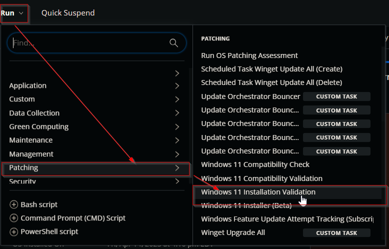  
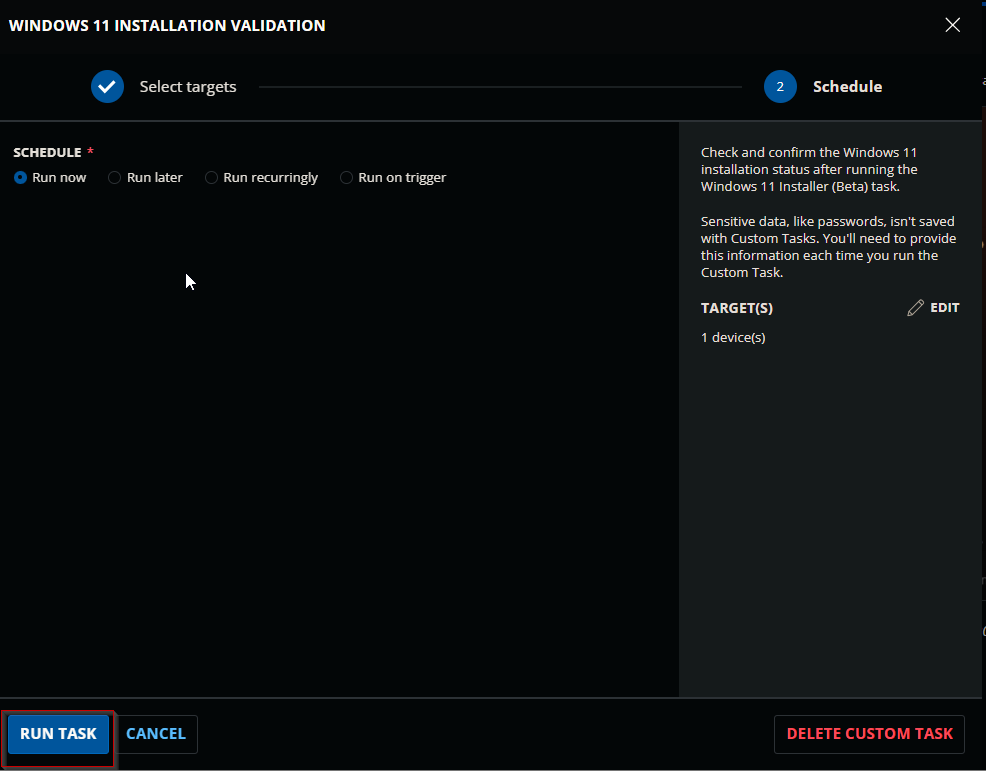  

## Dependencies

- [CW RMM - Custom Field - Windows 11 Upgrade RunTime](<../custom-fields/Endpoint - Windows 11 Upgrade RunTime.md>)
- [CW RMM - Custom Field - Endpoint - Windows 11 Upgrade Failed](<../custom-fields/Endpoint - Windows 11 Upgrade Failed.md>)
- [CW RMM - Device Group - Windows 11 Upgrade Validation](<../groups/Upgrade Enabled Windows 11 Compatible Machines.md>)
- [CW RMM - Task - Windows 11 Installer (Beta)](<./Windows 11 Installer (Beta).md>)

## Variables

| Name         | Description                                                              |
|--------------|--------------------------------------------------------------------------|
| TaskRunTime  | Value stored in the Windows 11 Upgrade RunTime custom field.            |
| Output       | Output of the previously executed PowerShell script.                    |

## Task Creation

Create a new `Script Editor` style script in the system to implement this Task.

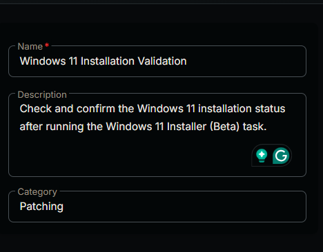  
  

**Name:** Windows 11 Installation Validation  
**Description:** Check and confirm the Windows 11 installation status after running the Windows 11 Installer (Beta) task.  
**Category:** Patching  
  

### Task

Navigate to the Script Editor Section and start by adding a row. You can do this by clicking the `Add Row` button at the bottom of the script page.  
  

A blank function will appear.  
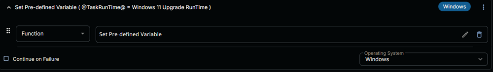  

#### Row 1 Function: Set Pre-defined Variable

Search and select the `Set Pre-defined Variable` function.  
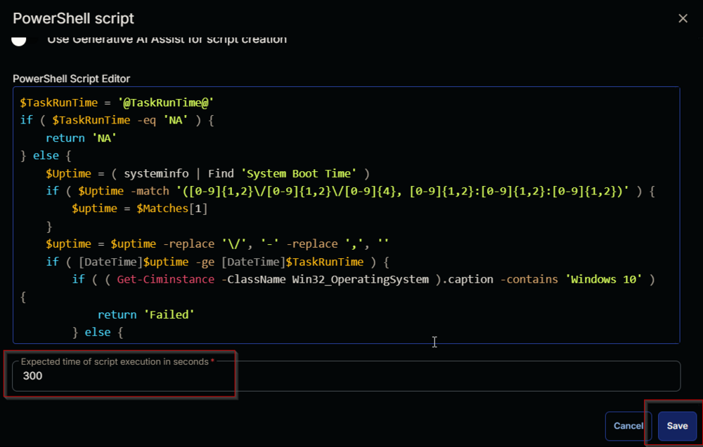  

The following function will pop up on the screen:  
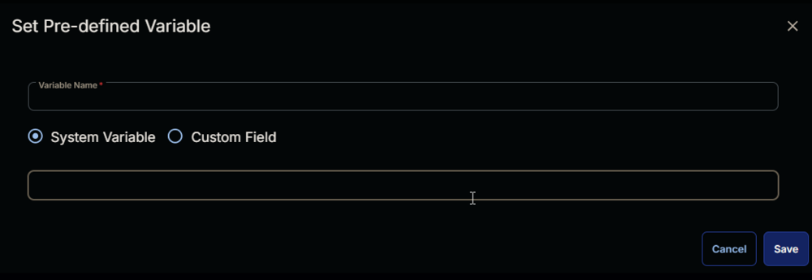  

- Select the `Custom Field` radio button.
- Set `TaskRunTime` in the `Variable Name` field.
- Search and select the `Windows 11 Upgrade RunTime` for the Custom field.
- Click the `Save` button to save the row.  
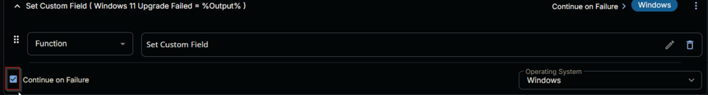  
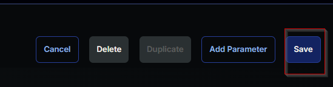  

#### Row 2 Function: PowerShell Script

Add a new row by clicking the `Add Row` button.  
  

A blank function will appear.  
  

Search and select the `PowerShell Script` function.  
  
  

The following function will pop up on the screen:  
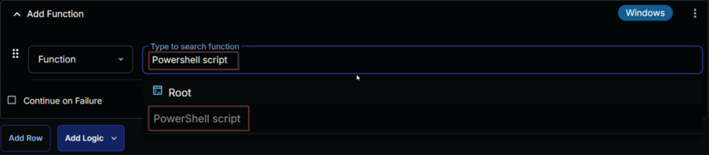  

Paste in the following PowerShell script and leave the expected time of script execution at `300` seconds. Click the `Save` button.

```
$TaskRunTime = '@TaskRunTime@'
if ( $TaskRunTime -eq 'NA' ) {
    return 'NA'
} else {
    $Uptime = ( systeminfo | Find 'System Boot Time' )
    if ( $Uptime -match '([0-9]{1,2}\\/[0-9]{1,2}\\/[0-9]{4}, [0-9]{1,2}:[0-9]{1,2}:[0-9]{1,2})' ) {
        $uptime = $Matches[1]
    }
    $uptime = $uptime -replace '\\\', '-' -replace ',', ''
    if ( [DateTime]$uptime -ge [DateTime]$TaskRunTime ) {
        if ( ( Get-Ciminstance -ClassName Win32_OperatingSystem ).caption -contains 'Windows 10' ) {
            return 'Failed'
        } else {
            return 'Success'
        }
    } else {
        return 'Pending'
    }
}
```
  

#### Row 3 Function: Set Custom Field

Add a new row by clicking the `Add Row` button.  
  

A blank function will appear.  
  

Search and select the `Set Custom Field` function.  
  

Search and select `Windows 11 Upgrade Failed` in the `Search Custom Field` field, set `%Output%` in the `Value` field, and click the `Save` button.  
  

Mark the `Continue on Failure` checkbox.  
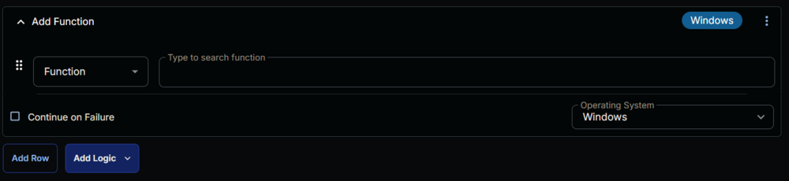  

Click the `Save` button at the top-right corner of the screen to save the task.  
  

## Completed Task

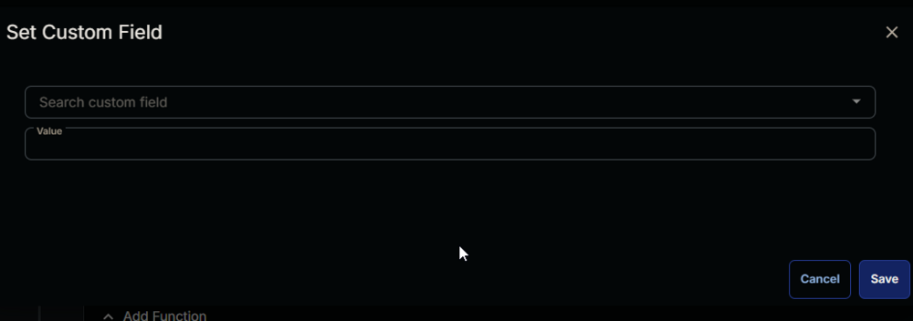  

## Deployment

The task should be scheduled to run once per day against the [Windows 11 Upgrade Validation](<../groups/Upgrade Enabled Windows 11 Compatible Machines.md>) device group.

- Go to `Automation` > `Tasks`.
- Search for the `Windows 11 Installation Validation` task.
- Select the concerned task.
- Click on the `Schedule` button to schedule the task.  
  
- This screen will appear.  
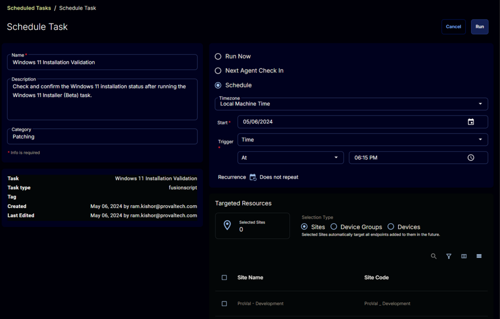  
- Click the `Does not repeat` button.  
  
- This pop-up box will appear.  
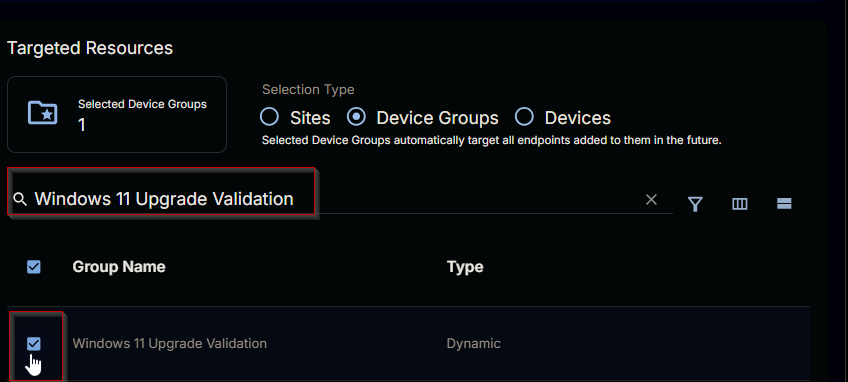  
- Click the `OK` button without making any changes to run the task `Every day`.  
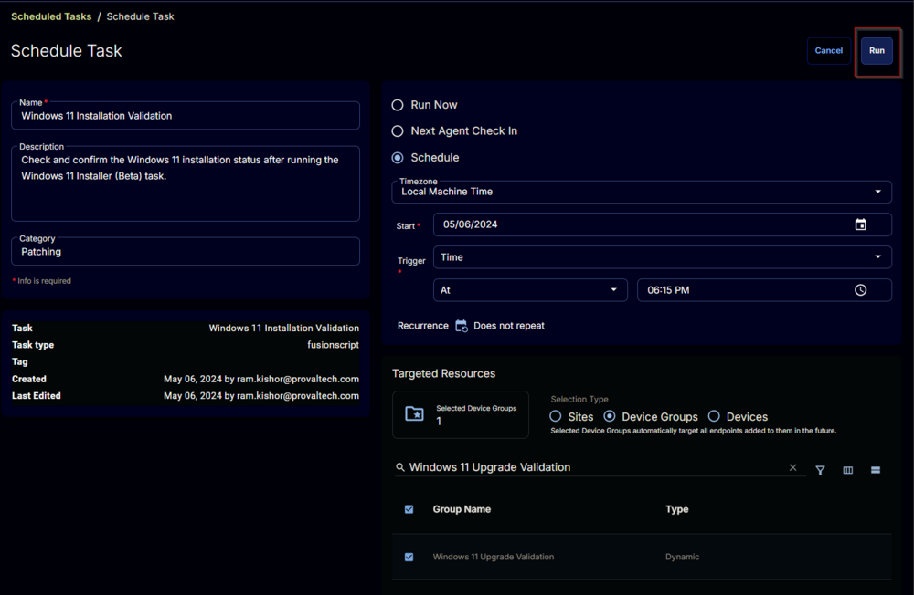  
- Recurrence will be updated to `Every Day`.  
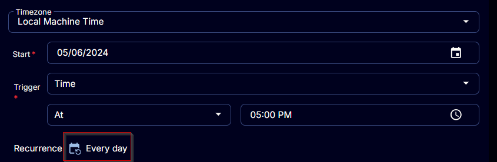  
- Select the `Device Groups` option in the `Targeted Resources` section.  
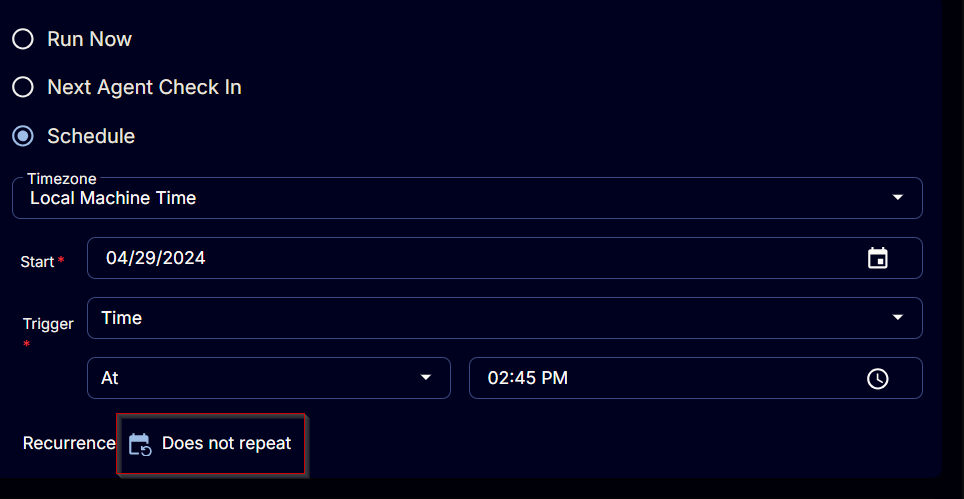  
- Search and select the [Windows 11 Upgrade Validation](<../groups/Upgrade Enabled Windows 11 Compatible Machines.md>) device group.  
  
- Now click the `Run` button to initiate the task.  
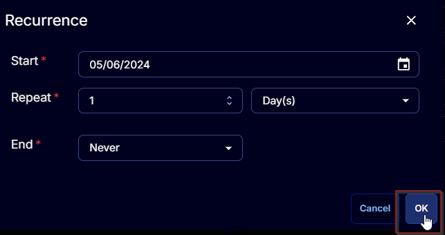  
- The task will start appearing in the Scheduled Tasks.  
  
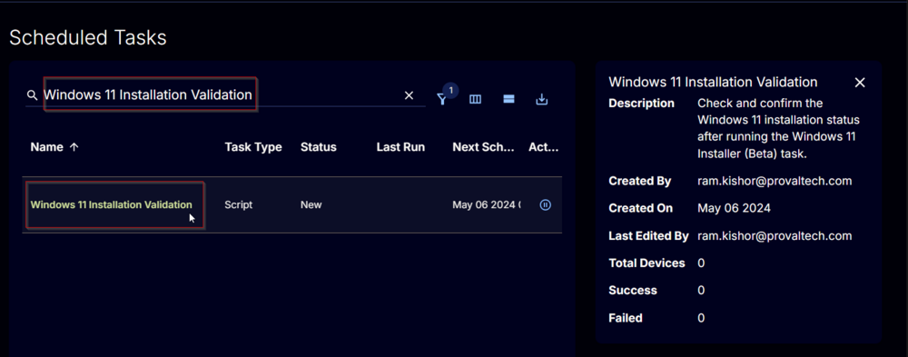  

## Output

- Script Log
- Custom Field


