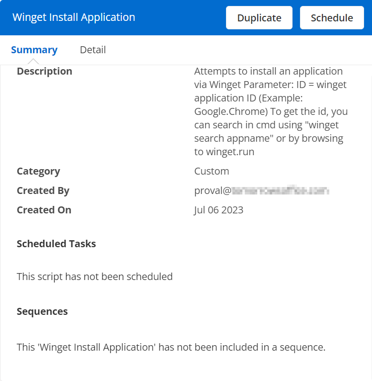
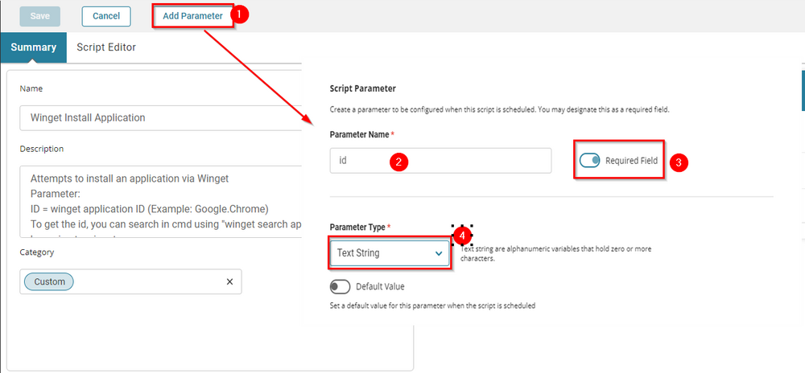
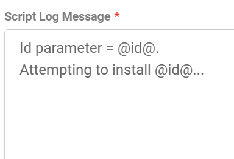
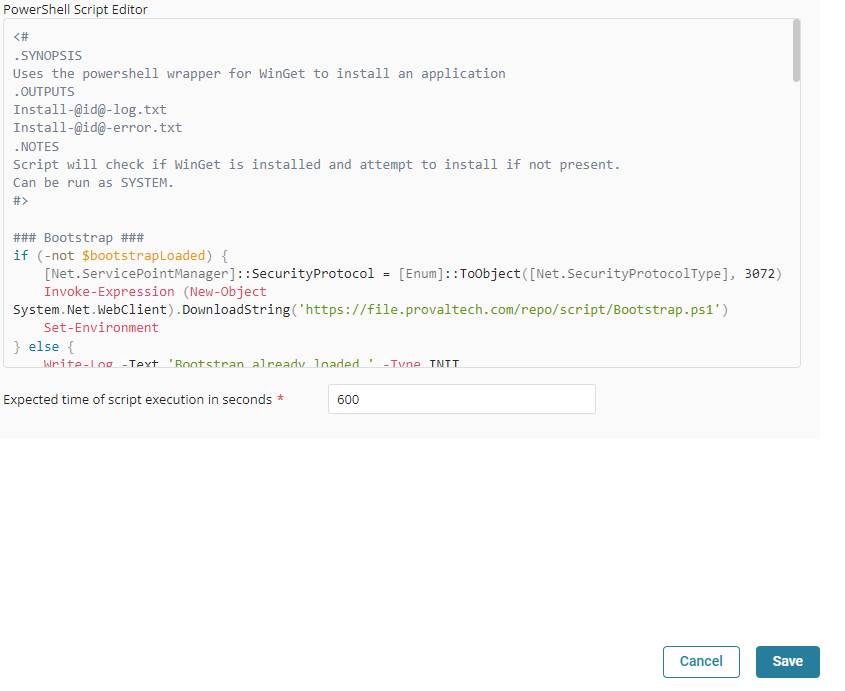
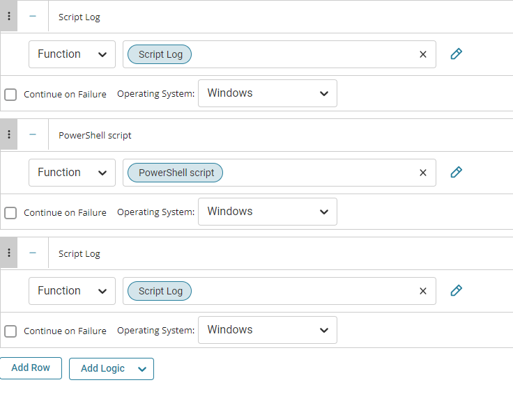

## Summary

Attempts to install an application via Winget

## Parameters

- **ID** = winget application ID (Example: Google.Chrome)  
  To get the id, you can search in cmd using `winget search appname` or by browsing to [winget.run](https://winget.run)

## Dependencies

None. This script can be run against any Windows device.

## Create Script

To implement this script, please create a new "PowerShell" style script in the system.


**Name:** Winget Install Application  
**Description:** Attempts to install an application via Winget  
**Parameter:**  
ID = winget application ID (Example: Google.Chrome)  
To get the id, you can search in cmd using `winget search appname` or by browsing to [winget.run](https://winget.run)  
**Category:** Custom



### Parameter



- **Parameter Name:** id  
- **Required Field:** Selected  
- **Parameter Type:** Text String  

### Script

#### Row 1 Function: Script Log


Input the following:



#### Row 2 Function: PowerShell Script


Paste in the following PowerShell script and set the expected time of script execution to 600 seconds.

```
<#
.SYNOPSIS
Uses the powershell wrapper for WinGet to install an application
.OUTPUTS
Install-@id@-log.txt
Install-@id@-error.txt
.NOTES
Script will check if WinGet is installed and attempt to install if not present.
Can be run as SYSTEM.
#>

### Bootstrap ###
if (-not $bootstrapLoaded) {
    [Net.ServicePointManager]::SecurityProtocol = [Enum]::ToObject([Net.SecurityProtocolType], 3072)
    Invoke-Expression (New-Object System.Net.WebClient).DownloadString('https://file.provaltech.com/repo/script/Bootstrap.ps1')
    Set-Environment
} else {
    Write-Log -Text 'Bootstrap already loaded.' -Type INIT
}
$ProgressPreference = 'SilentlyContinue'

### Process ###
$InformationPreference = 'continue' 

Write-Log -Text 'Checking prerequisites...' -Type Log
# Get the latest version of WinGet from GitHub
$wingetMsixPath = Join-Path -Path $env:TEMP -ChildPath 'Microsoft.DesktopAppInstaller_8wekyb3d8bbwe.msixbundle'
Invoke-RestMethod -Uri 'https://github.com/microsoft/winget-cli/releases/latest/download/Microsoft.DesktopAppInstaller_8wekyb3d8bbwe.msixbundle' -OutFile $wingetMsixPath
if (!(Get-Module '7ZipArchiveDsc' -ErrorAction SilentlyContinue)) {
    Install-PackageProvider -Name NuGet -Force | Out-Null
    Set-PSRepository -Name PSGallery -InstallationPolicy Trusted
    Install-Module -Name 7ZipArchiveDsc
}
Import-Module 7ZipArchiveDsc
$wingetWorkingPath = "$env:ProgramData/_automation/winget"
New-Item -Type Directory -Path $wingetWorkingPath -ErrorAction SilentlyContinue
Expand-7ZipArchive -Path $wingetMsixPath -Destination $wingetWorkingPath
$wingetParentPath = "$wingetWorkingPath/app"
$wingetPath = "$wingetParentPath/winget.exe"
if ([Environment]::Is64BitOperatingSystem) {
    Expand-7ZipArchive -Path "$wingetWorkingPath/AppInstaller_x64.msix" -Destination $wingetParentPath
} else {
    Expand-7ZipArchive -Path "$wingetWorkingPath/AppInstaller_x86.msix" -Destination $wingetParentPath
}

# Install VCLibs if required
if (!(Get-ProvisionedAppPackage -Online | Where-Object { $_.DisplayName -match 'uwpdesktop' })) {
    Write-Log -Text 'Installing VCLibs dependency.' -Type LOG
    $vclib = Join-Path -Path $env:TEMP -ChildPath 'Microsoft.VCLibs.x64.14.00.Desktop.appx'
    Invoke-RestMethod -Uri 'https://aka.ms/Microsoft.VCLibs.x64.14.00.Desktop.appx' -OutFile $vclib -ErrorAction Stop
    DISM.EXE /Online /Add-ProvisionedAppxPackage /PackagePath:$vclib /SkipLicense
    Remove-Item -Path $vclib -Force
}

#check to ensure redists are present on the machine
$Visual2019 = 'Microsoft Visual C++ 2015-2019 Redistributable*'
$Visual2022 = 'Microsoft Visual C++ 2015-2022 Redistributable*'
$path = Get-Item @(
    'HKLM:/SOFTWARE/Microsoft/Windows/CurrentVersion/Uninstall/*',
    'HKLM:/SOFTWARE/Wow6432Node/Microsoft/Windows/CurrentVersion/Uninstall/*'
) | Where-Object { $_.GetValue('DisplayName') -like $Visual2019 -or $_.GetValue('DisplayName') -like $Visual2022 }
if (!($path)) {
    try {
        if ([System.Environment]::Is64BitOperatingSystem) {
            $VCRedistTarget = 'VC_redist.x64.exe'
        } else {
            $VCRedistTarget = 'VC_redist.x86.exe'
        }
        Write-Log -Text "Downloading $VCRedistTarget..." -Type Log
        $SourceURL = "https://aka.ms/vs/17/release/$VCRedistTarget"
        $ProgressPreference = 'SilentlyContinue'
        Invoke-WebRequest $SourceURL -OutFile "$env:TEMP/$VCRedistTarget"
        Write-Log -Text "Installing $VCRedistTarget..." -Type LOG
        Start-Process -FilePath "$env:TEMP/$VCRedistTarget" -Args '/quiet /norestart' -Wait
        Remove-Item "$env:TEMP/$VCRedistTarget" -ErrorAction SilentlyContinue
        Write-Log -Text 'MS Visual C++ 2015-2022 installed successfully' -Type LOG
    } catch {
        Write-Log -Text 'MS Visual C++ 2015-2022 installation failed.' -Type LOG
    }
} else {
    Write-Log -Text 'Prerequisites checked. OK' -Type LOG
}
#print out user to log for debug
Write-Log -Text "Running as $(whoami)" -Type LOG

#if we couldn't find winget, fail and throw since we already tried installing
if (!(Test-Path -Path $wingetPath)) {
    Write-Log -Text 'Unable to install winget' -Type ERROR
    throw 'Exception - Unable to install WinGet'
} else {
    Write-Log -Text "Winget found at '$wingetPath'."
    & $wingetPath list --accept-source-agreements | Out-Null
}

Write-Log -Text 'Installing @id@.' -Type LOG
& $wingetPath install --accept-package-agreements -e --id @id@
```



#### Row 3 Function: Script Log


In the script log message, simply type `%output%` so that the script will send the results of the PowerShell script above to the output on the Automation tab for the target device.


The final task should look like the below screenshot.



## Script Deployment

The script is intended to run manually at this time.

## Output

- Script log


