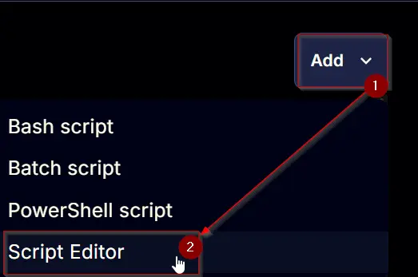
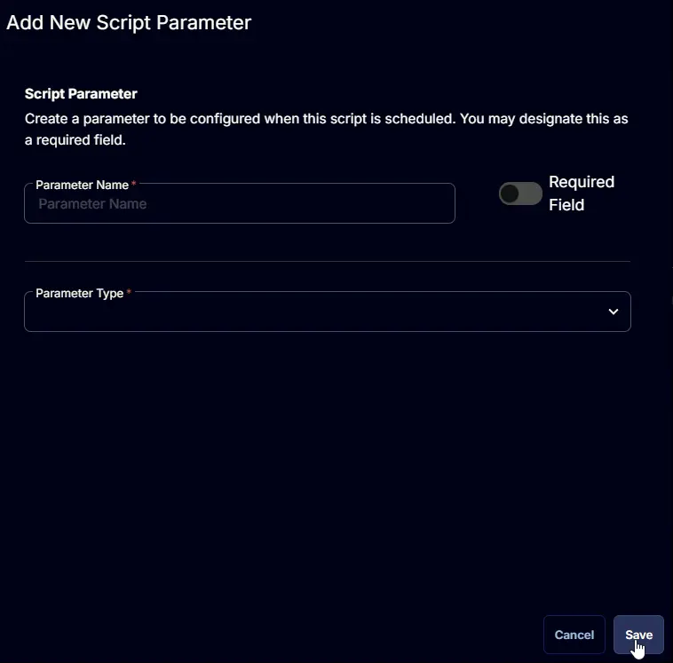

## Summary

## Sample Run

## Dependencies

## User Parameters

| Name | Example | Accepted Values | Required | Default | Type | Description |
| ---- | ------- | --------------- | -------- | ------- | ---- | ----------- |

## Task Creation

### Script Details

#### Step 1

Navigate to `Automation` ➞ `Tasks`  

#### Step 2

Create a new `Script Editor` style task by choosing the `Script Editor` option from the `Add` dropdown menu  

The `New Script` page will appear on clicking the `Script Editor` button:  

#### Step 3

Fill in the following details in the `Description` section:  

**Name:** `<Script Name>`  
**Description:** `<Script's Description>`  
**Category:** `<Script's Category>`

`<Insert a screenshot showing what the Description section should look like>`

### Parameters

Locate the `Add Parameter` button on the right-hand side of the screen and click on it to create a new parameter.  

The `Add New Script Parameter` page will appear on clicking the `Add Parameter` button.  

### Script Editor

Click the `Add Row` button in the `Script Editor` section to start creating the script  

A blank function will appear:  

#### Row 1 Function: `<Function Name>`

## Save Task

Click the `Save` button at the top-right corner of the screen to save the script.  

## Completed Task

`<Screenshot(s) of completed task>`

## Deployment

## Output