## Summary

This is a CW RMM implementation of the agnostic script [Add-WifiProfile](/docs/6e1f420f-5a5a-49e1-a7cc-943e258d2ae5). The script can be used to manually add Wi-Fi profiles for Windows computers.

**Requirement:** PowerShell v5+

## Sample Run

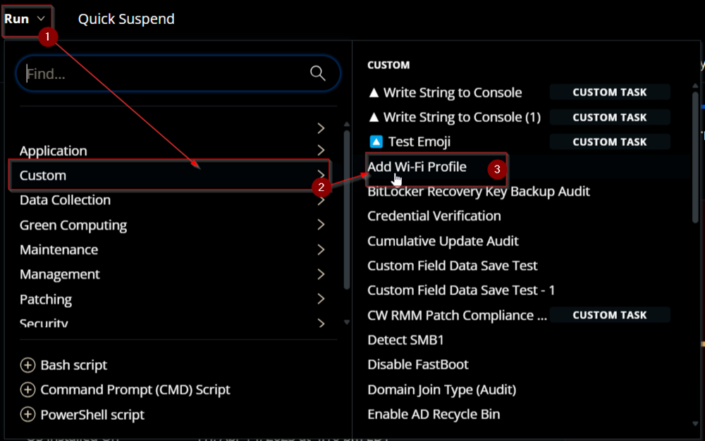

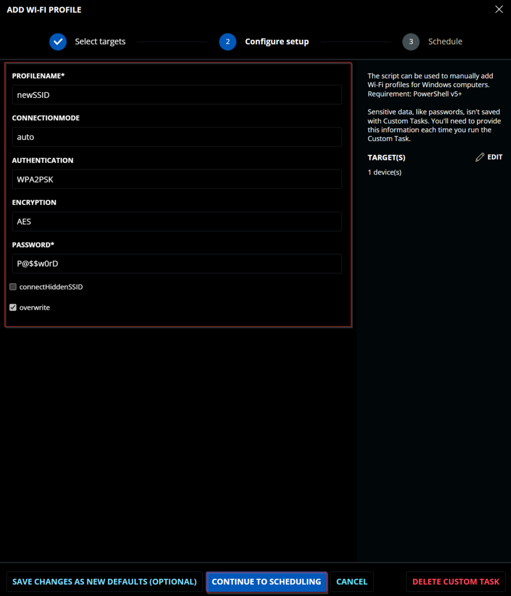

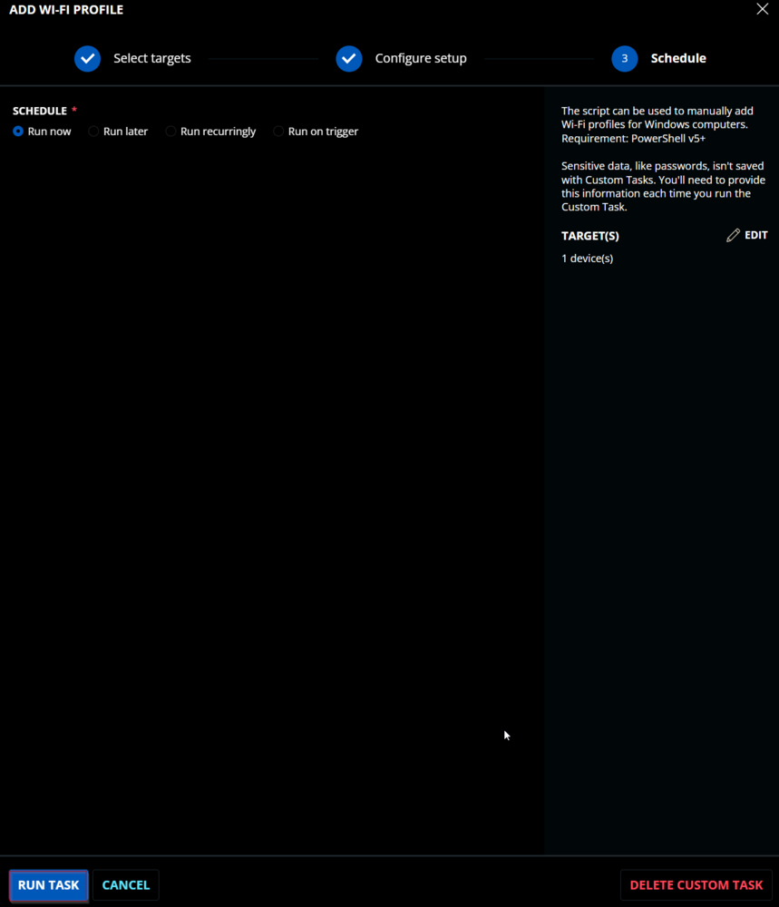

## Dependencies

[EPM - Windows Configuration - Agnostic Script - Add-WifiProfile](/docs/6e1f420f-5a5a-49e1-a7cc-943e258d2ae5)

## User Parameters

| Name                    | Example               | Accepted Values                                                                 | Required | Default | Type  | Description                                               |
|-------------------------|-----------------------|---------------------------------------------------------------------------------|----------|---------|-------|-----------------------------------------------------------|
| `profileName`           | ProValWifi            |                                                                                 | True     |         | Text  | The name of the WiFi profile to be created.              |
| `password`              | 123423e1c$$!#         |                                                                                 | True     |         | Text  | The password of the WiFi profile.                         |
| `connectionMode`        | auto                  | manual, auto                                                                     | false    | auto    | Text  | The connection mode of the WiFi profile.                  |
| `authentication`        | WPA2PSK              | open, shared, WPA, WPAPSK, WPA2, WPA2PSK, WPA3SAE, WPA3ENT192, OWE           | false    | WPA2PSK | Text  | The authentication method used by the WiFi profile.      |
| `encryption`            | none                  | none, WEP, TKIP, AES, GCMP256                                                   | False    | AES     | Text  | The encryption method used by the WiFi profile.          |
| `connectHiddenSSID`     | Unmarked              |                                                                                 | False    | $False  | Flag  | Whether to connect to the WiFi even if the SSID is hidden.|
| `overwrite`             | Marked                |                                                                                 | False    | $True   | Flag  | Whether to overwrite the WiFi profile if it already exists.|

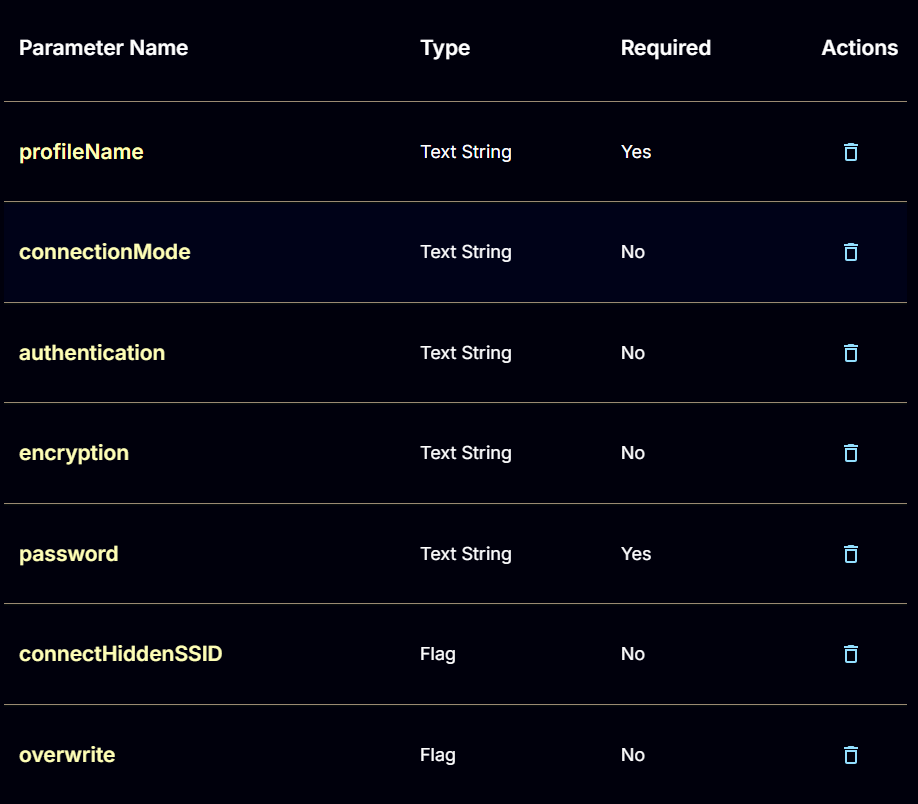

## Task Creation

Create a new `Script Editor` style script in the system to implement this Task.


**Name:** Add Wi-Fi Profile  \
**Description:** `The script can be used to manually add Wi-Fi profiles for Windows computers.`  \
`Requirement: PowerShell v5+`  \
**Category:** Custom

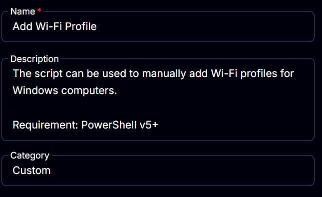

## Parameters

### profileName:
Add a new parameter by clicking the `Add Parameter` button present at the top-right corner of the screen.


This screen will appear.


- Set `profileName` in the `Parameter Name` field.
- Select `Text String` from the `Parameter Type` dropdown menu.
- Enable the `Required Field` button.
- Click the `Save` button.

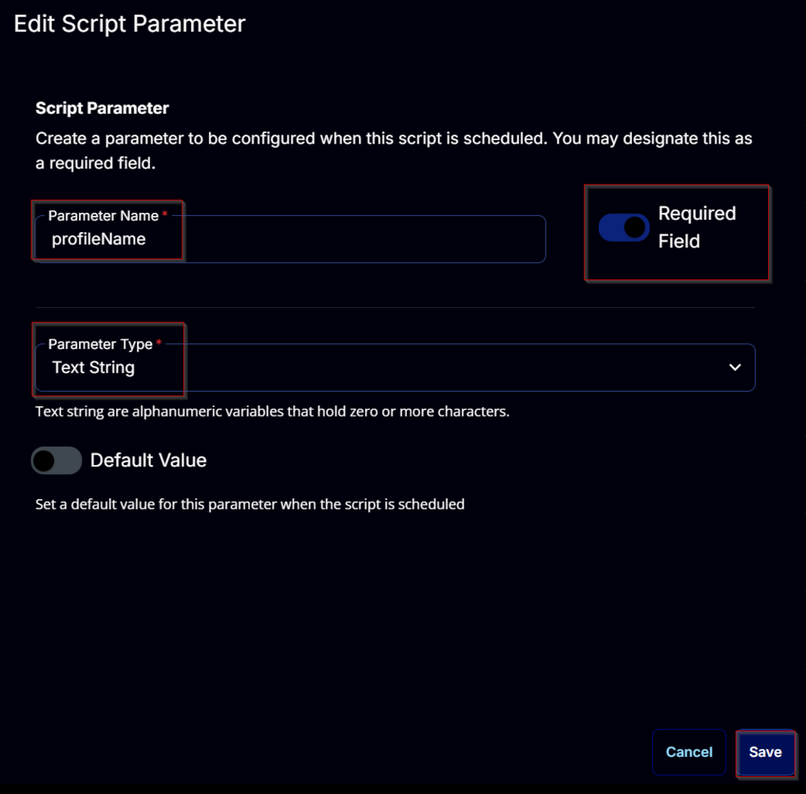

### connectionMode:
Add a new parameter by clicking the `Add Parameter` button present at the top-right corner of the screen.


This screen will appear.


- Set `connectionMode` in the `Parameter Name` field.
- Select `Text String` from the `Parameter Type` dropdown menu.
- Enable the `Default Value` button.
- Set `auto` in the `Value` field.
- Click the `Save` button.

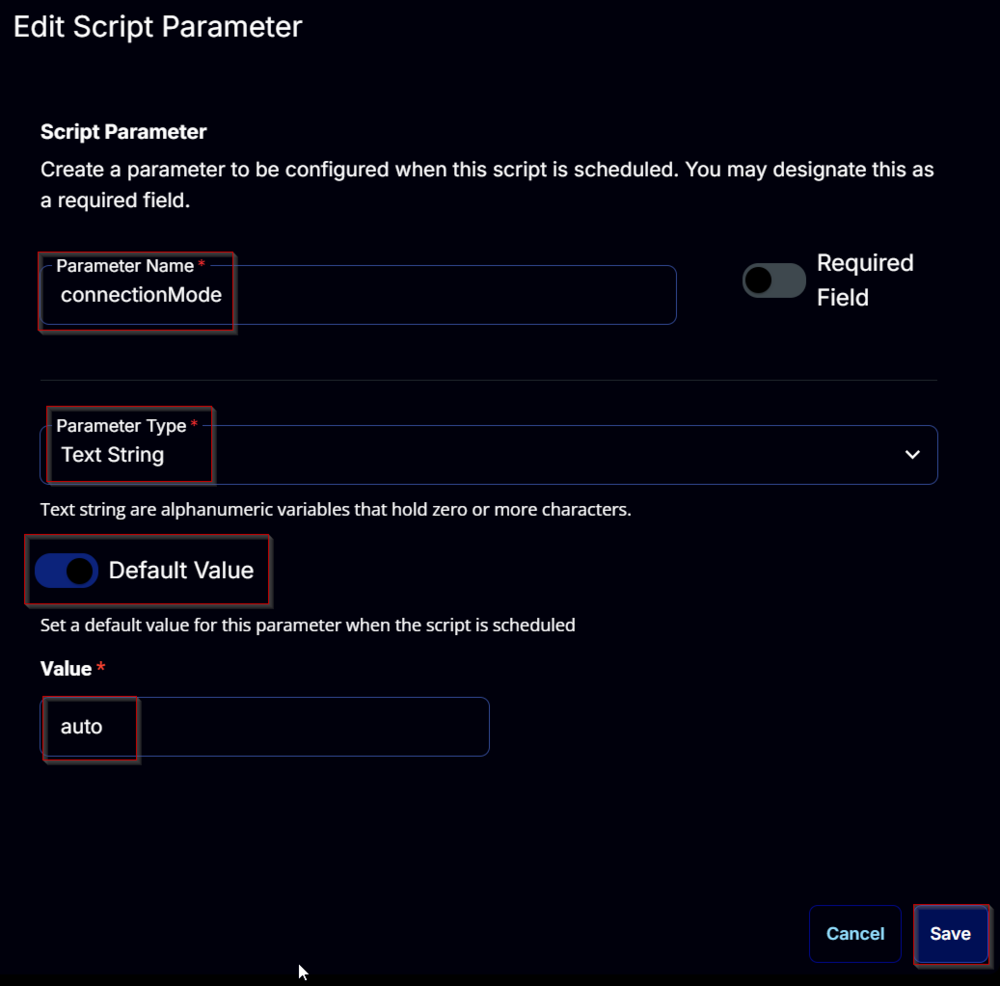

### authentication:
Add a new parameter by clicking the `Add Parameter` button present at the top-right corner of the screen.


This screen will appear.


- Set `authentication` in the `Parameter Name` field.
- Select `Text String` from the `Parameter Type` dropdown menu.
- Enable the `Default Value` button.
- Set `WPA2PSK` in the `Value` field.
- Click the `Save` button.

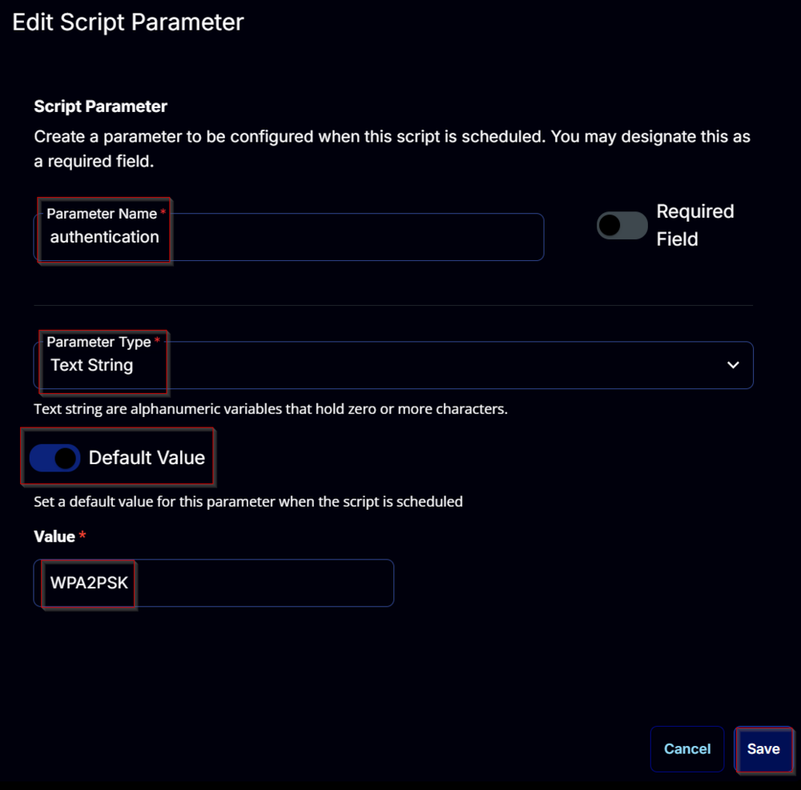

### encryption:
Add a new parameter by clicking the `Add Parameter` button present at the top-right corner of the screen.


This screen will appear.


- Set `encryption` in the `Parameter Name` field.
- Select `Text String` from the `Parameter Type` dropdown menu.
- Enable the `Default Value` button.
- Set `AES` in the `Value` field.
- Click the `Save` button.

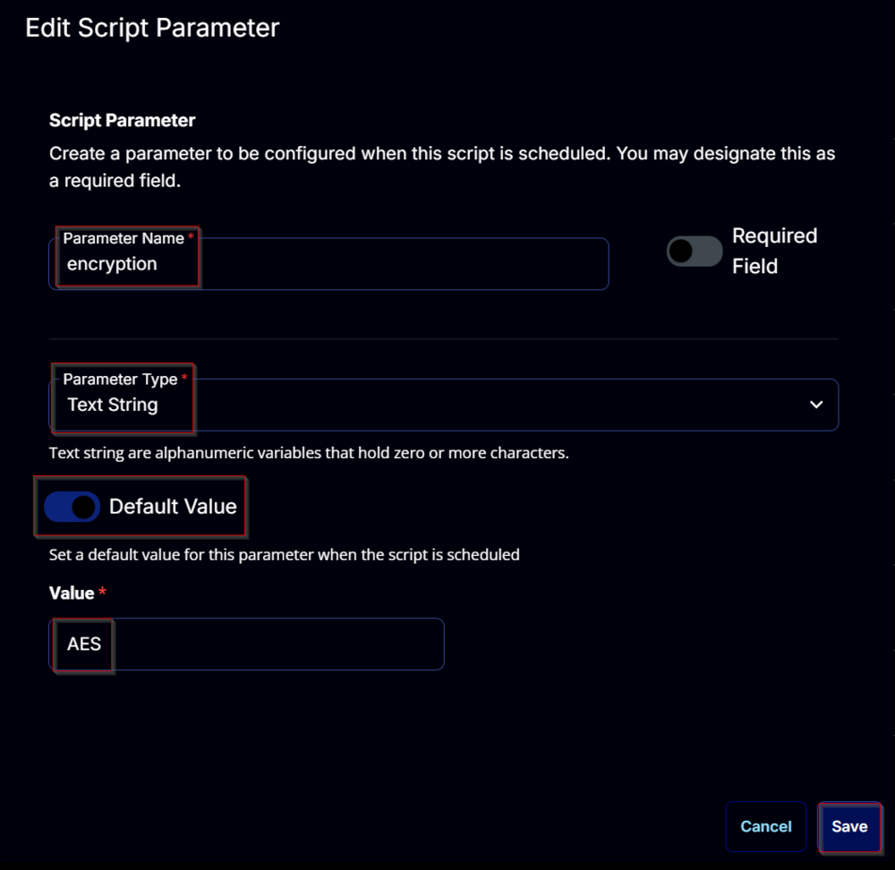

### password:
Add a new parameter by clicking the `Add Parameter` button present at the top-right corner of the screen.


This screen will appear.


- Set `password` in the `Parameter Name` field.
- Select `Text String` from the `Parameter Type` dropdown menu.
- Enable the `Required Field` button.
- Click the `Save` button.

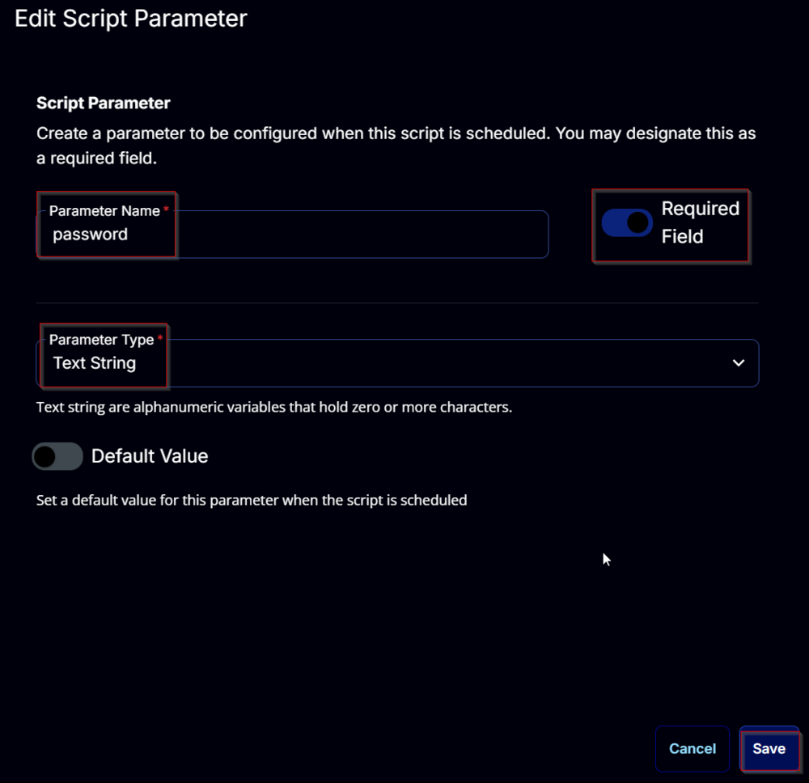

### connectHiddenSSID:
Add a new parameter by clicking the `Add Parameter` button present at the top-right corner of the screen.


This screen will appear.


- Set `connectHiddenSSID` in the `Parameter Name` field.
- Select `Flag` from the `Parameter Type` dropdown menu.
- Enable the `Default Value` button.
- Set `False` in the `Value` field.
- Click the `Save` button.

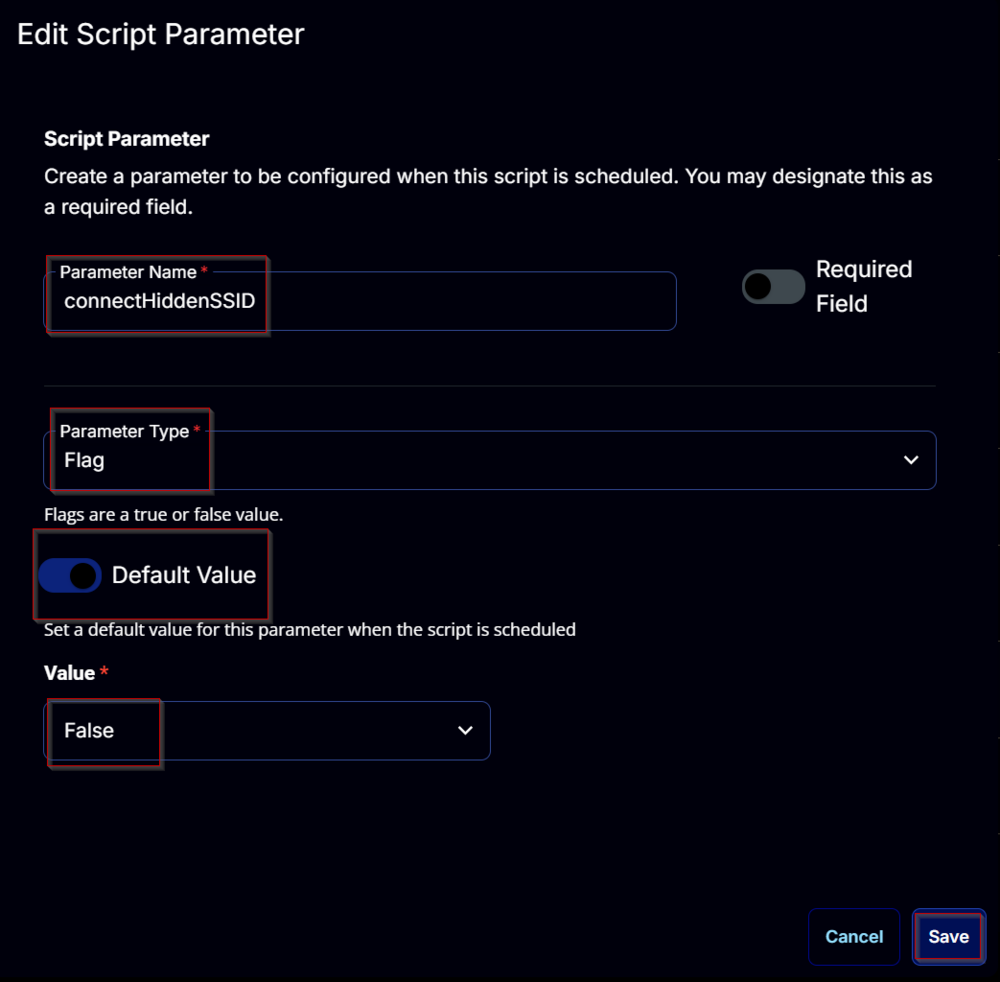

### overwrite:
Add a new parameter by clicking the `Add Parameter` button present at the top-right corner of the screen.


This screen will appear.


- Set `overwrite` in the `Parameter Name` field.
- Select `Flag` from the `Parameter Type` dropdown menu.
- Enable the `Default Value` button.
- Set `True` in the `Value` field.
- Click the `Save` button.

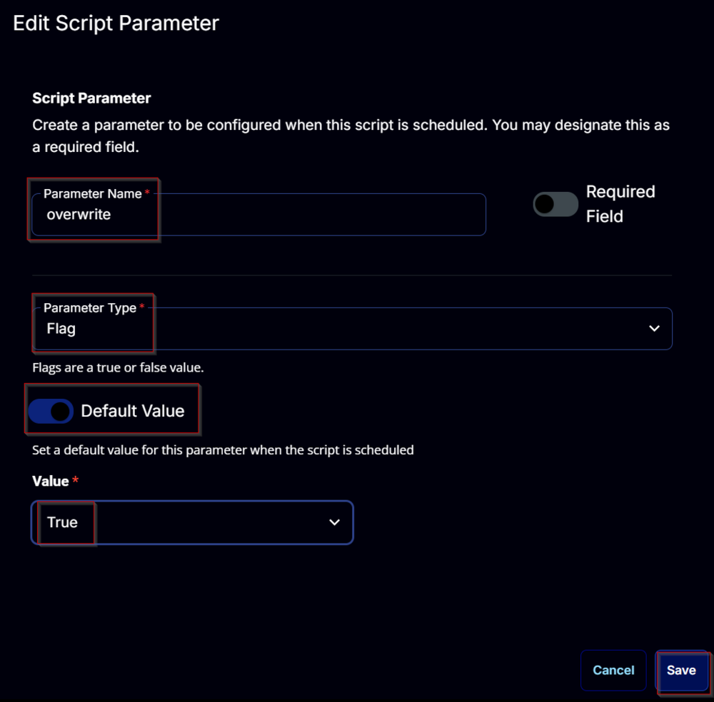

## Task

Navigate to the Script Editor Section and start by adding a row. You can do this by clicking the `Add Row` button at the bottom of the script page.


A blank function will appear.


### Row 1 Function: PowerShell Script

Search and select the `PowerShell Script` function.


The following function will pop up on the screen:


Paste in the following PowerShell script and set the `Expected time of script execution in seconds` to `300` seconds. Click the `Save` button.

```powershell
[Diagnostics.CodeAnalysis.SuppressMessageAttribute('PSAvoidUsingConvertToSecureStringWithPlainText', '')]
[CmdletBinding()]
Param()
# # Parameters and Globals
$profileName = '@profileName@'
if ( '@ConnectionMode@' -notin ( 'Manual', 'Auto' ) ) {
    throw "ConnectionMode can either be 'Manual' or 'Auto'."
} else {
    $ConnectionMode = '@ConnectionMode@'
}
if ( '@Authentication@' -notin ('open', 'shared', 'WPA', 'WPAPSK', 'WPA2', 'WPA2PSK', 'WPA3SAE', 'WPA3ENT192', 'OWE') ) {
    throw "Authentication can either be 'open', 'shared', 'WPA', 'WPAPSK', 'WPA2', 'WPA2PSK', 'WPA3SAE', 'WPA3ENT192', 'OWE'."
} else {
    $Authentication = '@Authentication@'
}
if ( '@Encryption@' -notin ('none', 'WEP', 'TKIP', 'AES', 'GCMP256') ) {
    throw "Encryption can either be 'none', 'WEP', 'TKIP', 'AES', 'GCMP256'."
} else {
    $Encryption = '@Encryption@'
}
$password = ConvertTo-SecureString '@Password@' -AsPlainText -Force
if ( '@connectHiddenSSID@' -match '1|Yes|True|Y') {
    $connectHiddenSSID = $true
} else {
    $connectHiddenSSID = $false
}
if ( '@overwrite@' -match '1|Yes|True|Y') {
    $overwrite = $true
} else {
    $overwrite = $false
}

$Parameters = @{
    ProfileName = $profileName
    ConnectionMode = $ConnectionMode
    Authentication = $Authentication
    Encryption = $Encryption
    Password = $password
    connectHiddenSSID = $connectHiddenSSID
    overwrite = $overwrite
}
#region Setup - Variables
$ProjectName = 'Add-WifiProfile'
[Net.ServicePointManager]::SecurityProtocol = [enum]::ToObject([Net.SecurityProtocolType], 3072)
$BaseURL = 'https://file.provaltech.com/repo'
$PS1URL = "$BaseURL/script/$ProjectName.ps1"
$WorkingDirectory = "C:/ProgramData/_automation/script/$ProjectName"
$PS1Path = "$WorkingDirectory/$ProjectName.ps1"
$Workingpath = $WorkingDirectory
$LogPath = "$WorkingDirectory/$ProjectName-log.txt"
$ErrorLogPath = "$WorkingDirectory/$ProjectName-Error.txt"
#endregion
#region Setup - Folder Structure
New-Item -Path $WorkingDirectory -ItemType Directory -ErrorAction SilentlyContinue | Out-Null
$response = Invoke-WebRequest -Uri $PS1URL -UseBasicParsing
if (($response.StatusCode -ne 200) -and (!(Test-Path -Path $PS1Path))) {
    throw "No pre-downloaded script exists and the script '$PS1URL' failed to download. Exiting."
} elseif ($response.StatusCode -eq 200) {
    Remove-Item -Path $PS1Path -ErrorAction SilentlyContinue
    [System.IO.File]::WriteAllLines($PS1Path, $response.Content)
}
if (!(Test-Path -Path $PS1Path)) {
    throw 'An error occurred and the script was unable to be downloaded. Exiting.'
}
#endregion
#region Execution
if ($Parameters) {
    & $PS1Path @Parameters
} else {
    & $PS1Path
}
#endregion
if ( !(Test-Path $LogPath) ) {
    throw 'PowerShell Failure. A Security application seems to have restricted the execution of the PowerShell Script.'
}
if ( Test-Path $ErrorLogPath ) {
    $ErrorContent = ( Get-Content -Path $ErrorLogPath )
    throw $ErrorContent
}
Get-Content -Path $LogPath
```

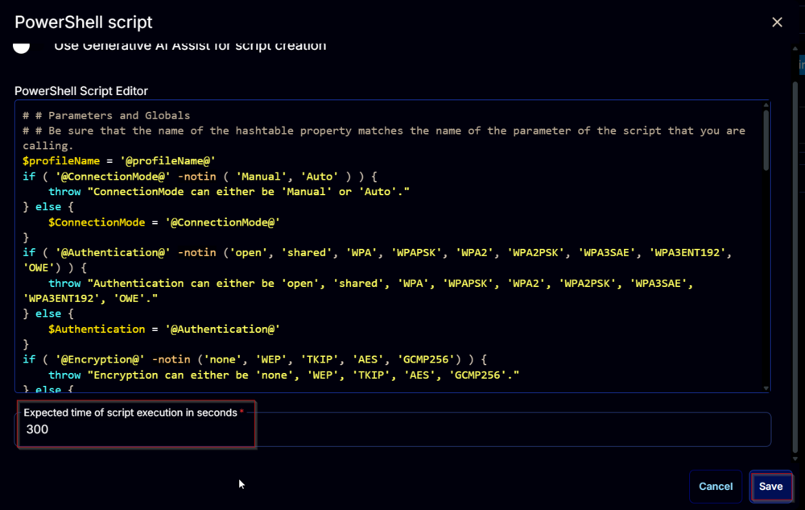

### Row 2 Function: Script Log

Add a new row by clicking the `Add Row` button.


A blank function will appear.


Search and select the `Script Log` function.


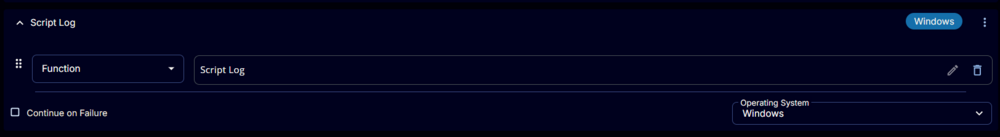

The following function will pop up on the screen:


In the script log message, simply type `%output%` and click the `Save` button.


Click the `Save` button at the top-right corner of the screen to save the script.


## Completed Task


## Output

- Script Log

