## Summary

This script utilizes the BISNotification.exe from the ProVal file repository and sends a custom message to the logged-in user on their machine if detected.  
Note: The user parameters are not mandatory. If the user parameters are not set, a default pop-up is displayed for the logged-in user, as shown below:

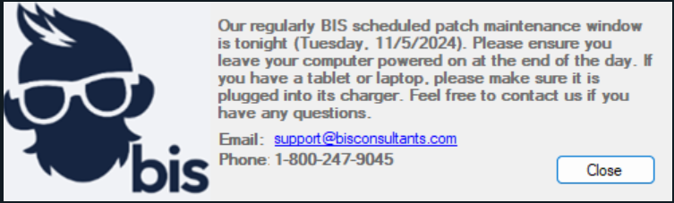

## Sample Run

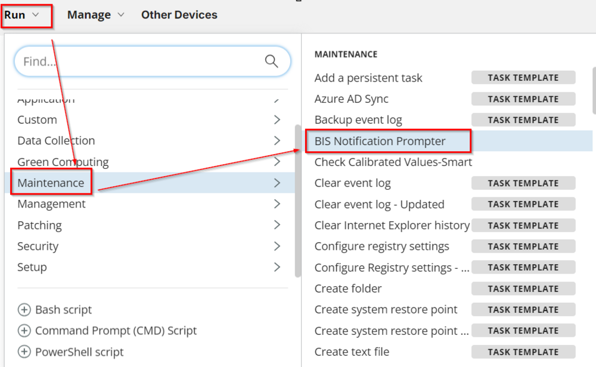  
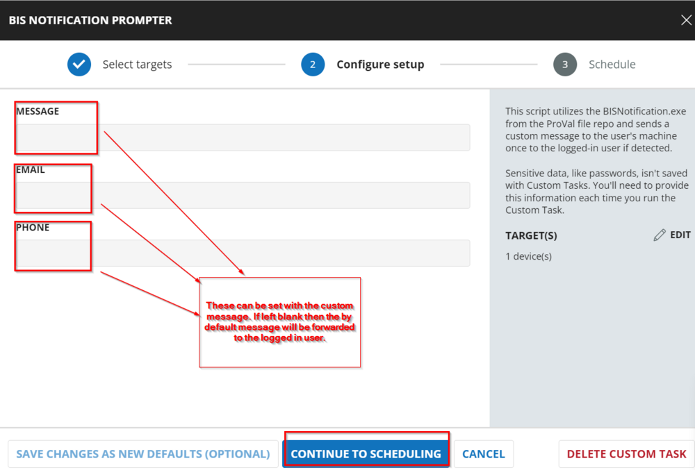  
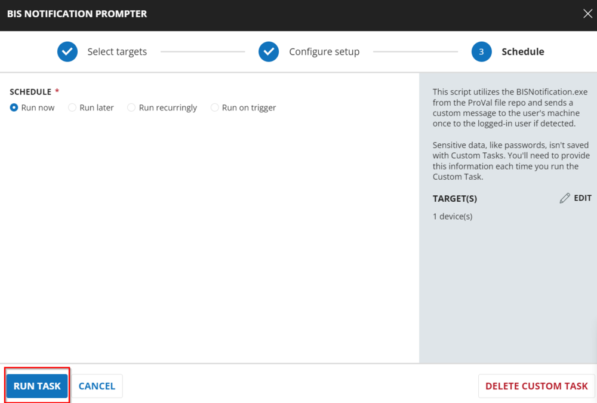

## User Parameters

| Name    | Example                             | Accepted Values | Required | Default | Type   | Description |
|---------|-------------------------------------|-----------------|----------|---------|--------|-------------|
| Message | This is a test message              | String          | False    | No      | String | This allows the notification to pop up with the provided custom message. The message should be as concise as possible. If the Message is left empty, the default message will be displayed. |
| Email   | [support@bisconsultants.com](mailto:support@bisconsultants.com) | String          | False    | No      | String | This allows the notification to pop up with the provided custom email address. |
| Phone   | 1-123-456-7890                     | String          | False    | No      | String | This allows the notification to pop up with the provided custom phone number. |

## Task Creation

Create a new `Script Editor` style script in the system to implement this task.  
  
  

**Name:** BIS Notification Prompter  
**Description:** This script utilizes the BISNotification.exe from the ProVal file repository and sends a custom message to the logged-in user on their machine if detected.  
**Category:** Maintenance  
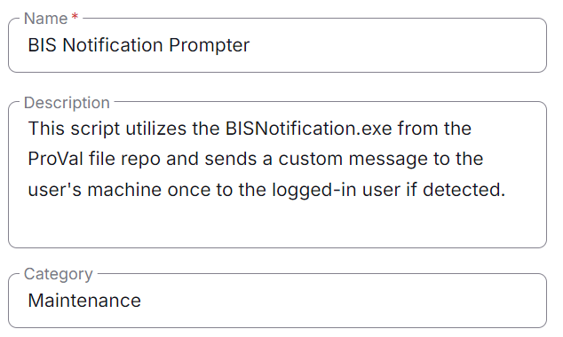  

## Task

Navigate to the Script Editor Section and start by adding a row. You can do this by clicking the `Add Row` button at the bottom of the script page.  
  

A blank function will appear.  
  

## Row 1 Function: PowerShell Script

Add a new row by clicking on the `Add Row` button.  
  

A blank function will appear.  
  

Search and select the `PowerShell Script` function.  
  

The following function will pop up on the screen:  
  

Paste in the following PowerShell script and leave the expected time of script execution set to `900` seconds. Click the `Save` button.

```powershell
[Net.ServicePointManager]::SecurityProtocol = [enum]::ToObject([Net.SecurityProtocolType], 3072)
#region Setup - Variables
$URL = 'https://file.provaltech.com/repo/app/BISNotification.exe'
$WorkingDirectory = 'C:\ProgramData\_automation\app\BISNotification'
$EXEPath = "$WorkingDirectory\BISNotification.exe"
#endregion

#region Setup - Folder Structure
if ( !(Test-Path $WorkingDirectory) ) {
    try {
        New-Item -Path $WorkingDirectory -ItemType Directory -Force -ErrorAction Stop | Out-Null
    } catch {
        return "Failed to Create $WorkingDirectory. Reason: $($Error[0].Exception.Message)"
    }
} if (-not ( ( ( Get-Acl $WorkingDirectory ).Access | Where-Object { $_.IdentityReference -Match 'EveryOne' } ).FileSystemRights -Match 'FullControl' ) ) {
    $ACl = Get-Acl $WorkingDirectory
    $AccessRule = New-Object System.Security.AccessControl.FileSystemAccessRule('Everyone', 'FullControl', 'ContainerInherit, ObjectInherit', 'none', 'Allow')
    $Acl.AddAccessRule($AccessRule)
    Set-Acl $WorkingDirectory $Acl
}
$response = Invoke-WebRequest -Uri $URL -OutFile $EXEPath -UseBasicParsing
if (!(Test-Path -Path $EXEPath)) {
    return 'An error occurred and the script was unable to be downloaded. Exiting.'
}

$Message = '@Message@'
$Email = '@Email@'
$Phone = '@Phone@'
$Parameter = ''

if ($Message -ne '' -and $Message -notmatch '@Messa') {
    $Parameter = "$Parameter -m `"$Message`""
}

if ($Email -ne '' -and $Email -notmatch '@Ema') {
    $Parameter = "$Parameter -e `"$Email`""
}

if ($Phone -match '[0-9]') {
    $Parameter = "$Parameter -p `"$Phone`""
}

$TaskName = 'BIS Notification'
$Description = 'Running BIS Notification app to send the prompt'
$ProjectName = 'BISNotification'
$WorkingDirectory = "C:\ProgramData\_automation\app\$ProjectName"
$TaskFile = "$WorkingDirectory\$ProjectName.exe"
$TaskCheck = Get-ScheduledTask -TaskName $TaskName -ErrorAction SilentlyContinue

if ($TaskCheck) {
    # Unregister the task
    Unregister-ScheduledTask -TaskName $TaskName -Confirm:$false
}

if ($Parameter -notmatch '-' ) {
    $Action = New-ScheduledTaskAction -Execute $TaskFile
} else {
    $Action = New-ScheduledTaskAction -Execute $TaskFile -Argument $Parameter
}
$TriggerTime = (Get-Date).AddMinutes(1)
$Trigger = New-ScheduledTaskTrigger -Once -At $TriggerTime

$Settings = New-ScheduledTaskSettingsSet
$Principal = New-ScheduledTaskPrincipal -GroupId ((New-Object System.Security.Principal.SecurityIdentifier('S-1-5-32-545')).Translate([System.Security.Principal.NTAccount]).Value)

try {
    Register-ScheduledTask -Action $Action -Trigger $Trigger -TaskName $TaskName -Description $Description -Settings $Settings -Principal $Principal
    Write-Output 'Task created successfully'
} catch {
    Write-Output 'Failed to create task'
}
```

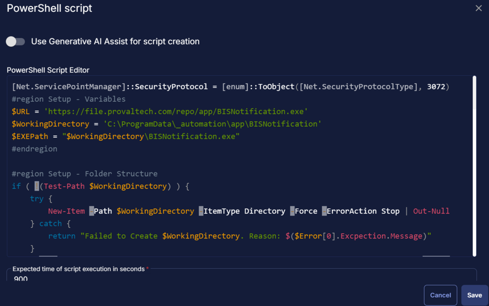  

Limit this PowerShell function to run on `Windows` machines only.

## Row 2 Function: Script Log

In the script log message, simply type `%output%` so that the script will send the results of the PowerShell script above to the output on the Automation tab for the target device.  
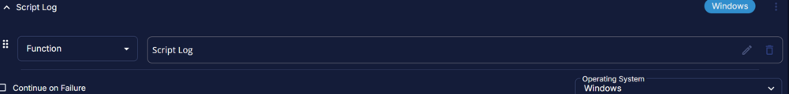  
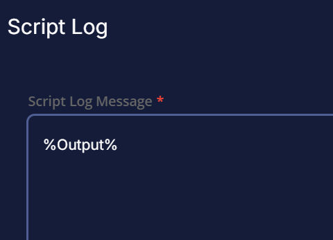  

## Row 3 Logic: If/Then

  
  

## Row 3a Condition: Output Contains

In the IF part, enter `An error occurred and the script was unable to be downloaded` in the right box of the "Output Contains" part.  
Add another condition with the Or operator and enter `Failed to create task` in the right box of the "Output Contains" part.  
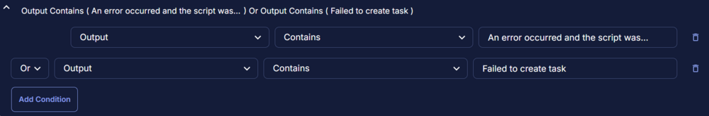  

## Row 3b Function: Script Exit

Add a new row by clicking on the `Add Row` button.  
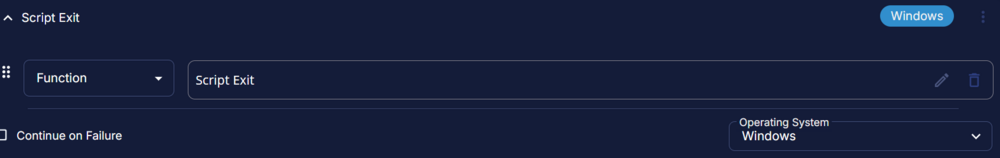  

In the script exit message, simply type `%Output%`.  
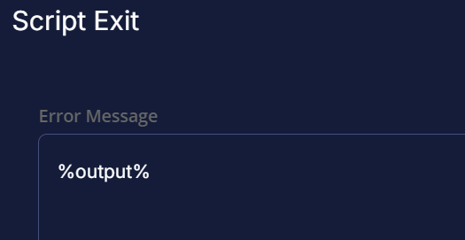  

## Row 4 Function: Script Exit

Add a new row by clicking on the `Add Row` button.  
  

In the script exit message, leave it empty.  
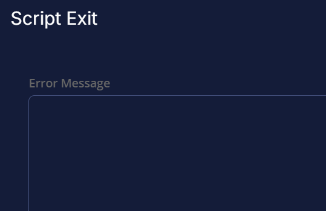  

## Completed Task

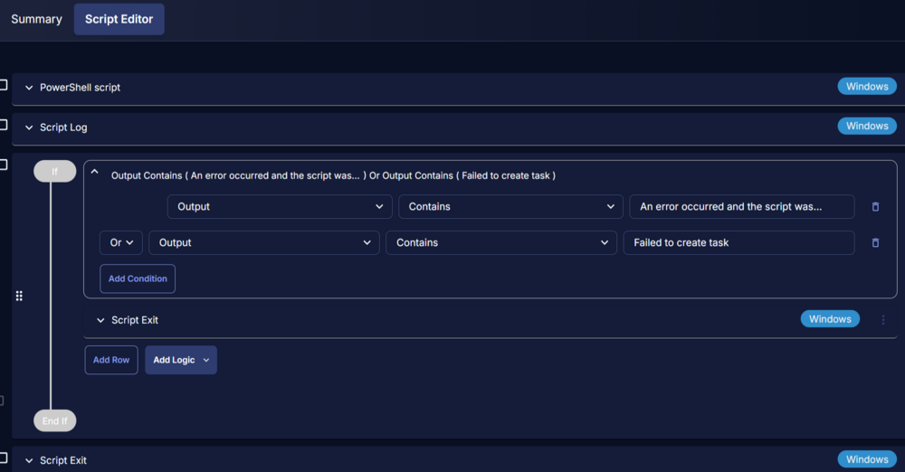  

## Implementation

This task can be scheduled manually on-demand to any agent or to a certain group of endpoints where the notification is required to be sent at a specific time.

1. Go to `Automation` > `Tasks.`
2. Search for `BIS Notification Prompter` Task.
3. Select the concerned task.
4. Click on the `Schedule` button to schedule the task/script.  
   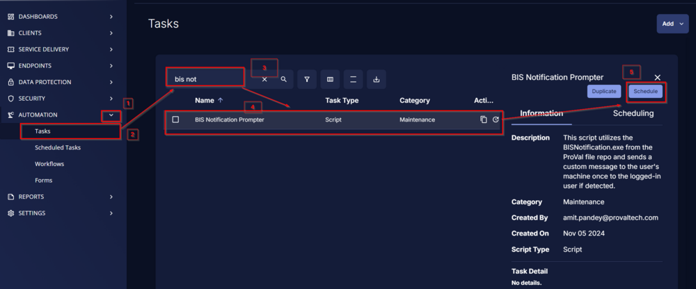
5. This screen will appear.  
   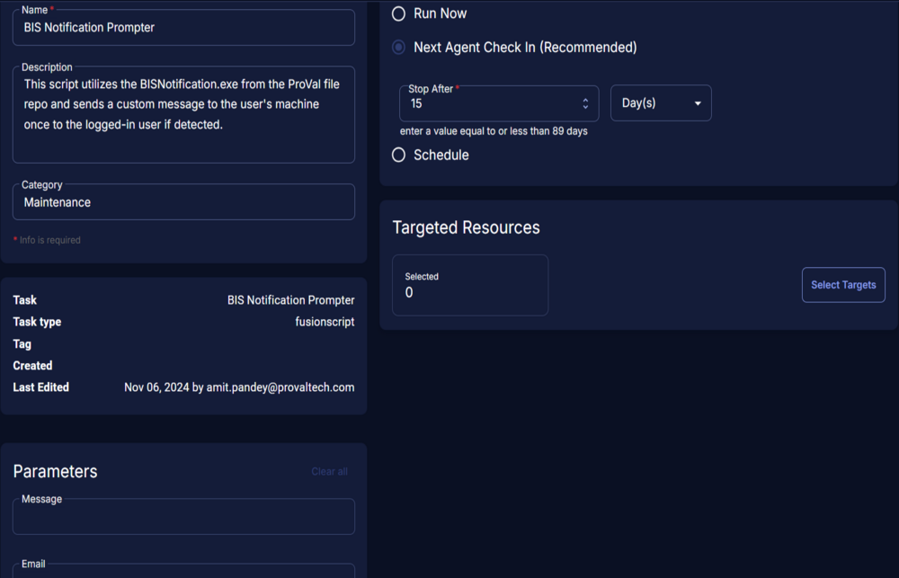  
   Please set the parameters as required to customize the notification:  
   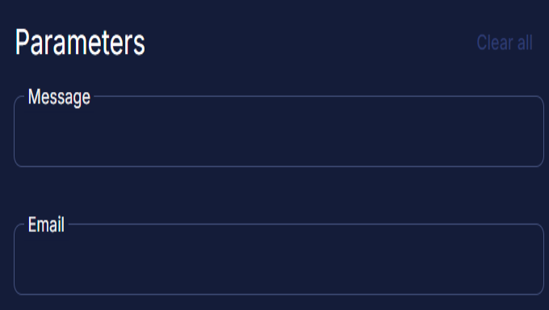
6. Select the `Schedule` button and click the calendar icon present in front of the `Recurrence` option.  
   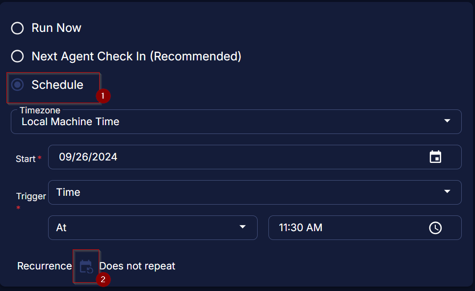
7. Select the `Month(s)` for the `Repeat`, `1` for `Dates`, and click the `OK` button to save the schedule.  
   
8. Click the `Select Targets` button to select the concerned target.  
   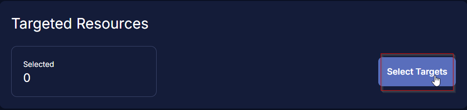
9. Search and select the Sites, Device Groups, or Devices for the target.  
   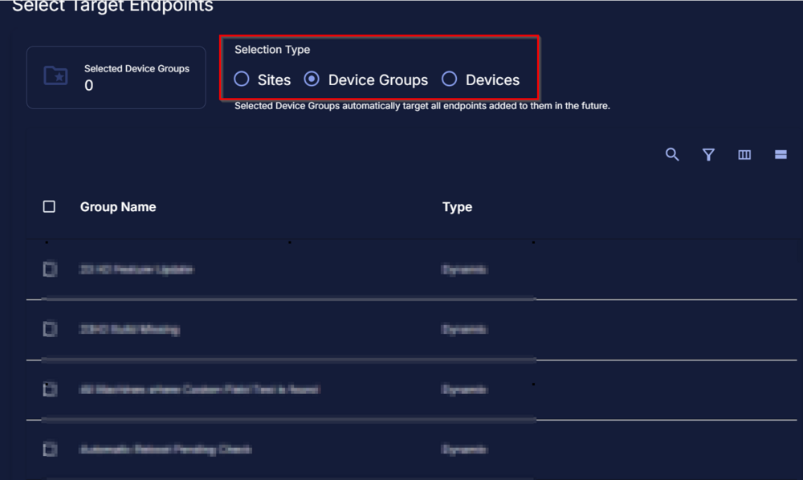
10. Click the `Run` button to initiate the schedule.  
    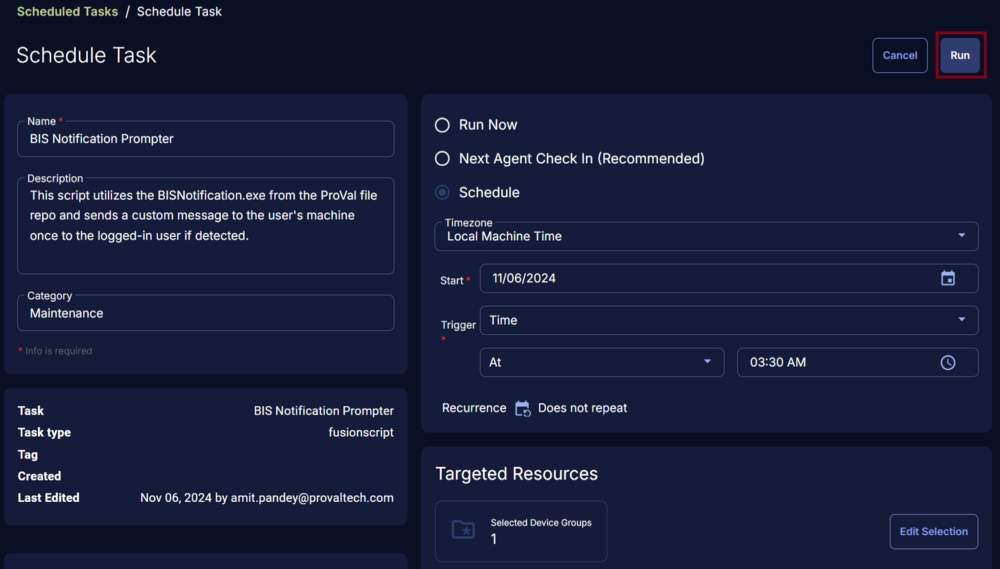

## Output

- **Script log**  
  To view the logs, follow the steps below:  
  Navigate to the Endpoints -> Devices  
    
  Navigate to the right side of the screen and click on the three bars as shown below:  
  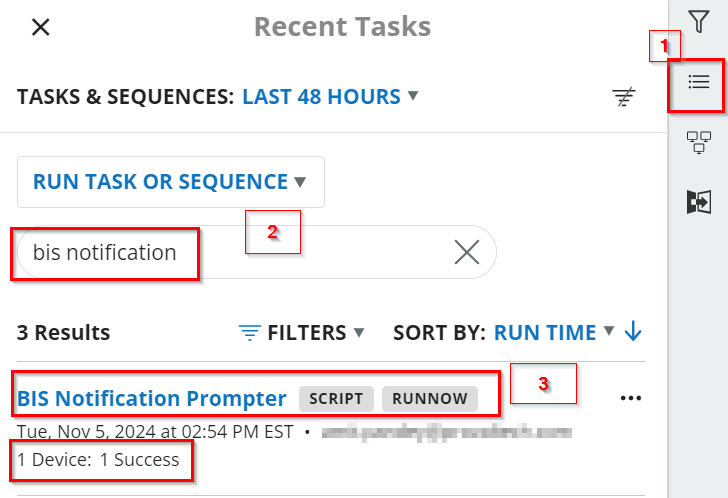  
  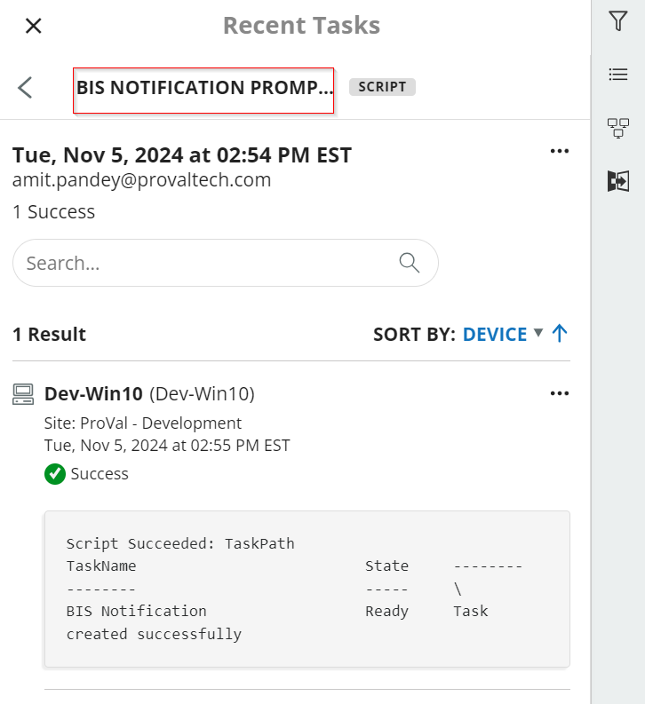  

