## Summary

This task enables BitLocker on the system volume.

The encryption methods that will be used to protect the target volume are:

- Aes256
- XtsAes256

These two options come with custom field dependencies.  
Refer to the document for the custom field dependencies check:  
[BitLocker Initialize C Volume](/docs/25f75989-92a9-49f9-b99b-a241b9f7d6ef)

## Sample Run

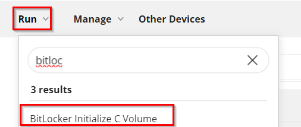  
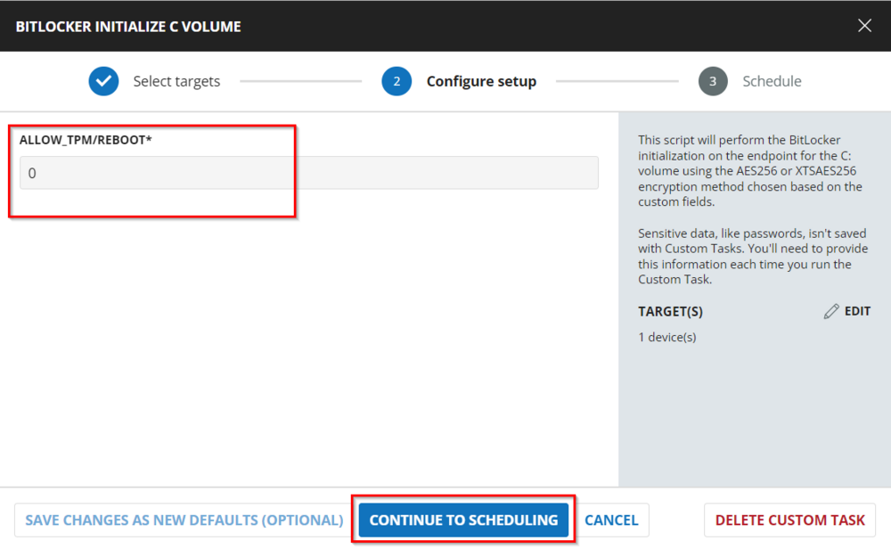  
  

## Dependencies

[BitLocker Initialize C Volume](/docs/25f75989-92a9-49f9-b99b-a241b9f7d6ef)

## Variables

| Name       | Description                                                                                                                                                                                                                                                         |
|------------|---------------------------------------------------------------------------------------------------------------------------------------------------------------------------------------------------------------------------------------------------------------------|
| Parameter  | This stores the parameter based on the combination of encryption methods that came from custom field options and allows reboot with TPM initialization based on the Allow_TPM/Reboot user parameter settings.                                                       |

## User Parameters

| Name               | Default Value | Required | Description                                                                                                                                                                                                                                           |
|--------------------|---------------|----------|-------------------------------------------------------------------------------------------------------------------------------------------------------------------------------------------------------------------------------------------------------|
| Allow_TPM/Reboot   | 0             | True     | Options for allowing TPM initialization and rebooting. 0 = Do not allow, 1 = Allow TPM Initialization, 2 = Allow Reboot, 3 = Allow TPM Initialization and Reboot                                                                                 |

## Implementation

### Create Task

BitLocker Initialize C Volume: To implement this script, please create a new "Script Editor" style script in the system.  
  

**Name:** BitLocker Initialize C Volume  
**Description:** This script will perform the BitLocker initialization on the endpoint for the C: volume using the AES256 or XTSAES256 encryption method chosen based on the custom fields.  
**Category:** Security  
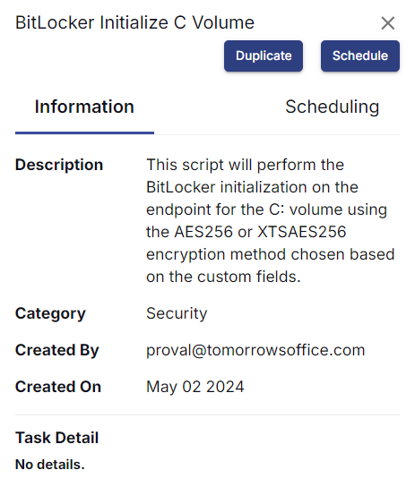  

### Script

Start by making three separate rows. You can do this by clicking the "Add Row" button at the bottom of the script page.  
  

### Row 1: Logic: If/Then

  
  

### Row 1a: Condition: Custom Field

In the IF part,  
Enter `false` in the right box of the "Custom Field Equals" part.  
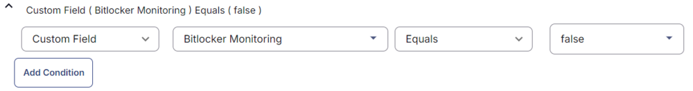  

### Row 1b: Function: Script Log

  

In the script log message, type `The BitLocker Monitoring custom field is not set at the company level. Exiting script.` so that the script will send the results of the PowerShell script above to the output on the Automation tab for the target device.  
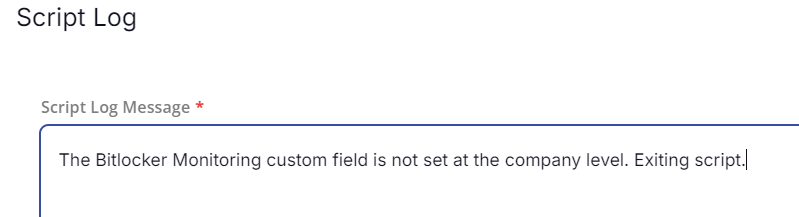  

### Row 1c: Function: Script Exit

Add a new row by clicking on the Add Row button.  
  

In the script exit message, please leave it blank.  
  

### Row 2: Logic: If/Then

  
  

### Row 2a: Condition: Custom Field

In the IF part,  
Enter `false` in the right box of the "Custom Field Does Not Equal" part.  
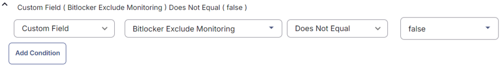  

### Row 2b: Function: Script Log

  

In the script log message, type `The BitLocker exclusion is applied to the endpoint. Exiting script.` so that the script will send the results of the PowerShell script above to the output on the Automation tab for the target device.  
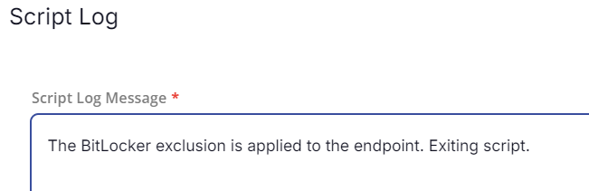  

### Row 2c: Function: Script Exit

Add a new row by clicking on the Add Row button.  
  

In the script exit message, please leave it blank.  
  

### Row 3: Function: Script Log

  

In the script log message, type `Checking OS.` so that the script will send the results of the PowerShell script above to the output on the Automation tab for the target device.  
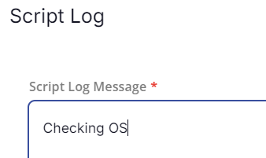  

### Row 4: Function: PowerShell Script

  

Paste the following PowerShell script and set the expected script execution time to 300 seconds.  

```powershell
$os = Get-WmiObject -Class Win32_OperatingSystem
if ($os.Caption -like "*Windows 10*") {
    return 'The operating system is Windows 10.'
}
elseif ($os.Caption -like "*Windows 11*") {
    return 'The operating system is Windows 11.'
}
else {
    return 'The operating system is not a Windows workstations.'
}
```  

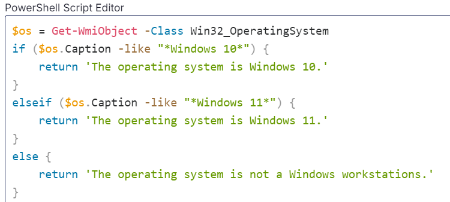  

### Row 5: Function: Script Log

  

In the script log message, type `%output%` so that the script will send the results of the PowerShell script above to the output on the Automation tab for the target device.  
  

### Row 6: Logic: If/Then

  
  

### Row 6a: Condition: Output Contains

In the IF part,  
Enter `The operating system is not a Windows workstation` in the right box of the "Output Contains" part.  
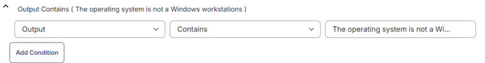  

### Row 6b: Function: Script Log

Add a new row by clicking on the Add Row button.  
  

In the script exit message, please leave it blank.  
  

### Row 7: Logic: If/Then

  
  

### Row 7a: Condition: Custom Field

In the IF part,  
Enter `false` in the right box of the "Custom Field Does Not Equal" part.  
  

### Row 7b: Condition: Custom Field

In the IF part, click:  
  

Enter `false` in the right box of the "Custom Field Does Not Equal" part.  
  

### Row 7c: Function: Script Log

  

In the script log message, type `Both custom fields 'BitLocker Monitoring' and 'BitLocker XTSAES 256' are true. Setting encryption method to 'XtsAes256'.` so that the script will send the results of the PowerShell script above to the output on the Automation tab for the target device.  
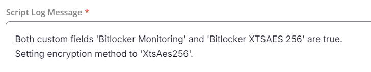  

### Row 7d: Function: Set User Variable

Enter the `Encryption Method` in the Variable Name box and provide the Value as `XtsAes256`.  
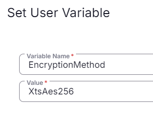  

### Row 7e: Logic: If/Then

  
  

### Row 7e.1: Condition: Value

In the IF part,  
Enter `0 Equals @Allow_TPM/Reboot@` in the right box of the Value part.  
  

### Row 7e.2: Function: Set User Variable

Enter the `Parameter` in the Variable Name box and provide the Value as `-RecoveryPasswordProtector -EncryptionMethod @EncryptionMethod@ -SkipHardwareTest`.  
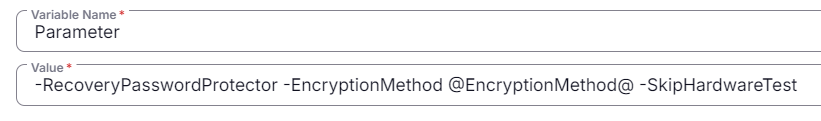  

### Row 7f: Logic: If/Then

### Row 7f.1: Condition: Value

In the IF part,  
Enter `1 Equals @Allow_TPM/Reboot@` in the right box of the Value part.  
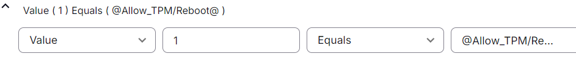  

### Row 7f.2: Function: Set User Variable

Enter the `Parameter` in the Variable Name box and provide the Value as `-RecoveryPasswordProtector -AllowTPMInit -EncryptionMethod @EncryptionMethod@ -SkipHardwareTest`.  
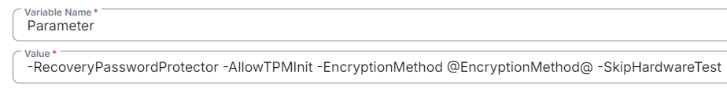  

### Row 7g: Logic: If/Then

### Row 7g.1: Condition: Value

In the IF part,  
Enter `2 Equals @Allow_TPM/Reboot@` in the right box of the Value part.  
  

### Row 7g.2: Function: Set User Variable

Enter the `Parameter` in the Variable Name box and provide the Value as `-RecoveryPasswordProtector -AllowRestart -EncryptionMethod @EncryptionMethod@ -SkipHardwareTest`.  
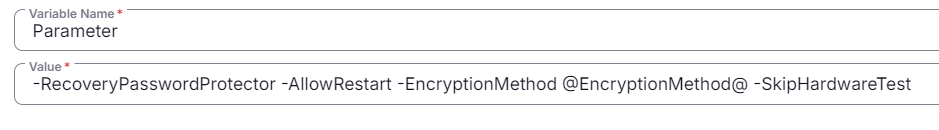  

### Row 7h: Logic: If/Then

### Row 7h.1: Condition: Value

In the IF part,  
Enter `3 Equals @Allow_TPM/Reboot@` in the right box of the Value part.  
  

### Row 7h.2: Function: Set User Variable

Enter the `Parameter` in the Variable Name box and provide the Value as `-RecoveryPasswordProtector -AllowTPMInit -AllowRestart -EncryptionMethod @EncryptionMethod@ -SkipHardwareTest`.  
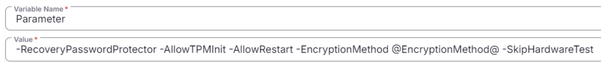  

### Row 7: Condition: Else  

### Row 7i: Condition: Custom Field

In the IF part,  
Enter `false` in the right box of the "Custom Field Does Not Equal" part.  
  

### Row 7j: Condition: Custom Field

In the IF part, click:  
  

Enter `false` in the right box of the "Custom Field Equals" part.  
  

### Row 7k: Function: Script Log

  

In the script log message, type `The 'BitLocker Monitoring' custom fields are true and 'BitLocker XTSAES 256' are false. Setting encryption method to 'Aes256'.` so that the script will send the results of the PowerShell script above to the output on the Automation tab for the target device.  
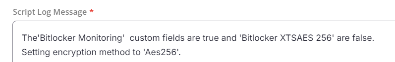  

### Row 7l: Function: Set User Variable

Enter the `Encryption Method` in the Variable Name box and provide the Value as `Aes256`.  
  

### Row 7l.1: Condition: Value

In the IF part,  
Enter `0 Equals @Allow_TPM/Reboot@` in the right box of the Value part.  
  

### Row 7l.2: Function: Set User Variable

Enter the `Parameter` in the Variable Name box and provide the Value as `-RecoveryPasswordProtector -EncryptionMethod @EncryptionMethod@ -SkipHardwareTest`.  
  

### Row 7m: Logic: If/Then

### Row 7m.1: Condition: Value

In the IF part,  
Enter `1 Equals @Allow_TPM/Reboot@` in the right box of the Value part.  
  

### Row 7m.2: Function: Set User Variable

Enter the `Parameter` in the Variable Name box and provide the Value as `-RecoveryPasswordProtector -AllowTPMInit -EncryptionMethod @EncryptionMethod@ -SkipHardwareTest`.  
  

### Row 7n: Logic: If/Then

### Row 7n.1: Condition: Value

In the IF part,  
Enter `2 Equals @Allow_TPM/Reboot@` in the right box of the Value part.  
  

### Row 7n.2: Function: Set User Variable

Enter the `Parameter` in the Variable Name box and provide the Value as `-RecoveryPasswordProtector -AllowRestart -EncryptionMethod @EncryptionMethod@ -SkipHardwareTest`.  
  

### Row 7o: Logic: If/Then

### Row 7o.1: Condition: Value

In the IF part,  
Enter `3 Equals @Allow_TPM/Reboot@` in the right box of the Value part.  
  

### Row 7o.2: Function: Set User Variable

Enter the `Parameter` in the Variable Name box and provide the Value as `-RecoveryPasswordProtector -AllowTPMInit -AllowRestart -EncryptionMethod @EncryptionMethod@ -SkipHardwareTest`.  
  

### Row 8: Function: Script Log

  

In the script log message, type `Executing BitLocker initialization` so that the script will send the results of the PowerShell script above to the output on the Automation tab for the target device.  
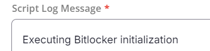  

### Row 9: Function: PowerShell Script

  

Paste the following PowerShell script and set the expected script execution time to `1800` seconds.  

```powershell
#region Setup - Variables
$ProjectName = 'Initialize-BitLockerVolume'
[Net.ServicePointManager]::SecurityProtocol = [enum]::ToObject([Net.SecurityProtocolType], 3072)
$BaseURL = 'https://file.provaltech.com/repo'
$PS1URL = "$BaseURL/script/$ProjectName.ps1"
$WorkingDirectory = "C:\ProgramData\_automation\script\$ProjectName"
$PS1Path = "$WorkingDirectory\$ProjectName.ps1"
$WorkingPath = $WorkingDirectory
#endregion
#region Setup - Folder Structure
mkdir -Path $WorkingDirectory -ErrorAction SilentlyContinue | Out-Null
$response = Invoke-WebRequest -Uri $PS1URL -UseBasicParsing
if (($response.StatusCode -ne 200) -and (!(Test-Path -Path $PS1Path))) {
    Write-Error -Message "No pre-downloaded script exists and the script '$PS1URL' failed to download. Exiting."
    return
} elseif ($response.StatusCode -eq 200) {
    Remove-Item -Path $PS1Path -ErrorAction SilentlyContinue
    [System.IO.File]::WriteAllLines($PS1Path, $response.Content)
}
if (!(Test-Path -Path $PS1Path)) {
    Write-Error -Message 'An error occurred and the script was unable to be downloaded. Exiting.'
    return
}
#endregion
#region Execution
& $PS1Path @Parameter@
#endregion
```  

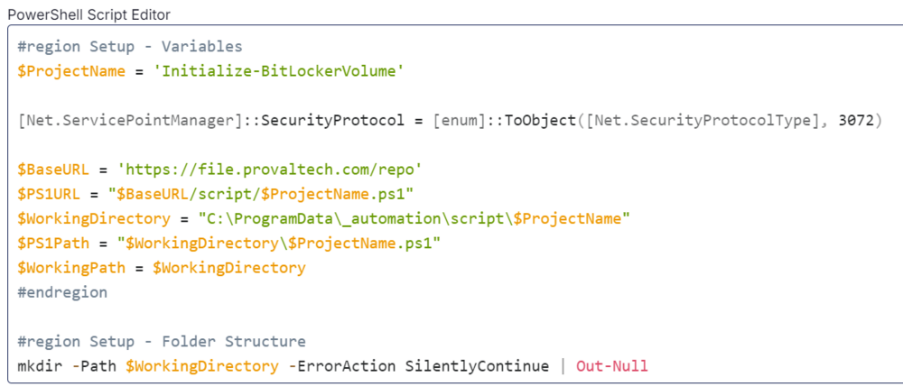  

### Row 10: Function: Script Log

  

In the script log message, type `%output%` so that the script will send the results of the PowerShell script above to the output on the Automation tab for the target device.  
  

### Row 11: Function: PowerShell Script

  

Paste the following PowerShell script and set the expected script execution time to 300 seconds.  

```powershell
$logFilePath = 'C:\ProgramData\_automation\script\Initialize-BitLockerVolume\Initialize-BitLockerVolume-log.txt'
$errorFilePath = 'C:\ProgramData\_automation\script\Initialize-BitLockerVolume\Initialize-BitLockerVolume-error.txt'
if (Test-Path $logFilePath) {
    if (Test-Path $errorFilePath) {
        return 'Failure'
    }
    else {
        return 'Success'
    }
}
else {
    return 'Failure'
}
```  

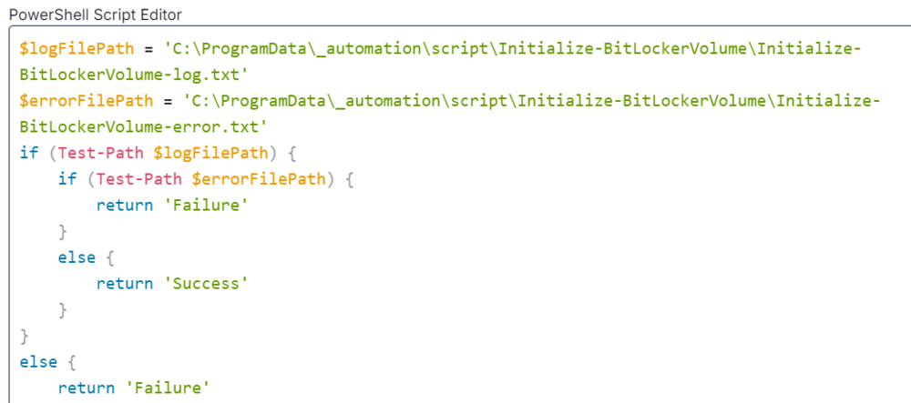  

### Row 12: Function: Script Log

  

In the script log message, type `%output%` so that the script will send the results of the PowerShell script above to the output on the Automation tab for the target device.  
  

### Row 13: Function: Set Custom Field

Add a new row by clicking on the Add Row button.  
Select Function 'Set Custom Field'. When you select `Set Custom Field`, it will open up a new window.  

In this window, search for the `BitLocker INIT Result` field.  
**Custom Field:** `BitLocker INIT Result`  
**Value:** `%Output%`  
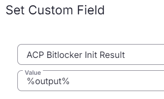  

