## Summary

This document describes the process for pushing BitLocker keys to Active Directory (AD) and Azure Active Directory (Azure AD). This is a one-way push, NOT a sync. If the push is successful, the key should be backed up. If the push is unsuccessful, the key will need to be validated manually.

## Parameters

This script does not have any parameters and can be run against any online Windows device.

## Dependencies

[CW RMM - Custom Field - BitLocker Key Backup Status](/docs/362c3958-f97e-4f40-bd1d-89cbfed9b17f)

## Create Script

To implement this script, please create a new "Script Editor" style script in the system.

  
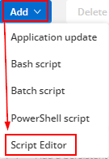  

**Name:** BitLocker Recovery Key Backup Audit  
**Description:** This script will attempt to push BitLocker keys to AD/Azure AD. This is a one-way push, NOT a sync. If the push is successful, the key should be backed up. If the push is unsuccessful, the key will need to be validated manually.  
**Category:** Custom  

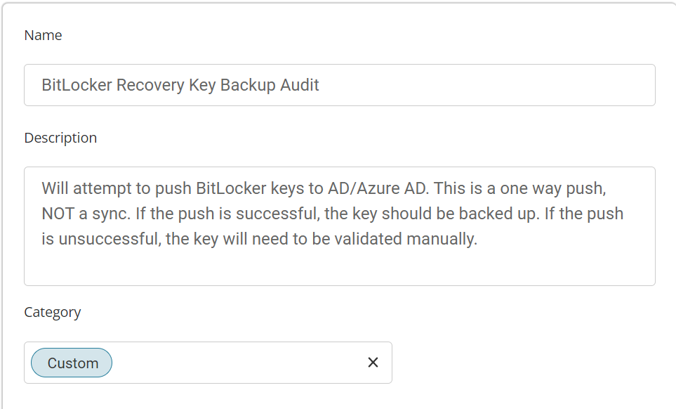  

Start by creating three separate rows. You can do this by clicking the "Add Row" button at the bottom of the script page.

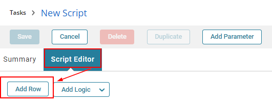  

### Row 1 Function: PowerShell Script

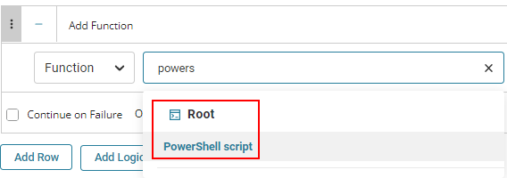  

Paste in the following PowerShell script and set the expected time of script execution to 300 seconds.

```
$InformationPreference = 'Continue'
$bitlockerVolumes = Get-BitLockerVolume
foreach ($bitlockerVolume in $bitlockerVolumes) {
    $keyProtectors = $bitlockerVolume | Select-Object -ExpandProperty KeyProtector | Where-Object { $_.KeyProtectorType -eq 'RecoveryPassword' }
    foreach ($keyProtector in $keyProtectors) {
        $recoveryPasswordSubstring = $keyProtector.RecoveryPassword.Substring($keyProtector.RecoveryPassword.Length - 13)
        $AADBackupSuccess = BackupToAAD-BitLockerKeyProtector -MountPoint $bitlockerVolume.MountPoint -KeyProtectorId $keyProtector.KeyProtectorID -ErrorAction SilentlyContinue
        if ($AADBackupSuccess) {
            Write-Information "Success: BitLocker recovery key ending in '$recoveryPasswordSubstring' has been backed up to Azure Active Directory."
            continue
        }
        $ADBackupSuccess = Backup-BitLockerKeyProtector -MountPoint $bitlockerVolume.MountPoint -KeyProtectorId $keyProtector.KeyProtectorID -ErrorAction SilentlyContinue
        if ($ADBackupSuccess) {
            Write-Information "Success: BitLocker recovery key ending in '$recoveryPasswordSubstring' has been backed up to Active Directory."
            continue
        }
        Write-Information "Failure: BitLocker recovery key ending in '$recoveryPasswordSubstring' has NOT been backed up to Active Directory or Azure Active Directory."
    }
}
```

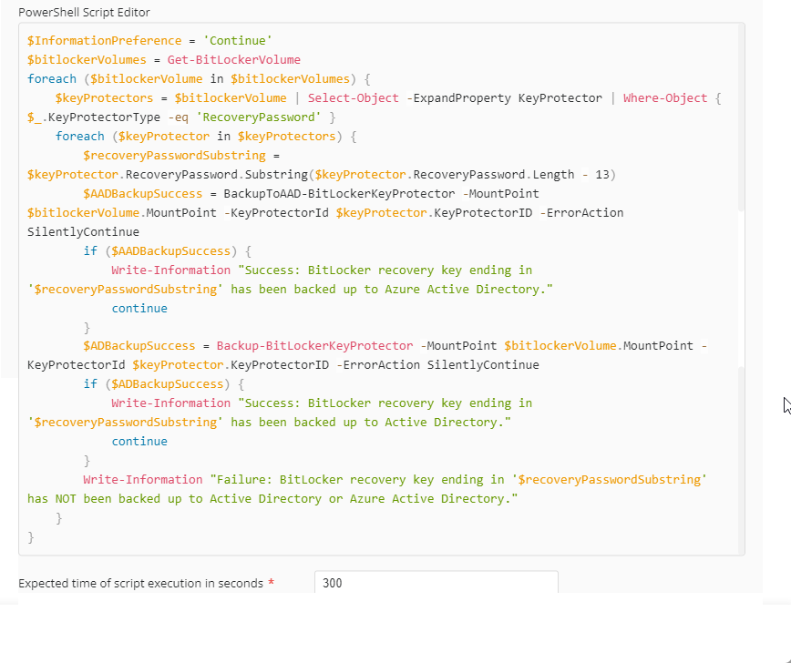  

Save and move to the next row.

### Row 2 Function: Script Log

  

In the script log message, simply type `%output%` so that the script will send the results of the PowerShell script above to the output on the Automation tab for the target device.

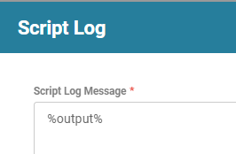  

### Row 3 Function: Set Custom Field

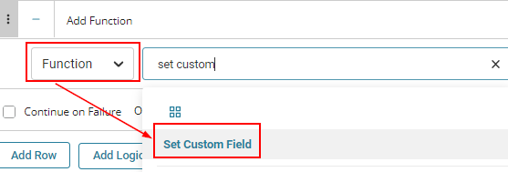  

When you select "Set Custom Field," a new window will open. In this window, find the "BitLocker Key Backup Status" field.

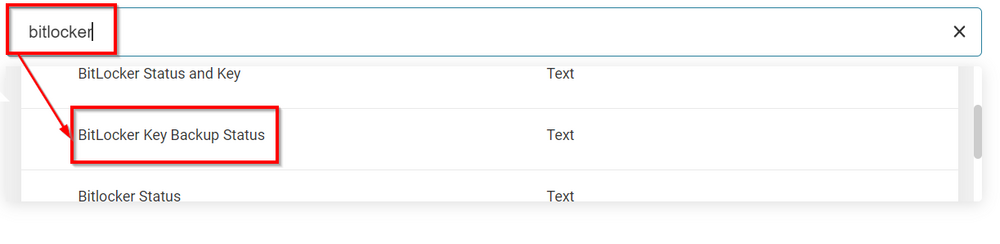  

In the Value area, simply type `%output%` to store the PowerShell output in the custom field.

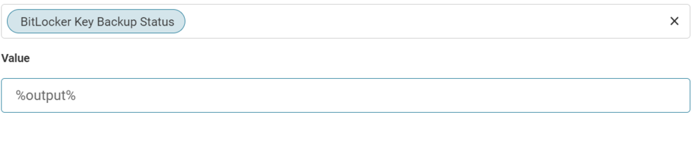  

Once all items are added, please save the task.  
The final task should look like the screenshot below.

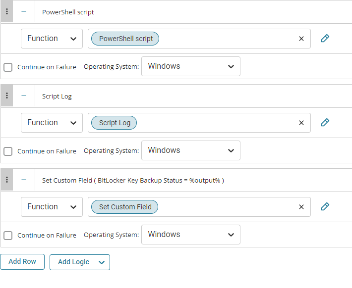  

## Script Deployment

The script is intended to run manually at this time.

The task should be scheduled to run once. Please see the example in the screenshot below.

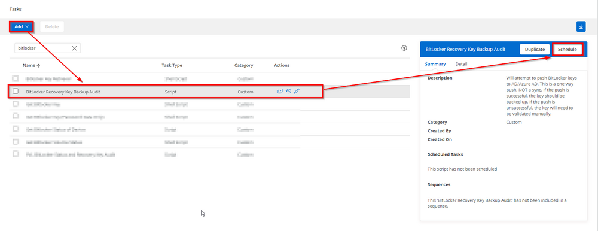  
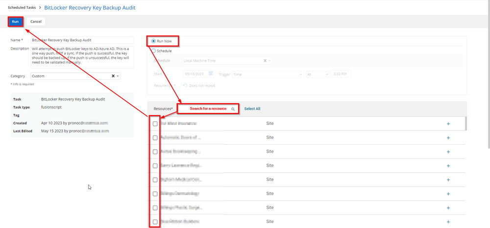  

**Run Now**  
**Resource:** Select a group/machine on which you would like to run this script.

## Output

- Script Log
- Custom Field

