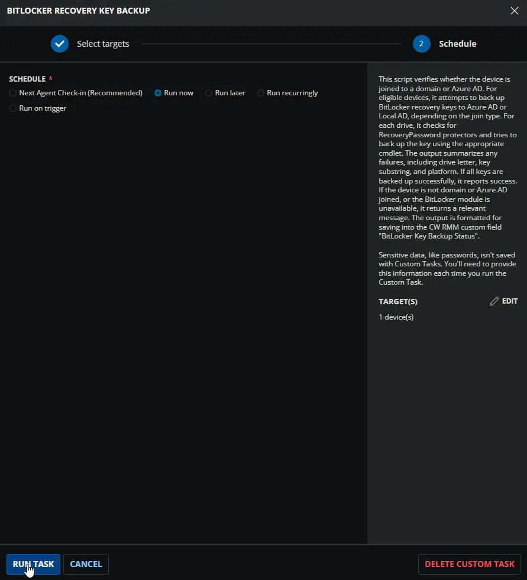
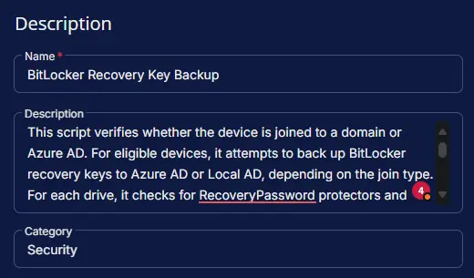
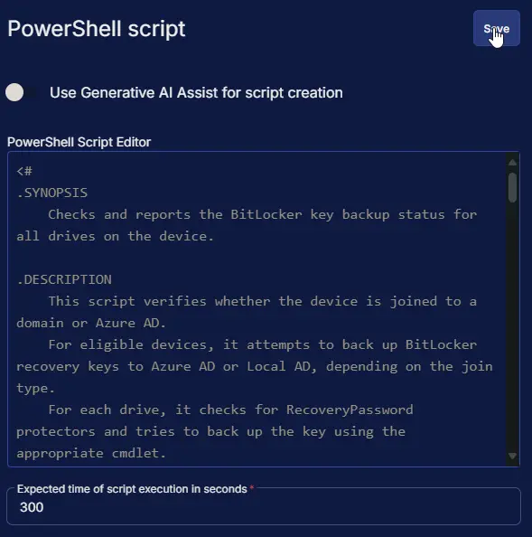
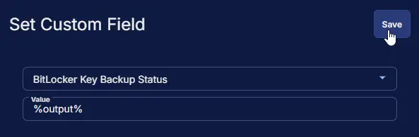
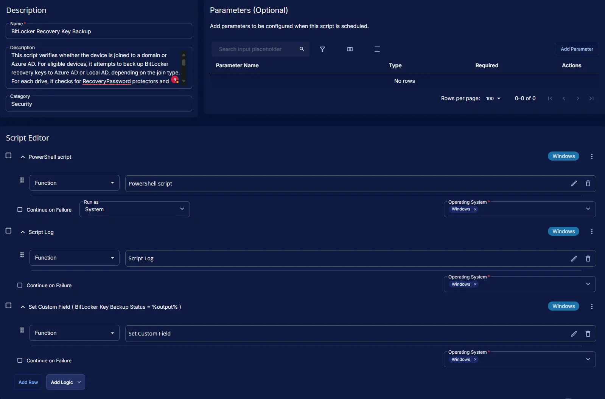
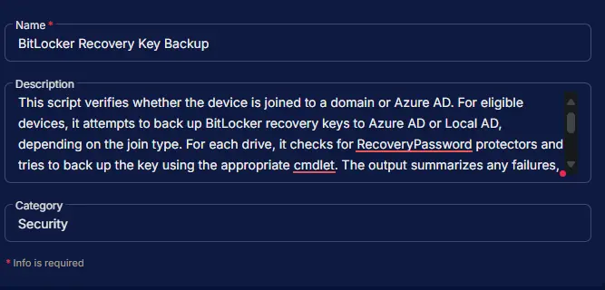
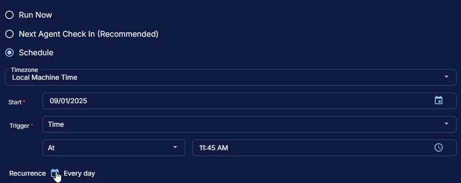
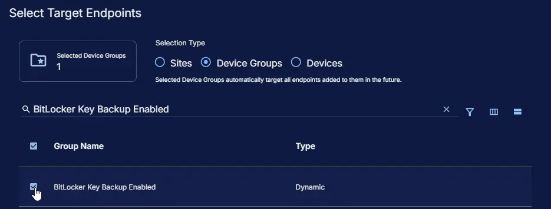
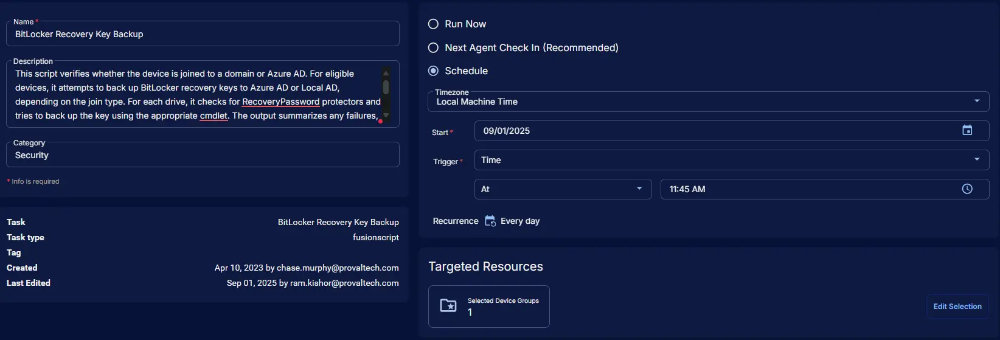

---
id: 'b469ea90-0c1b-421b-89e2-be5c91501035'
slug: /b469ea90-0c1b-421b-89e2-be5c91501035
title: 'BitLocker Recovery Key Backup'
title_meta: 'BitLocker Recovery Key Backup'
keywords: ['bitlocker', 'bitlocker-status', 'recovery-key', 'bitlocker-audit', 'recovery-password', 'backup', 'domain']
description: 'This script verifies whether the device is joined to a domain or Azure AD. For eligible devices, it attempts to back up BitLocker recovery keys to Azure AD or Local AD, depending on the join type. For each drive, it checks for RecoveryPassword protectors and tries to back up the key using the appropriate cmdlet. The output summarizes any failures, including drive letter, key substring, and platform. If all keys are backed up successfully, it reports success. If the device is not domain or Azure AD joined, or the BitLocker module is unavailable, it returns a relevant message. The output is formatted for saving into the CW RMM custom field "BitLocker Key Backup Status".'
tags: ['bitlocker', 'security', 'auditing']
draft: false
unlisted: false
last_update:
  date: 2025-09-01
---

## Summary

This script verifies whether the device is joined to a domain or Azure AD. For eligible devices, it attempts to back up BitLocker recovery keys to Azure AD or Local AD, depending on the join type. For each drive, it checks for RecoveryPassword protectors and tries to back up the key using the appropriate cmdlet. The output summarizes any failures, including drive letter, key substring, and platform. If all keys are backed up successfully, it reports success. If the device is not domain or Azure AD joined, or the BitLocker module is unavailable, it returns a relevant message. The output is formatted for saving into the CW RMM custom field [BitLocker Key Backup Status](/docs/362c3958-f97e-4f40-bd1d-89cbfed9b17f).

**Notes:** *The `BitLocker Drive Encryption` feature must be enabled on servers to run this script against windows servers. Auditing will not work without enabling this feature.*

## Sample Run

## Dependencies

- [Custom Field - BitLocker Key Backup Status](/docs/362c3958-f97e-4f40-bd1d-89cbfed9b17f)
- [Group - BitLocker Key Backup Enabled](/docs/72e98ffa-ed78-4986-a655-99bb4ad3f2a9)
- [Solution - BitLocker Key Backup](/docs/fecda0ff-5a3e-4cc5-b6a7-fd37732aa2e9)

## Task Setup Path

**Tasks Path:** `AUTOMATION` ➞ `Tasks`  
**Task Type:** `Script Editor`

## Task Creation

### Description

- **Name:** `BitLocker Recovery Key Backup`  
- **Description:** `This script verifies whether the device is joined to a domain or Azure AD. For eligible devices, it attempts to back up BitLocker recovery keys to Azure AD or Local AD, depending on the join type. For each drive, it checks for RecoveryPassword protectors and tries to back up the key using the appropriate cmdlet. The output summarizes any failures, including drive letter, key substring, and platform. If all keys are backed up successfully, it reports success. If the device is not domain or Azure AD joined, or the BitLocker module is unavailable, it returns a relevant message. The output is formatted for saving into the CW RMM custom field "BitLocker Key Backup Status".`  
- **Category:** `Security`

### Script Editor

#### Step 1: Row -> PowerShell script

- **Use Generative AI Assist for script creation:** `False`  
- **Expected time of script execution in seconds:** `300`  
- **Operating System:** `Windows`  
- **Continue on Failure:** `False`  
- **Run As:** `System`  
- **PowerShell Script Editor:**

[PowerShell Script](https://github.com/ProVal-Tech/cw-rmm/blob/main/tasks/bitlocker-recovery-key-backup/script.ps1)

#### Step 2: Row -> Script Log

- **Script Log Message:** `%Output%`  
- **Continue on Failure:** `False`  
- **Operating System:** `Windows`

#### Step 3: Row -> Set Custom Field ( BitLocker Key Backup Status = %output% )

- **Custom Field:** `BitLocker Key Backup Status`  
- **Value:** `%Output%`  
- **Continue on Failure:** `False`  
- **Operating System:** `Windows`

## Completed Task

## Output

- Script Log
- Custom Field

## Schedule Task

### Task Details

- **Name:** `BitLocker Recovery Key Backup`  
- **Description:** `This script verifies whether the device is joined to a domain or Azure AD. For eligible devices, it attempts to back up BitLocker recovery keys to Azure AD or Local AD, depending on the join type. For each drive, it checks for RecoveryPassword protectors and tries to back up the key using the appropriate cmdlet. The output summarizes any failures, including drive letter, key substring, and platform. If all keys are backed up successfully, it reports success. If the device is not domain or Azure AD joined, or the BitLocker module is unavailable, it returns a relevant message. The output is formatted for saving into the CW RMM custom field "BitLocker Key Backup Status".`  
- **Category:** `Security`

### Schedule

- **Schedule Type:**  `Schedule`  
- **Timezone:** `Local Machine Time`  
- **Start:** `<Current Date>`  
- **Trigger:** `Time` `At` `<Current Time>`  
- **Recurrence:** `Every day`

### Targeted Resource

**Device Group:** `BitLocker Key Backup Enabled`

### Completed Scheduled Task

## Changelog

### 2025-09-01

- Initial version of the document

