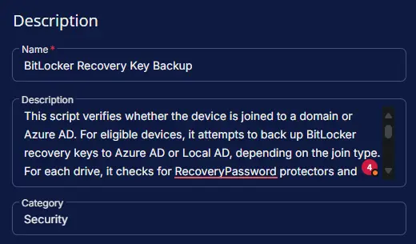

## Summary

This script verifies whether the device is joined to a domain or Azure AD. For eligible devices, it attempts to back up BitLocker recovery keys to Azure AD or Local AD, depending on the join type. For each drive, it checks for RecoveryPassword protectors and tries to back up the key using the appropriate cmdlet. The output summarizes any failures, including drive letter, key substring, and platform. If all keys are backed up successfully, it reports success. If the device is not domain or Azure AD joined, or the BitLocker module is unavailable, it returns a relevant message. The output is formatted for saving into the CW RMM custom field [BitLocker Key Backup Status](/docs/362c3958-f97e-4f40-bd1d-89cbfed9b17f).

**Notes:** *The `BitLocker Drive Encryption` feature must be enabled on servers to run this script against windows servers. Auditing will not work without enabling this feature.*

## Sample Run


## Dependencies

- [Custom Field - BitLocker Key Backup Status](/docs/362c3958-f97e-4f40-bd1d-89cbfed9b17f)
- [Group - BitLocker Key Backup Enabled](/docs/72e98ffa-ed78-4986-a655-99bb4ad3f2a9)
- [Solution - BitLocker Key Backup](/docs/fecda0ff-5a3e-4cc5-b6a7-fd37732aa2e9)

## Task Setup Path

**Tasks Path:** `AUTOMATION` ➞ `Tasks`  
**Task Type:** `Script Editor`

## Task Creation

### Description

- **Name:** `BitLocker Recovery Key Backup`  
- **Description:** `This script verifies whether the device is joined to a domain or Azure AD. For eligible devices, it attempts to back up BitLocker recovery keys to Azure AD or Local AD, depending on the join type. For each drive, it checks for RecoveryPassword protectors and tries to back up the key using the appropriate cmdlet. The output summarizes any failures, including drive letter, key substring, and platform. If all keys are backed up successfully, it reports success. If the device is not domain or Azure AD joined, or the BitLocker module is unavailable, it returns a relevant message. The output is formatted for saving into the CW RMM custom field "BitLocker Key Backup Status".`  
- **Category:** `Security`



### Script Editor

#### Step 1: Row -> PowerShell script

- **Use Generative AI Assist for script creation:** `False`  
- **Expected time of script execution in seconds:** `300`  
- **Operating System:** `Windows`  
- **Continue on Failure:** `False`  
- **Run As:** `System`  
- **PowerShell Script Editor:**

```PowerShell
<#
.SYNOPSIS
    Checks and reports the BitLocker key backup status for all drives on the device.

.DESCRIPTION
    This script verifies whether the device is joined to a domain or Azure AD.
    For eligible devices, it attempts to back up BitLocker recovery keys to Azure AD or Local AD, depending on the join type.
    For each drive, it checks for RecoveryPassword protectors and tries to back up the key using the appropriate cmdlet.
    The output summarizes any failures, including drive letter, key substring, and platform.
    If all keys are backed up successfully, it reports success.
    If the device is not domain or Azure AD joined, or the BitLocker module is unavailable, it returns a relevant message.
    The output is formatted for saving into the CW RMM custom field "BitLocker Key Backup Status".

.OUTPUTS
    A formatted string summarizing BitLocker key backup status for each drive.
    Format: | <DriveLetter>: - <Status> - <Last13Chars>; <Platform> |
    Example: | C: - FAILED - <Last13Chars>; Azure AD | D: - Key: Not Found |
    If all keys are backed up: | All BitLocker keys are backed up successfully. |

.NOTES
    - Output is truncated to 300 characters to fit the custom field limit.
    - Only devices joined to a domain or Azure AD are eligible for key backup.
    - Uses Get-BitLockerVolume, Backup-BitLockerKeyProtector, and BackupToAAD-BitLockerKeyProtector cmdlets.

.EXAMPLE
    # Save BitLocker key backup status to a custom field
    $status = .\Backup-BitlockerKeyCWRMM.ps1
    # Assign $status to the "BitLocker Key Backup Status" field in CW RMM.

#>

if (!(Get-Command -Name 'Get-BitLockerVolume' -ErrorAction SilentlyContinue)) {
    return '| BitLocker module is unavailable on this device. |'
}

$domainInfo = dsregcmd /status | Out-String

$aadJoined = $false
$domainJoined = $false
$workgroupJoined = $true

if ($domainInfo -match 'AzureAdJoined\s*:\s*YES') {
    $aadJoined = $true
}
if ($domainInfo -match 'DomainJoined\s*:\s*YES') {
    $domainJoined = $true
}
if ($aadJoined -or $domainJoined) {
    $workgroupJoined = $false
}

if ($workgroupJoined) {
    return '| Device is not joined to a domain or Azure AD. |'
}

$bitlockerInfo = Get-BitLockerVolume

if ($bitlockerInfo) {
    $bitlockerInfoOutput = @()

    foreach ($drive in $bitlockerInfo) {
        $keyProtectors = $drive | Where-Object { $_.KeyProtectorType -eq 'RecoveryPassword' } | Select-Object -ExpandProperty KeyProtector
        foreach ($keyProtector in $keyProtectors) {
            $recoveryPasswordSubstring = $keyProtector.RecoveryPassword.Substring($keyProtector.RecoveryPassword.Length - 13)
            if ($recoveryPasswordSubstring) {
                if ($aadJoined) {
                    if (!(BackupToAAD-BitLockerKeyProtector -MountPoint $drive.MountPoint -KeyProtectorId $keyProtector.KeyProtectorID -ErrorAction SilentlyContinue)) {
                        $bitlockerInfoOutput += '{0} - FAILED - {1}; Azure AD' -f $drive.MountPoint, $recoveryPasswordSubstring
                    }
                }
                if ($domainJoined) {
                    if (!(Backup-BitLockerKeyProtector -MountPoint $drive.MountPoint -KeyProtectorId $keyProtector.KeyProtectorID -ErrorAction SilentlyContinue)) {
                        $bitlockerInfoOutput += '{0} - FAILED - {1}; Local AD' -f $drive.MountPoint, $recoveryPasswordSubstring
                    }
                }
            } else {
                $bitlockerInfoOutput += '{0} - Key: Not Found' -f $drive.MountPoint
            }
        }
    }

    if ($bitlockerInfoOutput) {
        $bitlockerReturnString = $($bitlockerInfoOutput -join ' | ')
        if ($bitlockerReturnString.Length -le 300) {
            $bitlockerReturnInfo = $bitlockerReturnString
        } else {
            $bitlockerReturnInfo = $bitlockerReturnString.Substring(0, 295)
        }
        return '| {0} |' -f $bitlockerReturnInfo
    } else {
        return '| All BitLocker keys are backed up successfully. |'
    }
} else {
    return 'BitLocker Disabled'
}
```


#### Step 2: Row -> Script Log

- **Script Log Message:** `%Output%`  
- **Continue on Failure:** `False`  
- **Operating System:** `Windows`


#### Step 3: Row -> Set Custom Field ( BitLocker Key Backup Status = %output% )

- **Custom Field:** `BitLocker Key Backup Status`  
- **Value:** `%Output%`  
- **Continue on Failure:** `False`  
- **Operating System:** `Windows`


## Completed Task


## Output

- Script Log
- Custom Field

## Schedule Task

### Task Details

- **Name:** `BitLocker Recovery Key Backup`  
- **Description:** `This script verifies whether the device is joined to a domain or Azure AD. For eligible devices, it attempts to back up BitLocker recovery keys to Azure AD or Local AD, depending on the join type. For each drive, it checks for RecoveryPassword protectors and tries to back up the key using the appropriate cmdlet. The output summarizes any failures, including drive letter, key substring, and platform. If all keys are backed up successfully, it reports success. If the device is not domain or Azure AD joined, or the BitLocker module is unavailable, it returns a relevant message. The output is formatted for saving into the CW RMM custom field "BitLocker Key Backup Status".`  
- **Category:** `Security`


### Schedule

- **Schedule Type:**  `Schedule`  
- **Timezone:** `Local Machine Time`  
- **Start:** `<Current Date>`  
- **Trigger:** `Time` `At` `<Current Time>`  
- **Recurrence:** `Every day`


### Targeted Resource

**Device Group:** `BitLocker Key Backup Enabled`


### Completed Scheduled Task

