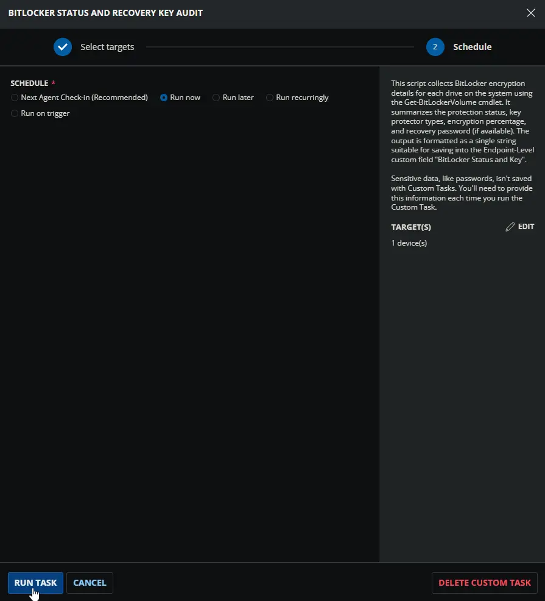
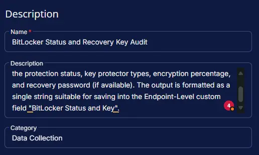
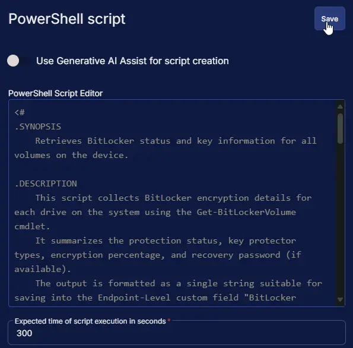
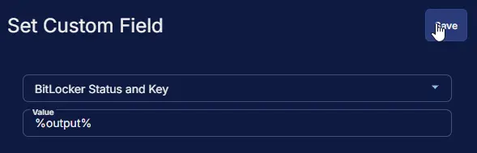
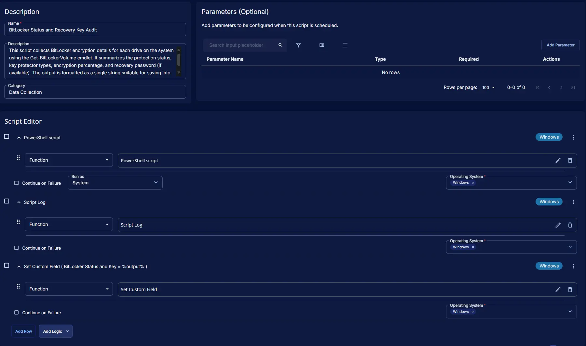
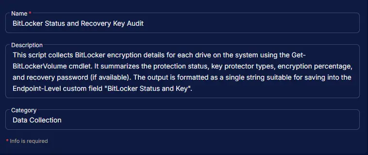
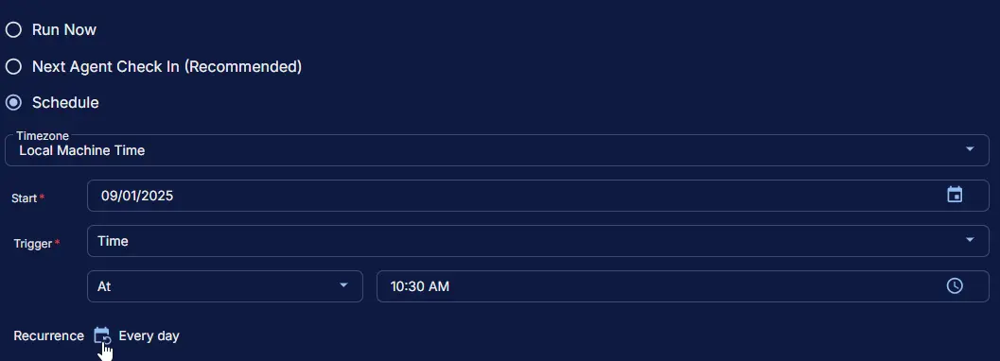
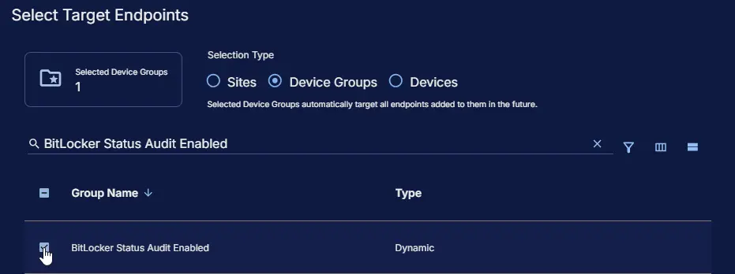
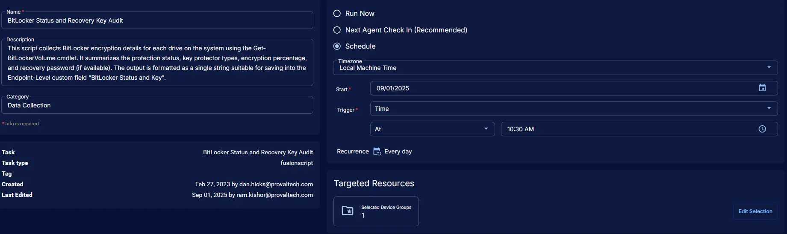

## Summary

This script collects BitLocker encryption details for each drive on the system using the Get-BitLockerVolume cmdlet. It summarizes the protection status, key protector types, encryption percentage, and recovery password (if available). The output is formatted as a single string suitable for saving into the Endpoint-Level custom field [BitLocker Status and Key](/docs/a7785954-5a6d-4003-9d0e-c919e1a96b0c). It is recommended to schedule this script to run once per day to keep the information up-to-date.

**Output Format:** `| DriveLetter: KeyProtectorTypes; ProtectionStatus; EncryptionPercentage; RecoveryPassword |`  
    **Example:** `| C: RecoveryPassword, TPM; Enabled; 100%; <RecoveryPassword> | D: Not Enabled |`

**Notes:** *The `BitLocker Drive Encryption` feature must be enabled on servers to run this script against windows servers. Auditing will not work without enabling this feature.*

## Sample Run



## Dependencies

- [Custom Field - BitLocker Status and Key](/docs/a7785954-5a6d-4003-9d0e-c919e1a96b0c)
- [Group - BitLocker Status Audit Enabled](/docs/8d034710-66c7-4f8e-8feb-740c9fa109f2)
- [Solution - BitLocker Status and Recovery Key Audit](/docs/b2a974b2-c231-4197-a639-d0775d77d7c7)

## Task Setup Path

**Tasks Path:** `AUTOMATION` ➞ `Tasks`  
**Task Type:** `Script Editor`

## Task Creation

### Description

- **Name:** `BitLocker Status and Recovery Key Audit`  
- **Description:** `This script collects BitLocker encryption details for each drive on the system using the Get-BitLockerVolume cmdlet. It summarizes the protection status, key protector types, encryption percentage, and recovery password (if available). The output is formatted as a single string suitable for saving into the Endpoint-Level custom field "BitLocker Status and Key".`  
- **Category:** `Data Collection`



### Script Editor

#### Step 1: Row -> PowerShell script

- **Use Generative AI Assist for script creation:** `False`  
- **Expected time of script execution in seconds:** `300`  
- **Operating System:** `Windows`  
- **Continue on Failure:** `False`  
- **Run As:** `System`  
- **PowerShell Script Editor:**

```PowerShell
<#
.SYNOPSIS
    Retrieves BitLocker status and key information for all volumes on the device.

.DESCRIPTION
    This script collects BitLocker encryption details for each drive on the system using the Get-BitLockerVolume cmdlet.
    It summarizes the protection status, key protector types, encryption percentage, and recovery password (if available).
    The output is formatted as a single string suitable for saving into the Endpoint-Level custom field "BitLocker Status and Key".

.OUTPUTS
    A formatted string summarizing BitLocker status for each drive.
    Format: | DriveLetter: KeyProtectorTypes; ProtectionStatus; EncryptionPercentage; RecoveryPassword |
    | C: RecoveryPassword, TPM; Enabled; 100%; <RecoveryPassword> | D: Not Enabled |

.NOTES
    - If the BitLocker module is unavailable, the script returns a message indicating so.
    - If the output string exceeds 300 characters, it is truncated to fit the custom field limit.
    - The script is intended for use in environments where BitLocker status needs to be reported centrally.

.EXAMPLE
    # Save BitLocker status to a custom field
    $status = .\Get-BitlockerInfoCWRMM.ps1
    # Assign $status to the "BitLocker Status and Key" field in your endpoint management system.

#>

if (!(Get-Command -Name 'Get-BitLockerVolume' -ErrorAction SilentlyContinue)) {
    return '| BitLocker module is unavailable on this device. |'
}

$bitlockerInfo = Get-BitLockerVolume
$bitlockerInfoOutput = @()
if ($bitlockerInfo) {
    foreach ($drive in $bitlockerInfo) {
        $letter = $drive.MountPoint.TrimEnd(':')
        $keyProtector = $($drive.KeyProtector.KeyProtectorType -join ', ')
        $protectionStatus = switch ($drive.ProtectionStatus) {
            'On' { 'Enabled' }
            'Off' { 'Suspended' }
            default { 'Unknown' }
        }
        $encryptionPercentage = $drive.EncryptionPercentage
        $recoveryPassword = (($drive.KeyProtector | Where-Object { $_.KeyProtectorType -eq 'RecoveryPassword' }).RecoveryPassword | Select-Object -First 1)
        $recoveryPassword = if ($recoveryPassword) { $recoveryPassword } else { 'Not Available' }
        if (!$keyProtector) {
            $bitlockerInfoOutput += '{0}: Disabled' -f $letter
        } else {
            $bitlockerInfoOutput += '{0}: {1}; {2}; {3}%; {4}' -f $letter, $keyProtector, $protectionStatus, $encryptionPercentage, $recoveryPassword
        }
    }
} else {
    $bitlockerInfoOutput = 'Disabled'
}
$bitlockerReturnString = $($bitlockerInfoOutput -join ' | ')
if ($bitlockerReturnString.Length -le 300) {
    $bitlockerReturnInfo = $bitlockerReturnString
} else {
    $bitlockerReturnInfo = $bitlockerReturnString.Substring(0, 295)
}
return '| {0} |' -f $bitlockerReturnInfo
```



#### Step 2: Row -> Script Log

- **Script Log Message:** `%Output%`  
- **Continue on Failure:** `False`  
- **Operating System:** `Windows`


#### Step 3: Row -> Set Custom Field ( BitLocker Status and Key = %output% )

- **Custom Field:** `BitLocker Status and Key`  
- **Value:** `%Output%`  
- **Continue on Failure:** `False`  
- **Operating System:** `Windows`



## Completed Task



## Output

- Script Log
- Custom Field

## Schedule Task

### Task Details

- **Name:** `BitLocker Status and Recovery Key Audit`  
- **Description:** `This script collects BitLocker encryption details for each drive on the system using the Get-BitLockerVolume cmdlet. It summarizes the protection status, key protector types, encryption percentage, and recovery password (if available). The output is formatted as a single string suitable for saving into the Endpoint-Level custom field "BitLocker Status and Key".`  
- **Category:** `Data Collection`



### Schedule

- **Schedule Type:**  `Schedule`  
- **Timezone:** `Local Machine Time`  
- **Start:** `<Current Date>`  
- **Trigger:** `Time` `At` `<Current Time>`  
- **Recurrence:** `Every day`



### Targeted Resource

**Device Group:** `BitLocker Status Audit Enabled`



### Completed Scheduled Task

