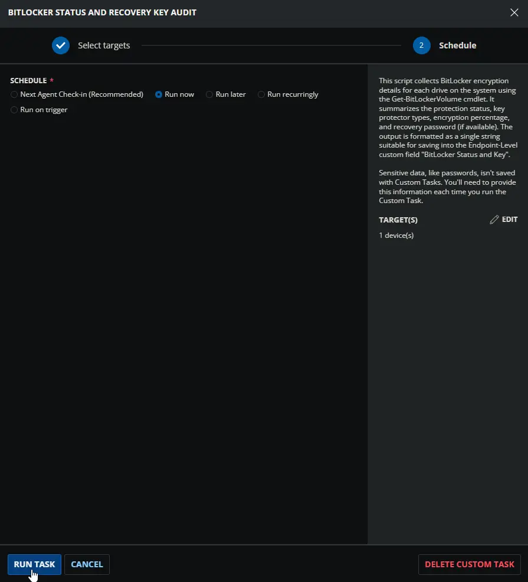
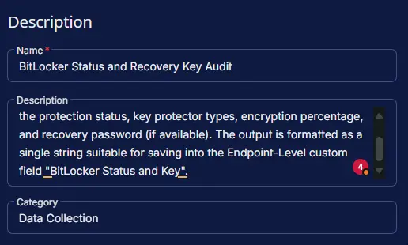
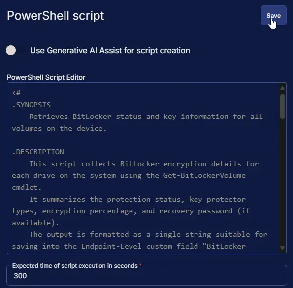
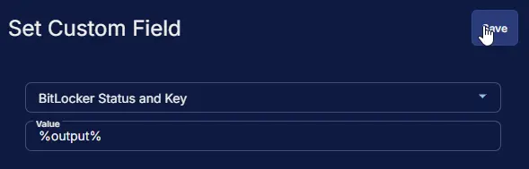
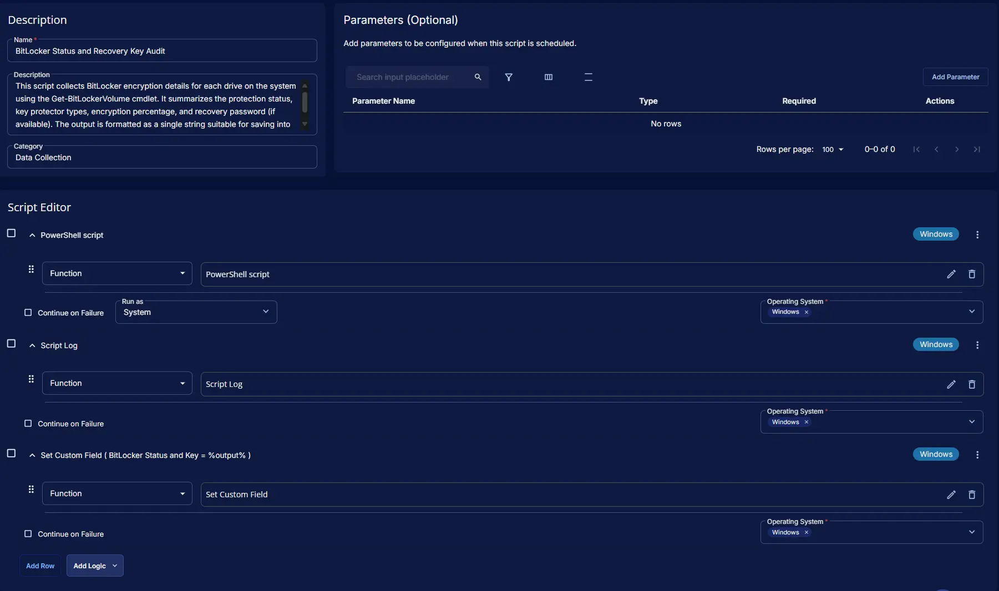
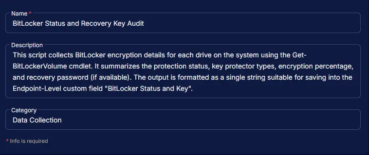
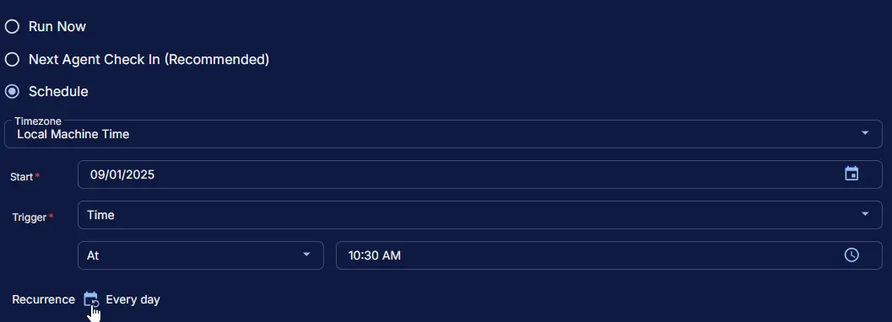
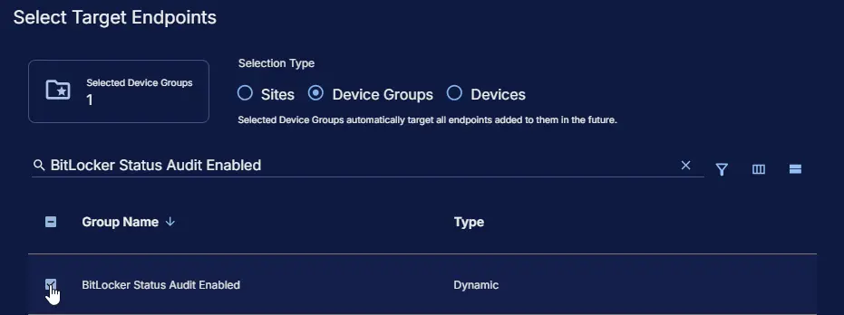
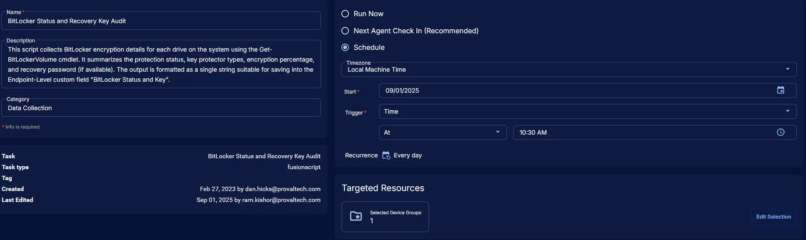

---
id: '9682b5a8-d821-43f6-9b77-59d43b6ef015'
slug: /9682b5a8-d821-43f6-9b77-59d43b6ef015
title: 'BitLocker Status and Recovery Key Audit'
title_meta: 'BitLocker Status and Recovery Key Audit'
keywords: ['bitlocker', 'bitlocker-status', 'recovery-key', 'bitlocker-audit', 'recovery-password']
description: 'This script collects BitLocker encryption details for each drive on the system using the Get-BitLockerVolume cmdlet. It summarizes the protection status, key protector types, encryption percentage, and recovery password (if available). The output is formatted as a single string suitable for saving into the Endpoint-Level custom field "BitLocker Status and Key".'
tags: ['bitlocker', 'security', 'auditing']
draft: false
unlisted: false
last_update:
  date: 2025-09-01
---

## Summary

This script collects BitLocker encryption details for each drive on the system using the Get-BitLockerVolume cmdlet. It summarizes the protection status, key protector types, encryption percentage, and recovery password (if available). The output is formatted as a single string suitable for saving into the Endpoint-Level custom field [BitLocker Status and Key](/docs/a7785954-5a6d-4003-9d0e-c919e1a96b0c). It is recommended to schedule this script to run once per day to keep the information up-to-date.

**Output Format:** `| DriveLetter: KeyProtectorTypes; ProtectionStatus; EncryptionPercentage; RecoveryPassword |`  
    **Example:** `| C: RecoveryPassword, TPM; Enabled; 100%; <RecoveryPassword> | D: Not Enabled |`

**Notes:** *The `BitLocker Drive Encryption` feature must be enabled on servers to run this script against windows servers. Auditing will not work without enabling this feature.*

## Sample Run

## Dependencies

- [Custom Field - BitLocker Status and Key](/docs/a7785954-5a6d-4003-9d0e-c919e1a96b0c)
- [Group - BitLocker Status Audit Enabled](/docs/8d034710-66c7-4f8e-8feb-740c9fa109f2)
- [Solution - BitLocker Status and Recovery Key Audit](/docs/b2a974b2-c231-4197-a639-d0775d77d7c7)

## Task Setup Path

**Tasks Path:** `AUTOMATION` ➞ `Tasks`  
**Task Type:** `Script Editor`

## Task Creation

### Description

- **Name:** `BitLocker Status and Recovery Key Audit`  
- **Description:** `This script collects BitLocker encryption details for each drive on the system using the Get-BitLockerVolume cmdlet. It summarizes the protection status, key protector types, encryption percentage, and recovery password (if available). The output is formatted as a single string suitable for saving into the Endpoint-Level custom field "BitLocker Status and Key".`  
- **Category:** `Data Collection`

### Script Editor

#### Step 1: Row -> PowerShell script

- **Use Generative AI Assist for script creation:** `False`  
- **Expected time of script execution in seconds:** `300`  
- **Operating System:** `Windows`  
- **Continue on Failure:** `False`  
- **Run As:** `System`  
- **PowerShell Script Editor:**

[PowerShell Script](https://github.com/ProVal-Tech/cw-rmm/blob/main/tasks/bitlocker-status-and-recovery-key-audit/script.ps1)

#### Step 2: Row -> Script Log

- **Script Log Message:** `%Output%`  
- **Continue on Failure:** `False`  
- **Operating System:** `Windows`

#### Step 3: Row -> Set Custom Field ( BitLocker Status and Key = %output% )

- **Custom Field:** `BitLocker Status and Key`  
- **Value:** `%Output%`  
- **Continue on Failure:** `False`  
- **Operating System:** `Windows`

## Completed Task

## Output

- Script Log
- Custom Field

## Schedule Task

### Task Details

- **Name:** `BitLocker Status and Recovery Key Audit`  
- **Description:** `This script collects BitLocker encryption details for each drive on the system using the Get-BitLockerVolume cmdlet. It summarizes the protection status, key protector types, encryption percentage, and recovery password (if available). The output is formatted as a single string suitable for saving into the Endpoint-Level custom field "BitLocker Status and Key".`  
- **Category:** `Data Collection`

### Schedule

- **Schedule Type:**  `Schedule`  
- **Timezone:** `Local Machine Time`  
- **Start:** `<Current Date>`  
- **Trigger:** `Time` `At` `<Current Time>`  
- **Recurrence:** `Every day`

### Targeted Resource

**Device Group:** `BitLocker Status Audit Enabled`

### Completed Scheduled Task

## Changelog

### 2025-04-10

- Initial version of the document

